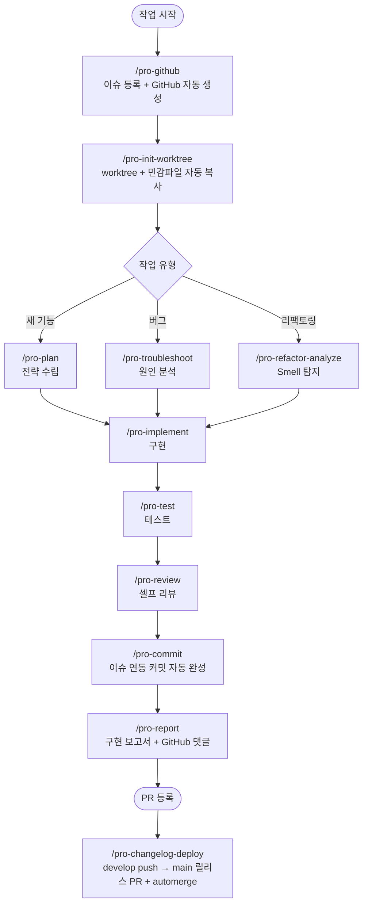
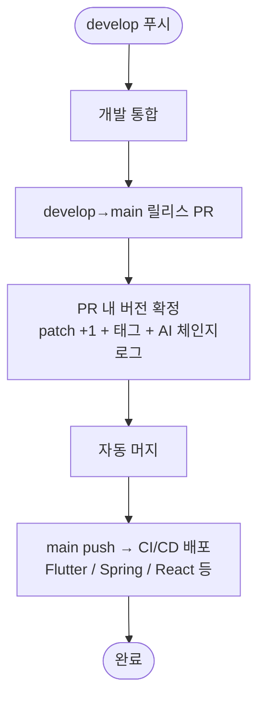

<div align="center">

# 🚀 Projectops

**GitHub Actions 자동화 + Agent AI Skills — 개발 사이클 전체를 자동화하는 DevOps 템플릿**

> 이슈 등록부터 커밋, 보고서, 배포까지. 개발자는 코드만 작성하세요.

<!-- AUTO-VERSION-SECTION: DO NOT EDIT MANUALLY -->
## 최신 버전 : v4.2.34 (2026-07-26)

[전체 버전 기록 보기](CHANGELOG.md)

</div>

---

## 왜 이 템플릿인가?

이 프로젝트는 두 축으로 개발 워크플로우를 자동화합니다.

**① GitHub Actions** — main 푸시 한 번으로 버전 관리, 체인지로그, CI/CD 배포까지 자동 처리  
**② Agent Skills** — `/github`, `/commit`, `/report` 등 AI가 이슈 작성부터 커밋 메시지, 구현 보고서까지 대신 생성

| 기존 방식 | Projectops |
|----------|---------------------|
| 버전 수동 관리, 태그 직접 생성 | 릴리스(develop→main PR) 시 patch 버전 자동 증가 + 태그 생성 |
| 체인지로그 직접 작성 (30분+) | CodeRabbit AI가 PR마다 자동 생성 |
| CI/CD 처음부터 설정 | 프로젝트 타입별 워크플로우 즉시 구성 |
| 이슈 매번 형식 맞춰 작성 (5분+) | `/pro-github` 한 번에 표준 템플릿 생성 + 등록 |
| 커밋 메시지 이슈 URL 수동 복사 | `/pro-commit` 이슈 컨텍스트 기반 자동 완성 |
| PR 설명/보고서 직접 작성 | `/pro-report` git diff 분석 후 자동 생성 |
| 코드 리뷰·분석 매번 프롬프트 입력 | 24종 Skills로 일관된 결과, 매번 재입력 불필요 |

---

## AI 개발 사이클

Agent Skills가 개발 사이클 전체를 커버합니다.



> Skills 전체 목록 및 상세 사용법: **[docs/SKILLS.md](docs/SKILLS.md)**

---

## GitHub Actions 자동화 파이프라인



---

## 빠른 시작

### 새 프로젝트

GitHub에서 **"Use this template"** 클릭 → 1분 내 자동 초기화 완료

### 기존 프로젝트에 통합

**권장 — npx (macOS · Linux · Windows 공통)**

```bash
npx projectops
```

> Node.js 20.12+ 만 있으면 별도 설치 없이 대화형 마법사가 실행됩니다. 비대화형: `npx projectops --mode full --type spring,react --force`

> ⚠️ 구 `template_integrator.sh` / `.ps1`은 **지원 종료(EOF)** 되었습니다 (#458). 실행하면 `npx projectops` 안내만 출력하며, 다음 minor에서 파일이 제거됩니다.

### Agent Skills만 설치

```bash
# Claude Code
claude plugin marketplace add Cassiiopeia/projectops
claude plugin install projectops@projectops-marketplace --scope user
```

```bash
# Gemini CLI
gemini extensions install https://github.com/Cassiiopeia/projectops
```

```bash
# Codex CLI (macOS / Linux)
codex plugin marketplace add Cassiiopeia/projectops
```

`--mode skills` 마법사는 Codex marketplace를 등록한 뒤 native skills fallback도 자동 준비합니다. `/plugins`는 설치 확인/관리용으로만 사용하면 됩니다.

Codex plugin marketplace를 사용할 수 없는 환경에서는 [Skills 가이드](docs/SKILLS.md)의 fallback 설치 방식을 사용하세요.

```bash
# Cursor / 전체 Agent Skills 설치 메뉴 (권장 — npx)
npx projectops --mode skills
```


> Claude Code는 `/pro-` 자동완성, Gemini는 extension, Codex는 plugin marketplace를 우선 사용합니다. 자세한 설치 방식은 [Skills 가이드](docs/SKILLS.md)를 확인하세요.

---

## 주요 기능

| 기능 | 설명 | 문서 |
|------|------|------|
| **Agent Skills** | Claude Code, Cursor, Gemini CLI, Codex CLI에서 쓰는 24종 AI DevOps Skills | [상세](docs/SKILLS.md) |
| **버전 자동화** | 릴리스(develop→main PR) 시 patch 버전 자동 증가 + Git 태그 | [상세](docs/VERSION-CONTROL.md) |
| **AI 체인지로그** | provider 사다리(CodeRabbit/GitHub Models/OpenAI 계열/commit) 기반 CHANGELOG 자동 생성 | [상세](docs/CHANGELOG-AUTOMATION.md) |
| **PR Preview** | 댓글 한 줄로 임시 서버 배포, 닫으면 자동 삭제 | [상세](docs/PR-PREVIEW.md) |
| **이슈 자동화** | 브랜치명/커밋 메시지 자동 제안, QA 이슈 생성 | [상세](docs/ISSUE-AUTOMATION.md) |
| **Flutter CI/CD** | iOS TestFlight + Android Play Store 자동 배포 | [상세](docs/FLUTTER-CICD-OVERVIEW.md) |
| **배포 설정 마법사** | Play Store / TestFlight / Firebase App Distribution 5단계 HTML 마법사 | `.github/util/flutter/{playstore,testflight,firebase}-wizard/` |
| **SSH+Docker 배포** | SSH 접속 서버에 Docker 무중단 배포 (Synology·AWS EC2 등) | [상세](docs/SSH-DOCKER-DEPLOYMENT-GUIDE.md) |

---

## Agent Skills (24종)

### 🔄 개발 사이클 자동화

| 스킬 | 용도 |
|------|------|
| `/pro-init-worktree` | Git worktree 생성 + 민감 파일 자동 복사 |
| `/pro-commit` | 이슈 컨텍스트 기반 커밋 메시지 자동 완성 (superpowers 준수) |
| `/pro-report` | git diff 분석 → 구현 보고서 생성 + GitHub 댓글 자동 포스팅 |
| `/pro-changelog-deploy` | develop push → main 릴리스 PR 생성 + 릴리스 노트 작성 + automerge |
| `/pro-github` | GitHub 전반: 이슈 생성(설명 한 줄 → 템플릿 작성+등록)/조회/수정/댓글/라벨/담당자, PR 생성/머지/조회, 레포 탐색, Actions/Secret 관리 |

### 📊 분석형 (코드 수정 없음)

| 스킬 | 용도 |
|------|------|
| `/pro-analyze` | 구현 전 현재 코드 상태 분석 및 영향 범위 평가 |
| `/pro-plan` | 요구사항 명확화 + 2가지 이상 접근 방식 비교로 전략 수립 |
| `/pro-design-analyze` | 아키텍처/API/DB/UI 설계 분석 (구현 X) |
| `/pro-refactor-analyze` | Code Smell 탐지 + Before/After 기반 리팩토링 계획 |
| `/pro-review` | 보안/성능/버그/품질 6관점 리뷰, Critical/Major/Minor 분류 |
| `/pro-troubleshoot` | 가설-검증 방식 근본 원인 분석, Quick Fix/Root Fix 제시 |

### 🔧 구현형 (실제 코드 작성)

| 스킬 | 용도 |
|------|------|
| `/pro-implement` | 계획/분석 결과 기반 코드 구현 (기존 스타일 100% 준수) |
| `/pro-design` | 아키텍처/API/DB/UI 설계 + 구현까지 |
| `/pro-refactor` | Extract Method, DRY 등 리팩토링 기법 단계별 적용 |
| `/pro-test` | AAA 패턴 단위/통합/E2E 테스트 코드 작성 |
| `/pro-figma` | Figma CSS → React/RN/Flutter 반응형 코드 변환 |
| `/pro-build` | 프로젝트 빌드 실행, 에러 분석, 최적화 제안 |

### 📝 문서/산출물 생성형

| 스킬 | 용도 |
|------|------|
| `/pro-document` | 코드 주석/README/API 문서 작성 |
| `/pro-testcase` | 이슈 분석 → QA 체크리스트 생성 |
| `/pro-ppt` | 트러블슈팅/구현 사례 → 5섹션 발표자료 |
| `/pro-spring-test` | Spring Boot 테스트 샘플 코드 생성 |
| `/pro-synology-expose` | Synology NAS 외부 도메인 노출 설정 가이드 |
| `/pro-ssh` | 원격 서버 SSH 접속·명령 실행 (AWS EC2, 시놀로지 NAS, Linux 등 범용) |
| `/pro-skill-creator` | Skill 생성/리뷰/개선 (CREATE·REVIEW·IMPROVE 3모드) |

---

## 지원 프로젝트 타입

| 타입 | 버전 파일 | CI/CD |
|------|----------|-------|
| `spring` | build.gradle | SSH+Docker 배포, Nexus |
| `flutter` | pubspec.yaml | TestFlight, Play Store |
| `react` (Next.js 포함) | package.json | Docker |
| `node` | package.json | Docker |
| `python` | pyproject.toml | SSH+Docker 배포 |
| `react-native` | Info.plist + build.gradle | — |
| `react-native-expo` | app.json | — |
| `basic` | version.yml만 | — |

---

## 댓글 명령어

Issue나 PR에 댓글로 자동화를 실행합니다.

| 명령어 | 기능 | 대상 |
|--------|------|------|
| `@projectops server build` | 임시 서버 배포 | Spring, Python |
| `@projectops server destroy` | 서버 삭제 | Spring, Python |
| `@projectops server status` | 서버 상태 확인 | Spring, Python |
| `@projectops build app` | iOS + Android 빌드 | Flutter |
| `@projectops apk build` | Android만 빌드 | Flutter |
| `@projectops ios build` | iOS만 빌드 | Flutter |
| `@projectops create qa` | QA 이슈 자동 생성 | 모든 프로젝트 |

> 상세: [PR Preview](docs/PR-PREVIEW.md) | [Flutter 빌드](docs/FLUTTER-TEST-BUILD-TRIGGER.md) | [이슈 자동화](docs/ISSUE-AUTOMATION.md)

---

## 설정

### 필수 Secret

```
Repository Settings → Secrets → Actions → New repository secret
Name: _GITHUB_PAT_TOKEN
Value: [Personal Access Token - repo, workflow 권한]
```

### Organization 설정

```
Settings → Actions → General
├─ ✅ Allow GitHub Actions to create and approve pull requests
└─ ✅ Read and write permissions
```

---

## 문서

전체 목록은 **[문서 인덱스](docs/README.md)**를 참고하세요.

| 문서 | 설명 |
|------|------|
| [📚 문서 인덱스](docs/README.md) | docs 전체를 목적별로 안내 |
| [Agent Skills 가이드](docs/SKILLS.md) | 24종 Skills 용도, 사용법, 전체 개발 사이클 흐름 |
| [NPX 마법사 가이드](docs/NPX-WIZARD.md) | npx projectops 통합, 프로젝트 성격(intent), 배포/publish 2축, 레거시 자동 마이그레이션 |
| [통합 스크립트 가이드](docs/TEMPLATE-INTEGRATOR.md) | 구 integrator 지원 종료(EOF) 안내 |
| [버전 관리](docs/VERSION-CONTROL.md) | version.yml, 자동 버전 증가 |
| [체인지로그 자동화](docs/CHANGELOG-AUTOMATION.md) | 릴리스 PR 흐름, 릴리스 노트 provider 사다리, CodeRabbit 연동 |
| [PR Preview](docs/PR-PREVIEW.md) | 임시 서버 배포 시스템 |
| [Flutter CI/CD](docs/FLUTTER-CICD-OVERVIEW.md) | iOS/Android 자동 배포, GitHub Secrets 전체 목록 |
| [Flutter 마법사](docs/FLUTTER-TESTFLIGHT-WIZARD.md) | [TestFlight](docs/FLUTTER-TESTFLIGHT-WIZARD.md) / [Play Store](docs/FLUTTER-PLAYSTORE-WIZARD.md) / [Firebase](docs/FLUTTER-FIREBASE-WIZARD.md) 배포 설정 마법사 |
| [SSH+Docker 배포](docs/SSH-DOCKER-DEPLOYMENT-GUIDE.md) | SSH 접속 서버에 Docker 배포 (Synology·AWS EC2 등) |
| [이슈 자동화](docs/ISSUE-AUTOMATION.md) | Issue Helper, QA 봇 |
| [GitHub Projects 동기화](docs/PROJECTS-SYNC.md) | Issue Label ↔ Projects Status 동기화 ([마법사](docs/GITHUB-PROJECTS-SYNC-WIZARD.md)) |
| [브랜치 네이밍 규칙](docs/BRANCH-CONVENTION.md) | `YYYYMMDD_#번호_제목` 규칙과 의존 소비자 (유지보수자용) |
| [워크플로우 주석 표준](docs/WORKFLOW-COMMENT-GUIDELINES.md) | 주석 컨벤션, 파일별 적용 현황 (기여자용) |
| [트러블슈팅](docs/TROUBLESHOOTING.md) | 자주 발생하는 문제 해결 |

---

## 지원

- [Issues](https://github.com/Cassiiopeia/projectops/issues) — 버그 리포트, 기능 요청
- [CONTRIBUTING.md](CONTRIBUTING.md) — 기여 가이드

---

<div align="center">

**MIT License**

</div>
