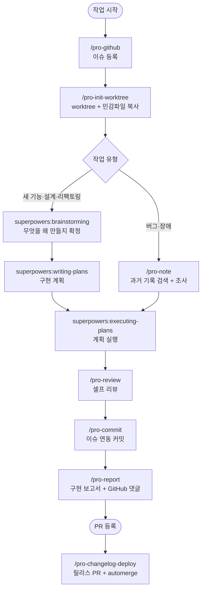
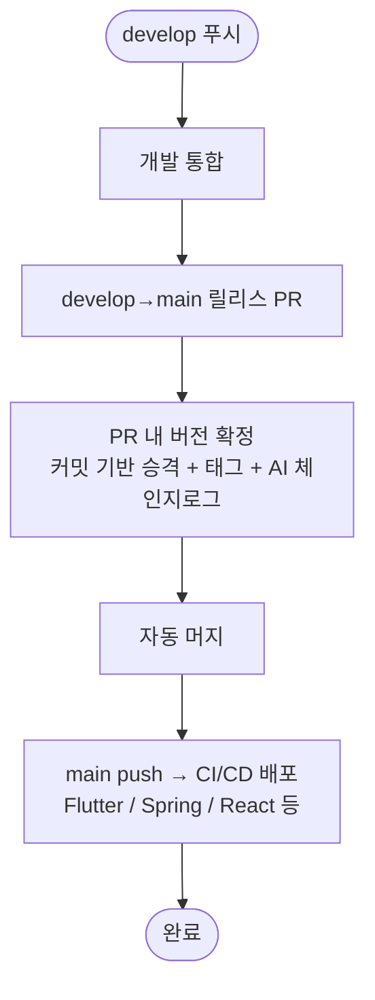

<div align="center">


**한국어** | [English](https://github.com/Cassiiopeia/projectops/blob/main/docs/i18n/README.en.md) | [简体中文](https://github.com/Cassiiopeia/projectops/blob/main/docs/i18n/README.zh-CN.md) | [日本語](https://github.com/Cassiiopeia/projectops/blob/main/docs/i18n/README.ja.md)

[](https://www.npmjs.com/package/projectops) [](https://github.com/Cassiiopeia/projectops/releases) [](LICENSE) [](https://cassiiopeia.github.io/projectops/)

<!-- AUTO-VERSION-SECTION: DO NOT EDIT MANUALLY -->
## 최신 버전 : v4.31.1 (2026-10-02)

[전체 버전 기록 보기](CHANGELOG.md)

</div>

---

## 30초 시작

| 하고 싶은 일 | 실행할 것 |
|---|---|
| 새 프로젝트를 시작한다 | GitHub에서 **Use this template** 클릭 (1분 내 자동 초기화) |
| 기존 프로젝트에 붙인다 | `npx projectops` |
| Agent Skills만 설치한다 | `npx projectops --mode skills` |
| 설치 상태를 점검한다 (읽기 전용) | `npx projectops --mode doctor` |

> Node.js 20.12 이상만 있으면 됩니다. 별도 설치 없이 대화형 마법사가 실행됩니다.


> 위 화면은 샘플 Spring 프로젝트에서 **실제로 실행한 화면**입니다. 비대화형 실행과 옵션 전체는 [CLI 레퍼런스](https://cassiiopeia.github.io/projectops/CLI)를 보세요.

---

## 왜 이 템플릿인가?

이 프로젝트는 두 축으로 개발 워크플로우를 자동화합니다.

**① GitHub Actions** — main 푸시 한 번으로 버전 관리, 체인지로그, CI/CD 배포까지 자동 처리  
**② Agent Skills** — `/pro-github`, `/pro-commit`, `/pro-report` 등 AI가 이슈 작성부터 커밋 메시지, 구현 보고서까지 대신 생성

| 기존 방식 | Projectops |
|----------|---------------------|
| 버전 수동 관리, 태그 직접 생성 | 릴리스 시 커밋 내용에 맞는 버전 자동 증가 + 태그 생성 |
| 체인지로그 직접 작성 (30분+) | 릴리스 PR마다 자동 생성 (커밋 분석, AI 키가 있으면 AI 요약) |
| CI/CD 처음부터 설정 | 프로젝트 타입별 워크플로우 즉시 구성 |
| 이슈 매번 형식 맞춰 작성 (5분+) | `/pro-github` 한 번에 표준 템플릿 생성 + 등록 |
| 커밋 메시지 이슈 URL 수동 복사 | `/pro-commit` 이슈 컨텍스트 기반 자동 완성 |
| PR 설명/보고서 직접 작성 | `/pro-report` git diff 분석 후 자동 생성 |
| 코드 리뷰·분석 매번 프롬프트 입력 | 20종 Skills로 일관된 결과, 매번 재입력 불필요 |

---

## 실제로 이렇게 동작합니다

이 저장소 자신이 이 도구로 운영됩니다. 아래는 가짜 목업이 아니라 **이 레포의 실제 이슈·PR·릴리스 화면**입니다.


| 단계 | 일어나는 일 |
|------|------------|
| 1. 이슈 등록 | `/pro-github`가 템플릿에 맞춰 작성·등록하고, 라벨이 바뀌면 Projects 보드 상태가 따라갑니다 |
| 2. 자동 안내 | 이슈가 열리면 **브랜치명과 커밋 메시지 템플릿**을 댓글로 알려줍니다 |
| 3. 구현 보고서 | `/pro-report`가 변경 내용과 흐름도를 이슈 댓글로 남깁니다 |
| 4. 릴리스 PR | develop → main PR에서 버전 확정, 릴리스 노트, 자동 머지가 진행됩니다 |
| 5. GitHub Release | main에 반영되면 버전 태그와 함께 릴리스가 자동으로 만들어집니다 |

<details>
<summary>단계별 화면 크게 보기</summary>


</details>

---

## 구성 요소

| 구성 | 하는 일 | 문서 |
|---|---|---|
| **GitHub Actions** | main 푸시 한 번으로 버전 관리, 체인지로그, CI/CD 배포를 자동 처리합니다 | [버전 관리](https://cassiiopeia.github.io/projectops/VERSION-CONTROL) |
| **Agent Skills** (20종) | `/pro-github`, `/pro-commit`, `/pro-report` 등으로 AI가 이슈·커밋 메시지·구현 보고서를 대신 만듭니다 | [Skills 가이드](https://cassiiopeia.github.io/projectops/SKILLS) |
| **npx CLI** | 기존 프로젝트에 워크플로우를 설치·업데이트하고 상태를 진단합니다 | [CLI 레퍼런스](https://cassiiopeia.github.io/projectops/CLI) |

<details>
<summary>Agent Skills 20종 전체 보기</summary>

### 🔄 개발 사이클 자동화

| 스킬 | 용도 |
|------|------|
| `/pro-init-worktree` | Git worktree 생성 + 민감 파일 자동 복사 |
| `/pro-commit` | 이슈 컨텍스트 기반 커밋 메시지 자동 완성 (superpowers 준수) |
| `/pro-report` | git diff 분석 → 구현 보고서 생성 + GitHub 댓글 자동 포스팅 |
| `/pro-changelog-deploy` | develop push → main 릴리스 PR 생성 + 릴리스 노트 작성 + automerge |
| `/pro-github` | GitHub 전반: 이슈 생성(설명 한 줄 → 템플릿 작성+등록)/조회/수정/댓글/라벨/담당자, PR 생성/머지/조회, 레포 탐색, Actions/Secret 관리 |

### 📊 분석형 (코드 수정 없음)

| 스킬 | 용도 |
|------|------|
| `/pro-review` | 보안/성능/버그/품질 6관점 리뷰, Critical/Major/Minor 분류 |
| `/pro-note` | 막혔을 때 과거 기록 검색, 알아낸 것을 실행 가능한 기록으로 저장 |

### 🔧 구현형 (실제 코드 작성)

| 스킬 | 용도 |
|------|------|
| `/pro-figma-verify` | Figma 시안을 코드로 옮기고, 옮긴 것이 시안과 같은지 픽셀로 센다 |
| `/pro-build` | 프로젝트 빌드 실행, 에러 분석, 최적화 제안 |
| `/pro-launch` | 앱·웹·서버를 띄우고 조작하고 찍는다 — 상태바 고정 캡처, 폭 바꾸기, 응답 바꿔치기(빈 목록·실패 연출), 코드 렌더 |
| `/pro-design-brief` | 시안보다 먼저 만든 화면의 디자인 요청서 — 상태별 캡처·대안·문구 후보·꼭 지킬 것을 보드로 만들어 디자이너에게 |
| `/pro-oss-consult` | GitHub 레포를 오픈소스로서 진단 — 성격 판별, 6축 채점, 성숙도 단계, 승인받은 것만 About·topics·라벨·파일 수정. 단일 레포·계정 전체 일괄 |

> 설계·계획·구현 흐름은 `superpowers`(brainstorming → writing-plans → executing-plans)가 담당합니다.
> `/pro-plan` · `/pro-analyze` · `/pro-implement`는 같은 역할의 이전 세대 경로로, 명시적으로 호출할 때만 동작합니다.
> 위 표의 17종과 이 3종을 합쳐 총 20종입니다.

### 📝 문서/산출물 생성형

| 스킬 | 용도 |
|------|------|
| `/pro-testcase` | 이슈 분석 → QA 체크리스트 생성 |
| `/pro-agent-test` | 앱·웹·서버를 실제로 실행해 밟으며 버그를 찾는 QA — 재현 절차·근거·심각도와 함께 보고 (코드는 고치지 않음) |
| `/pro-synology-expose` | Synology NAS 외부 도메인 노출 설정 가이드 |
| `/pro-ssh` | 원격 서버 SSH 접속·명령 실행 (AWS EC2, 시놀로지 NAS, Linux 등 범용) |
| `/pro-skill-creator` | Skill 생성/리뷰/개선 (CREATE·REVIEW·IMPROVE 3모드) |

</details>

<details>
<summary>개발 사이클과 자동화 파이프라인 흐름도 보기</summary>

### AI 개발 사이클

Agent Skills가 개발 사이클 전체를 커버합니다.


```mermaid
flowchart TD
    A(["작업 시작"]) --> B["/pro-github<br/>이슈 등록"]
    B --> C["/pro-init-worktree<br/>worktree + 민감파일 복사"]
    C --> D{"작업 유형"}

    D -->|새 기능·설계·리팩토링| E1["superpowers:brainstorming<br/>무엇을 왜 만들지 확정"]
    D -->|버그·장애| E2["/pro-note<br/>과거 기록 검색 + 조사"]

    E1 --> P["superpowers:writing-plans<br/>구현 계획"]
    P --> F["superpowers:executing-plans<br/>계획 실행"]
    E2 --> F
    F --> H["/pro-review<br/>셀프 리뷰"]
    H --> I["/pro-commit<br/>이슈 연동 커밋"]
    I --> J["/pro-report<br/>구현 보고서 + GitHub 댓글"]
    J --> K(["PR 등록"])
    K --> L["/pro-changelog-deploy<br/>릴리스 PR + automerge"]
```

> Skills 전체 목록 및 상세 사용법: **[docs/SKILLS.md](docs/SKILLS.md)**

### GitHub Actions 자동화 파이프라인


```mermaid
flowchart TD
    A([develop 푸시]) --> B[개발 통합]
    B --> C[develop→main 릴리스 PR]
    C --> D["PR 내 버전 확정<br/>커밋 기반 승격 + 태그 + AI 체인지로그"]
    D --> E[자동 머지]
    E --> F["main push → CI/CD 배포<br/>Flutter / Spring / React 등"]
    F --> G([완료])
```

</details>

<details>
<summary>Agent Skills만 설치하기 (Claude Code, Gemini CLI, Codex CLI, Cursor)</summary>

```bash
# Claude Code
claude plugin marketplace add Cassiiopeia/projectops
claude plugin install projectops@projectops-marketplace --scope user
```

```bash
# Gemini CLI
gemini extensions install https://github.com/Cassiiopeia/projectops
```

```bash
# Codex CLI (macOS / Linux)
codex plugin marketplace add Cassiiopeia/projectops
```

`--mode skills` 마법사는 Codex marketplace를 등록한 뒤 native skills fallback도 자동 준비합니다. `/plugins`는 설치 확인/관리용으로만 사용하면 됩니다.

Codex plugin marketplace를 사용할 수 없는 환경에서는 [Skills 가이드](docs/SKILLS.md)의 fallback 설치 방식을 사용하세요.

```bash
# Cursor / 전체 Agent Skills 설치 메뉴 (권장 — npx)
npx projectops --mode skills
```


> Claude Code는 `/pro-` 자동완성, Gemini는 extension, Codex는 plugin marketplace를 우선 사용합니다. 자세한 설치 방식은 [Skills 가이드](docs/SKILLS.md)를 확인하세요.

</details>

---

## 지원 프로젝트 타입

| 타입 | 버전 파일 | CI/CD |
|------|----------|-------|
| `spring` | build.gradle | SSH+Docker 배포, Nexus |
| `flutter` | pubspec.yaml | TestFlight, Play Store |
| `react` (Next.js 포함) | package.json | Docker |
| `node` | package.json | Docker |
| `python` | pyproject.toml | SSH+Docker 배포 |
| `react-native` | Info.plist + build.gradle | — |
| `react-native-expo` | app.json | — |
| `basic` | version.yml만 | — |

---

## 댓글 명령어

Issue나 PR에 댓글로 자동화를 실행합니다.

| 명령어 | 기능 | 대상 |
|--------|------|------|
| `@projectops server build` | 임시 서버 배포 | Spring, Python |
| `@projectops server destroy` | 서버 삭제 | Spring, Python |
| `@projectops server status` | 서버 상태 확인 | Spring, Python |
| `@projectops build app` | iOS + Android 빌드 | Flutter |
| `@projectops apk build` | Android만 빌드 | Flutter |
| `@projectops ios build` | iOS만 빌드 | Flutter |
| `@projectops create qa` | QA 이슈 자동 생성 | 모든 프로젝트 |

> 상세: [PR Preview](docs/PR-PREVIEW.md) | [Flutter 빌드](docs/FLUTTER-TEST-BUILD-TRIGGER.md) | [이슈 자동화](docs/ISSUE-AUTOMATION.md)

---

## 설정

### 필수 Secret

```
Repository Settings → Secrets → Actions → New repository secret
Name: _GITHUB_PAT_TOKEN
Value: [Personal Access Token - repo, workflow 권한]
```

### Organization 설정

```
Settings → Actions → General
├─ ✅ Allow GitHub Actions to create and approve pull requests
└─ ✅ Read and write permissions
```

---

## 알아둘 것

맞지 않는 경우를 먼저 알려 드립니다.

- **GitHub 전용입니다.** GitHub Actions와 GitHub 이슈·PR을 전제로 하므로 GitLab 등은 지원하지 않습니다.
- **릴리스는 개발 브랜치 → 기본 브랜치 PR 구조를 전제로 합니다.** 브랜치 이름은 `version.yml`에서 바꿀 수 있지만, 두 브랜치를 나눠 쓰지 않는 저장소에는 맞지 않습니다.
- **이슈·PR 자동화에는 개인 액세스 토큰(PAT) 등록이 필요합니다.** 위 [설정](#설정)을 따라 주세요.
- **서버 배포 워크플로우는 SSH로 접속하는 Docker 서버를 전제로 합니다.**

---

## 문서

전체 문서는 **[문서 사이트](https://cassiiopeia.github.io/projectops/)** 에서 검색하며 볼 수 있습니다.

- [시작하기](https://cassiiopeia.github.io/projectops/GETTING-STARTED)
- [CLI 레퍼런스](https://cassiiopeia.github.io/projectops/CLI)
- [Agent Skills 가이드](https://cassiiopeia.github.io/projectops/SKILLS)
- [버전 관리](https://cassiiopeia.github.io/projectops/VERSION-CONTROL)
- [체인지로그 자동화](https://cassiiopeia.github.io/projectops/CHANGELOG-AUTOMATION)
- [PR Preview](https://cassiiopeia.github.io/projectops/PR-PREVIEW)
- [이슈 자동화](https://cassiiopeia.github.io/projectops/ISSUE-AUTOMATION)
- [SSH + Docker 배포](https://cassiiopeia.github.io/projectops/SSH-DOCKER-DEPLOYMENT-GUIDE)
- [Flutter CI/CD](https://cassiiopeia.github.io/projectops/FLUTTER-CICD-OVERVIEW)
- [트러블슈팅](https://cassiiopeia.github.io/projectops/TROUBLESHOOTING)

---

## 지원

- [Issues](https://github.com/Cassiiopeia/projectops/issues) — 버그 리포트, 기능 요청
  - 이 레포는 완료된 이슈를 닫지 않고 `작업완료` 라벨로 표시합니다. 열린 이슈 수가 많아 보이는 이유입니다.
- [CONTRIBUTING.md](CONTRIBUTING.md) — 기여 가이드
- [SECURITY.md](SECURITY.md) — 보안 취약점은 공개 이슈가 아니라 비공개로 신고해 주세요

---

<div align="center">

**MIT License**

</div>
