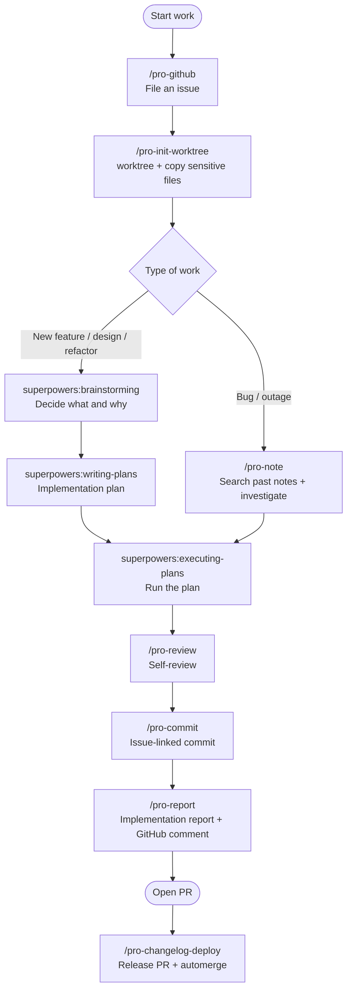
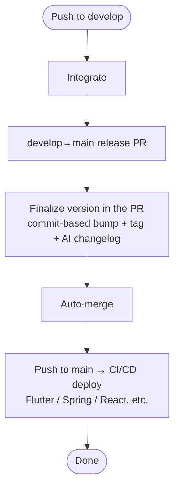

<div align="center">


[한국어](docs/i18n/README.ko.md) | **English** | [简体中文](docs/i18n/README.zh-CN.md) | [日本語](docs/i18n/README.ja.md)

[](https://www.npmjs.com/package/projectops) [](https://github.com/Cassiiopeia/projectops/releases) [](LICENSE) [](https://cassiiopeia.github.io/projectops/)

**Status: actively maintained.** New versions ship often, sometimes several a day. To stay on a version you have tested, run `npx projectops@<version>` ([releases](https://github.com/Cassiiopeia/projectops/releases)).

<!-- AUTO-VERSION-SECTION: DO NOT EDIT MANUALLY -->
## Latest version : v4.36.3 (2026-10-07)

[View full version history](CHANGELOG.md)

</div>

---

## Get started in 30 seconds

| I want to... | Run this |
|---|---|
| Start a new project | Click **Use this template** on GitHub (auto-setup in about a minute) |
| Add it to an existing project | `npx projectops` |
| Install Agent Skills only | `npx projectops --mode skills` |
| Check the install state (read-only) | `npx projectops --mode doctor` |

> You only need Node.js 20.12+. An interactive wizard runs with no separate install.


> This is a **real run** on a sample Spring project (the wizard follows your system language, or use `--lang en|ko`). Version numbers shown were current when it was recorded. For non-interactive use and every option, see the [CLI reference](https://cassiiopeia.github.io/projectops/en/cli).

---

## Why this template?

This project automates your development workflow on two axes.

**① GitHub Actions**: one push to main handles versioning, changelogs, and CI/CD deployment.
**② Agent Skills**: commands such as `/pro-github`, `/pro-commit`, and `/pro-report` let an AI agent write issues, commit messages, and implementation reports for you.

| The usual way | With Projectops |
|----------|---------------------|
| Bump versions and create tags by hand | At release time the version is bumped from your commit titles and a tag is created |
| Write the changelog yourself | Generated for every release PR (commit analysis, or an AI summary if you add an AI key) |
| Set up CI/CD from scratch | Workflows for your project type, ready immediately |
| Format every issue by hand | `/pro-github` writes and files an issue from the standard template in one step |
| Copy the issue URL into commit messages | `/pro-commit` completes the message from the issue context |
| Write PR descriptions and reports by hand | `/pro-report` analyzes the git diff and generates one |
| Re-type prompts for every code review or analysis | 20 Skills give consistent results without re-typing |

---

## Compared with other tools

If you only need one piece of this, a smaller tool may suit you better.

| | projectops | release-please | semantic-release | changesets |
|---|---|---|---|---|
| Version decided from | Commit titles (`feat` → minor, `feat!` → major) | Conventional Commits | Conventional Commits (configurable) | Changeset files written in each PR |
| Review step before a release | A release PR (develop → main), merged automatically | A release PR you merge | None by default, releases on push | A "Version Packages" PR |
| Changelog | Written in the release PR (commit analysis, or an AI summary) | Generated | Generated (plugin) | Assembled from changeset files |
| CI/CD workflows for your project type | Yes (Spring, Flutter, React, Node, Python ...) | No | No | No |
| Issue and PR helpers, Agent Skills | Yes | No | No | No |
| What it adds to your repo | About 50 files (below) | A workflow and a config file | A config file and a CI step | A `.changeset/` folder and a CI step |

- Want only versioning and a changelog? release-please or semantic-release is smaller.
- Publishing npm packages from a monorepo where each PR should say what changed? changesets fits better.
- Want the whole cycle (issue → branch → release PR → deploy) in one install, with agent skills on top? That is what projectops is for.

**Footprint, measured.** With v4.36.2 on 2026-10-08, `npx projectops --mode full --type basic --force` in an empty repository added 52 files: 8 workflows, 26 helper scripts under `.github/scripts/`, issue, PR and discussion templates, `version.yml` and a setup guide. `--type spring` added 56 files (12 workflows).

---

## What it actually looks like

Below is a **real run, recorded** after installing projectops in a sample repo in a test organization. The timer in the top right is real elapsed time; only the waiting parts are played back fast.

### 1. Open an issue and a branch name and commit message arrive automatically


When an issue is opened, GitHub Actions runs on its own and comments a **branch name and a commit message template**. Work on that branch name and the issue number links into your commits and reports automatically.

### 2. Open a PR and a change summary arrives automatically


Open a PR from a work branch and a **change summary** built from the commits is posted as a comment. Push more commits and the same comment is updated instead of piling up new ones.

### 3. Open a release PR and everything from versioning to merge and tag is automatic


Open a PR from the development branch to `main` and it writes the release notes, decides the version from commit titles (`feat`, `fix`, ...) and puts it in the PR title, merges automatically, and creates the **version tag**. This example had `feat` commits, so the minor version went up.

> The warning banner GitHub shows for Korean branch names is hidden in the recording. Everything else is the unedited screen.
---

## What is inside

| Part | What it does | Docs |
|---|---|---|
| **GitHub Actions** | One push to main handles versioning, changelogs, and CI/CD deployment | [Versioning](https://cassiiopeia.github.io/projectops/VERSION-CONTROL) (Korean) |
| **Agent Skills** (20) | `/pro-github`, `/pro-commit`, `/pro-report` and more let an AI agent write issues, commit messages, and implementation reports | [Skills guide](https://cassiiopeia.github.io/projectops/SKILLS) (Korean) |
| **npx CLI** | Installs and updates workflows in an existing project, and diagnoses its state | [CLI reference](https://cassiiopeia.github.io/projectops/en/cli) |

<details>
<summary>See all 20 Agent Skills</summary>

### 🔄 Development cycle automation

| Skill | Purpose |
|------|------|
| `/pro-init-worktree` | Create a Git worktree and copy sensitive files automatically |
| `/pro-commit` | Complete a commit message from the issue context (follows superpowers) |
| `/pro-report` | Analyze the git diff → generate an implementation report and post it as a GitHub comment |
| `/pro-changelog-deploy` | Push develop → open the main release PR + write release notes + automerge |
| `/pro-github` | GitHub in general: create issues (one-line description → template + file), view/edit/comment/label/assign, create/merge/view PRs, explore repos, manage Actions and Secrets |

### 📊 Analysis (no code changes)

| Skill | Purpose |
|------|------|
| `/pro-review` | Review from 6 angles (security, performance, bugs, quality...), classified Critical/Major/Minor |
| `/pro-note` | When stuck, search past notes; save what you found out as an actionable note |

### 🔧 Implementation (writes real code)

| Skill | Purpose |
|------|------|
| `/pro-figma-verify` | Move a Figma design into code, then compare the result with the design pixel by pixel |
| `/pro-build` | Run the project build, analyze errors, suggest optimizations |
| `/pro-launch` | Launch, drive, and capture apps, web, and servers: fixed status bar, width changes, response mocking (empty list, failures), render from code |
| `/pro-design-brief` | A design request for a screen you built before the mockup exists: state captures, alternatives, copy candidates, and must-keep rules as a board for the designer |
| `/pro-oss-consult` | Diagnose a GitHub repo as an open-source project: type detection, 6-axis scoring, maturity stage, and edits to About, topics, labels, and files only after approval. One repo or a whole account |

> Design, planning, and implementation flow is handled by `superpowers` (brainstorming → writing-plans → executing-plans).
> `/pro-plan`, `/pro-analyze`, and `/pro-implement` are the previous generation of the same roles and only run when invoked explicitly. Together with the 17 in the tables above, that makes 20 in total.

### 📝 Documents and artifacts

| Skill | Purpose |
|------|------|
| `/pro-testcase` | Analyze an issue → generate a QA checklist |
| `/pro-agent-test` | QA that actually runs apps, web, and servers to find bugs, reporting reproduction steps, evidence, and severity (it does not fix code) |
| `/pro-synology-expose` | Guide to exposing a Synology NAS service on an external domain |
| `/pro-ssh` | Connect to a remote server over SSH and run commands (AWS EC2, Synology NAS, Linux, and more) |
| `/pro-skill-creator` | Create, review, and improve a Skill (CREATE / REVIEW / IMPROVE modes) |

</details>

<details>
<summary>See the development cycle and pipeline diagrams</summary>

### AI development cycle

Agent Skills cover the entire development cycle.


```mermaid
flowchart TD
    A(["Start work"]) --> B["/pro-github<br/>File an issue"]
    B --> C["/pro-init-worktree<br/>worktree + copy sensitive files"]
    C --> D{"Type of work"}

    D -->|New feature / design / refactor| E1["superpowers:brainstorming<br/>Decide what and why"]
    D -->|Bug / outage| E2["/pro-note<br/>Search past notes + investigate"]

    E1 --> P["superpowers:writing-plans<br/>Implementation plan"]
    P --> F["superpowers:executing-plans<br/>Run the plan"]
    E2 --> F
    F --> H["/pro-review<br/>Self-review"]
    H --> I["/pro-commit<br/>Issue-linked commit"]
    I --> J["/pro-report<br/>Implementation report + GitHub comment"]
    J --> K(["Open PR"])
    K --> L["/pro-changelog-deploy<br/>Release PR + automerge"]
```

> Full list of Skills and usage: **[docs/en/skills.md](docs/en/skills.md)**

### GitHub Actions pipeline


```mermaid
flowchart TD
    A([Push to develop]) --> B[Integrate]
    B --> C[develop→main release PR]
    C --> D["Finalize version in the PR<br/>commit-based bump + tag + AI changelog"]
    D --> E[Auto-merge]
    E --> F["Push to main → CI/CD deploy<br/>Flutter / Spring / React, etc."]
    F --> G([Done])
```

</details>

<details>
<summary>Install Agent Skills only (Claude Code, Gemini CLI, Codex CLI, Cursor)</summary>

```bash
# Claude Code
claude plugin marketplace add Cassiiopeia/projectops
claude plugin install projectops@projectops-marketplace --scope user
```

```bash
# Gemini CLI
gemini extensions install https://github.com/Cassiiopeia/projectops
```

```bash
# Codex CLI (macOS / Linux)
codex plugin marketplace add Cassiiopeia/projectops
```

The `--mode skills` wizard registers the Codex marketplace and also prepares the native skills fallback. Use `/plugins` only to check or manage the install.

Where the Codex plugin marketplace is unavailable, use the fallback install described in the [Skills guide](docs/en/skills.md).

```bash
# Cursor / the full Agent Skills install menu (recommended: npx)
npx projectops --mode skills
```

> Claude Code prefers `/pro-` autocomplete, Gemini prefers its extension, and Codex prefers its plugin marketplace. See the [Skills guide](docs/en/skills.md) for details.

</details>

---

## Supported project types

| Type | Version file | CI/CD |
|------|----------|-------|
| `spring` | build.gradle | SSH + Docker deploy, Nexus |
| `flutter` | pubspec.yaml | TestFlight, Play Store |
| `react` (including Next.js) | package.json | Docker |
| `node` | package.json | Docker |
| `python` | pyproject.toml | SSH + Docker deploy |
| `react-native` | Info.plist + build.gradle | — |
| `react-native-expo` | app.json | — |
| `basic` | version.yml only | — |

---

## Comment commands

Run automation by commenting on an issue or PR.

| Command | What it does | Applies to |
|--------|------|------|
| `@projectops server build` | Deploy a temporary server | Spring, Python |
| `@projectops server destroy` | Delete the server | Spring, Python |
| `@projectops server status` | Check server status | Spring, Python |
| `@projectops build app` | Build iOS + Android | Flutter |
| `@projectops apk build` | Build Android only | Flutter |
| `@projectops ios build` | Build iOS only | Flutter |
| `@projectops create qa` | Create a QA issue automatically | All projects |

> Details: [PR Preview](docs/en/pr-preview.md) | [Flutter builds](docs/FLUTTER-TEST-BUILD-TRIGGER.md) | [Issue automation](docs/en/issue-automation.md)

---

## Setup

### Personal access token (optional)

Everything runs with the built-in `GITHUB_TOKEN`. Add a personal access token as the repository secret `_GITHUB_PAT_TOKEN` only if you need one of these:

| You want | Why the built-in token is not enough | Classic token scopes |
|---|---|---|
| Release PRs to merge even when branch protection blocks the Actions bot | The release workflow retries the merge with `--admin`, which needs an admin's token | `repo`, `workflow` |
| Issue labels synced to a GitHub Projects board | `GITHUB_TOKEN` cannot use the Projects API | `repo`, `project` |
| Other workflows to react to the issue helper's comment in a private repository | Events created with `GITHUB_TOKEN` do not start other workflows | `repo` |

Without a token, workflows that should run after a release merge are started with an explicit dispatch, so you do not need a token for that.

A fine-grained token with **Contents**, **Pull requests**, **Issues** and **Workflows** set to *Read and write* should cover the first row. We have not verified fine-grained tokens end to end yet; for Projects sync we have only tested a classic token. If a fine-grained token fails, please open an issue.

```
Repository Settings → Secrets → Actions → New repository secret
Name: _GITHUB_PAT_TOKEN
```

### Organization settings

```
Settings → Actions → General
├─ ✅ Allow GitHub Actions to create and approve pull requests
└─ ✅ Read and write permissions
```

---

## Things to know

We would rather tell you up front when this is not a fit.

- **GitHub only.** It assumes GitHub Actions and GitHub issues/PRs, so GitLab and others are not supported.
- **Releases assume a develop branch → default branch PR flow.** Branch names can be changed in `version.yml`, but it does not suit a repo that does not use two branches.
- **A personal access token is optional.** You need one only to merge past branch protection or to sync a Projects board. See [Setup](#setup).
- **It adds about 50 files to your repository** (workflows, helper scripts, templates). See [the measurement](#compared-with-other-tools).
- **New versions ship often.** Pin a version you have tested with `npx projectops@<version>`.
- **Server deploy workflows assume a Docker server reachable over SSH.**

---

## Documentation

Browse and search everything on the **[docs site](https://cassiiopeia.github.io/projectops/en/)**. The main guides are in English. A few wizard pages are still Korean only (translations are welcome, see [#799](https://github.com/Cassiiopeia/projectops/issues/799)).

- [Getting started](https://cassiiopeia.github.io/projectops/en/getting-started)
- [CLI reference](https://cassiiopeia.github.io/projectops/en/cli)
- [Agent Skills guide](https://cassiiopeia.github.io/projectops/en/skills)
- [Versioning](https://cassiiopeia.github.io/projectops/en/version-control)
- [Changelog automation](https://cassiiopeia.github.io/projectops/en/changelog-automation)
- [PR Preview](https://cassiiopeia.github.io/projectops/en/pr-preview)
- [Issue automation](https://cassiiopeia.github.io/projectops/en/issue-automation)
- [SSH + Docker deploy](https://cassiiopeia.github.io/projectops/en/ssh-docker-deployment-guide)
- [Flutter CI/CD](https://cassiiopeia.github.io/projectops/en/flutter-cicd-overview)
- [Troubleshooting](https://cassiiopeia.github.io/projectops/en/troubleshooting)

---

## Support

- [Issues](https://github.com/Cassiiopeia/projectops/issues): bug reports and feature requests
  - Finished issues are marked with the `status: done` label and closed automatically when a release is merged (`close_on_release`).
- [CONTRIBUTING.md](CONTRIBUTING.md): contribution guide
- [SECURITY.md](SECURITY.md): please report security vulnerabilities privately, not in a public issue

---

<div align="center">

**MIT License**

</div>
