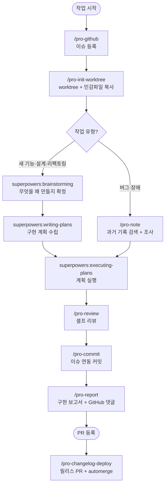

# Agent Skills 가이드

> **이 레포는 Claude Code, Cursor, Gemini CLI, Codex CLI에서 사용할 수 있는 Agent Skill 패키지입니다.**
> GitHub Actions 자동화 템플릿과 더불어, 개발/DevOps Skill 17종을 제공합니다.

---

## Skill이 뭔가요?

Skill은 특정 작업(예: 코드 리뷰, 이슈 작성, 리팩토링)에 특화된 지침과 출력 포맷을 가진 **전문가 모드**입니다. Claude Code에서는 `/pro-<skill>` 형태(예: `/pro-review`)로 호출하고, Gemini CLI는 extension, Codex CLI는 plugin marketplace를 통해 이 레포의 `skills/`를 읽습니다.

예를 들어 `/pro-review`를 실행하면 Claude가 단순히 "코드 좀 봐줘"에 답하는 게 아니라, **보안/성능/버그/품질/아키텍처/테스트 6가지 관점**으로 나눠서 **Critical/Major/Minor 우선순위**로 정리된 리뷰를 돌려줍니다.

---

## 설치

### Claude Code

```bash
claude plugin marketplace add Cassiiopeia/projectops
claude plugin install projectops@projectops-marketplace --scope user
```

설치 후 Claude Code에서 `/pro-` 까지 입력하면 사용 가능한 Skill 목록이 자동완성됩니다.

### Cursor

`npx projectops`의 `skills` 모드를 사용하면 `skills/`가 Cursor용 경로로 복사됩니다.

```bash
# macOS / Linux / Windows 공통
npx projectops --mode skills
```

대화형 메뉴에서 `Agent Skill 설치`를 선택한 뒤 Cursor scope를 고르면 됩니다.

### Gemini CLI

Gemini CLI는 extension으로 설치합니다.

```bash
gemini extensions install https://github.com/Cassiiopeia/projectops
```

업데이트:

```bash
gemini extensions update projectops
```

설치 후 Gemini는 루트 `gemini-extension.json`의 `contextFileName`에 따라 `GEMINI.md`를 읽고, `skills/{skill-name}/SKILL.md`를 참조합니다.

### Codex CLI

Codex는 plugin marketplace source로 이 레포를 등록합니다. OpenAI 공식 marketplace 등재가 아니라, 사용자가 직접 신뢰한 GitHub repo를 marketplace source로 추가하는 흐름입니다.

**방법 1 (기본):** Plugin marketplace 등록

macOS / Linux:

```bash
codex plugin marketplace add Cassiiopeia/projectops
```

마법사 설치:

```bash
npx projectops --mode skills
```

마법사는 Codex marketplace를 등록합니다. 등록 후 `/plugins`에서 `projectops` 항목을 확인하세요.

업데이트:

```bash
codex plugin marketplace upgrade projectops
```

**방법 2 (Fallback):** git clone + symlink로 즉시 활성화

marketplace 명령이 없거나 즉시 사용이 필요한 환경에서 사용합니다.

macOS / Linux:

```bash
git clone https://github.com/Cassiiopeia/projectops.git ~/.codex/projectops
mkdir -p ~/.agents/skills
ln -s ~/.codex/projectops/skills ~/.agents/skills/projectops
```

Windows PowerShell:

```powershell
git clone https://github.com/Cassiiopeia/projectops.git "$env:USERPROFILE\.codex\projectops"
New-Item -ItemType Directory -Force -Path "$env:USERPROFILE\.agents\skills"
cmd /c mklink /J "%USERPROFILE%\.agents\skills\projectops" "%USERPROFILE%\.codex\projectops\skills"
```

Codex에서는 slash command UI가 아니라 `AGENTS.md`와 설치된 `skills/`를 통해 관련 `SKILL.md`를 읽는 방식으로 사용합니다.

---

## Skill 전체 목록 (17종)

용도에 따라 네 그룹으로 나뉩니다:

- **분석형** (4종) — 코드를 읽기만 하고 수정하지 않음. 계획/리뷰/진단 결과를 돌려줌.
- **구현형** (4종) — 실제로 파일을 수정하거나 생성함.
- **개발 사이클 자동화형** (3종) — 커밋, 배포, GitHub 작업을 대신 수행함.
- **문서/산출물 생성형** (6종) — 코드는 건드리지 않고, `.md` 파일이나 보고서를 생성함.

> 설계·계획·구현 흐름은 `superpowers`(brainstorming → writing-plans → executing-plans)가 담당합니다. `/pro-plan` · `/pro-analyze` · `/pro-implement`는 같은 역할의 이전 세대 경로로, 명시적으로 호출할 때만 동작합니다.

---

## 📊 분석형 Skill (4종)

코드를 수정하지 않습니다. "먼저 상황을 파악하고 싶을 때" 사용하세요.

### `/pro-analyze`

**무엇을 하나요?**
"이 기능을 추가하려는데 지금 코드 상태가 어떤지 먼저 알고 싶다"일 때 사용합니다. 현재 코드베이스를 훑어보고, 어떤 파일을 손대야 하는지, 어디에 영향이 가는지, 테스트는 어디서 필요한지 정리된 분석 리포트를 돌려줍니다.

**수정되는 것**: 없음 (읽기만)
**돌려주는 것**: 코드 분석 + 구현 계획 초안 + 위험 요소 목록

**언제 쓰나요?**
- 새 기능 들어가기 전 "이거 기존 구조랑 어떻게 맞물리지?" 궁금할 때
- 처음 보는 레포에서 특정 기능의 영향 범위가 궁금할 때

---

### `/pro-plan`

**무엇을 하나요?**
"뭘 만들지는 정해졌는데 어떻게 만들지는 모르겠다"일 때 사용합니다. 요구사항이 애매하면 먼저 질문으로 명확화한 뒤, **최소 2가지 이상의 접근 방식**을 장단점과 함께 비교해서 전략 문서를 작성해줍니다.

**수정되는 것**: 없음
**돌려주는 것**: 배경/요구사항/접근 방식 비교/주요 결정/위험 요소가 정리된 전략 문서

**언제 쓰나요?**
- 리팩토링이나 아키텍처 변경처럼 방향성부터 정해야 할 때
- 바로 코딩에 들어가기 전 의사결정을 남겨두고 싶을 때

---

### `/pro-review`

**무엇을 하나요?**
코드를 **보안/성능/버그/품질/아키텍처/테스트 6가지 관점**으로 리뷰합니다. 발견한 이슈를 **Critical / Major / Minor**로 분류해서 돌려주고, 잘한 점도 같이 짚어줍니다.

**수정되는 것**: 없음
**돌려주는 것**: 우선순위별 리뷰 코멘트 + 개선 제안

**언제 쓰나요?**
- PR 올리기 전 셀프 리뷰
- 특정 파일이나 함수에 대한 2차 검토
- 구현 완료 후 "빠뜨린 거 없나?" 확인

---

### `/pro-note`

**무엇을 하나요?**
막혔을 때 **과거에 같은 문제를 겪었는지 먼저 찾아보고**, 어렵게 알아낸 것을 다음에 쓸 수 있는 기록으로 남깁니다.

기록의 기준은 하나입니다 — **6개월 뒤 누군가가 AI 없이 이 문서만 보고 같은 문제를 해결할 수 있어야 한다.** 그래서 명령어를 복사해서 그대로 실행할 수 있게 적고, 각 명령이 무엇을 확인하는지와 어떤 출력이 나오면 무슨 뜻인지를 함께 남깁니다. 되돌릴 수 없는 조치 앞에는 백업 절차를 먼저 둡니다.

**수정되는 것**: 없음 (기록 파일만 생성)
**돌려주는 것**: 과거 기록 검색 결과, 또는 실행 가능한 형태의 새 기록

**두 시점에 자동으로 동작합니다**

- **막혔을 때** — "빌드가 또 깨졌는데?" 하면 조사 전에 기록부터 검색합니다. 있으면 그때 해결법을 바로 꺼내옵니다.
- **어렵게 풀었을 때** — 여러 번 시도했거나 원인이 예상과 달랐다면 기록을 제안합니다. 한 번에 끝난 일은 묻지 않습니다.

**어디에 쌓이나요?**

| 성격 | 저장 위치 |
|---|---|
| 이 프로젝트 코드·설정·관례 | 저장소 안 (`docs/projectops/note/`) |
| 배포 도구·플랫폼 공통 문제 | 사용자 홈 (다른 프로젝트에서도 검색됨) |
| 로컬 환경 문제 | 사용자 홈 |

저장소 파일이 바뀌었는지로 자동 판정하며, 애매할 때만 한 번 묻습니다. 검색할 때는 양쪽을 모두 봅니다.

**언제 쓰나요?**
- 빌드·배포가 실패하는데 원인을 모를 때
- 에러가 반복되는데 전에 어떻게 고쳤는지 기억 안 날 때
- 라이브러리 사용법이나 프로젝트 관례를 삽질 끝에 알아냈을 때
- 이미 해결한 것을 나중에 기록으로 남기고 싶을 때

---

## 🔧 구현형 Skill (4종)

실제로 파일을 수정합니다. "작업을 진행해달라"일 때 사용하세요.

### `/pro-implement`

**무엇을 하나요?**
`/pro-plan`이나 `/pro-analyze`에서 나온 계획을 **실제 코드로 구현**합니다. 기존 프로젝트의 코드 스타일(들여쓰기, 네이밍, 패턴)을 자동으로 감지해서 100% 맞춰 작성합니다.

**수정되는 것**: 실제 소스 코드 파일
**돌려주는 것**: 구현된 코드 + 자체 검증 결과

**언제 쓰나요?**
- 계획이 이미 서 있고 바로 구현만 하면 될 때
- 직접 "이거 구현해줘"라고 요청할 때도 OK

---

### `/pro-figma`

**무엇을 하나요?**
Figma에서 복사한 CSS 값이나 스크린샷을 **반응형 코드**로 변환합니다. px 하드코딩을 제거하고 프로젝트의 디자인 토큰/시스템을 활용합니다. React, React Native, Flutter 모두 지원합니다.

**수정되는 것**: 해당 컴포넌트 파일
**돌려주는 것**: 반응형으로 변환된 UI 코드

**언제 쓰나요?**
- 디자이너가 Figma에서 전달한 화면을 코드로 옮길 때
- 기존 하드코딩된 px 값을 반응형으로 바꿀 때

---

### `/pro-build`

**무엇을 하나요?**
프로젝트 타입(Spring/Flutter/React/Node 등)에 맞는 빌드 명령을 실행하고, 빌드 에러가 나면 원인을 분석해서 고치고, 빌드 결과를 최적화할 여지가 있으면 제안합니다.

**수정되는 것**: 빌드 설정 파일 (필요 시)
**돌려주는 것**: 빌드 성공/실패 결과 + 에러 분석 + 최적화 제안

**언제 쓰나요?**
- 빌드가 깨져서 원인을 찾아야 할 때
- 번들 크기 최적화 요청
- "그냥 한 번 빌드해봐"

---

### `/pro-init-worktree`

**무엇을 하나요?**
브랜치명만 주면 **Git worktree를 자동으로 생성**하고, `.gitignore`를 분석해서 원본 프로젝트에 존재하는 로컬 설정 파일 후보를 찾습니다. 에이전트가 후보별 복사 필요성을 판단해 필요한 파일만 근거와 함께 선택 복사하고, 복사하지 않은 후보도 마지막에 리포트합니다. UTF-8 인코딩 문제도 처리합니다.

**수정되는 것**: 새 worktree 디렉토리 생성 + 필요한 로컬 설정 파일 선택 복사
**돌려주는 것**: 생성된 worktree 경로 + 복사/스킵/누락 후보 리포트

**언제 쓰나요?**
- PR마다 별도 worktree로 작업하고 싶을 때
- `.env`, Firebase 설정, 서명 키, 로컬 빌드 설정처럼 worktree에도 필요한 파일을 놓치고 싶지 않을 때

---

## 🔄 개발 사이클 자동화 Skill (3종)

이슈 등록부터 커밋, 배포까지 — 반복 작업을 AI가 대신합니다.

### `/pro-commit`

**무엇을 하나요?**
`/pro-github`의 이슈 생성이나 `/pro-init-worktree`가 저장해둔 이슈 컨텍스트(`.projectops/context/current-issue.json`)를 읽어서 **프로젝트 커밋 컨벤션에 맞는 메시지를 자동 완성**하고 커밋합니다. 메시지는 반드시 제안 후 사용자 확인을 받고 실행합니다.

**수정되는 것**: git 커밋 (staged 파일 기준)  
**돌려주는 것**: `이슈제목 : 타입 : 변경사항 설명 이슈URL` 형식의 완성된 커밋

**커밋 컨벤션**:
```
이슈제목 : feat : 변경사항 설명 https://github.com/.../issues/123
```

**이슈 컨텍스트가 없을 때**:
1. 이슈 새로 만들기 (`/pro-github` 이슈 생성 플로우 안내)
2. 이슈 번호 직접 입력 (GitHub에서 정보 자동 조회)
3. 이슈 없이 자유 형식 커밋
4. 취소

**superpowers 원칙 준수**:
- staged 파일 없으면 `git add`를 대신하지 않음 — 사용자가 직접 스테이징
- 사용자 확인 없이 절대 커밋 실행 안 함
- `git push`는 절대 실행하지 않음 — 커밋까지만 담당

**언제 쓰나요?**
- 이슈 번호/URL을 커밋 메시지에 매번 복사붙여넣기하는 게 귀찮을 때
- 팀 커밋 컨벤션을 일관되게 유지하고 싶을 때

---

### `/pro-changelog-deploy`

**무엇을 하나요?**
`develop` 브랜치를 push 후 `main`으로 릴리스 PR(`deploy` PR)을 생성하고, **릴리스 노트를 직접 작성**해서 PR 본문에 올립니다. `PROJECT-COMMON-RELEASE-CHANGELOG` 워크플로우가 "Summary by CodeRabbit" 문구를 감지하면 CHANGELOG 업데이트 후 automerge가 자동 진행됩니다. automerge에 실패하면 기존 PR을 닫고 새로 재시도합니다.

**수정되는 것**: 없음 (GitHub API 호출만)
**돌려주는 것**: `develop → main` 릴리스 PR(deploy PR) URL + 릴리스 노트 작성 완료 안내

**언제 쓰나요?**
- 구현 완료 후 배포 사이클 전체(push → PR → CHANGELOG → 머지)를 한 번에 처리하고 싶을 때
- automerge가 실패해서 재트리거가 필요할 때

---

### `/pro-github`

**무엇을 하나요?**
GitHub 이슈/PR/댓글을 **독립적으로 조회하고 관리**합니다. 다른 스킬 없이 단독으로 이슈 목록 조회, 상태 변경, 댓글 추가 등을 수행합니다. GitHub API를 직접 호출하며 `gh` CLI를 사용하지 않습니다.

**수정되는 것**: GitHub 이슈/PR 상태 (요청 시)
**돌려주는 것**: 이슈/PR 목록, 상세 정보, 작업 완료 안내

**언제 쓰나요?**
- 이슈 목록을 빠르게 조회하거나 상태를 바꾸고 싶을 때
- PR에 댓글을 추가하거나 라벨을 변경할 때
- 다른 스킬 없이 GitHub 작업만 단독으로 처리할 때

---

## 📝 문서/산출물 생성형 Skill (6종)

코드는 건드리지 않고, 특정 형식의 **문서 파일**을 생성합니다.

### `/pro-report`

**무엇을 하나요?**
`git status`로 변경 파일을 확인하고, 이슈 기반으로 관련 파일을 선별해서 읽은 뒤 **구현 보고서**를 작성합니다. `.report/YYYYMMDD_#이슈번호_설명.md` 형식으로 저장됩니다.

**수정되는 것**: `.report/` 폴더에 새 `.md` 파일
**돌려주는 것**: 개요/변경사항/주요 구현 내용/주의사항이 정리된 보고서

**언제 쓰나요?**
- 구현 완료 후 PR 설명이나 내부 보고서가 필요할 때
- 특정 이슈에 대한 작업 내역 정리

---

### `/pro-testcase`

**무엇을 하나요?**
GitHub 이슈를 읽고 관련 코드를 탐색한 뒤, **QA용 테스트 체크리스트**를 생성합니다. 기본 기능/엣지 케이스/프로젝트 타입별 추가 항목이 포함됩니다. 결과는 `testcase-[번호]-[설명].md`로 저장되어 **GitHub 댓글에 바로 붙여넣을 수 있습니다**.

**수정되는 것**: 테스트케이스 `.md` 파일
**돌려주는 것**: 체크박스 형식의 QA 테스트 항목 목록

**언제 쓰나요?**
- QA에게 넘기기 전 체크리스트가 필요할 때
- 수동 테스트 시나리오를 정리하고 싶을 때

---

### `/pro-spring-test`

**무엇을 하나요?**
Spring Boot 프로젝트용 테스트 샘플 코드를 생성합니다. `build.gradle` / `pom.xml`에서 **`suh-logger` 의존성과 멀티모듈 여부를 자동 감지**해서 적절한 템플릿을 선택하고, 대상 클래스와 동일한 패키지 경로에 테스트 파일을 만듭니다.

**수정되는 것**: 테스트 클래스 파일 생성
**돌려주는 것**: 바로 실행 가능한 Spring Boot 테스트 샘플

**언제 쓰나요?**
- Spring Boot 프로젝트에서 테스트 초기 세팅
- `suh-logger` 기반 로깅 테스트 필요

---

### `/pro-synology-expose`

**무엇을 하나요?**
시놀로지 NAS에 올린 웹 서비스를 **외부 도메인으로 노출하는 설정 가이드**를 단계별로 안내합니다. DNS 레코드 추가(Cloudflare/Route53 등), DSM 역방향 프록시 설정, Let's Encrypt 인증서 발급까지 커버합니다.

**수정되는 것**: 설정 가이드 `.md` 파일 (안내 중심, 실제 서버 설정은 사용자가 진행)
**돌려주는 것**: 도메인/DDNS/DNS 제공자/이메일을 입력받아 맞춤 가이드 생성

**언제 쓰나요?**
- 새 서비스를 Synology로 외부에 공개해야 할 때
- HTTPS 인증서 설정이 처음일 때

---

### `/pro-ssh`

**무엇을 하나요?**
AWS EC2, 시놀로지 NAS, 일반 Linux 서버 등 **SSH 접근 가능한 모든 서버에 접속**해서 명령을 실행하고 결과를 보고합니다. 비밀번호 인증과 PEM 키 인증을 모두 지원하며, 서버 정보는 `~/.projectops/config/ssh.config.json`에 저장해두면 이름만 말해도 바로 접속합니다.

**수정되는 것**: 없음 (원격 서버에서 명령 실행 후 결과만 반환)
**돌려주는 것**: SSH 명령 실행 결과 + 요약 보고

**언제 쓰나요?**
- "서버 로그 봐줘", "prod 검수해줘", "배포 됐는지 확인해줘"
- CI/CD 완료 후 서버 상태 자동 검수
- 여러 서버를 config에 등록해두고 이름으로 선택

---

### `/pro-skill-creator`

**무엇을 하나요?**
Skill 파일을 **생성(CREATE)·리뷰(REVIEW)·개선(IMPROVE)** 3가지 모드로 관리합니다. CREATE는 새 SKILL.md를 표준 포맷으로 작성하고, REVIEW는 기존 Skill을 `common-rules.md` 기준으로 검토해 개선점을 제안하며, IMPROVE는 리뷰 결과를 반영해 실제로 수정합니다.

**수정되는 것**: `skills/{skill-name}/SKILL.md` (IMPROVE 모드 시)
**돌려주는 것**: 새 SKILL.md 초안 / 리뷰 리포트 / 개선된 SKILL.md

**언제 쓰나요?**
- 새 Skill을 표준에 맞게 처음부터 만들고 싶을 때
- 기존 Skill이 최신 컨벤션과 맞는지 검토할 때
- 리뷰 결과를 바로 Skill에 반영하고 싶을 때

---

## 어떤 Skill을 언제 쓸까?

실제 작업 순서는 **이슈 등록 → 작업 환경 분리 → 계획 → 구현 → 테스트 → 리뷰 → 보고서** 입니다.

### 표준 개발 흐름 (전체 사이클)



> 설계·계획·구현은 `superpowers` 3종이 담당합니다. `/pro-plan` · `/pro-analyze` · `/pro-implement`는 같은 역할의 이전 세대 경로로, 명시적으로 호출할 때만 동작합니다.

### 시나리오별 흐름 정리

| 상황 | 추천 흐름 |
|------|----------|
| **새 기능 개발 (표준)** | `pro-github` → `pro-init-worktree` → `brainstorming` → `writing-plans` → `executing-plans` → `pro-review` → `pro-commit` → `pro-report` → `pro-changelog-deploy` |
| **버그 수정** | `pro-github` → `pro-init-worktree` → `pro-note`(검색) → `executing-plans` → `pro-commit` → `pro-report` → `pro-changelog-deploy` |
| **리팩토링·설계 변경** | 새 기능 개발과 동일 (`brainstorming`에서 범위를 좁혀 시작) |
| **QA 테스트케이스** | `pro-github` → `pro-testcase` |

### 단건 작업 (사이클 없이 단독 호출)

| 상황 | 사용 Skill |
|------|----------|
| 코드 리뷰만 필요 | `review` |
| 이슈만 빠르게 초안 작성 | `issue` |
| PR 설명 / 발표 자료 / QA 체크리스트 생성 | `report` / `ppt` / `testcase` |
| Figma 디자인을 코드로 변환 | `figma` |
| Spring Boot 테스트 샘플 생성 | `spring-test` |
| Synology 외부 노출 가이드 | `synology-expose` |
| 원격 서버 SSH 접속·명령 실행 | `ssh` |
| 빌드 실행 / 에러 분석 | `build` |
| 코드 주석 / 문서 작성 | `document` |
| 배포 PR 생성 + automerge | `changelog-deploy` |
| GitHub 이슈/PR 조회 및 관리 | `github` |
| Skill 생성/리뷰/개선 | `skill-creator` |

---

## 참고

- Skill 원본: 이 레포의 `skills/` 폴더 (Claude/Gemini/Codex/Cursor 공통 원본)
- Claude Code 매니페스트: `.claude-plugin/plugin.json`, `.claude-plugin/marketplace.json`
- Gemini CLI 매니페스트: `gemini-extension.json`, `GEMINI.md`
- Codex CLI marketplace/bootstrap/metadata: `.agents/plugins/marketplace.json`, `AGENTS.md`, `.codex-plugin/plugin.json`
- 버전 동기화: `version.yml` 변경 시 `PROJECT-TEMPLATE-PLUGIN-VERSION-SYNC` 워크플로우가 자동 반영
