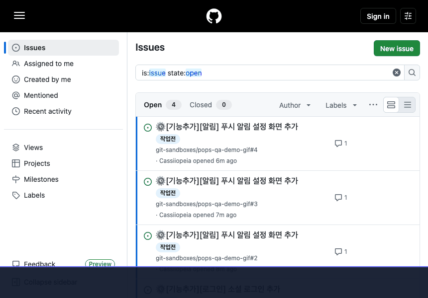
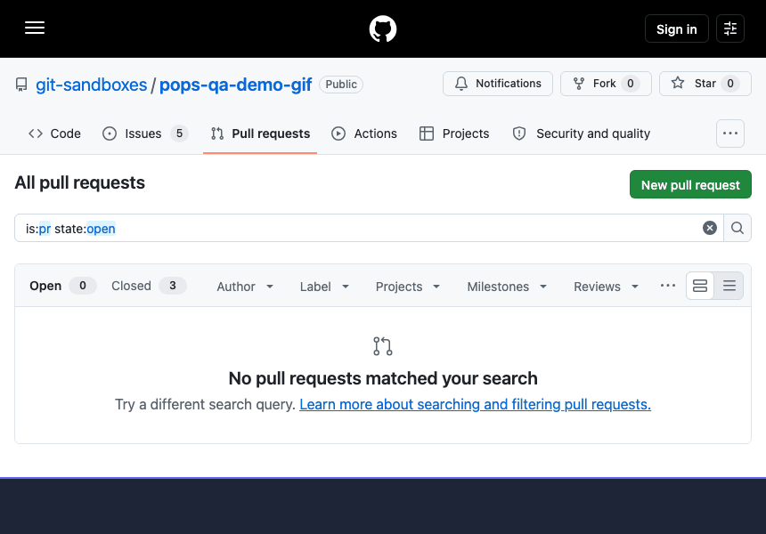

## What it looks like

Run `npx projectops` in your project folder. This is a **real run** on a sample Spring project (the wizard UI itself is currently Korean).

### 1. Open an issue and a branch name and commit message arrive automatically

When an issue is opened, GitHub Actions runs on its own and comments a **branch name and a commit message template**. Work on that branch name and the issue number links into your commits and reports automatically.

### 2. Open a PR and a change summary arrives automatically

Open a PR from a work branch and a **change summary** built from the commits is posted as a comment. Push more commits and the same comment is updated instead of piling up new ones.

### 3. Open a release PR and everything from versioning to merge and tag is automatic

Open a PR from the development branch to `main` and it writes the release notes, decides the version from commit titles (`feat`, `fix`, ...) and puts it in the PR title, merges automatically, and creates the **version tag**. This example had `feat` commits, so the minor version went up.

> The warning banner GitHub shows for Korean branch names is hidden in the recording. Everything else is the unedited screen.
