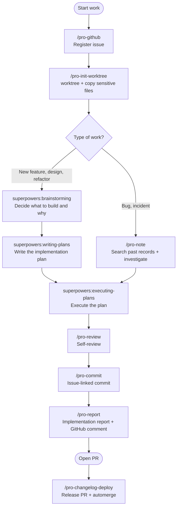

# Agent Skills guide

> **This repository is an Agent Skill package you can use with Claude Code, Cursor, Gemini CLI, and Codex CLI.**
> Along with the GitHub Actions automation template, it provides 17 development/DevOps Skills.

---

## What is a Skill?

A Skill is an **expert mode** with instructions and an output format specialized for one kind of task (for example code review, writing an issue, or refactoring). In Claude Code you call it as `/pro-<skill>` (for example `/pro-review`). Gemini CLI reads this repository's `skills/` through an extension, and Codex CLI reads it through a plugin marketplace.

For example, when you run `/pro-review`, Claude does not just answer "take a look at my code". It reviews from **six angles: security, performance, bugs, quality, architecture, and tests**, and returns the result sorted by **Critical/Major/Minor priority**.

---

## Installation

### Claude Code

```bash
claude plugin marketplace add Cassiiopeia/projectops
claude plugin install projectops@projectops-marketplace --scope user
```

After installing, type `/pro-` in Claude Code and the list of available Skills autocompletes.

### Cursor

With the `skills` mode of `npx projectops`, `skills/` is copied to the Cursor path.

```bash
# same on macOS / Linux / Windows
npx projectops --mode skills
```

In the interactive menu, choose `Agent Skill 설치` (install Agent Skill), then pick the Cursor scope.

### Gemini CLI

Gemini CLI installs it as an extension.

```bash
gemini extensions install https://github.com/Cassiiopeia/projectops
```

Update:

```bash
gemini extensions update projectops
```

After installing, Gemini reads `GEMINI.md` according to `contextFileName` in the root `gemini-extension.json`, and refers to `skills/{skill-name}/SKILL.md`.

### Codex CLI

Codex registers this repository as a plugin marketplace source. It is not listed in the official OpenAI marketplace; instead, you add a GitHub repo you trust yourself as a marketplace source.

**Method 1 (default):** Register the plugin marketplace

macOS / Linux:

```bash
codex plugin marketplace add Cassiiopeia/projectops
```

Wizard install:

```bash
npx projectops --mode skills
```

The wizard registers the Codex marketplace. After registering, check the `projectops` entry in `/plugins`.

Update:

```bash
codex plugin marketplace upgrade projectops
```

**Method 2 (fallback):** Activate immediately with git clone + symlink

Use this when the marketplace command is not available or you need it right away.

macOS / Linux:

```bash
git clone https://github.com/Cassiiopeia/projectops.git ~/.codex/projectops
mkdir -p ~/.agents/skills
ln -s ~/.codex/projectops/skills ~/.agents/skills/projectops
```

Windows PowerShell:

```powershell
git clone https://github.com/Cassiiopeia/projectops.git "$env:USERPROFILE\.codex\projectops"
New-Item -ItemType Directory -Force -Path "$env:USERPROFILE\.agents\skills"
cmd /c mklink /J "%USERPROFILE%\.agents\skills\projectops" "%USERPROFILE%\.codex\projectops\skills"
```

In Codex there is no slash command UI. You use Skills by having it read the relevant `SKILL.md` through `AGENTS.md` and the installed `skills/`.

---

## Full Skill list (17)

By purpose, they fall into four groups:

- **Analysis** (2) — Only read code and never modify it. Return plans, reviews, or diagnoses.
- **Implementation** (6) — Actually modify or create files.
- **Development cycle automation** (3) — Do commits, deploys, and GitHub work for you.
- **Document/artifact generation** (6) — Do not touch code; generate `.md` files or reports.

> Design, planning, and implementation are handled by `superpowers` (brainstorming → writing-plans → executing-plans), not by this plugin.


---

## 📊 Analysis Skills (2)

They do not modify code. Use them "when you want to understand the situation first".

### `/pro-review`

**What does it do?**
It reviews code from **six angles: security, performance, bugs, quality, architecture, and tests**. It sorts the issues it finds into **Critical / Major / Minor**, and also points out what was done well.

**Modifies**: nothing
**Returns**: review comments by priority + improvement suggestions

**When to use it**
- Self-review before opening a PR
- A second look at a specific file or function
- After finishing an implementation, to check "did I miss anything?"

---

### `/pro-note`

**What does it do?**
When you are stuck, it **first looks for whether you hit the same problem before**, and it records what you worked hard to figure out in a form you can use next time.

There is one standard for a record — **six months from now, someone must be able to solve the same problem from this document alone, without AI.** So commands are written so you can copy and run them as they are, and each one comes with what it checks and what a given output means. Before any step that cannot be undone, a backup procedure comes first.

**Modifies**: nothing (only creates record files)
**Returns**: past-record search results, or a new record in an executable form

**It works automatically at two moments**

- **When you are stuck** — If you say "the build broke again?", it searches the records before investigating. If one exists, it brings out the fix from last time right away.
- **After a hard fix** — If it took several tries or the cause was not what you expected, it suggests writing a record. It does not ask about things that were done in one go.

**Where do records accumulate?**

| Nature | Storage location |
|---|---|
| This project's code, settings, conventions | Inside the repository (`docs/projectops/note/`) |
| Problems common to deploy tools and platforms | User home (also searched from other projects) |
| Local environment problems | User home |

It decides automatically based on whether repository files changed, and asks once only when it is unclear. Searches look at both places.

**When to use it**
- A build or deploy fails and you do not know the cause
- An error keeps repeating and you do not remember how you fixed it before
- You worked out a library usage or a project convention the hard way
- You want to record something you already solved, for later

---

## 🔧 Implementation Skills (6)

They actually modify files. Use them when you want the work to be carried out.

### `/pro-figma-verify`

**What does it do?**
It **moves a Figma design into code and counts whether what you moved matches the design.** It lists every fill, border, effect, and layout in the dump without omission and uses that as the work list. It converts to responsive units, then compares the design image against the app screen pixel by pixel and points out where they differ.

**Modifies**: the relevant component files
**Returns**: a classification table + responsive code + pixel comparison results (including a diff image)

**When to use it**
- When moving a screen handed over by a designer into code
- When checking whether the moved screen matches the design
- After a designer says "this is different", to pin down what is different

> Moving and counting are one Skill. If they are split, the person moving works only from the picture without knowing what must be moved — in practice, a build has shipped with three of four effect lines missing.

---

### `/pro-oss-consult`

**What does it do?**
It **diagnoses a GitHub repo as an open source project**. It first determines the repo's nature (deployable app, small tool, CLI, docs, template, and so on), then scores it strictly on six axes — first impression, proof of value, community, code extensibility, legal safety, and long-term operation — and tells you the maturity stage and the prerequisites for the next stage. Scripts collect the facts; the agent makes the judgments.

**Modifies**: only what you approve — About, topics, Discussions, and labels (through this Skill's CLI), and document files added on a new branch. For each repo it shows a plan and asks for approval, and it does not change visibility, delete, or replace a license; it only suggests those.
**Returns**: a diagnosis report (scores on six axes, defects, improvements, maturity), and a scoreboard for an account-wide batch check

**When to use it**
- To check whether your repo is in a state where other people can find it and contribute
- To check the blockers to going public (committed secrets, license, personal data) on a repo you just opened
- To sweep all repos of an account or organization at once and set priorities

> Issue, PR, and comment work itself is `/pro-github`, and review of code changes is `/pro-review`.

---

### `/pro-build`

**What does it do?**
It runs the build command that fits the project type (Spring/Flutter/React/Node and so on). If the build errors out it analyzes the cause and fixes it, and if there is room to optimize the build result it suggests how.

**Modifies**: build config files (when needed)
**Returns**: build success/failure result + error analysis + optimization suggestions

**When to use it**
- The build broke and you need to find the cause
- A request to optimize bundle size
- "Just run a build"

---

### `/pro-init-worktree`

**What does it do?**
Give it only a branch name and it **creates a Git worktree automatically**, then analyzes `.gitignore` to find candidate local config files that exist in the original project. The agent decides for each candidate whether copying is needed, selectively copies only the necessary files with the reason, and reports the candidates it did not copy at the end. It also handles UTF-8 encoding problems.

**Modifies**: creates a new worktree directory + selectively copies the needed local config files
**Returns**: the created worktree path + a report of copied/skipped/missing candidates

**When to use it**
- When you want to work in a separate worktree for each PR
- When you do not want to miss files the worktree also needs, such as `.env`, Firebase config, signing keys, and local build settings

---

### `/pro-launch`

**What does it do?**
A **capability Skill** that starts, operates, and captures apps, web, and servers. It captures Android emulator and iOS simulator screens with the status bar fixed, and opens a browser to navigate, click, type, and capture. By changing the width or swapping API responses, it can stage empty-list, failure, and loading states without touching the server. Single HTTP requests, DB queries, and server logs also run using the connection method you wrote down.

**Modifies**: nothing (only saves captures and run records)
**Returns**: capture images + run result JSON

**When to use it**
- "Start the emulator and capture it", "capture it at mobile width"
- When you need state screens such as an empty list or a 500 error
- When another Skill (`pro-agent-test`, `pro-design-brief`, `pro-figma-verify`) needs to capture a screen

> QA that goes through the app end to end looking for bugs is `/pro-agent-test`. This Skill is "a tool for starting and capturing".

---

### `/pro-design-brief`

**What does it do?**
It builds a **request document** to hand to a designer for a screen you built before the design exists. It captures the real screen by state (empty list, failure, long text, font size, small phone), assembles layout alternatives, copy candidates, and must-keep items (brand specs, agreed exceptions) into a board, and hands it off in whichever format fits the repo: an issue, a single HTML page, or an md folder. It gives material to think with, not the answer.

**Modifies**: nothing
**Returns**: a per-state capture board + a design request issue (or HTML/md)

**When to use it**
- "Request a design", "ask them to draw the empty and error screens too"
- When requesting a design for a screen you built without one

> Moving a design into code and comparing it is `/pro-figma-verify`.

---

## 🔄 Development cycle automation Skills (3)

From registering an issue to committing and deploying — AI takes over the repetitive work.

### `/pro-commit`

**What does it do?**
It reads the issue context (`.projectops/context/current-issue.json`) saved by the issue creation of `/pro-github` or by `/pro-init-worktree`, **auto-completes a message that fits the project commit convention**, and commits. It always proposes the message first and runs only after the user confirms.

**Modifies**: a git commit (based on staged files)
**Returns**: a finished commit in the form `issue title : type : change description issue URL`

**Commit convention**:
```
issue title : feat : change description https://github.com/.../issues/123
```

**When there is no issue context**:
1. Create a new issue (guides you through the `/pro-github` issue creation flow)
2. Enter an issue number directly (info is looked up from GitHub automatically)
3. Commit in free form without an issue
4. Cancel

**Follows superpowers principles**:
- If nothing is staged, it does not run `git add` for you — the user stages by hand
- It never runs a commit without user confirmation
- It never runs `git push` — it handles the commit only

**When to use it**
- When copying and pasting the issue number/URL into every commit message is a chore
- When you want to keep the team commit convention consistent

---

### `/pro-changelog-deploy`

**What does it do?**
It pushes the `develop` branch, creates a release PR (`deploy` PR) to `main`, and **writes the release notes itself** into the PR body. When the `PROJECT-COMMON-RELEASE-CHANGELOG` workflow detects the "Summary by CodeRabbit" phrase, it updates the CHANGELOG and automerge proceeds automatically. If automerge fails, it closes the existing PR and retries with a new one.

**Modifies**: nothing (only GitHub API calls)
**Returns**: the `develop → main` release PR (deploy PR) URL + a notice that the release notes are written

**When to use it**
- After finishing an implementation, to handle the whole deploy cycle (push → PR → CHANGELOG → merge) in one go
- When automerge failed and you need to re-trigger it

---

### `/pro-github`

**What does it do?**
It **looks up and manages** GitHub issues/PRs/comments **independently**. Without any other Skill, it lists issues, changes status, adds comments, and so on. It calls the GitHub API directly and does not use the `gh` CLI.

**Modifies**: GitHub issue/PR state (on request)
**Returns**: issue/PR lists, details, a completion notice

**When to use it**
- When you want to list issues quickly or change their status
- When adding a comment to a PR or changing labels
- When you want to do GitHub work alone, without any other Skill

---

## 📝 Document/artifact generation Skills (6)

They do not touch code; they generate **document files** in a specific format.

### `/pro-report`

**What does it do?**
It checks the changed files with `git status`, selects and reads the files related to the issue, and writes an **implementation report**. It is saved in the form `.report/YYYYMMDD_#issue-number_description.md`.

**Modifies**: a new `.md` file in the `.report/` folder
**Returns**: a report covering overview, changes, key implementation details, and caveats

**When to use it**
- When you need a PR description or an internal report after finishing an implementation
- To summarize the work done for a specific issue

---

### `/pro-testcase`

**What does it do?**
It reads a GitHub issue, explores the related code, and generates a **QA test checklist**. It includes basic features, edge cases, and extra items by project type. The result is saved as `testcase-[number]-[description].md`, and **you can paste it straight into a GitHub comment**.

**Modifies**: a test case `.md` file
**Returns**: a list of QA test items in checkbox form

**When to use it**
- When you need a checklist before handing off to QA
- When you want to organize manual test scenarios

---

### `/pro-agent-test`

**What does it do?**
QA that **actually runs apps, web, and servers and goes through them looking for bugs.** It taps the screen (app/web) and sends requests (server), and at each step it cross-checks device storage, browser state, and the server DB. It does not look only at the place it was asked about; it also checks other screens of the same kind and symmetric actions (sign up ↔ withdraw, create ↔ delete) to find consistency defects. If logs are missing, it reports that as an untraceable defect.

**Modifies**: nothing (it does not fix code; it only reports defects)
**Returns**: per-step evidence (screenshots, comparison tables) · reproduction steps · a defect list by severity

**When to use it**
- Before a deploy, to confirm the main flows (login, sign-up, payment) really work
- To reproduce a bug a user hit — the ones unit tests do not catch
- Problems that only occur in release builds (R8, signing, and manifest problems do not reproduce in debug)

> It differs from `/pro-testcase` (QA document generation) — this Skill **runs** the app.

---

### `/pro-synology-expose`

**What does it do?**
It guides you step by step through a **setup guide for exposing a web service on a Synology NAS under an external domain**. It covers adding DNS records (Cloudflare/Route53 and others), DSM reverse proxy setup, and issuing a Let's Encrypt certificate.

**Modifies**: a setup guide `.md` file (guidance-focused; the user does the actual server setup)
**Returns**: a tailored guide generated from the domain/DDNS/DNS provider/email you enter

**When to use it**
- When you need to publish a new service externally through Synology
- When it is your first time setting up an HTTPS certificate

---

### `/pro-ssh`

**What does it do?**
It **connects to any server reachable by SSH** — AWS EC2, Synology NAS, a generic Linux server, and so on — runs commands, and reports the result. It supports both password and PEM key authentication, and if you save server info in `~/.projectops/config/ssh.config.json`, it connects when you just say the name.

**Modifies**: nothing (runs commands on the remote server and only returns the result)
**Returns**: SSH command output + a summary report

**When to use it**
- "Show me the server logs", "check prod", "did the deploy go through?"
- Automatic server state checks after CI/CD finishes
- Registering several servers in the config and choosing by name

---

### `/pro-skill-creator`

**What does it do?**
It manages Skill files in three modes: **create (CREATE), review (REVIEW), and improve (IMPROVE)**. CREATE writes a new SKILL.md in the standard format, REVIEW examines an existing Skill against `common-rules.md` and suggests improvements, and IMPROVE applies the review results by actually editing.

**Modifies**: `skills/{skill-name}/SKILL.md` (in IMPROVE mode)
**Returns**: a new SKILL.md draft / a review report / an improved SKILL.md

**When to use it**
- When you want to build a new Skill from scratch to the standard
- When checking whether an existing Skill matches the latest conventions
- When you want to apply review results to a Skill right away

---

## Which Skill when?

The actual work order is **register issue → separate work environment → plan → implement → test → review → report**.

### Standard development flow (full cycle)




### Flow by scenario

| Situation | Recommended flow |
|------|----------|
| **New feature development (standard)** | `pro-github` → `pro-init-worktree` → `brainstorming` → `writing-plans` → `executing-plans` → `pro-review` → `pro-commit` → `pro-report` → `pro-changelog-deploy` |
| **Bug fix** | `pro-github` → `pro-init-worktree` → `pro-note`(search) → `executing-plans` → `pro-commit` → `pro-report` → `pro-changelog-deploy` |
| **Refactor, design change** | Same as new feature development (start by narrowing the scope in `brainstorming`) |
| **QA test cases** | `pro-github` → `pro-testcase` |
| **Real-run verification (app, web, server)** | `pro-agent-test` → (if a problem is found) `pro-github` → `pro-commit` |

### Single tasks (called alone, outside the cycle)

| Situation | Skill to use |
|------|----------|
| Only a code review is needed | `review` |
| Quickly draft just an issue | `github` |
| Generate a PR description / QA checklist | `report` / `testcase` |
| Move a Figma design into code and compare it with the design | `figma-verify` |
| Synology external exposure guide | `synology-expose` |
| SSH into a remote server and run commands | `ssh` |
| Run a build / analyze errors | `build` |
| Create a deploy PR + automerge | `changelog-deploy` |
| Look up and manage GitHub issues/PRs | `github` |
| Create/review/improve a Skill | `skill-creator` |

---

## References

- Skill source: the `skills/` folder of this repository (the common source for Claude/Gemini/Codex/Cursor)
- Claude Code manifests: `.claude-plugin/plugin.json`, `.claude-plugin/marketplace.json`
- Gemini CLI manifests: `gemini-extension.json`, `GEMINI.md`
- Codex CLI marketplace/bootstrap/metadata: `.agents/plugins/marketplace.json`, `AGENTS.md`, `.codex-plugin/plugin.json`
- Version sync: when `version.yml` changes, the `PROJECT-TEMPLATE-PLUGIN-VERSION-SYNC` workflow applies it automatically
