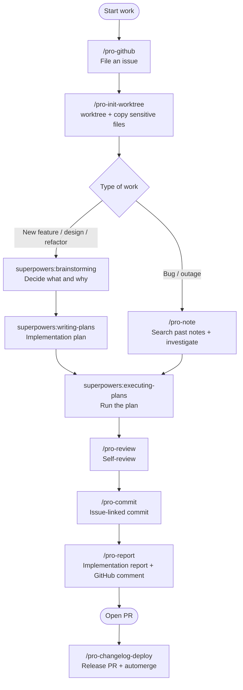
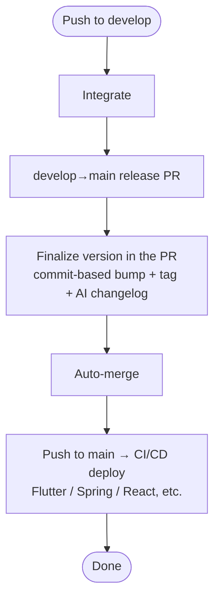

<div align="center">

# 🚀 Projectops

**GitHub Actions automation + Agent AI Skills: a DevOps template that automates your whole development cycle**

> From filing an issue to commits, reports, and releases. Just write the code.

[한국어](https://github.com/Cassiiopeia/projectops/blob/main/README.md) | **English** | [简体中文](https://github.com/Cassiiopeia/projectops/blob/main/docs/i18n/README.zh-CN.md) | [日本語](https://github.com/Cassiiopeia/projectops/blob/main/docs/i18n/README.ja.md)

[](https://www.npmjs.com/package/projectops) [](https://github.com/Cassiiopeia/projectops/releases) [](../../LICENSE)

[Changelog](../../CHANGELOG.md)

</div>

> **Note:** This is a translation of the [Korean README](https://github.com/Cassiiopeia/projectops/blob/main/README.md), which is the source of truth. The linked guides under `docs/` are currently written in Korean only.

---

## Why this template?

This project automates your development workflow on two axes.

**① GitHub Actions**: one push to main handles versioning, changelogs, and CI/CD deployment.
**② Agent Skills**: commands such as `/pro-github`, `/pro-commit`, and `/pro-report` let an AI agent write issues, commit messages, and implementation reports for you.

| The usual way | With Projectops |
|----------|---------------------|
| Bump versions and create tags by hand | At release time the version is bumped from your commit titles and a tag is created |
| Write the changelog yourself (30+ min) | Generated for every release PR (commit analysis, or an AI summary if you add an AI key) |
| Set up CI/CD from scratch | Workflows for your project type, ready immediately |
| Format every issue by hand (5+ min) | `/pro-github` writes and files an issue from the standard template in one step |
| Copy the issue URL into commit messages | `/pro-commit` completes the message from the issue context |
| Write PR descriptions and reports by hand | `/pro-report` analyzes the git diff and generates one |
| Re-type prompts for every code review or analysis | 20 Skills give consistent results without re-typing |

---

## What it actually looks like

This repository is run with this tool. The screens below are not mockups. They are **this repo's real issue, PR, and release pages**.


| Step | What happens |
|------|------------|
| 1. File an issue | `/pro-github` writes and files it from the template; when the label changes, the Projects board status follows |
| 2. Automatic guide | When an issue opens, a comment tells you the **branch name and a commit message template** |
| 3. Implementation report | `/pro-report` leaves the changes and a flow chart as an issue comment |
| 4. Release PR | On the develop → main PR, the version is finalized, release notes are written, and the PR auto-merges |
| 5. GitHub Release | Once it lands on main, a release is created automatically with the version tag |

<details>
<summary>See each step full size</summary>


</details>

---

## AI development cycle

Agent Skills cover the entire development cycle.



> Full list of Skills and usage: **[docs/SKILLS.md](../SKILLS.md)** (Korean)

---

## GitHub Actions pipeline



---

## Quick start

### New project

Click **"Use this template"** on GitHub → automatic setup finishes within a minute.

### Add to an existing project

**Recommended: npx (macOS, Linux, Windows)**

```bash
npx projectops
```

> You only need Node.js 20.12+. An interactive wizard runs with no separate install. Non-interactive: `npx projectops --mode full --type spring,react --force`

> ⚠️ The old `template_integrator.sh` / `.ps1` have reached **end of life (EOF)** (#458). They only print a pointer to `npx projectops` and will be removed in the next minor release.

### Install Agent Skills only

```bash
# Claude Code
claude plugin marketplace add Cassiiopeia/projectops
claude plugin install projectops@projectops-marketplace --scope user
```

```bash
# Gemini CLI
gemini extensions install https://github.com/Cassiiopeia/projectops
```

```bash
# Codex CLI (macOS / Linux)
codex plugin marketplace add Cassiiopeia/projectops
```

The `--mode skills` wizard registers the Codex marketplace and also prepares the native skills fallback. Use `/plugins` only to check or manage the install.

Where the Codex plugin marketplace is unavailable, use the fallback install described in the [Skills guide](../SKILLS.md).

```bash
# Cursor / the full Agent Skills install menu (recommended: npx)
npx projectops --mode skills
```

> Claude Code prefers `/pro-` autocomplete, Gemini prefers its extension, and Codex prefers its plugin marketplace. See the [Skills guide](../SKILLS.md) for details.

---

## Key features

| Feature | Description | Docs |
|------|------|------|
| **Agent Skills** | 20 AI DevOps Skills for Claude Code, Cursor, Gemini CLI, and Codex CLI | [Details](../SKILLS.md) |
| **Automatic versioning** | Decides major/minor/patch from commit titles at release time + a Git tag | [Details](../VERSION-CONTROL.md) |
| **AI changelog** | Generates CHANGELOG through a ladder (PR body → OpenAI-compatible AI key such as Gemini or Groq → commit analysis). It still completes for free without a key | [Details](../CHANGELOG-AUTOMATION.md) |
| **PR Preview** | Deploy a temporary server with one comment; it is removed when the PR closes | [Details](../PR-PREVIEW.md) |
| **Issue automation** | Suggests branch names and commit messages, creates QA issues | [Details](../ISSUE-AUTOMATION.md) |
| **Flutter CI/CD** | Automatic deploy to iOS TestFlight and Android Play Store | [Details](../FLUTTER-CICD-OVERVIEW.md) |
| **Deployment setup wizards** | 5-step HTML wizards for Play Store / TestFlight / Firebase App Distribution | `.github/util/flutter/{playstore,testflight,firebase}-wizard/` |
| **SSH + Docker deploy** | Zero-downtime Docker deployment to an SSH server (Synology, AWS EC2, etc.) | [Details](../SSH-DOCKER-DEPLOYMENT-GUIDE.md) |

---

## Agent Skills (20)

### 🔄 Development cycle automation

| Skill | Purpose |
|------|------|
| `/pro-init-worktree` | Create a Git worktree and copy sensitive files automatically |
| `/pro-commit` | Complete a commit message from the issue context (follows superpowers) |
| `/pro-report` | Analyze the git diff → generate an implementation report and post it as a GitHub comment |
| `/pro-changelog-deploy` | Push develop → open the main release PR + write release notes + automerge |
| `/pro-github` | GitHub in general: create issues (one-line description → template + file), view/edit/comment/label/assign, create/merge/view PRs, explore repos, manage Actions and Secrets |

### 📊 Analysis (no code changes)

| Skill | Purpose |
|------|------|
| `/pro-review` | Review from 6 angles (security, performance, bugs, quality...), classified Critical/Major/Minor |
| `/pro-note` | When stuck, search past notes; save what you found out as an actionable note |

### 🔧 Implementation (writes real code)

| Skill | Purpose |
|------|------|
| `/pro-figma-verify` | Move a Figma design into code, then compare the result with the design pixel by pixel |
| `/pro-build` | Run the project build, analyze errors, suggest optimizations |
| `/pro-launch` | Launch, drive, and capture apps, web, and servers: fixed status bar, width changes, response mocking (empty list, failures), render from code |
| `/pro-design-brief` | A design request for a screen you built before the mockup exists: state captures, alternatives, copy candidates, and must-keep rules as a board for the designer |
| `/pro-oss-consult` | Diagnose a GitHub repo as an open-source project: type detection, 6-axis scoring, maturity stage, and edits to About, topics, labels, and files only after approval. One repo or a whole account |

> Design, planning, and implementation flow is handled by `superpowers` (brainstorming → writing-plans → executing-plans).
> `/pro-plan`, `/pro-analyze`, and `/pro-implement` are the previous generation of the same roles and only run when invoked explicitly. Together with the 17 in the tables above, that makes 20 in total.

### 📝 Documents and artifacts

| Skill | Purpose |
|------|------|
| `/pro-testcase` | Analyze an issue → generate a QA checklist |
| `/pro-agent-test` | QA that actually runs apps, web, and servers to find bugs, reporting reproduction steps, evidence, and severity (it does not fix code) |
| `/pro-synology-expose` | Guide to exposing a Synology NAS service on an external domain |
| `/pro-ssh` | Connect to a remote server over SSH and run commands (AWS EC2, Synology NAS, Linux, and more) |
| `/pro-skill-creator` | Create, review, and improve a Skill (CREATE / REVIEW / IMPROVE modes) |

---

## Supported project types

| Type | Version file | CI/CD |
|------|----------|-------|
| `spring` | build.gradle | SSH + Docker deploy, Nexus |
| `flutter` | pubspec.yaml | TestFlight, Play Store |
| `react` (including Next.js) | package.json | Docker |
| `node` | package.json | Docker |
| `python` | pyproject.toml | SSH + Docker deploy |
| `react-native` | Info.plist + build.gradle | — |
| `react-native-expo` | app.json | — |
| `basic` | version.yml only | — |

---

## Comment commands

Run automation by commenting on an issue or PR.

| Command | What it does | Applies to |
|--------|------|------|
| `@projectops server build` | Deploy a temporary server | Spring, Python |
| `@projectops server destroy` | Delete the server | Spring, Python |
| `@projectops server status` | Check server status | Spring, Python |
| `@projectops build app` | Build iOS + Android | Flutter |
| `@projectops apk build` | Build Android only | Flutter |
| `@projectops ios build` | Build iOS only | Flutter |
| `@projectops create qa` | Create a QA issue automatically | All projects |

> Details: [PR Preview](../PR-PREVIEW.md) | [Flutter builds](../FLUTTER-TEST-BUILD-TRIGGER.md) | [Issue automation](../ISSUE-AUTOMATION.md)

---

## Setup

### Required secret

```
Repository Settings → Secrets → Actions → New repository secret
Name: _GITHUB_PAT_TOKEN
Value: [Personal Access Token - repo and workflow scopes]
```

### Organization settings

```
Settings → Actions → General
├─ ✅ Allow GitHub Actions to create and approve pull requests
└─ ✅ Read and write permissions
```

---

## Documentation

See the **[documentation index](../README.md)** for the full list. All guides are currently in Korean.

---

## Things to know

We would rather tell you up front when this is not a fit.

- **GitHub only.** It assumes GitHub Actions and GitHub issues/PRs, so GitLab and others are not supported.
- **Releases assume a develop branch → default branch PR flow.** Branch names can be changed in `version.yml`, but it does not suit a repo that does not use two branches.
- **Issue and PR automation needs a personal access token (PAT).** Follow [Setup](#setup) above.
- **Server deploy workflows assume a Docker server reachable over SSH.**

---

## Support

- [Issues](https://github.com/Cassiiopeia/projectops/issues): bug reports and feature requests
  - This repo does not close finished issues; it marks them with the `작업완료` (done) label. That is why the open-issue count looks high.
- [CONTRIBUTING.md](../../CONTRIBUTING.md): contribution guide (Korean)
- [SECURITY.md](../../SECURITY.md): please report security vulnerabilities privately, not in a public issue

---

<div align="center">

**MIT License**

</div>
