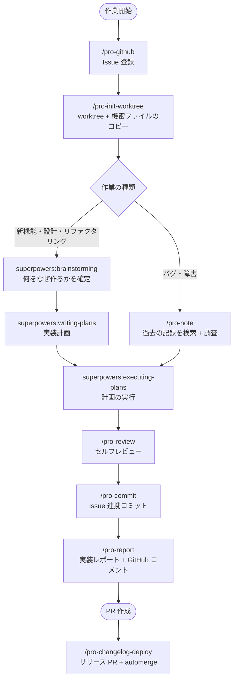
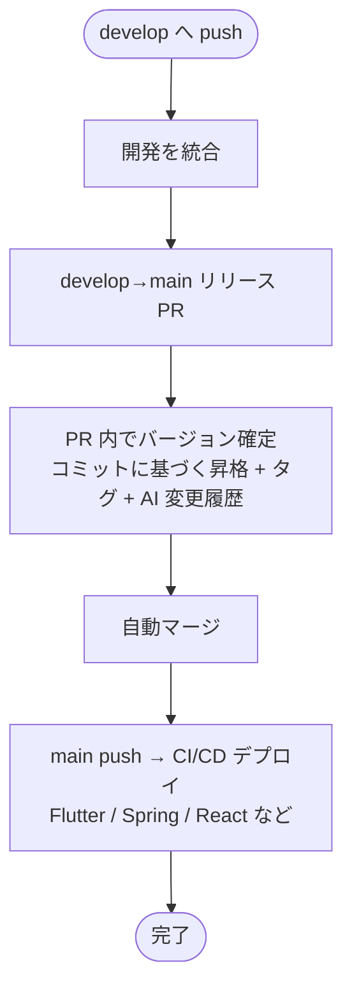

<div align="center">

# 🚀 Projectops

**GitHub Actions の自動化 + Agent AI Skills：開発サイクル全体を自動化する DevOps テンプレート**

> Issue の作成からコミット、レポート、リリースまで。開発者はコードを書くことに集中できます。

[한국어](https://github.com/Cassiiopeia/projectops/blob/main/README.md) | [English](https://github.com/Cassiiopeia/projectops/blob/main/docs/i18n/README.en.md) | [简体中文](https://github.com/Cassiiopeia/projectops/blob/main/docs/i18n/README.zh-CN.md) | **日本語**

[](https://www.npmjs.com/package/projectops) [](https://github.com/Cassiiopeia/projectops/releases) [](../../LICENSE)

[変更履歴](../../CHANGELOG.md)

</div>

> **お知らせ：** このページは[韓国語版 README](https://github.com/Cassiiopeia/projectops/blob/main/README.md) の翻訳で、正本は韓国語版です。リンク先の `docs/` 配下のガイドは現在、韓国語のみです。

---

## なぜこのテンプレートなのか

このプロジェクトは 2 つの軸で開発ワークフローを自動化します。

**① GitHub Actions**：main へ一度 push するだけで、バージョン管理、変更履歴、CI/CD デプロイまで自動で処理します。
**② Agent Skills**：`/pro-github`、`/pro-commit`、`/pro-report` などのコマンドで、AI が Issue の作成からコミットメッセージ、実装レポートまで代わりに作成します。

| 従来の方法 | Projectops |
|----------|---------------------|
| バージョンを手動で管理し、タグも手作業で作成 | リリース時にコミットタイトルに応じてバージョンを自動で上げ、タグを作成 |
| 変更履歴を手書き（30 分以上） | リリース PR ごとに自動生成（コミット分析。AI キーがあれば AI 要約） |
| CI/CD を一から設定 | プロジェクトタイプ別のワークフローをすぐに構成 |
| Issue を毎回書式に合わせて作成（5 分以上） | `/pro-github` が標準テンプレートで作成から登録まで一度で実行 |
| コミットメッセージに Issue の URL を手作業でコピー | `/pro-commit` が Issue の文脈から自動で補完 |
| PR の説明やレポートを手書き | `/pro-report` が git diff を分析して自動生成 |
| コードレビューや分析のたびにプロンプトを入力 | 20 種の Skills で一貫した結果。毎回の再入力は不要 |

---

## 実際の動作画面

このリポジトリ自体がこのツールで運用されています。以下はモックアップではなく、**このリポジトリの実際の Issue、PR、リリース画面**です。


| ステップ | 起きること |
|------|------------|
| 1. Issue 登録 | `/pro-github` がテンプレートに沿って作成・登録し、ラベルが変わると Projects ボードの状態も連動します |
| 2. 自動ガイド | Issue が開かれると、**ブランチ名とコミットメッセージのテンプレート**をコメントで知らせます |
| 3. 実装レポート | `/pro-report` が変更内容とフローチャートを Issue のコメントに残します |
| 4. リリース PR | develop → main の PR でバージョン確定、リリースノート作成、自動マージが進みます |
| 5. GitHub Release | main に反映されると、バージョンタグ付きのリリースが自動で作成されます |

<details>
<summary>ステップごとの画面を大きく見る</summary>


</details>

---

## AI 開発サイクル

Agent Skills が開発サイクル全体をカバーします。



> Skills の全一覧と詳しい使い方：**[docs/SKILLS.md](../SKILLS.md)**（韓国語）

---

## GitHub Actions 自動化パイプライン



---

## クイックスタート

### 新規プロジェクト

GitHub で **「Use this template」** をクリック → 1 分以内に自動で初期化が完了します。

### 既存プロジェクトへの導入

**推奨：npx（macOS・Linux・Windows 共通）**

```bash
npx projectops
```

> Node.js 20.12 以上があれば、別途インストールなしで対話型ウィザードが起動します。非対話型：`npx projectops --mode full --type spring,react --force`

> ⚠️ 旧 `template_integrator.sh` / `.ps1` は**サポート終了（EOF）**です（#458）。実行しても `npx projectops` の案内が表示されるだけで、次の minor リリースでファイルが削除されます。

### Agent Skills だけをインストール

```bash
# Claude Code
claude plugin marketplace add Cassiiopeia/projectops
claude plugin install projectops@projectops-marketplace --scope user
```

```bash
# Gemini CLI
gemini extensions install https://github.com/Cassiiopeia/projectops
```

```bash
# Codex CLI (macOS / Linux)
codex plugin marketplace add Cassiiopeia/projectops
```

`--mode skills` ウィザードは Codex marketplace を登録したうえで、ネイティブ skills のフォールバックも自動で準備します。`/plugins` はインストールの確認・管理にのみ使ってください。

Codex plugin marketplace が使えない環境では、[Skills ガイド](../SKILLS.md)のフォールバックのインストール方法を使ってください。

```bash
# Cursor / すべての Agent Skills のインストールメニュー（推奨：npx）
npx projectops --mode skills
```

> Claude Code は `/pro-` の自動補完、Gemini は extension、Codex は plugin marketplace を優先して使います。詳しくは [Skills ガイド](../SKILLS.md)を参照してください。

---

## 主な機能

| 機能 | 説明 | ドキュメント |
|------|------|------|
| **Agent Skills** | Claude Code、Cursor、Gemini CLI、Codex CLI で使える 20 種の AI DevOps Skills | [詳細](../SKILLS.md) |
| **バージョン自動化** | リリース時にコミットタイトルから major/minor/patch を判定 + Git タグ | [詳細](../VERSION-CONTROL.md) |
| **AI 変更履歴** | 生成のはしご（PR 本文 → OpenAI 互換の AI キー（Gemini・Groq など）→ コミット分析）で CHANGELOG を自動生成。キーがなくても無料で完了します | [詳細](../CHANGELOG-AUTOMATION.md) |
| **PR Preview** | コメント 1 行で一時サーバーをデプロイし、PR を閉じると自動で削除 | [詳細](../PR-PREVIEW.md) |
| **Issue 自動化** | ブランチ名・コミットメッセージの自動提案、QA Issue の作成 | [詳細](../ISSUE-AUTOMATION.md) |
| **Flutter CI/CD** | iOS TestFlight と Android Play Store への自動デプロイ | [詳細](../FLUTTER-CICD-OVERVIEW.md) |
| **デプロイ設定ウィザード** | Play Store / TestFlight / Firebase App Distribution 向けの 5 ステップ HTML ウィザード | `.github/util/flutter/{playstore,testflight,firebase}-wizard/` |
| **SSH+Docker デプロイ** | SSH 接続のサーバー（Synology・AWS EC2 など）へ Docker を無停止でデプロイ | [詳細](../SSH-DOCKER-DEPLOYMENT-GUIDE.md) |

---

## Agent Skills（20 種）

### 🔄 開発サイクルの自動化

| スキル | 用途 |
|------|------|
| `/pro-init-worktree` | Git worktree を作成し、機密ファイルを自動でコピー |
| `/pro-commit` | Issue の文脈からコミットメッセージを自動補完（superpowers 準拠） |
| `/pro-report` | git diff を分析 → 実装レポートを生成し、GitHub コメントとして自動投稿 |
| `/pro-changelog-deploy` | develop を push → main へのリリース PR を作成 + リリースノート作成 + automerge |
| `/pro-github` | GitHub 全般：Issue の作成（一行の説明 → テンプレートで作成・登録）/参照/編集/コメント/ラベル/担当者、PR の作成/マージ/参照、リポジトリ探索、Actions・Secret の管理 |

### 📊 分析型（コードを変更しない）

| スキル | 用途 |
|------|------|
| `/pro-review` | セキュリティ・性能・バグ・品質など 6 つの観点でレビューし、Critical/Major/Minor に分類 |
| `/pro-note` | 行き詰まったときに過去の記録を検索し、分かったことを実行可能な記録として保存 |

### 🔧 実装型（実際にコードを書く）

| スキル | 用途 |
|------|------|
| `/pro-figma-verify` | Figma のデザインをコードに移し、出来上がりがデザインと同じかをピクセル単位で比較 |
| `/pro-build` | プロジェクトのビルド実行、エラー分析、最適化の提案 |
| `/pro-launch` | アプリ・Web・サーバーを起動・操作・撮影：ステータスバー固定、幅の変更、レスポンスの差し替え（空リスト・失敗の再現）、コードによる描画 |
| `/pro-design-brief` | デザインが出る前に作った画面のデザイン依頼書：状態別キャプチャ、代替案、文言候補、必ず守ることをボードにしてデザイナーへ |
| `/pro-oss-consult` | GitHub リポジトリをオープンソースとして診断：性格の判別、6 軸の採点、成熟度ステージ、承認を得た内容だけ About・topics・ラベル・ファイルを修正。単一リポジトリもアカウント全体も対応 |

> 設計・計画・実装の流れは `superpowers`（brainstorming → writing-plans → executing-plans）が担当します。
> `/pro-plan`・`/pro-analyze`・`/pro-implement` は同じ役割の旧世代の経路で、明示的に呼び出したときだけ動作します。上の表の 17 種と合わせて、合計 20 種です。

### 📝 ドキュメント・成果物の生成型

| スキル | 用途 |
|------|------|
| `/pro-testcase` | Issue を分析 → QA チェックリストを生成 |
| `/pro-agent-test` | アプリ・Web・サーバーを実際に動かしてバグを探す QA。再現手順・根拠・深刻度とともに報告（コードは修正しない） |
| `/pro-synology-expose` | Synology NAS のサービスを外部ドメインに公開する設定ガイド |
| `/pro-ssh` | リモートサーバーへ SSH 接続してコマンドを実行（AWS EC2、Synology NAS、Linux など汎用） |
| `/pro-skill-creator` | Skill の作成・レビュー・改善（CREATE・REVIEW・IMPROVE の 3 モード） |

---

## 対応プロジェクトタイプ

| タイプ | バージョンファイル | CI/CD |
|------|----------|-------|
| `spring` | build.gradle | SSH+Docker デプロイ、Nexus |
| `flutter` | pubspec.yaml | TestFlight、Play Store |
| `react`（Next.js を含む） | package.json | Docker |
| `node` | package.json | Docker |
| `python` | pyproject.toml | SSH+Docker デプロイ |
| `react-native` | Info.plist + build.gradle | — |
| `react-native-expo` | app.json | — |
| `basic` | version.yml のみ | — |

---

## コメントコマンド

Issue や PR へのコメントで自動化を実行します。

| コマンド | 機能 | 対象 |
|--------|------|------|
| `@projectops server build` | 一時サーバーをデプロイ | Spring、Python |
| `@projectops server destroy` | サーバーを削除 | Spring、Python |
| `@projectops server status` | サーバーの状態を確認 | Spring、Python |
| `@projectops build app` | iOS + Android をビルド | Flutter |
| `@projectops apk build` | Android のみビルド | Flutter |
| `@projectops ios build` | iOS のみビルド | Flutter |
| `@projectops create qa` | QA Issue を自動作成 | すべてのプロジェクト |

> 詳細：[PR Preview](../PR-PREVIEW.md) | [Flutter ビルド](../FLUTTER-TEST-BUILD-TRIGGER.md) | [Issue 自動化](../ISSUE-AUTOMATION.md)

---

## 設定

### 必須の Secret

```
Repository Settings → Secrets → Actions → New repository secret
Name: _GITHUB_PAT_TOKEN
Value: [Personal Access Token - repo、workflow 権限]
```

### Organization の設定

```
Settings → Actions → General
├─ ✅ Allow GitHub Actions to create and approve pull requests
└─ ✅ Read and write permissions
```

---

## ドキュメント

すべての一覧は **[ドキュメントインデックス](../README.md)** を参照してください。ガイドは現在すべて韓国語です。

---

## 知っておいてほしいこと

合わない場合は、先にお伝えしておきます。

- **GitHub 専用です。** GitHub Actions と GitHub の Issue・PR を前提にしているため、GitLab などには対応していません。
- **リリースは「開発ブランチ → デフォルトブランチ」の PR 構成を前提にしています。** ブランチ名は `version.yml` で変更できますが、2 つのブランチを分けて使わないリポジトリには合いません。
- **Issue・PR の自動化には、個人アクセストークン（PAT）の登録が必要です。** 上の[設定](#設定)に従ってください。
- **サーバーデプロイのワークフローは、SSH で接続できる Docker サーバーを前提にしています。**

---

## サポート

- [Issues](https://github.com/Cassiiopeia/projectops/issues)：バグ報告、機能リクエスト
  - このリポジトリは完了した Issue を閉じず、`작업완료`（完了）ラベルで示します。未解決の Issue 数が多く見える理由です。
- [CONTRIBUTING.md](../../CONTRIBUTING.md)：コントリビューションガイド（韓国語）
- [SECURITY.md](../../SECURITY.md)：セキュリティ上の脆弱性は、公開 Issue ではなく非公開で報告してください

---

<div align="center">

**MIT License**

</div>
