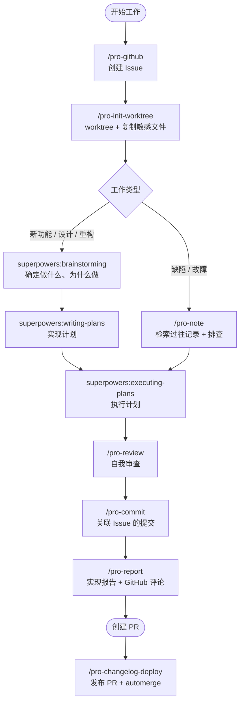
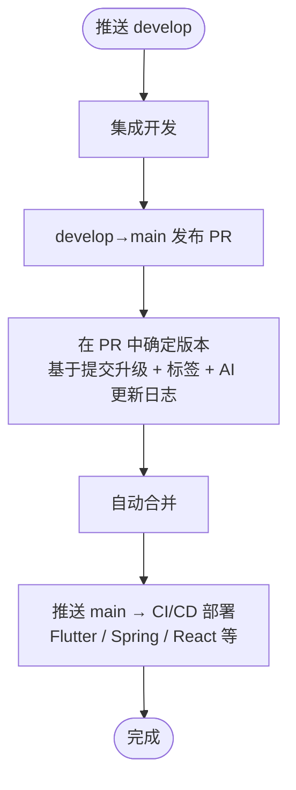

<div align="center">

# 🚀 Projectops

**GitHub Actions 自动化 + Agent AI Skills：自动化整个开发周期的 DevOps 模板**

> 从创建 Issue 到提交、报告、发布。你只需要写代码。

[한국어](https://github.com/Cassiiopeia/projectops/blob/main/README.md) | [English](https://github.com/Cassiiopeia/projectops/blob/main/docs/i18n/README.en.md) | **简体中文** | [日本語](https://github.com/Cassiiopeia/projectops/blob/main/docs/i18n/README.ja.md)

[](https://www.npmjs.com/package/projectops) [](https://github.com/Cassiiopeia/projectops/releases) [](../../LICENSE)

[更新日志](../../CHANGELOG.md)

</div>

> **说明：** 本文是[韩文 README](https://github.com/Cassiiopeia/projectops/blob/main/README.md) 的译文，以韩文版为准。文中链接的 `docs/` 下的指南目前只有韩文版。

---

## 为什么选择这个模板？

本项目从两个方向自动化开发工作流。

**① GitHub Actions**：推送一次 main，版本管理、更新日志、CI/CD 部署全部自动完成。
**② Agent Skills**：通过 `/pro-github`、`/pro-commit`、`/pro-report` 等命令，由 AI 代你撰写 Issue、提交信息和实现报告。

| 传统做法 | 使用 Projectops |
|----------|---------------------|
| 手动管理版本、手动创建标签 | 发布时按提交标题自动升级版本并创建标签 |
| 手写更新日志（30 分钟以上） | 每个发布 PR 自动生成（提交分析；配置 AI 密钥后为 AI 摘要） |
| 从零搭建 CI/CD | 立即按项目类型配置好工作流 |
| 每次按格式手写 Issue（5 分钟以上） | `/pro-github` 一步按标准模板生成并提交 |
| 手动把 Issue 链接复制到提交信息 | `/pro-commit` 根据 Issue 上下文自动补全 |
| 手写 PR 说明和报告 | `/pro-report` 分析 git diff 后自动生成 |
| 每次代码审查和分析都要重新输入提示词 | 20 个 Skills 提供一致的结果，无需重复输入 |

---

## 实际运行效果

本仓库自身就是用这个工具运营的。下面不是模拟图，而是**本仓库真实的 Issue、PR 和发布页面**。


| 步骤 | 发生的事 |
|------|------------|
| 1. 创建 Issue | `/pro-github` 按模板撰写并提交；标签变化后，Projects 看板状态随之同步 |
| 2. 自动指引 | Issue 创建后，评论会告诉你**分支名和提交信息模板** |
| 3. 实现报告 | `/pro-report` 把变更内容和流程图留在 Issue 评论中 |
| 4. 发布 PR | 在 develop → main 的 PR 中确定版本、撰写发布说明并自动合并 |
| 5. GitHub Release | 合并到 main 后，会自动创建带版本标签的 Release |

<details>
<summary>查看每一步的大图</summary>


</details>

---

## AI 开发周期

Agent Skills 覆盖整个开发周期。



> Skills 完整列表和用法：**[docs/SKILLS.md](../SKILLS.md)**（韩文）

---

## GitHub Actions 自动化流水线



---

## 快速开始

### 新项目

在 GitHub 上点击 **"Use this template"** → 1 分钟内自动完成初始化。

### 集成到现有项目

**推荐：npx（macOS、Linux、Windows 通用）**

```bash
npx projectops
```

> 只需 Node.js 20.12+，无需单独安装即可运行交互式向导。非交互式：`npx projectops --mode full --type spring,react --force`

> ⚠️ 旧的 `template_integrator.sh` / `.ps1` 已**停止支持（EOF）**（#458）。运行它们只会输出 `npx projectops` 的提示，并将在下一个 minor 版本中删除。

### 仅安装 Agent Skills

```bash
# Claude Code
claude plugin marketplace add Cassiiopeia/projectops
claude plugin install projectops@projectops-marketplace --scope user
```

```bash
# Gemini CLI
gemini extensions install https://github.com/Cassiiopeia/projectops
```

```bash
# Codex CLI (macOS / Linux)
codex plugin marketplace add Cassiiopeia/projectops
```

`--mode skills` 向导会注册 Codex marketplace，并自动准备原生 skills 回退方案。`/plugins` 仅用于确认和管理安装。

在无法使用 Codex plugin marketplace 的环境中，请使用 [Skills 指南](../SKILLS.md) 中的回退安装方式。

```bash
# Cursor / 完整的 Agent Skills 安装菜单（推荐：npx）
npx projectops --mode skills
```

> Claude Code 优先使用 `/pro-` 自动补全，Gemini 优先使用 extension，Codex 优先使用 plugin marketplace。详见 [Skills 指南](../SKILLS.md)。

---

## 主要功能

| 功能 | 说明 | 文档 |
|------|------|------|
| **Agent Skills** | 可在 Claude Code、Cursor、Gemini CLI、Codex CLI 中使用的 20 个 AI DevOps Skills | [详情](../SKILLS.md) |
| **自动版本管理** | 发布时按提交标题判定 major/minor/patch + Git 标签 | [详情](../VERSION-CONTROL.md) |
| **AI 更新日志** | 通过生成阶梯（PR 正文 → 兼容 OpenAI 的 AI 密钥（Gemini、Groq 等）→ 提交分析）自动生成 CHANGELOG。没有密钥也能免费完成 | [详情](../CHANGELOG-AUTOMATION.md) |
| **PR Preview** | 一条评论即可部署临时服务器，关闭 PR 后自动删除 | [详情](../PR-PREVIEW.md) |
| **Issue 自动化** | 自动建议分支名和提交信息，创建 QA Issue | [详情](../ISSUE-AUTOMATION.md) |
| **Flutter CI/CD** | 自动部署到 iOS TestFlight 和 Android Play Store | [详情](../FLUTTER-CICD-OVERVIEW.md) |
| **部署配置向导** | Play Store / TestFlight / Firebase App Distribution 的 5 步 HTML 向导 | `.github/util/flutter/{playstore,testflight,firebase}-wizard/` |
| **SSH+Docker 部署** | 向 SSH 服务器（Synology、AWS EC2 等）零停机部署 Docker | [详情](../SSH-DOCKER-DEPLOYMENT-GUIDE.md) |

---

## Agent Skills（20 个）

### 🔄 开发周期自动化

| 技能 | 用途 |
|------|------|
| `/pro-init-worktree` | 创建 Git worktree 并自动复制敏感文件 |
| `/pro-commit` | 根据 Issue 上下文自动补全提交信息（遵循 superpowers） |
| `/pro-report` | 分析 git diff → 生成实现报告并自动发布为 GitHub 评论 |
| `/pro-changelog-deploy` | 推送 develop → 创建 main 发布 PR + 撰写发布说明 + automerge |
| `/pro-github` | GitHub 全面操作：创建 Issue（一句话描述 → 按模板撰写并提交）/查看/编辑/评论/标签/负责人，创建/合并/查看 PR，浏览仓库，管理 Actions 与 Secret |

### 📊 分析类（不修改代码）

| 技能 | 用途 |
|------|------|
| `/pro-review` | 从安全、性能、缺陷、质量等 6 个角度审查，按 Critical/Major/Minor 分类 |
| `/pro-note` | 遇到困难时检索过往记录，并把查明的内容保存为可执行的记录 |

### 🔧 实现类（实际编写代码）

| 技能 | 用途 |
|------|------|
| `/pro-figma-verify` | 把 Figma 设计稿转成代码，并逐像素对比成品与设计稿是否一致 |
| `/pro-build` | 运行项目构建、分析错误、给出优化建议 |
| `/pro-launch` | 启动、操作并截取应用、网页和服务器：固定状态栏、调整宽度、替换响应（空列表、失败场景）、用代码渲染 |
| `/pro-design-brief` | 设计稿出来之前，为已做好的页面生成设计需求：各状态截图、备选方案、文案候选、必须遵守的约束，整理成画板交给设计师 |
| `/pro-oss-consult` | 以开源项目的标准诊断 GitHub 仓库：判别类型、6 个维度评分、成熟度阶段，仅在获得批准后修改 About、topics、标签和文件。支持单个仓库或整个账号 |

> 设计、规划和实现流程由 `superpowers`（brainstorming → writing-plans → executing-plans）负责。
> `/pro-plan`、`/pro-analyze`、`/pro-implement` 是同类职责的上一代路径，仅在显式调用时运行。加上上表中的 17 个，共 20 个。

### 📝 文档/产出物生成类

| 技能 | 用途 |
|------|------|
| `/pro-testcase` | 分析 Issue → 生成 QA 检查清单 |
| `/pro-agent-test` | 真正运行应用、网页和服务器来查找缺陷的 QA，并附复现步骤、依据和严重程度（不修改代码） |
| `/pro-synology-expose` | 将 Synology NAS 服务暴露到外部域名的设置指南 |
| `/pro-ssh` | 通过 SSH 连接远程服务器并执行命令（AWS EC2、Synology NAS、Linux 等通用） |
| `/pro-skill-creator` | 创建/审查/改进 Skill（CREATE / REVIEW / IMPROVE 三种模式） |

---

## 支持的项目类型

| 类型 | 版本文件 | CI/CD |
|------|----------|-------|
| `spring` | build.gradle | SSH+Docker 部署、Nexus |
| `flutter` | pubspec.yaml | TestFlight、Play Store |
| `react`（含 Next.js） | package.json | Docker |
| `node` | package.json | Docker |
| `python` | pyproject.toml | SSH+Docker 部署 |
| `react-native` | Info.plist + build.gradle | — |
| `react-native-expo` | app.json | — |
| `basic` | 仅 version.yml | — |

---

## 评论命令

在 Issue 或 PR 中通过评论运行自动化。

| 命令 | 功能 | 适用对象 |
|--------|------|------|
| `@projectops server build` | 部署临时服务器 | Spring、Python |
| `@projectops server destroy` | 删除服务器 | Spring、Python |
| `@projectops server status` | 查看服务器状态 | Spring、Python |
| `@projectops build app` | 构建 iOS + Android | Flutter |
| `@projectops apk build` | 仅构建 Android | Flutter |
| `@projectops ios build` | 仅构建 iOS | Flutter |
| `@projectops create qa` | 自动创建 QA Issue | 所有项目 |

> 详情：[PR Preview](../PR-PREVIEW.md) | [Flutter 构建](../FLUTTER-TEST-BUILD-TRIGGER.md) | [Issue 自动化](../ISSUE-AUTOMATION.md)

---

## 配置

### 必需的 Secret

```
Repository Settings → Secrets → Actions → New repository secret
Name: _GITHUB_PAT_TOKEN
Value: [Personal Access Token - repo、workflow 权限]
```

### Organization 设置

```
Settings → Actions → General
├─ ✅ Allow GitHub Actions to create and approve pull requests
└─ ✅ Read and write permissions
```

---

## 文档

完整列表请参阅**[文档索引](../README.md)**。所有指南目前均为韩文。

---

## 需要了解的限制

我们宁愿先告诉你它不适合哪些情况。

- **仅支持 GitHub。** 以 GitHub Actions 和 GitHub Issue/PR 为前提，不支持 GitLab 等。
- **发布以“开发分支 → 默认分支”的 PR 流程为前提。** 分支名可在 `version.yml` 中修改，但不适合不区分两个分支的仓库。
- **Issue 和 PR 自动化需要注册个人访问令牌（PAT）。** 请按上面的[配置](#配置)操作。
- **服务器部署工作流以可通过 SSH 连接的 Docker 服务器为前提。**

---

## 支持

- [Issues](https://github.com/Cassiiopeia/projectops/issues)：缺陷报告、功能请求
  - 本仓库不会关闭已完成的 Issue，而是用 `작업완료`（已完成）标签标记。这就是未关闭 Issue 数量看起来很多的原因。
- [CONTRIBUTING.md](../../CONTRIBUTING.md)：贡献指南（韩文）
- [SECURITY.md](../../SECURITY.md)：请不要在公开 Issue 中报告安全漏洞，而是私下报告

---

<div align="center">

**MIT License**

</div>
