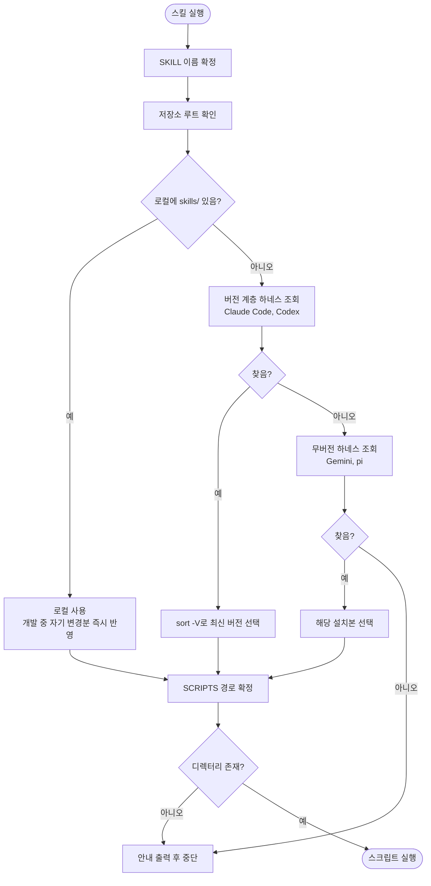

# 스킬 스크립트 탐색이 Claude Code 경로만 보아 나머지 3개 하네스에서 동작 불가

## 개요

스킬이 자신의 파이썬 스크립트(`*_cli.py`)를 찾을 때 조회하는 설치 경로가 Claude Code 한 곳으로 하드코딩되어 있었습니다. 이 프로젝트는 네 하네스(Claude Code, Codex, Gemini, pi)에 배포되고 레포 루트에 각 하네스용 매니페스트가 모두 존재하는데, 정작 탐색 코드는 하나만 봤습니다.

경로에서 스킬명을 분리해 **플러그인 루트만 해석**하도록 바꿨습니다. 그 결과 15개 파일 37곳의 탐색 블록이 `SKILL=` 값 한 단어만 다르고 나머지는 문자 그대로 동일해졌습니다. 하네스가 추가되어도 규칙 문서 한 곳만 고치면 됩니다.

구현 과정에서 이슈에 기재되지 않았던 결함 2건(버전 선택 오류, 조용한 실패)을 실측으로 발견해 함께 수정했습니다.

## 기능 흐름



## 변경 사항

### 탐색 블록 통일 (스킬 11종)

- `skills/pro-github/SKILL.md`: 10곳
- `skills/pro-changelog-deploy/SKILL.md`: 8곳
- `skills/pro-commit/SKILL.md` · `pro-report` · `pro-review` · `pro-troubleshoot`: 각 2곳
- `skills/pro-analyze` · `pro-plan` · `pro-ppt` · `pro-design-analyze` · `pro-refactor-analyze`: 각 1곳

### 규칙 문서 (reference 4종)

- `skills/references/common-rules.md`: 표준 호출 패턴 갱신, 하네스 4곳 표와 2단계 조회 이유를 단일 지점으로 정리
- `skills/references/issue-creation.md`: 3곳
- `skills/references/doc-output-path.md`: 1곳
- `skills/references/config-rules.md`: config 탐색 금지 안내를 하네스 중립 표현으로 교정

## 주요 구현 내용

### 스킬명을 경로에서 분리

기존 블록은 경로 끝에 스킬명이 박혀 있어 스킬마다 문자열이 달랐습니다. 하네스를 넷으로 늘리면 그 조합만큼 변형이 생깁니다.

```bash
SKILL=pro-github; ROOT=$(git rev-parse --show-toplevel 2>/dev/null || pwd)
[ -d "$ROOT/skills/$SKILL/scripts" ] || ROOT=$(ls -d ~/.claude/plugins/cache/*/projectops/* ~/.codex/plugins/cache/*/projectops/* 2>/dev/null | sort -V | tail -1)
[ -n "$ROOT" ] || ROOT=$(ls -d ~/.gemini/extensions/projectops ~/.pi/agent/git/github.com/*/projectops 2>/dev/null | head -1)
SCRIPTS="$ROOT/skills/$SKILL/scripts"
[ -d "$SCRIPTS" ] || { echo "projectops 스킬 스크립트를 찾지 못했습니다. 플러그인 설치를 확인하세요."; exit 1; }
```

루트만 해석하고 스킬명은 변수로 붙이므로, 37곳이 첫 줄 `SKILL=` 값만 다릅니다.

### 하네스별 설치 경로 (로컬 실측)

| 하네스 | 경로 | 버전 계층 |
|---|---|---|
| Claude Code | `~/.claude/plugins/cache/{마켓}/projectops/{버전}/` | 있음 |
| Codex | `~/.codex/plugins/cache/{마켓}/projectops/{버전}/` | 있음 |
| Gemini | `~/.gemini/extensions/projectops/` | 없음 |
| pi | `~/.pi/agent/git/github.com/{owner}/projectops/` | 없음 |

네 경로 모두 홈 기준이라 macOS에서도 동일한 구조가 적용됩니다.

### 함께 수정한 결함 1 — 버전 선택이 경로 문자열 정렬에 좌우됨

네 경로를 한 번에 `sort -V | tail -1`로 정렬하면 버전이 아니라 **경로 전체**가 비교 대상이 됩니다. 후보가 한 하네스 안에만 있을 때는 접두사가 같아 우연히 버전순이 되지만, 여러 하네스가 섞이면 루트 이름이 먼저 비교됩니다.

실측 결과 `.pi`가 `.claude`보다 사전순 뒤라서, Claude Code에 더 최신 버전이 있어도 항상 pi 설치본이 선택됐습니다. 버전 계층이 있는 두 하네스를 먼저 조회하고 결과가 없을 때만 무버전 하네스로 넘어가는 2단계 구조로 회피했습니다.

### 함께 수정한 결함 2 — 스크립트 미발견 시 조용히 통과

기존 `cd "$SCRIPTS" || exit 1`은 안전망 역할을 하지 못했습니다. `cd ""`는 실패하지 않고 현재 디렉터리에 머물기 때문입니다. 스크립트를 못 찾아도 통과한 뒤 "파일 없음"이라는 원인 불명 오류로 끝났습니다.

빈 값 검사를 명시적으로 넣어 하네스에 종속되지 않은 안내와 함께 중단하도록 했습니다.

## 검증

| 시나리오 | 결과 |
|---|---|
| 사용자 프로젝트 (`skills/` 없음) | 하네스 최신 버전 선택 후 스크립트 정상 실행 |
| 이 저장소 | 로컬 우선 선택 (자기 변경분 즉시 반영) |
| Claude Code · Codex 부재 | pi 폴백 정상 동작 |
| 전 하네스 부재 | 안내 출력 후 종료 코드 1 |

- 다중 패턴 동시 조회 확인: 미설치 하네스의 패턴은 매칭 실패로 조용히 제외되며 나머지 결과에 영향 없음
- 회귀 테스트 311건 전부 통과
- 변경분에 실행 로직 손상이 없음을 diff로 자가 검증

## 주의사항

- **새 하네스를 지원할 때**는 `references/common-rules.md`의 표준 호출 패턴과 하네스 표를 먼저 고치고, 그 형태를 각 SKILL.md에 반영합니다. 버전 계층 유무에 따라 1단계·2단계 중 어디에 넣을지 판단해야 합니다.
- **2단계 조회를 하나로 합치지 않습니다.** 합치면 위에 적은 정렬 함정이 그대로 재발합니다.
- **빈 값 가드를 빼지 않습니다.** `cd ""`가 성공하는 셸 동작 때문에 가드가 유일한 방어선입니다.
- Codex·Gemini·pi에서의 실제 동작은 해당 하네스에 이 버전이 설치된 뒤 확인이 필요합니다. 경로 구조는 실측했으나, 설치본이 없던 두 하네스(Codex·Gemini)는 조회 결과가 비어 있는 상태로만 검증했습니다.
