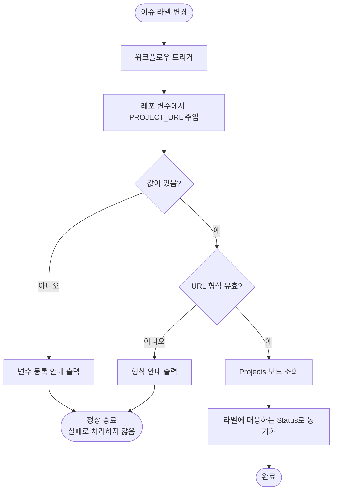

# 레포 루트 PROJECTS-SYNC-MANAGER에 개인 보드 URL이 활성화된 채 커밋되어 있음

## 개요

`PROJECT-COMMON-PROJECTS-SYNC-MANAGER.yaml`의 `PROJECT_URL`에 특정 개인 프로젝트 보드 주소가 주석 해제된 상태로 커밋되어 있었습니다.

처음에는 배포 원본(`project-types/common/`)과 동일한 주석 플레이스홀더로 되돌렸습니다. 그런데 확인해 보니 **이 저장소가 실제로 그 보드를 사용 중**이었고(워크플로우 442회 실행, 당일 실행 이력 존재), 주석 처리는 정합성은 회복하지만 이 저장소의 보드 동기화를 끊는 조치였습니다.

"템플릿에 개인 값이 들어가면 안 된다"와 "이 저장소는 보드를 계속 써야 한다"는 두 요구가 충돌하므로, 값을 파일에서 분리해 **레포 변수 주입** 방식으로 전환했습니다. 사용자가 받는 파일에는 어떤 URL도 없고, 각 저장소는 설정 화면에서 변수 하나만 등록하면 됩니다.

## 기능 흐름



## 변경 사항

### 워크플로우 (원본과 복사본 동일 유지)

- `.github/workflows/project-types/common/PROJECT-COMMON-PROJECTS-SYNC-MANAGER.yaml`
- `.github/workflows/PROJECT-COMMON-PROJECTS-SYNC-MANAGER.yaml`

두 파일 모두 아래를 동일하게 반영했습니다.

- `PROJECT_URL`을 레포 변수 주입(`${{ vars.PROJECT_URL }}`)으로 전환
- env 섹션 주석을 변수 등록 절차로 교체하고, 파일에 URL을 직접 적지 말라는 경고 추가
- 파일 헤더의 빠른 시작 안내를 변수 등록 절차로 교체
- 미설정 시 출력되는 안내 문구를 실제 조치(설정 화면 경로)에 맞게 수정

### 문서

- `docs/PROJECTS-SYNC.md`: 설정 방법을 파일 수정에서 변수 등록으로 교체, 체크리스트·환경변수 표·트러블슈팅 항목 정합화

### 함께 수정한 항목

- `skills/pro-commit/SKILL.md`: 커밋 메시지 정제의 heredoc 블록 제거

## 주요 구현 내용

### 레포 변수 주입으로 전환

```yaml
env:
  STATUS_LABELS: '["작업전", "작업중", "담당자확인", "피드백", "작업완료", "보류", "취소"]'
  PROJECT_URL: ${{ vars.PROJECT_URL }}
```

변수가 없는 저장소에서는 빈 문자열이 되고, 워크플로우가 이를 감지해 안내 로그만 남기고 정상 종료합니다. 실패로 처리하지 않으므로 설정 전까지 아무 영향이 없습니다.

이 방식의 이점은 세 가지입니다.

| 관점 | 기존 (파일에 직접 기재) | 변경 (레포 변수) |
|---|---|---|
| 템플릿 배포 | 개인 보드 주소가 함께 전파 | 어떤 URL도 포함되지 않음 |
| 이 저장소 동기화 | 유지되지만 값이 커밋됨 | 유지되고 값은 커밋되지 않음 |
| 사용자 설정 | 워크플로우 파일 편집 필요 | 설정 화면에서 변수 등록 |

### 커밋 메시지 정제 heredoc 제거

`pro-commit`의 메시지 정제 단계에 인라인 파이썬 heredoc이 남아 있었습니다. 이 블록은 "설치본이 구버전이라 `sanitize-message` 서브커맨드가 없을 때"를 대비한 폴백이었는데, **그 안에 mention 제거 정규식을 그대로 복제**하고 있었습니다.

규칙이 두 곳에 있으면 한쪽만 수정되어 어긋납니다. 이는 #523에서 GNU 전용 `sed`가 macOS에서 조용히 실패했던 사고와 동일한 구조입니다. 폴백을 제거하고 스크립트 직접 호출로 단순화해, 정제 규칙이 `commit_cli.py` 한 곳에만 존재하도록 했습니다.

```bash
SANITIZED=$(PYTHONIOENCODING=utf-8 "$PYTHON" "$SCRIPTS/commit_cli.py" sanitize-message "$RAW_MSG") \
  || { echo "❌ 커밋 메시지 정리 실패 — 커밋을 중단합니다"; exit 1; }
```

호출이 실패하거나 결과가 비면 커밋을 중단하므로, 빈 메시지로 커밋되는 경로가 없습니다.

## 검증

- **실동작 확인**: 이슈 라벨을 실제로 변경해 워크플로우를 실행하고, 실행 로그에 `PROJECT_URL`이 정상 주입되어 보드 동기화가 수행됨을 확인
- 배포 원본과 루트 복사본이 완전히 일치함을 확인
- YAML 파싱 정상
- 메시지 정제 동작 확인: 끝에 붙은 mention은 제거, 본문 중간의 mention은 보존
- 회귀 테스트 Python 68건 · Node 311건 전부 통과 (기존에 실패하던 문서 검사 1건 포함 해소)

## 주의사항

- **이 저장소를 포크하거나 새로 설정할 때**는 설정 화면에서 `PROJECT_URL` 변수를 등록해야 보드 동기화가 동작합니다. 등록 전까지는 안내 로그만 남고 아무 동작도 하지 않습니다.
- **워크플로우 파일에 URL을 직접 적지 않습니다.** 파일에 적으면 커밋되어 템플릿 갱신이나 포크 시 다른 저장소로 섞여 들어갑니다. 이번 이슈의 원인이 그것이었습니다.
- 공통 워크플로우는 `project-types/common/`(원본)과 `.github/workflows/`(복사본) 두 곳을 동일하게 유지해야 합니다. 이번 건은 그 규칙이 깨진 상태였으므로, 이후 수정 시 양쪽을 함께 반영해야 합니다.
