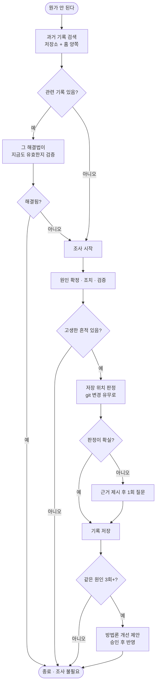

# 알아낸 것을 쌓고 막혔을 때 꺼내 쓰는 pro-note 신설

## 개요

어렵게 알아낸 것이 매번 휘발되는 문제를 해결하기 위해 `pro-note`를 신설하고 `pro-troubleshoot`을 대체했습니다.

기존 `pro-troubleshoot`은 코드 버그를 잡는 디버깅 스킬이었습니다. 그런데 실제로 시간을 잡아먹는 것은 코드 버그만이 아닙니다. 인증서 만료로 배포가 막히거나, 라이브러리 호출 순서를 삽질 끝에 파악하거나, 로컬 환경 설정을 다시 맞추는 일이 반복됩니다. 이런 것들이 디버깅 프레임에 담기지 않아 기록도 남지 않았고, 이 저장소에 쌓인 트러블슈팅 문서는 1건뿐이었습니다.

핵심 설계 원칙은 하나입니다. **기록의 독자는 6개월 뒤의 누군가이며, 그 사람은 이 대화를 보지 못했고 AI 없이 터미널 앞에 앉아 있을 수 있다.** 그 사람이 이 문서만으로 같은 문제를 처음부터 끝까지 해결할 수 있어야 합니다.

## 기능 흐름



## 변경 사항

### 신설

- `skills/pro-note/SKILL.md` (310줄) — 검색 우선 흐름, 기록 품질 기준, 저장 위치 판정, 승격 규칙
- `skills/pro-note/scripts/note_cli.py` (315줄) — `search` · `resolve-scope` · `get-output-path` · `list`
- `skills/pro-note/references/investigation-checklists.md` (188줄) — 유형별 조사 체크리스트

### 제거

- `skills/pro-troubleshoot/` — 코드 디버깅 역할은 `superpowers`와 `/code-review`가 담당

### 참조 정합화

`AGENTS.md` · `CLAUDE.md` · `GEMINI.md` · `README.md` · `docs/SKILLS.md` · `scripts/common/__init__.py` · reference 4종 · 테스트 3종

## 주요 구현 내용

### 기록 품질 기준을 명문화

기존 스킬에는 "산출물을 저장하라"만 있고 그 문서가 만족해야 할 조건이 없었습니다. 이번에는 다음을 규칙으로 못박았습니다.

- 명령어는 복사해서 그대로 실행 가능해야 한다 (경로를 축약하지 않는다)
- 각 명령이 무엇을 확인하는지, 어떤 출력이 나오면 무슨 뜻인지 함께 적는다
- 되돌릴 수 없는 조치 앞에는 백업 절차를 먼저 둔다
- "이렇게 하면 된다"가 아니라 왜 이 문제가 생겼고 왜 이 조치가 맞는지 적는다
- 증거 없이 원인을 단정하지 않고, 불확실하면 `(추정)`으로 표시한다

저장 직전 7개 항목 자체검토를 강제해, 이 조건을 만족하지 못하면 보완하도록 했습니다.

case 템플릿은 조사 과정을 **무엇을 확인하려는가 → 명령어 → 실제 출력 → 그래서 알게 된 것** 순서로 적도록 구성했습니다. 조사하면서 실행한 명령과 출력을 그대로 보존하게 하는 것이 핵심입니다. 나중에 재구성하면 명령어가 부정확해지고, 그러면 따라 할 수 없는 문서가 됩니다.

### 조사보다 검색을 먼저

축적의 목적은 다음에 같은 문제를 빨리 끝내는 것입니다. 검색이 동작하지 않으면 쌓아둔 것이 의미가 없으므로, 막힌 상황에서는 조사 전에 기록을 검색하도록 흐름을 구성했습니다.

검색은 토큰 부분 일치 방식입니다. 형태소 분석 없이 파일명에 가중치 3배를 주고 본문 등장 횟수를 더합니다. 한국어와 영어가 섞이고 표현이 매번 다른 기록에서는 이 정도가 오히려 안정적입니다.

실측 검증 결과입니다.

| 검색어 | 결과 | 점수 |
|---|---|---|
| `인증서 만료` | 해당 기록 1건 | 8 |
| `배포 실패` | 해당 기록 1건 | 5 |
| `쿠버네티스 스케일링` | 0건 | — |

관련도 순 정렬이 의도대로 동작하고, 무관한 키워드는 걸리지 않습니다.

### 저장 위치 자동 판정

이 프로젝트에서만 의미 있는 것과 어디서나 쓸모 있는 것을 나눠 저장합니다.

| 성격 | 저장 위치 |
|---|---|
| 프로젝트 코드·설정·관례 | `docs/projectops/note/` |
| 도구·플랫폼 공통 (배포 인증서 등) | `~/.projectops/note/` |
| 로컬 환경 | `~/.projectops/note/` |

판정 신호는 **저장소 파일이 변경되었는가**입니다. 변경이 있으면 프로젝트 고유 문제이고, 변경 없이 외부 설정만 건드렸으면 프로젝트 밖 문제입니다. 이 한 가지로 대부분이 갈리며, 애매한 경우에만 `ask_user: true`를 반환해 agent가 근거를 제시하고 한 번 묻습니다.

검색할 때는 항상 양쪽을 조회합니다. 지금 막힌 것이 프로젝트 문제일지 환경 문제일지 미리 알 수 없기 때문입니다.

### 기록을 두 종류로 분리

| 종류 | 담는 것 | 파일명 |
|---|---|---|
| `case` | 무슨 일이 있었나 | `YYYYMMDD_NNN_제목.md` |
| `fact` | 무엇을 알게 됐나 | `주제.md` (누적 갱신) |

한 번의 사건이면 case, 앞으로 계속 참이면 fact로 구분합니다.

### 방법론 개선은 반복 패턴일 때만, 승인 후에

같은 원인이 3회 이상 반복될 때만 `SKILL.md`의 조사 절차 개선을 제안합니다. 한 번 겪은 특수 사례를 방법론에 넣으면 문서가 오염되기 때문입니다.

제안은 변경 내용을 보여주고 승인을 받은 뒤에만 반영합니다. `skills/`는 사용자에게 배포되는 자산이므로, 한 사람의 경험이 다른 프로젝트의 방법론을 자동으로 바꾸면 안 됩니다.

### 구현 중 발견한 결함 — Windows 한글 파일명 처리

`subprocess.run(text=True)`만 사용하면 시스템 기본 인코딩으로 디코딩을 시도합니다. Windows에서는 cp949가 적용되어 **변경 파일 목록에 한글 파일명이 있으면 `UnicodeDecodeError`로 중단**됩니다.

```
UnicodeDecodeError: 'cp949' codec can't decode byte 0xec in position 143
```

이 저장소는 한글 파일명을 사용하므로 첫 실행에서 바로 재현되었습니다. git 호출을 단일 헬퍼로 모으고 `encoding="utf-8"`, `errors="replace"`를 명시해 해결했으며, 재발을 막기 위해 함수 주석에 이유를 남겼습니다.

아울러 `-c core.quotepath=false`를 붙여 git이 한글 파일명을 `\352\270\260` 형태로 이스케이프하지 않도록 했습니다. 이 옵션이 없으면 사용자에게 읽을 수 없는 경로가 노출됩니다.

## 검증

| 항목 | 결과 |
|---|---|
| 검색 정확도 | 관련도 순 정렬 확인, 무관 키워드 0건 |
| 저장 위치 판정 | 변경 있음 → `project`(certain), 저장소 밖 → `home` |
| 경로 계산 | case는 날짜+순번, fact는 주제명, scope별 루트 분리 확인 |
| 잘못된 인자 | `bad_args` JSON emit 확인 |
| 한글 파일명 | 이스케이프 없이 정상 출력 확인 |
| 회귀 테스트 | Node 311건 · Python 68건 전부 통과 |

## 주의사항

- **기록 품질 기준을 완화하지 않습니다.** 명령어 축약이나 출력 생략은 문서를 "읽을 수는 있지만 따라 할 수는 없는" 상태로 만듭니다. 이 스킬의 존재 이유가 사라집니다.
- **검색을 조사 뒤로 미루지 않습니다.** 검색이 먼저여야 축적한 기록이 실제로 쓰입니다.
- **`SKILL.md` 자동 수정을 허용하지 않습니다.** 배포 자산이므로 승인 단계가 필수입니다.
- **`subprocess` 호출 시 `encoding`을 생략하지 않습니다.** Windows 한글 환경에서 즉시 깨집니다.
- 승격 임계값(3회)은 초기값입니다. 사례가 쌓인 뒤 실제 반복 양상을 보고 조정할 여지가 있습니다.
- 같은 문제인지 판별하는 로직은 현재 토큰 일치 수준입니다. 표현이 크게 다른 동일 문제("톰캣 죽음" vs "8080 응답 없음")는 놓칠 수 있으며, 기록이 축적된 뒤 정교화가 필요합니다.
