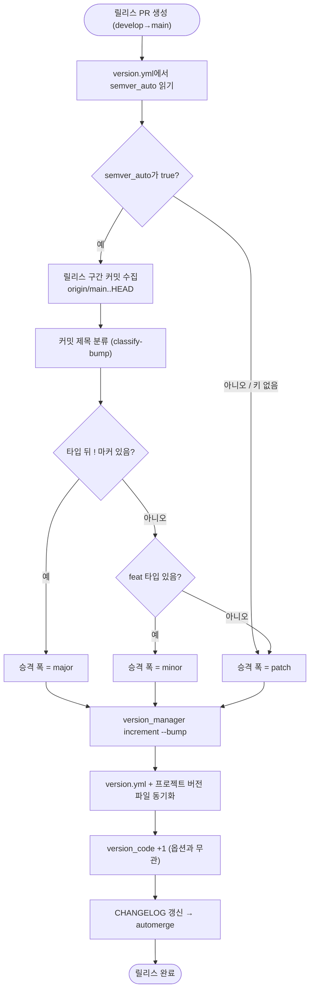

# 릴리스 버전이 무조건 patch만 올라 시맨틱 버저닝이 동작하지 않음

## 개요

릴리스 워크플로우가 커밋 내용과 무관하게 항상 `patch +1`만 하던 구조를, **릴리스 구간 커밋
제목으로 major/minor/patch를 결정**하도록 바꿨다. 판정은 전부 규칙 기반이라 같은 커밋이면
언제나 같은 버전이 나온다(AI 미사용). `version.yml`의 `semver_auto` 옵션으로 켜고 끄며,
**키가 없는 기존 통합 레포는 종전대로 patch 고정**이라 남의 레포 버전이 예고 없이 튀지 않는다.

착수 근거는 실측이다. `origin/main` 릴리스 이력 **45회가 전부 patch**라 버전이 `4.2.45`까지
갔는데, 그 구간에 `: feat :` 커밋이 분명히 있었음에도 **minor는 45번 중 0번** 올랐다.
"minor 올릴 때를 사람이 기억한다"는 전제가 45번 연속 실패한 셈이다.

## 기능 흐름



판정에서 제외되는 줄: `[skip ci]` 포함, `Merge`로 시작, 빈 줄.
한 구간에 여러 타입이 섞이면 **가장 높은 것이 이긴다** (major > minor > patch).

## 변경 사항

### 버전 증가 로직
- `.github/scripts/version_manager.py`: `increment_version(version, bump)` 추가.
  `increment_patch()`는 기존 호출 계약이라 그대로 유지. CLI에 `increment [--bump major|minor|patch]`
  지원(`parse_bump_flag`) — 플래그가 없으면 기존과 동일하게 patch.
- `.github/scripts/version_manager.sh`: **무수정**. `exec ... "$@"` 위임 shim이라 인자가 그대로 통과된다.

### 승격 폭 판정
- `.github/scripts/changelog_manager.py`: `classify_bump_level()` + `classify-bump --commits-file`
  서브커맨드 신설. tier-1(projectops 컨벤션)·tier-2(Conventional Commits)·breaking 마커
  정규식 3개로 각 줄의 타입과 `!` 유무만 판정한다.

### 릴리스 워크플로우
- `.github/workflows/PROJECT-COMMON-RELEASE-CHANGELOG.yaml`: `semver_auto` 읽기 step,
  릴리스 구간 커밋 수집 step, 승격 폭을 전달하는 버전 확정 step으로 교체.
- `.github/workflows/project-types/common/PROJECT-COMMON-RELEASE-CHANGELOG.yaml`: 위와 동일 유지.
- `PROJECT-COMMON-VERSION-CONTROL.yaml`: **변경 없음** (사유는 아래 주의사항).

### 마법사 옵션 배선
- `src/core/version-yml.js`: `parseTemplateOptions`에 `semverAuto` 파싱, `buildVersionYml`에 기록.
- `src/context.js` / `src/index.js` / `src/commands/interactive.js`: context 필드 추가 및
  "저장값 → (기존 레포 false / 신규 true)" 분기.
- `src/commands/full.js` / `src/commands/version.js`: `templateOptions`로 전달.
- `src/core/migration-guide.js`: 마이그레이션 가이드 yaml 메타에 `semver_auto` 기록.

### 테스트 · 문서
- `.github/scripts/test/test_classify_bump.py` (신규 20케이스), `test_increment_bump.py` (신규 10케이스)
- `test/version-yml.test.js`: 기록·파싱 왕복 회귀 4케이스 추가
- `test/options-ask.test.js`: 공용 기대값 `CL_NULL`에 `semverAuto: null` 추가
- `CLAUDE.md`: 커밋 타입이 릴리스 버전을 결정한다는 규칙, semver 승격 축 설명
- `skills/pro-commit/SKILL.md`: breaking 마커(`feat!`) 선택 규칙
- `version.yml`: 이 레포에 `semver_auto: true` 적용 + 헤더 주석 갱신

## 주요 구현 내용

### 참조 구현을 그대로 이식하지 않은 이유

`project-auto-wizard`가 같은 문제를 이미 풀어놨지만, 복사하면 **major 경로가 죽는다.**
그쪽 커밋은 순수 Conventional Commits(`feat: ...`)라 줄 맨 앞에 타입이 오고 표준 `!` 마커가
자연히 작동한다. 반면 projectops 컨벤션은 `제목 : feat : 내용`이라 **줄 앞이 한글 제목**이고,
참조 구현의 breaking 정규식(`^[a-zA-Z]+(\([^)]*\))?!:`)은 여기서 절대 매칭되지 않는다.

실증은 참조 구현 자신의 테스트에 있었다. `"로그인 기능 : feat : 소셜 로그인 추가"` → minor는
보장하는데, `"제목 : feat! : 내용"` 형태의 major 케이스는 **테스트 자체가 없다.** 그래서
tier-1 정규식에 `!`를 여는 쪽을 택했다 — 비용은 정규식 한 글자와 테스트 2줄이고,
`!`는 사람이 의도적으로 칠 때만 발동하므로 실질 안전성은 수동 지정과 같다.

### 커밋 분류 함수를 통째로 가져오지 않은 이유

참조 구현의 `classify_commits()`는 bump 판정용이 아니라 **릴리스 노트 렌더링용**이다
(제목·설명 병합, 말미 URL 제거, 버킷별 마크다운 생성). projectops는 그 일을
`changelog_providers/` 사다리가 이미 하므로, 통째로 들이면 릴리스 노트 생성 경로가 둘로
갈라져 반드시 드리프트가 난다. 그래서 승격 폭만 판정하는 자급자족 함수를 새로 썼다.

### AI 보조 판정을 넣지 않은 이유

참조 구현에는 "규칙이 patch일 때 자유형식 커밋을 AI에게 보여 minor 승격 여부를 묻는" 보조
경로가 있다. 이를 제외한 이유는 두 가지다. 첫째, 같은 커밋이 릴리스마다 다른 버전을 내는
비결정성이 생긴다. 둘째, 이 레포는 컨벤션 준수율이 높아(최근 60커밋 중 미분류 사실상 없음)
얻는 게 적다. 결과적으로 major는 `!` 마커와 수동 지정 두 경로뿐이라 오히려 단순해졌다.

### 커밋 수집 위치

수집한 커밋 목록은 워킹트리가 아니라 `$RUNNER_TEMP`에 둔다. 릴리스 커밋 step이 `git add -A`를
하므로 워킹트리에 두면 그 파일이 릴리스 커밋에 딸려 들어간다.

## 주의사항

### 기본값을 바꾸면 남의 레포 버전이 튄다

`semverAuto`는 `existing?.options?.semverAuto ?? (existing ? false : true)`로 분기한다 —
**version.yml이 이미 있으면(=기존 통합 레포) false**, 없으면(=신규 통합) true. 이미 운영 중인
레포(RomRom-BE/FE 등)가 마법사 업데이트만으로 minor 승격을 시작하지 않게 하는 안전장치다.
`runFull`이 version.yml을 **전체 재생성**하는 구조라, 이 분기가 없으면 업데이트 한 번에
`semver_auto: true`가 박힌다.

### 인라인 주석 때문에 왕복이 조용히 깨졌던 자리

구현 중 실제로 발생한 버그다. `semver_auto: true   # 주석` 형태로 기록한 값을 파서가 못 읽어
`null`을 반환했다. `strip()`이 따옴표·공백만 걷어내므로 `"true # ..."` 전체가 값이 되어
`"true"` 비교에 실패한 것이다. 같은 자리의 `intent`가 캡처를 `([a-z]+)`로 제한해 이 문제를
피하고 있었고, 동일하게 `(true|false)`로 한정해 해결했다.

**증상이 조용하다는 점이 위험하다** — 마법사는 켜서 기록했는데 워크플로우는 꺼진 줄 아는
상태가 된다. 왕복(기록→파싱) 테스트로 고정해 뒀으니, `options` 블록에 새 키를 추가할 때는
같은 방식으로 캡처를 제한하고 왕복 테스트를 함께 넣을 것.

### 안전망 워크플로우는 의도적으로 제외했다

`PROJECT-COMMON-VERSION-CONTROL`은 **릴리스 PR을 거치지 않은 main 직접 push**에만 발동한다.
그 경로의 커밋은 컨벤션 준수를 신뢰할 수 없고 애초에 비권장 경로라 patch를 유지한다.
참조 구현도 안전망은 patch로 둔다.

### 새 승격 규칙은 이번 릴리스가 아니라 다음 릴리스부터 적용된다 (실측)

이 레포는 `semver_auto: true`를 켰고 구현 커밋이 `: feat :`이라 이번 릴리스가 바로
`4.3.0`으로 나갈 것으로 예상했으나, **실제로는 `4.2.46`(patch)으로 나갔다.**

원인은 트리거 방식이다. `PROJECT-COMMON-RELEASE-CHANGELOG`는 `pull_request_target`으로
도는데, 이 이벤트는 **head가 아니라 base 브랜치(main)의 워크플로우 파일을 실행**한다
(fork PR이 워크플로우를 변조하지 못하게 하는 GitHub의 보안 설계). 릴리스 PR이 열린 시점의
main에는 아직 구 워크플로우(무조건 patch)만 있었으므로 구 로직이 돌았다.

**워크플로우 자체를 고치는 모든 변경에 공통인 성질이다.** 머지되어 main에 반영된 다음
릴리스부터 새 로직이 적용된다. 승격 규칙이 안 먹는다고 판단하기 전에 "지금 main의 워크플로우가
새 것인지"를 먼저 확인할 것:

```bash
git show origin/main:.github/workflows/PROJECT-COMMON-RELEASE-CHANGELOG.yaml | grep -c semver_auto
```

### 향후 major를 올릴 때

`!` 마커를 쓰려면 커밋 타입을 `feat!`처럼 적는다. 기존 사용자의 설정·API·CLI 인자가 더 이상
동작하지 않게 되는 변경에만 붙이고, 확신이 없으면 붙이지 않는다. 참조 구현에서도 `!` 실사용
커밋은 0건이라, 실전 검증은 이 레포가 처음 하게 된다.

## 검증 결과

| 항목 | 결과 |
|---|---|
| `npm test` | 315/315 통과 |
| `pytest .github/scripts/test/` | 79/79 통과 (신규 30 포함) |
| 루트·common 워크플로우 동일성 | diff 없음 |
| YAML 파싱 | 변경 전·후 모두 성공 (변경이 깨뜨리지 않음) |
| 실제 릴리스 구간 판정 | v4.2.44 구간 입력 시 `minor` — feat를 담고도 patch로 나갔던 자리 |
| 배포 후 실측 (v4.2.46) | 구 워크플로우가 처리해 patch — 사유는 주의사항 참조 |

워크플로우 로직 end-to-end 시뮬레이션 6케이스 (4.2.45 / version_code 439에서 시작):

| 케이스 | semver_auto | 승격 폭 | 결과 |
|---|---|---|---|
| 기존 레포(키 없음) + feat | false | patch | 4.2.46 |
| ON + fix만 | true | patch | 4.2.46 |
| ON + feat 포함 | true | minor | 4.3.0 |
| ON + breaking 마커 | true | major | 5.0.0 |
| OFF 명시 + feat | false | patch | 4.2.46 |
| ON + `[skip ci]`·Merge만 | true | patch | 4.2.46 |

`version_code`는 6케이스 전부 439 → 440으로 동일하게 +1 되어, 옵션과 무관함을 확인했다.

## 관련

- 설계 문서: `docs/superpowers/specs/2026-09-15-semver-auto-bump-design.md`
- 구현 커밋: `8e46cfd`
- 릴리스 PR: #547
