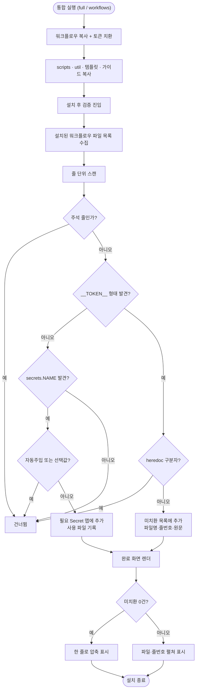

# 설치가 끝나도 치환 실패와 필요 Secret이 드러나지 않음

## 개요

마법사 설치가 "성공"으로 끝나도 그 결과물이 실제로 돌아가는 상태인지 확인하는 단계가 없었다.
설치 직후 **디스크에 쓰인 최종 워크플로우를 다시 읽어** 두 가지를 검증하는 단계를 추가했다:
남아 있는 미치환 토큰, 그리고 그 레포가 실제로 요구하는 GitHub Secret 목록.

설치 전이 아니라 후에 검사하는 이유는, 치환이 파일 단위로 흩어져 일어나고 자동 토큰은
탐색 결과에 의존하기 때문이다. 최종 내용을 보는 것이 실제 배포될 것과 같은 것을 보는
유일한 방법이다.

## 기능 흐름

## 변경 사항

### 검증 엔진
- `src/core/verify.js` (신규): `scanUnsubstituted`(미치환 토큰), `collectRequiredSecrets`
  (필요 Secret), `verifyInstall`(통합 진입점) 3개 함수.

### 설치 흐름 연결
- `src/commands/full.js`: 9단계로 검증 추가, 반환값에 `verification` 포함.
- `src/commands/workflows.js`: 동일 연결. 워크플로우만 설치하는 모드라 오히려 더 필요하다.
- `src/index.js`: 완료 화면으로 검증 결과 전달.

### 완료 화면
- `src/ui/summary.js`: 미치환 결과와 Secret 목록 렌더. 정상이면 한 줄, 문제가 있으면
  파일·줄번호를 최대 10건까지 펼치고 나머지는 건수로 압축.

### 테스트
- `test/verify.test.js` (신규): 15케이스.

## 주요 구현 내용

### 제외 규칙이 이 기능의 핵심이다

무엇을 세느냐보다 **무엇을 세지 않느냐**가 중요하다. 제외를 잘못하면 정상 설치가 매번
경고를 뿜고, 그러면 사용자가 경고 자체를 무시하게 된다.

| 제외 대상 | 이유 |
|---|---|
| `__SUH_*__` heredoc 구분자 | 값이 아니라 문법이다. `cat <<'__SUH_FILE_CONTENT_EOF__'` |
| 주석으로 죽어 있는 줄 | 실행되지 않는다. 템플릿에는 선택 스텝이 통째로 주석 처리돼 있는데 이걸 세면 쓰지도 않는 Secret을 "등록하세요"라고 안내하게 된다 |
| `GITHUB_TOKEN` | Actions가 자동 주입한다. 사용자가 등록할 대상이 아니다 |
| 폴백이 있는 선택 Secret | 없어도 동작한다. 필수와 섞으면 안내 자체를 못 믿게 된다 |

실측으로 확인했다 — 이 레포의 `.github/workflows`를 스캔하면 **0건**(false positive 없음),
치환 전 템플릿 원본을 스캔하면 **25건**이 정상 검출된다.

### 파일 목록을 받지 않고 디렉터리를 스캔한다

참조 구현은 복사 결과 파일명 배열을 넘겨받는다. 여기서는 목록을 생략하면 설치된 워크플로우
전체를 스캔하도록 했다. 복사 결과(신규/변경/무변경)를 조합해 넘기는 것보다, **최종 디스크
상태를 그대로 보는 쪽이 이 기능의 목적에 맞다.** 인자를 주면 그 파일만 보는 경로도 유지해
테스트와 부분 검사가 가능하다.

### 선택 Secret 분류는 이 레포 기준으로 다시 정했다

참조 구현은 `AI_API_KEY`·`WORKFLOW_PAT`을 선택으로 둔다. 이 레포는 provider 사다리(#455)가
있어 `MODEL_API_KEY`가 없어도 GitHub Models → commit 규칙으로 폴백하므로 선택이다.
반면 `_GITHUB_PAT_TOKEN`은 현재 릴리스 머지에 **필수**라 선택으로 두지 않았다 — PAT 없이
머지하는 작업이 끝나면 그때 선택으로 옮기는 것이 맞다.

## 주의사항

### 이 기능이 도입 즉시 실제 버그를 찾아냈다

`PROJECT-SPRING-PR-PREVIEW.yaml`이 Docker Hub 자격증명 이름을 한 파일 안에서 혼용하고
있었다(대부분 `DOCKERHUB_*`, 한 job만 `DOCKER_*`). 안내대로 `DOCKERHUB_*`만 등록하면 그
job만 골라 빈 자격증명으로 실패하는 형태였다. 별도 이슈(#550)로 수정했다.

한 배포 세트가 `DOCKER_PASSWORD`와 `DOCKERHUB_TOKEN`을 **동시에** 요구하는 것이 비정상
신호였는데, 이건 Secret을 자동 수집해야만 보인다. 앞으로도 수집 결과에 **같은 목적의 이름이
두 벌 나오면 의심**할 것.

### 검증은 경고이지 차단이 아니다

미치환이 발견돼도 설치를 실패시키지 않는다. 자동 탐색이 실패하는 상황(특이한 프로젝트 구조)
자체는 정상 범주이고, 사용자가 값을 직접 채우면 되기 때문이다. 다만 그 사실이 **설치 시점에
드러나는 것**이 이 기능의 목적이다 — 종전에는 배포를 돌릴 때에야 알 수 있었다.

### 새 토큰·Secret을 추가할 때

- 새 치환 토큰은 `__대문자__` 형태를 지키면 자동으로 검사 대상이 된다. 별도 등록 불필요.
- heredoc 구분자를 새로 만든다면 반드시 `__SUH_` 접두사를 유지할 것. 아니면 미치환으로 잡힌다.
- 폴백이 있는 새 Secret을 추가하면 `OPTIONAL_SECRETS`에 넣는다. 안 넣으면 "등록 필수"로
  안내되어 사용자가 불필요한 값을 만들게 된다.

## 검증 결과

| 항목 | 결과 |
|---|---|
| `node --test test/verify.test.js` | 15/15 통과 |
| `npm test` 전체 | 330/330 통과 |
| 이 레포 워크플로우 스캔 | 0건 (false positive 없음) |
| 템플릿 원본 스캔 | 25건 검출 (6종 토큰) |
| spring server-deploy Secret 수집 | 9종 → (#550 수정 후) 7종으로 정리 |

## 관련

- 구현 커밋: `ddbc756`
- 파생 이슈: #550 (검증기가 발견한 Docker 자격증명 불일치)
