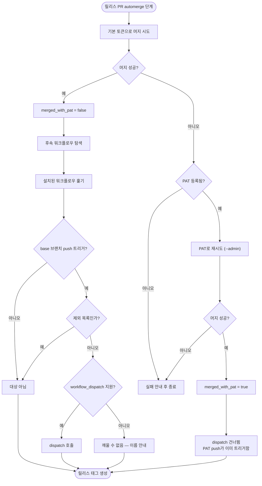

# PAT를 등록하지 않으면 릴리스 파이프라인이 중간에 멈춤

## 개요

템플릿 도입 첫 경험에서 가장 큰 마찰이던 **Personal Access Token 등록을 필수에서 선택으로
내렸다.** 이제 PAT 없이도 릴리스가 끝까지 완주한다. 등록하면 더 매끄럽게 동작할 뿐이다.

조사해 보니 PAT를 쓰는 지점 대부분이 실제로는 PAT가 필요 없었고, **진짜 제약은 한 곳**이었다:
GitHub은 기본 토큰이 만든 push로는 워크플로우를 재트리거하지 않는다(무한 루프 방지).
그래서 PAT 없이 머지하면 릴리스는 되지만 후속 배포·동기화가 따라오지 않았다.

## 기능 흐름



## 변경 사항

### 인증 폴백
- `PROJECT-COMMON-RELEASE-CHANGELOG.yaml`: PAT 참조 **8곳**을
  `secrets._GITHUB_PAT_TOKEN || secrets.GITHUB_TOKEN`으로 전환. 워크플로우 표현식이 빈 값을
  falsy로 처리하므로 한 줄로 표현된다.
- **머지 step 내부 2곳은 의도적으로 보존** (아래 주의사항 참조).

### 후속 워크플로우 트리거
- `.github/scripts/dispatch_downstream.py` (신규): `scan`(탐색) / `dispatch`(트리거) 두 커맨드.
  stdout은 JSON 한 줄, 사람이 읽을 로그는 stderr.
- `RELEASE-CHANGELOG`: 머지 step에 `id: merge_pr` 부여, PAT 머지 성공 시
  `merged_with_pat=true` 출력. 태그 생성 직전에 트리거 단계 추가
  (`if: merged_with_pat != 'true'`, `continue-on-error: true`).
- `PROJECT-COMMON-README-VERSION-UPDATE`: `workflow_dispatch` 추가 — 유일하게 깨울 수 없던
  워크플로우였다.
- `src/core/copy/simple.js`: 새 스크립트를 통합 복사 목록에 등록.

### 안내 조정
- `src/core/verify.js`: `_GITHUB_PAT_TOKEN`을 선택 Secret으로 편입 (#549 검증 결과에서 제외).
- `src/ui/summary.js`: 완료 화면의 "필수 3가지" 1번을 "(선택)"으로 바꾸고, 등록 시 이득을 명시.
- 워크플로우 헤더의 "필수 GitHub Secrets" → "전부 선택"으로 갱신 + 폴백 동작 설명.

### 테스트
- `.github/scripts/test/test_dispatch_downstream.py` (신규): 13케이스.
- `test/verify.test.js`: 선택 Secret 편입에 맞춰 2케이스 갱신.

## 주요 구현 내용

### 머지 step의 PAT 참조는 일부러 남겼다

머지는 이미 **기본 토큰 1차 → PAT 2차(`--admin`)** 폴백 구조였다. 이 두 지점을 폴백 표현식으로
바꾸면 2차 시도가 1차와 완전히 같아져 `--admin` 재시도가 무의미해진다. 브랜치 보호 규칙이
있는 레포에서 PAT가 제공하는 유일한 실익이 그 우회이므로 원형을 보존했다.

기계적으로 전부 치환했다면 조용히 기능이 죽었을 자리다.

### 대상은 고정 목록이 아니라 동적 탐색이다

프로젝트 타입마다 배포 워크플로우가 다르므로 목록을 박아둘 수 없다. 설치된 워크플로우를 훑어
두 조건을 모두 만족하는 것만 깨운다.

1. base 브랜치 push로 트리거되는가 — 원래 돌았어야 할 대상인가
2. `workflow_dispatch`를 지원하는가 — 깨울 수단이 있는가

2를 만족하지 않으면 방법이 없다. 조용히 넘기지 않고 이름을 출력해 사용자가 판단하게 한다.

### 정식 YAML 파서를 쓰지 않았다

이 레포의 워크플로우에는 들여쓰기 0칸 heredoc이 들어 있어 엄격한 파서가 파싱에 실패한다
(GitHub 본체는 정상 처리). 트리거 블록만 보면 되므로 줄 단위 스캔이 더 안전하다.
주석 줄은 먼저 걷어낸다 — 주석 안의 예시 트리거를 실제로 오인하면 엉뚱한 워크플로우를 깨운다.

## 주의사항

### VERSION-CONTROL은 절대 깨우면 안 된다

**구현 중 발견한 가장 위험한 함정이다.** 이 워크플로우는 base 브랜치 push로 돌고
`workflow_dispatch`도 지원하므로 탐색 조건을 그대로 통과한다. 하지만 깨우면 안 된다.

VERSION-CONTROL은 "릴리스 PR을 거치지 않은 직접 push"에만 발동해야 하는 안전망이다.
그 가드는 `github.event.before`가 없으면 `HEAD^..HEAD`만 검사하는데, **dispatch에는 before가
없다.** README 갱신 같은 후속 커밋이 먼저 들어오면 그 범위에 `version.yml` 변경이 빠져
가드가 뚫리고 **버전이 한 번 더 올라간다.**

순서에 기대지 않고 `EXCLUDE` 집합으로 아예 제외했다. 테스트로 고정해 뒀다.

> **새 워크플로우를 추가할 때**: "릴리스 머지 직후에 돌면 해로운가"를 자문하고, 그렇다면
> `dispatch_downstream.py`의 `EXCLUDE`에 넣는다. push 트리거가 있다는 이유만으로 깨우면 안 된다.

### 실패해도 릴리스를 막지 않는다

트리거 단계는 `continue-on-error: true`이고, 스크립트도 토큰이 없거나 네트워크 오류일 때
exit 0으로 끝낸다. 이 시점에는 **릴리스가 이미 완료된 상태**라, 후속을 못 깨웠다고 파이프라인을
실패로 만들면 오히려 상황을 나쁘게 한다. 실패는 로그로 남긴다.

### PAT가 여전히 유용한 경우

- **브랜치 보호 규칙이 있는 레포**: `--admin` 머지가 필요하다. 기본 토큰으로는 불가능하다.
- **후속 워크플로우가 `workflow_dispatch`를 지원하지 않는 경우**: 깨울 수단이 없다.
  사용자가 직접 만든 워크플로우가 여기 해당할 수 있다.

두 경우 모두 완료 화면과 로그가 안내한다.

### 이번 변경은 다음 릴리스부터 적용된다

`pull_request_target`은 base 브랜치(main)의 워크플로우 파일로 실행되므로(#546에서 겪은 것과
같은 성질), 이 변경이 main에 머지된 **다음 릴리스**부터 새 경로가 돈다.

## 검증 결과

| 항목 | 결과 |
|---|---|
| `pytest test_dispatch_downstream.py` | 13/13 통과 |
| `pytest` 전체 | 92/92 통과 |
| `npm test` | 331/331 통과 |
| PAT 폴백 전환 | 8곳 (머지 로직 내부는 보존 확인) |
| 이 레포 탐색 결과 | targets 4개 / unreachable **0개** |
| 두 워크플로우 사본 동일성 | RELEASE-CHANGELOG·README-VERSION-UPDATE 모두 일치 |
| YAML 파싱 | 정상 |

탐색 실측:

```
targets: PROJECT-COMMON-README-VERSION-UPDATE, PROJECT-TEMPLATE-CI,
         PROJECT-TEMPLATE-NPM-PUBLISH, PROJECT-TEMPLATE-PLUGIN-VERSION-SYNC
unreachable: (없음)
```

`PROJECT-COMMON-VERSION-CONTROL`이 목록에서 정상적으로 빠진 것을 확인했다.

## 관련

- 구현 커밋: `5585de9`
- 연관: #549 (선택 Secret 분류), #546 (`pull_request_target` 반영 시점)
