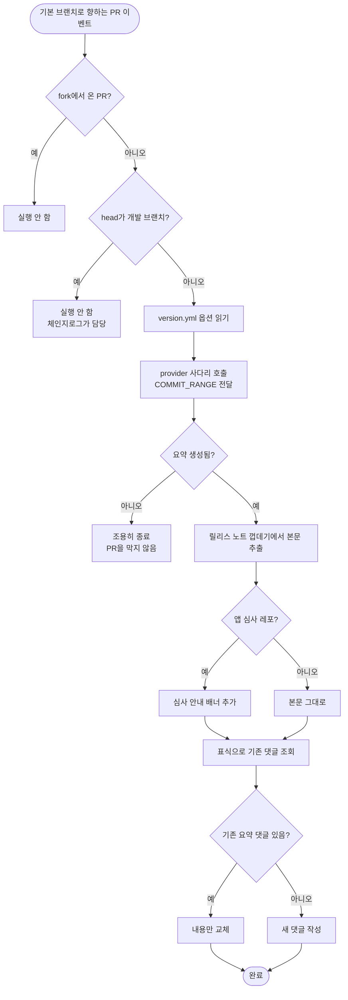

# 일반 PR에는 변경 요약이 없어 리뷰어가 커밋 목록을 직접 읽어야 함

## 개요

릴리스 PR에만 있던 변경 요약을 **일상적인 작업 PR로 확장**했다. 기본 브랜치를 향하는 PR이
열리거나 갱신되면 커밋을 요약해 댓글로 단다. CodeRabbit을 쓰지 않는 레포도 요약을 받는다.

함께, "이 레포가 앱 심사로 이어지는가"를 `version.yml` 옵션으로 올려 **워크플로우와 스킬이
같은 값을 보게** 했다. 종전에는 스킬 설정 파일(사용자 홈)에만 있어 워크플로우가 볼 수 없었다.

## 기능 흐름

## 변경 사항

### 워크플로우
- `PROJECT-COMMON-AI-PR-SUMMARY.yaml` (신규, 루트 + 공통 원본 동일):
  `pull_request`(opened/synchronize/reopened) 트리거. fork PR과 릴리스 PR 제외.
  `concurrency`로 같은 PR의 연속 커밋은 마지막 것만 요약.

### 스크립트
- `.github/scripts/pr_summary_comment.py` (신규): 표식 기반 댓글 작성·갱신.
  stdout은 JSON 한 줄, 사람이 읽을 로그는 stderr, 어떤 실패도 exit 0.

### 프로젝트 성격 축
- `src/core/version-yml.js`: `app_release` 파싱·기록. **미지정이면 키 자체를 쓰지 않는다.**
- `src/context.js` / `src/index.js` / `src/commands/interactive.js`: 저장값 보존 배선.
- `src/commands/full.js` / `version.js`: `templateOptions` 전달.
- `src/core/copy/simple.js`: 새 스크립트를 통합 복사 목록에 등록.

### 테스트
- `test/version-yml.test.js`: `app_release` 왕복 5케이스 추가.
- `test/options-ask.test.js`: 공용 기대값에 새 필드 반영.

## 주요 구현 내용

### 새 생성기를 만들지 않고 provider 사다리를 재사용했다

참조 구현(`project-auto-wizard`)은 `ai-summary`라는 전용 서브커맨드를 따로 만들었다.
여기서는 그러지 않았다 — `commit.py`가 `COMMIT_RANGE` 환경변수로 범위를 받는 구조라,
릴리스 노트를 만드는 사다리를 **그대로 호출하면 된다.**

별도 생성기를 두면 "릴리스 노트 문체"와 "PR 요약 문체"가 서로 다르게 진화하고, provider를
추가할 때마다 두 곳을 고쳐야 한다. 한 엔진을 공유하는 편이 드리프트를 원천 차단한다.

범위는 세 점(`origin/base...HEAD`)을 쓴다. 공통 조상 기준이라 base에 새로 들어온 커밋이
요약에 섞이지 않는다.

### 댓글을 쌓지 않고 갱신한다

`synchronize`마다 새 댓글이 달리면 스레드가 요약으로 도배되어 **사람이 쓴 리뷰 코멘트가
묻힌다.** HTML 주석 표식(`<!-- PROJECTOPS-AI-SUMMARY -->`)을 심어 두고 다음 실행에서 찾아
내용만 교체한다. 표식은 렌더링되지 않는다.

참조 구현은 매번 새 댓글을 단다 — 이 부분은 개선해서 가져왔다.

### 워크플로우를 새로 만든 이유

기존 릴리스 워크플로우에 얹을 수도 있었지만 교환이 나쁘다.

| | 기존에 얹기 | 새 워크플로우 |
|---|---|---|
| 트리거 | `opened` → `synchronize` 포함으로 넓혀야 함 | 독립 |
| 부작용 | **automerge 파이프라인이 커밋마다 깨어남** | 없음 |
| 이벤트 | `pull_request_target` (secrets 접근) | `pull_request` (권한 제한) |
| job 구조 | 4개 job이 `needs`로 엮여 전부 스킵 조건 필요 | 단일 job |

요약 댓글 하나를 위해 **자동 머지까지 하는 워크플로우의 트리거를 넓히는 것**은 사고 반경을
릴리스 전체로 키운다. 보안 측면에서도 `pull_request`가 적절하다.

### 릴리스 PR에는 달지 않는다

head가 개발 브랜치인 PR은 체인지로그가 이미 그 일을 한다. 중복 요약은 노이즈다.

## 주의사항

### app_release는 마법사가 묻지 않는다

`semver_auto`와 같은 방침이다(#485 질문 부담 축소). **미지정이면 키 자체를 쓰지 않으므로**
기존 레포의 `version.yml`은 전혀 바뀌지 않고, 안내 배너도 붙지 않는다. 켜려면 사용자가
직접 `metadata.template.options.app_release: true`를 쓴다.

통합·업데이트 시에는 저장값을 **보존만** 한다. 마법사가 임의로 켜거나 끄지 않는다.

### 어떤 경우에도 PR을 막지 않는다

요약 생성과 댓글 작성 모두 `continue-on-error: true`이고, 스크립트도 토큰 부재·네트워크
오류·파싱 실패를 전부 exit 0으로 흡수한다. 요약은 편의 기능이지 게이트가 아니다.

### CodeRabbit을 쓰는 레포에서는 아예 돌지 않는다 (중복 방지)

**구현 중 잡은 구멍이다.** 처음에는 provider가 `coderabbit`이면 `github-ai`로 대체해
요약을 만들게 했다. 그런데 CodeRabbit 봇은 그 설정과 무관하게 **자기 요약을 PR에 단다.**
결과는 요약 댓글 두 개다. 이 레포도 `.coderabbit.yaml`이 있어 바로 중복이 날 상황이었다.

`.coderabbit.yaml`(또는 `.yml`)이 있으면 전체 단계를 건너뛴다. 판정을 옵션 값이 아니라
**설정 파일 존재**로 잡은 이유는, 옵션은 켜뒀지만 GitHub 앱 연동을 안 했거나 그 반대인
경우가 있을 수 있어 실제 사용 여부를 더 정확히 반영하기 때문이다.

정리하면 어느 경로에서도 요약 생성기는 하나만 돈다.

| 상황 | 릴리스 PR | 일반 작업 PR |
|---|---|---|
| CodeRabbit 사용 | CodeRabbit → 응답 시 사다리 job skipped | CodeRabbit 봇만 (이 워크플로우 skip) |
| CodeRabbit 미사용 | provider 사다리 | 이 워크플로우 |

`provider: coderabbit`인데 봇이 10분간 무응답일 때만 사다리로 폴백한다.

### 본문 추출은 구조가 바뀌면 원문으로 폴백한다

provider 사다리는 릴리스 노트 형식(`## 릴리스 노트` + HTML 주석)으로 감싸 출력한다.
PR 댓글에는 그 껍데기가 어울리지 않아 본문만 꺼내지만, 구조를 못 찾으면 원문을 그대로 쓴다 —
요약이 없는 것보다는 낫다.

## 검증 결과

| 항목 | 결과 |
|---|---|
| `npm test` | 336/336 통과 |
| `pytest` 전체 | 92/92 통과 |
| YAML 파싱 | 정상 |
| 댓글 렌더 실측 | 표식·배너·본문 추출 정상 |
| `app_release` 교차 검증 | 워크플로우 정규식과 마법사 파서 판독 일치 (`true`) |
| 두 워크플로우 사본 동일성 | 일치 |

## 관련

- 구현 커밋: `73cfaed`
- 연관: #455 (provider 사다리), #546 (version.yml 옵션 축 패턴)
