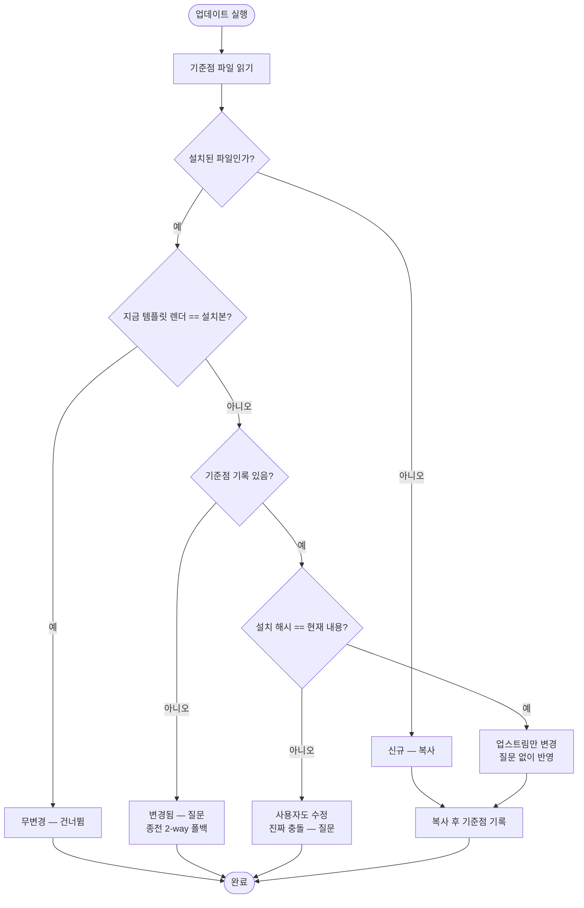

# 업데이트가 사용자 수정과 템플릿 변경을 구분하지 못해 매번 전부 물어봄

## 개요

마법사 업데이트의 충돌 판정이 2-way(지금 템플릿 렌더 결과 vs 설치본)라 **기준점이 없었다.**
업스트림이 한 글자만 고쳐도 사용자가 손대지 않은 파일이 "변경됨"으로 떨어져 매번 질문 대상이
됐고, 정작 가려내야 할 진짜 충돌이 그 속에 묻혔다.

설치 시점 해시를 기준점으로 남겨 **"누가 바꿨는지"를 가르도록** 했다. 사용자가 손대지 않은
파일의 템플릿 개선은 질문 없이 반영하고, 양쪽이 모두 바뀐 경우에만 묻는다.

## 기능 흐름

## 판정 진리표

| 사용자 수정 | 업스트림 변경 | 처리 |
|---|---|---|
| 없음 | 있음 | **질문 없이 업데이트** ← 종전에 매번 묻던 경우 |
| 없음 | 없음 | 무변경 |
| 있음 | 있음 | 질문 (진짜 충돌) |
| 있음 | 없음 | 사용자 수정 유지 |
| **판정 불가**(기준점 없음) | — | 종전 2-way로 폴백 |

## 변경 사항

- `src/core/baseline.js` (신규): 해시 기록·조회(`readBaseline`/`writeBaseline`),
  수정 여부 판정(`isUserModified`), 삭제 감지(`detectRemoved`).
- `src/core/copy/workflows.js`: `classify`를 3분류 → **4분류**(신규/무변경/upstream/변경됨)로
  확장, `upstream`은 질문 없이 복사, 복사 완료 후 기준점 기록(`recordBaseline`).
- `test/baseline.test.js` (신규): 14케이스.

기준점은 `.github/.projectops/baseline.json`에 저장한다.

## 주요 구현 내용

### 해시를 두 개 두는 이유

환경값 치환으로 사용자 값이 들어간 파일은 디스크 내용과 "기본값으로 렌더한 결과"가 애초에
다르다. 하나로는 두 질문에 동시에 답할 수 없다.

| 해시 | 기록 내용 | 답하는 질문 |
|---|---|---|
| `installed` | 설치 시점 우리가 실제로 쓴 내용 | 사용자가 그 뒤에 손댔는가 |
| `rendered` | 그 시점 템플릿을 렌더한 결과 | 업스트림이 그 뒤에 바뀌었는가 |

### installed는 "실제로 쓴 파일"에만 기록한다

유지(skip)한 파일을 "우리가 썼다"고 기록하면 거짓말이 되고, **다음 업데이트에서 그 파일이
조용히 덮인다.** `writeBaseline`은 `installed`가 없으면 이전 값을 지키고, 이전 기록 전체를
병합해 이번에 건드리지 않은 파일의 기준점도 잃지 않는다.

### 판정 불가는 false가 아니라 null이다

`isUserModified`는 기준점이 없거나 그 파일 기록이 없으면 **null**을 반환한다. 이를 false로
오해하면 "사용자가 안 건드렸다"로 판단해 **수정본을 말없이 덮어쓴다.** 호출부는 null을
종전 2-way 판정으로 폴백시킨다.

손상된 기준점 파일도 null로 취급한다 — 업데이트 자체를 막지 않는다. 빈 객체를 반환하지
않는 이유는 "기록 없음"이 "전부 삭제됨"으로 오해될 수 있기 때문이다.

### 기준점 기록 실패는 통합 실패가 아니다

`recordBaseline`은 예외를 삼킨다. 기록이 없으면 다음 업데이트가 종전 방식으로 폴백할 뿐,
통합 자체를 실패시킬 이유가 없다.

### 기준점 파일은 커밋 대상이다

`.gitignore`에 넣지 않았다. 팀원이 각자 다른 기준점을 가지면 의미가 없다 — A가 통합해
커밋한 기준점을 B가 업데이트할 때 그대로 봐야 판정이 일관된다.

## 주의사항

### 기존 레포는 이번 업데이트에서 혜택이 없다

기준점은 통합·업데이트를 한 번 실행해야 생긴다. 따라서 **기존 레포는 다음 업데이트부터**
새 판정이 작동한다. 이번 실행은 종전과 동일하게 동작하고 기준점만 남긴다.

E2E로 확인했다 — 기준점이 없는 레포는 사용자 수정 파일이 종전대로 유지(skip)된다.

### common 워크플로우는 이 판정을 타지 않는다

공통 워크플로우는 원래 **"무변경이면 스킵, 아니면 무조건 덮어쓰기"** 정책이라 분류 함수를
거치지 않는다(코드 주석에 명시). 이번 변경의 적용 범위는 **타입별 워크플로우**다.

> 구현 중 이 사실을 모른 채 공통 워크플로우로 E2E를 돌려 "사용자 수정이 날아간다"는 오판을
> 했다. 기존 설계대로 동작한 것이었다. 공통 워크플로우의 덮어쓰기 정책을 바꿀지는 별개
> 논의이며 이번 범위 밖이다.

### 삭제 감지는 아직 연결하지 않았다

`detectRemoved`는 구현·테스트했지만 복사 흐름에 연결하지 않았다. "사용자가 지운 워크플로우를
업데이트가 되살리지 않는다"는 동작은 고아 워크플로우 정리(#487)와 겹치는 영역이라, 설계를
맞춘 뒤 별도로 다루는 것이 안전하다고 판단했다.

## 검증 결과

| 항목 | 결과 |
|---|---|
| `node --test test/baseline.test.js` | 14/14 통과 |
| `npm test` 전체 | 350/350 통과 (회귀 없음) |
| `pytest` 전체 | 94/94 통과 |

**E2E 시나리오** (통합 → 사용자 수정 + 업스트림 개선 → 재통합):

| 확인 | 결과 |
|---|---|
| 사용자가 수정한 파일 보존 | ✅ |
| 업스트림만 바뀐 파일 자동 반영 | ✅ |
| 기준점 없는 레포 = 동작 무변화 | ✅ |

## 관련

- 구현 커밋: `63a8bd0`
- 연관: #487 (고아 워크플로우 정리 — 삭제 감지 연결 시 함께 볼 영역)
