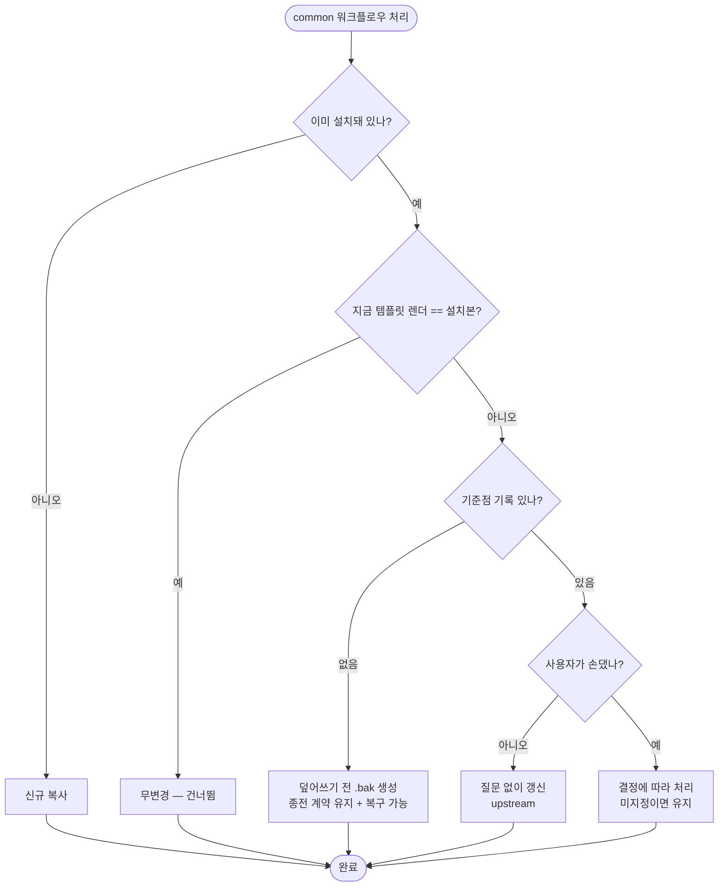

# common 워크플로우에 가한 수정이 업데이트 때 백업도 질문도 없이 사라짐

## 개요

업데이트가 `PROJECT-COMMON-*` 워크플로우를 **질문도 `.bak`도 없이** 덮어썼다. 그 파일에 가한
수정은 복구 수단 없이 사라졌다. `common/deploy` 경로조차 `.bak`을 남기는데 common 본체만
아무것도 남기지 않았다.

common 경로를 타입별과 같은 판정·보호 체계로 통일했다. 이제 어느 경로에서도 사용자 수정본이
근거 없이 사라지지 않는다.

## 문제의 본질

`common/`은 "모든 프로젝트에서 동일한 워크플로우"를 전제한다. 그래서 무조건 덮어써도 된다는
판단이 성립했다. 그런데 **릴리스 파이프라인은 그 전제가 가장 안 맞는 영역이다.**

| 프로젝트 | 릴리스 직후 필요한 일 |
|---|---|
| Flutter 앱 | APK/AAB 빌드 → Release 첨부, 스토어 업로드 |
| Spring 서버 | 이미지 빌드 → 레지스트리 push, 배포 트리거 |
| 라이브러리 | npm/maven publish |

같은 파일을 쓰지만 뒤에 붙일 스텝이 전부 다르다. 붙이려면 common 워크플로우를 고치는 수밖에
없고, 고치면 다음 업데이트에 사라졌다.

> **고치지 않고는 쓸 수 없는 파일을, 고치면 날아가는 규칙으로 관리하고 있었다.**

## 기능 흐름

## 변경 사항

- `src/core/copy/workflows.js`: common 경로를 `classify()` 기반 4분류로 전환.
  `upstream`은 질문 없이 갱신, `changed`는 결정에 따라 처리, **기준점이 없으면 `.bak` 후 덮어쓰기**.
  `listWorkflowConflicts`에 common 포함 — 대화형에서 질문 대상이 된다.
- `test/common-workflow-protect.test.js` (신규): 6케이스.

## 주요 구현 내용

### 기준점이 없을 때 skip하면 회귀가 된다

구현 중 잡은 함정이다. 사용자 수정을 지키려고 `changed`를 전부 `skip`으로 처리하면, **기준점이
없는 기존 레포는 common 워크플로우를 영영 갱신받지 못한다.** common의 종전 계약은 "항상 최신"
이었고 그것을 깨면 업데이트 자체가 무의미해진다.

그래서 판정 불가일 때는 **계약을 지키되 되돌릴 수단을 남긴다** — 덮어쓰기 전 `.bak`.
이슈에서 제안된 "최소 안전망"과 정확히 같은 결론이다.

| 사용자 수정 | 업스트림 변경 | 기준점 | 처리 |
|---|---|---|---|
| 없음 | 있음 | 있음 | 질문 없이 갱신 |
| 있음 | 있음 | 있음 | 결정에 따라 (미지정 = 유지) |
| 판정 불가 | 있음 | **없음** | **`.bak` 후 덮어쓰기** |
| — | 없음 | — | 무변경 |

### 질문 총량은 늘지 않는다

손대지 않은 사용자는 종전과 똑같이 조용히 갱신받는다. 질문은 **손댄 것이 확인된 파일**에만
생긴다. 기준점이 없으면 질문 대신 `.bak`으로 처리하므로 기존 레포의 첫 업데이트도 조용하다.

## 주의사항

### 기존 레포는 첫 업데이트에서 .bak이 생길 수 있다

기준점이 없으므로 common 워크플로우 중 내용이 다른 것은 `.bak`을 남기고 덮어쓴다. 사용자가
수정한 적이 없어도(템플릿이 갱신된 경우) `.bak`이 생긴다 — 판정할 근거가 없으니 보수적으로
간다. 그 실행에서 기준점이 기록되므로 **다음 업데이트부터는 정확히 갈린다.**

### common의 덮어쓰기 정책은 여전히 기본값이다

"손대지 않았으면 갱신한다"는 원칙은 그대로다. 바뀐 것은 **손댄 경우의 처리**뿐이다.
템플릿이 관리하는 파일이라는 성격을 유지하면서 사용자 수정만 보호한다.

### 근본 해결은 남아 있다

이번 변경은 "날아가는 것을 막는" 방어다. 릴리스 후속 작업을 사용자 소유 파일로 분리하는
훅 지점(이슈 댓글의 3번)은 다루지 않았다. 그게 들어가면 애초에 common 파일을 고칠 이유가
없어진다 — `common/secret-backup`이 이미 "있으면 안 건드림" 방식으로 선례를 만들어 두었다.

## 검증 결과

| 항목 | 결과 |
|---|---|
| `node --test test/common-workflow-protect.test.js` | 6/6 통과 |
| `npm test` 전체 | 368/368 통과 |
| `pytest` 전체 | 94/94 통과 |

**E2E 3케이스** (통합 → 수정 → 재통합):

| 상황 | 결과 |
|---|---|
| 기준점 없음 + 사용자 수정 | 템플릿 갱신 반영 + **`.bak`에 내 수정 보존** |
| 기준점 있음 + 사용자 수정 | 내 수정 유지 (질문 대상) |
| 기준점 있음 + 미수정 | 질문 없이 자동 갱신, `.bak` 없음 |

## 관련

- 구현 커밋: `b9560e5`
- 연관: #557 (기준점 판정), #561 (이 동작이 로그에 남는다)
