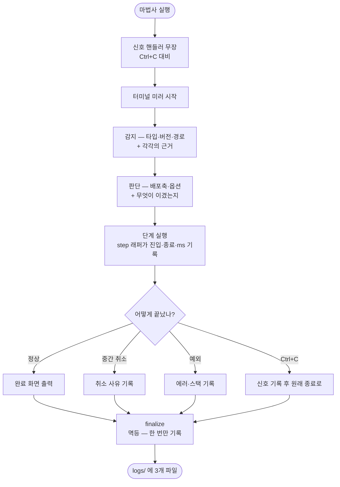

# 실행 로그가 저장소에 커밋되고 일부 동작은 기록조차 되지 않아 업데이트 추적이 반쪽이다

## 개요

마법사의 실행 기록을 **서버 로그 수준으로** 다시 만들었다. 자리를 추적 제외 폴더로 옮기고,
"결과"만 남기던 것을 "경위"까지 남기도록 바꿨다. 이제 로그 한 파일만 보고 실행 전체를
재구성할 수 있다.

| | 전 | 후 |
|---|---|---|
| 위치 | `docs/projectops/migration/` (커밋됨) | `.github/.projectops/logs/` (추적 제외) |
| `.log` | 65바이트, 배너 한 줄 | **92줄**, 내부 이벤트 + 터미널 출력 병합 |
| 레벨 | 없음 | ERROR / WARN / INFO / DEBUG |
| 단계 소요시간 | 없음 | 단계별 ms |
| 판단 근거 | 없음 | 무엇을 보고 그렇게 정했는지 |
| 중간 취소 시 | **기록 없음** | 사유와 함께 기록 |

## 기능 흐름



## 변경 사항

### 위치와 추적 제외
- `src/core/run-trace.js`: `MIGRATION_DIR`을 `.github/.projectops/logs`로 변경.
  `logs/.gitignore`(`*` + `!.gitignore`)를 매 실행 보장.

### 서버 로그 형식
- `formatLogLine()`: `[시각] 레벨 phase/action 대상 key=value` 형식.
- `levelOf()`: 4단계 레벨 판정.
- `stripAnsi()`: 색상 제어문자 제거.
- `event()`가 이벤트 기록과 동시에 로그 라인도 남긴다.

### 단계 계측
- `step(name, fn)` / `stepAsync(name, fn)`: 진입·종료·소요 ms·실패를 자동 기록.
- `index.js`·`interactive.js`·`full.js`의 주요 단계에 적용.

### 종료 경로 일원화
- `finalize()`: 멱등. `finally`에서 호출해 정상·취소·예외 모두 커버.
- `armSignals()`: SIGINT/SIGTERM에 기록 후 원래 종료 동작으로 넘김.

### 판단 근거
- 감지(`detect/*`)·판단(`resolve/*`) 이벤트에 `source`·`reason`·`applicableForTypes` 등 근거 수록.

### 안내
- `summary.js`: 완료 화면에 **이번 실행의 로그 파일 경로**를 정확히 표시.

## 주요 구현 내용

### 폴더가 자기 규칙을 들고 다닌다

루트 `.gitignore`를 고치는 대신 **로그 폴더 안에 `.gitignore`** 를 둔다.

| | 루트에 추가 | 폴더 안에 |
|---|---|---|
| 사용자 파일 수정 | 남의 레포 루트를 건드림 | **건드리지 않음** |
| `baseline.json` 오염 위험 | 패턴을 잘못 쓰면 같이 묻힘 | **구조상 불가능** (상위 폴더) |

`baseline.json`(#557)은 팀원이 같은 기준점을 봐야 하므로 **계속 추적된다.** 성격이 반대라
폴더를 나눴다.

### DEBUG도 파일에는 전부 남긴다

레벨을 나눈 목적은 "화면을 조용히" 하는 것이지 "기록을 줄이는" 것이 아니다. 문제가 터진
뒤에 "그때 DEBUG를 켰더라면"은 소용없다. 화면 기본값은 INFO지만 파일에는 DEBUG까지 적는다.
조치가 필요한 것만 보려면 `grep WARN` 한 번이면 된다.

### 단계는 래퍼로 감싼다

개별 호출부에 start/done을 흩뿌리면 반드시 빠뜨리는 자리가 생긴다. `step()`이 진입·종료·
소요시간·실패를 자동으로 남기므로, 새 단계를 추가할 때 계측을 잊을 수 없다.

```
[00:51:38] INFO  step/start  acquire-template  source=local
[00:51:40] INFO  step/done   acquire-template  ms=1861     ← 어디가 느린지 즉시 보인다
```

### 끊었을 때야말로 기록이 필요하다

종전에는 정상 완주 경로에만 기록이 있었다. 취소 경로가 6곳인데 전부 아무것도 남기지 않았다.
**사용자가 중간에 끊었을 때가 "어디까지 갔는지"가 가장 궁금한 순간**이라, 완주했을 때만
남기는 기록은 쓸모가 절반이다.

`finalize()`를 멱등으로 만들어 `finally`에 두고, SIGINT는 신호 핸들러로 따로 잡았다.
핸들러는 기록만 하고 원래 종료 동작으로 넘기므로 **동작은 바뀌지 않는다.**

## 주의사항

### trace 호출은 `event`다 — `emit`은 없다

구현 중 실제로 겪은 사고다. `trace?.emit?.(...)`로 잘못 썼는데 **optional chaining이라 예외도
안 나고 조용히 무시**되어, 설치 검증 결과가 로그에 한 줄도 남지 않았다. 새 계측을 추가할 때
이름을 확인할 것.

### 민감값 가드를 우회하지 말고 키 이름을 바꿀 것

`scrubDetail`이 `pat|token|secret|password|credential` 키를 지운다. 여기에 걸려 치환
플레이스홀더 이름(`token`)과 필요 키 개수(`secrets`)가 통째로 사라진 적이 있다.
**가드는 그대로 두고** `placeholder`·`requiredKeys`로 이름을 바꿔 해결했다. 가드를 건드리면
언젠가 진짜 비밀값이 새어 나간다.

### 구 경로는 처리하지 않았다

하위호환을 고려하지 않기로 했으므로 `docs/projectops/migration/`의 기존 파일은 그대로 둔다.
과거 실행의 기록이고, 지우면 그 이력이 사라진다.

### 대화형 실제 실행은 검증하지 않았다

`prompt/*` 이벤트와 대화형 단계 계측은 io 스텁 기반 시나리오로 확인했다. 실제 터미널에서
사람이 조작하는 경로는 돌려보지 못했다.

## 검증 결과

| 항목 | 결과 |
|---|---|
| `npm test` | 368/368 통과 |
| `pytest` | 94/94 통과 |
| 1회 실행 로그 | 92줄 (INFO 47 / DEBUG 41 / WARN 4) |
| phase 흐름 | detect → resolve → run → step → breaking → copy → env → baseline → verify |
| ANSI 제어문자 | 제거 확인 |
| `.gitignore` 자동 생성 | 확인 |

**종료 경로별 기록 (실측)**

| 종료 방식 | 결과 | 마지막 줄 |
|---|---|---|
| 정상 완주 | ✅ 92줄 | `INFO run/end` |
| 모드 선택에서 취소 | ✅ 5줄 | `WARN run/cancelled mode-select` |
| 확인 메뉴에서 취소 | ✅ 7줄 | `WARN run/cancelled confirm-loop` |
| 실행 중 예외 | ✅ 7줄 | `ERROR run/error message=...` |
| **Ctrl+C (SIGINT)** | ✅ 5줄 | `WARN run/cancelled SIGINT` (종료코드 130) |

## 관련

- 구현 커밋: `ca96f63`, `b1b50f0`, `748d5e3`, `fb22509`
- 연관: #549 (검증 결과 기록), #557 (기준점), #560 (common 보호 동작도 기록됨)
