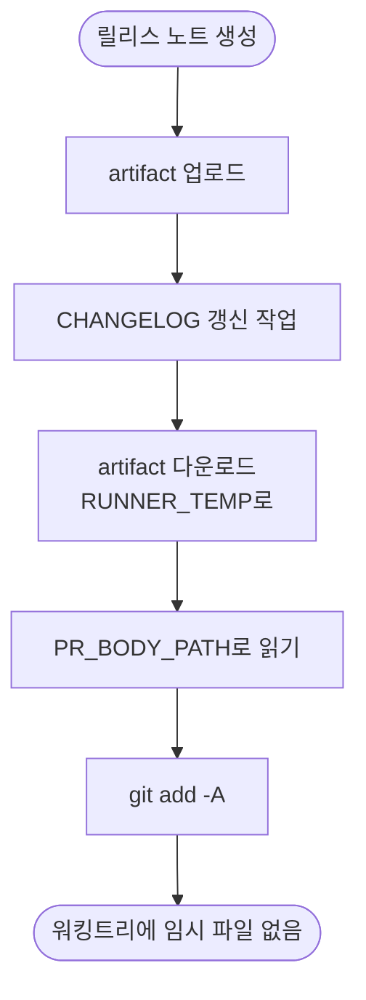

# 릴리스 워크플로우의 임시 파일 pr_body.md가 저장소 루트에 커밋됨

## 개요

릴리스 워크플로우가 PR 본문을 담아두는 작업용 파일 `pr_body.md`가 **매 릴리스마다 저장소에
커밋되고 있었다.** v4.4.1부터 반복됐고, 이 템플릿을 쓰는 모든 저장소에서 같은 일이 벌어졌다.

```
a4c69e1 v4.6.1 릴리즈 버전 확정 ...
 CHANGELOG.json | CHANGELOG.md | pr_body.md ← 임시 파일 | version.yml
```

## 원인

artifact를 **워킹트리 루트**에 풀었고, 릴리스 확정 커밋이 `git add -A`로 전체를 담았다.

| 위치 | 동작 |
|---|---|
| `download-artifact` (path 미지정) | 루트에 `pr_body.md` 생성 |
| `git add -A` | 함께 스테이징 |
| `rm -f pr_body.md` | **커밋 이후**라 이미 늦음 |

정리 단계가 있었지만 커밋 뒤에 있어 무용지물이었다.

> 같은 함정을 이미 한 번 피한 적이 있다. #546에서 릴리스 구간 커밋 목록을 `$RUNNER_TEMP`에
> 둔 이유가 정확히 이것이고 그 자리에 주석도 남아 있다. `pr_body.md`는 그 조치 이전부터
> 있던 파일이라 함께 정리되지 않았다.

## 기능 흐름



## 변경 사항

- `PROJECT-COMMON-RELEASE-CHANGELOG.yaml`: `download-artifact`에 `path: ${{ runner.temp }}/pr-content`
- 〃: `update-from-summary` 단계에 `PR_BODY_PATH` 주입, 불필요해진 정리 단계 제거
- 〃: `git add -A` 주석에 "작업 파일은 `$RUNNER_TEMP`에 둘 것" 경고 추가
- `changelog_manager.py`: `PR_BODY_PATH` 우선, 없으면 종전처럼 cwd 탐색(하위호환)
- 공통 원본과 루트 복사본 동일 유지

## 주요 구현 내용

### 스크립트 계약은 건드리지 않았다

`_common.py`의 `write_pr_body()`가 cwd에 고정 파일명으로 쓰는 것은 provider 5종의 공통
계약이다. 그것을 바꾸면 파급이 크다. **읽는 쪽에만 경로를 주입**해 커밋하는 job의 워킹트리만
깨끗하게 만들었다.

생성하는 job(`detect-and-parse`·`fallback-summary`)은 커밋을 하지 않으므로 루트에 파일이
있어도 무해하다.

## 주의사항

### 이미 커밋된 파일은 그대로 두었다

추적 해제는 사용자 판단이 필요해 이번 변경에 포함하지 않았다. 다음 릴리스부터 갱신이 멈출
뿐 파일 자체는 남아 있다.

### 워킹트리에 임시 파일을 만들지 말 것

`git add -A`는 타입마다 다른 버전 파일을 담아야 해서 유지된다. 따라서 **새 작업 파일은
반드시 `$RUNNER_TEMP`에** 둔다. 이 규칙을 해당 위치 주석에 남겼다.

## 검증 결과

| 항목 | 결과 |
|---|---|
| `pytest` | 137/137 |
| 외부 경로 읽기 | ✅ 워킹트리에 파일 미생성 확인 |
| env 없을 때 | ✅ 종전 동작(cwd 탐색) 유지 |

`.github/scripts/test/test_pr_body_path.py` (신규 4건) — 외부 경로 읽기 · 워킹트리 무오염 ·
하위호환 · 입력 없을 때 확인 경로 안내.

## 관련

- 구현 커밋: `de7b0db`
- 연관: #546 (같은 함정을 먼저 피한 사례) · #565 (같은 워크플로우)
