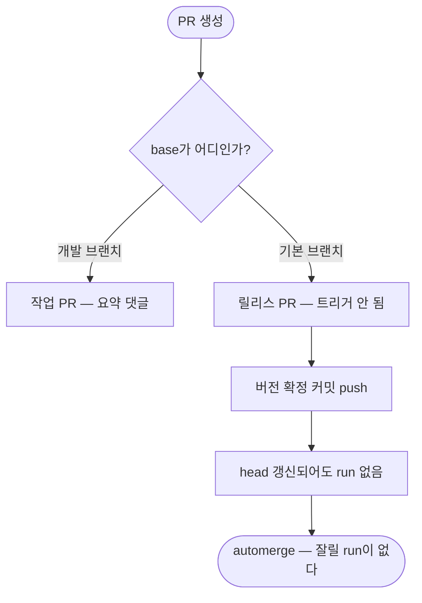

# 릴리스마다 CI와 PR 요약 워크플로우가 머지에 잘려 실패하지 않았는데 빨간불로 남음

## 개요

릴리스할 때마다 Actions에 **실패하지 않은 워크플로우가 빨간불로 남았다.** 조사 과정에서
같은 자리의 트리거 설정이 더 큰 문제를 감추고 있던 것이 드러났다.

## 유령 실패

같은 PR에서 run이 두 번 뜨는데 결과가 갈렸다.

```
01:31:47  sha=298f15c (작업 커밋)        → skipped   ← 게이트 정상 작동
01:32:13  sha=a4c69e1 (버전 확정 커밋)    → failure   ← 9초 뒤 머지에 잘림
01:32:22  automerge 머지
01:32:23  run 종료, total_count: 0       ← job 배정 전이었다
```

릴리스 워크플로우가 버전 확정 커밋을 push → PR head 갱신 → 새 run 시작 → automerge가
곧바로 PR을 닫음. **실제로는 아무것도 실패하지 않았다.**

| 트리거 | 최근 20건 |
|---|---|
| `push` | **13건 전부 success** |
| `pull_request` 머지 직전 | **failure** (job 0개) |

## 더 큰 문제 — 실행될 수 없던 워크플로우

```yaml
on:
  pull_request:
    branches: ["main"]          # base(PR이 향하는 곳)가 main인 PR만
jobs:
  if: head.ref != 'develop'     # 그런데 head가 develop이면 제외
```

`branches`는 **base** 필터다. 작업 PR의 base는 개발 브랜치라 트리거되지 않고, 트리거되는
릴리스 PR은 job 조건에서 전부 걸러진다. 이 저장소 PR **30건이 모두 `develop → main`**이라
`AI PR SUMMARY`는 단 한 번도 실행된 적이 없었다.

최근 PR 4건의 댓글 작성자가 `github-actions[bot]` 하나뿐인 것이 그 증거다.

## 기능 흐름



## 변경 사항

- `PROJECT-COMMON-AI-PR-SUMMARY.yaml`: `branches: ["develop"]`
- `PROJECT-TEMPLATE-CI.yaml`: `pull_request.branches: ["develop"]`
- `PROJECT-COMMON-RELEASE-CHANGELOG.yaml`: `@coderabbitai summary` 호출 + 10분 폴링 제거
- 공통 원본과 루트 복사본 동일 유지

## 주요 구현 내용

### 판정하지 않는 것으로 해결했다

종전에는 CodeRabbit을 호출한 뒤 **최대 10분을 폴링**했다. 응답이 없으면 그 10분을 통째로
날렸고, 무응답이 rate limit 때문인지 판별할 방법도 없었다.

**요청을 보내지 않으면 기다릴 이유도 없다.** 두 단계를 함께 걷어냈다. CodeRabbit이 본문에
요약을 달아두었다면 "이미 있으면 존중" 경로에서 그대로 쓰이므로 손해가 없다.

### 트리거를 바로잡으니 두 문제가 함께 풀렸다

| | 전 | 후 |
|---|---|---|
| 작업 PR | 트리거 안 됨 | **요약 달림** |
| 릴리스 PR | 트리거 후 skip, 머지에 잘려 failure | **트리거 자체가 안 됨** |

릴리스 PR에서 run이 생기지 않으므로 잘릴 일도 없다.

## 주의사항

### CI 중복도 함께 사라졌다

릴리스 PR의 내용은 develop push에서 이미 검증된다. `pull_request.branches`에서 기본
브랜치를 뺀 것은 유령 실패 해결인 동시에 중복 제거이기도 하다.

### 릴리스가 최대 10분 빨라진다

CodeRabbit을 쓰도록 설정된 저장소는 매 릴리스마다 그만큼 기다리고 있었다.

## 검증 결과

| 항목 | 결과 |
|---|---|
| `npm test` | 395/395 |
| `pytest` | 137/137 |
| job 구조 | 4개 job · needs 참조 온전 확인 |
| 공통 원본 동일성 | ✅ |

## 관련

- 구현 커밋: `de7b0db`
- 연관: #564 (같은 워크플로우) · #553 (AI PR 요약 신설 — 트리거 오류의 출처) · #566
