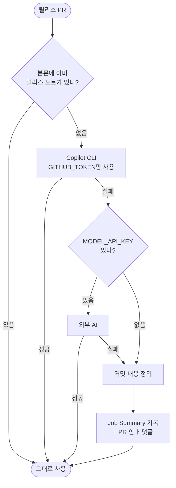

# 신규 설치 기본 changelog provider가 서비스 종료된 GitHub Models라 항상 실패함

## 개요

신규 통합의 기본 릴리스 노트 생성기가 **2026년 7월 30일 종료된 서비스**였다. 조사 과정에서
같은 경로에 얽힌 문제가 연달아 드러나, 생성 구조 자체를 다시 설계했다.

| | 전 | 후 |
|---|---|---|
| 기본 생성기 | `github-ai` (**HTTP 410**) | `commit` (외부 의존 0) |
| provider 질문 | 4지선다 (기본값이 죽어 있음) | **묻지 않음** |
| 커밋 분석 결과 | 전부 "기타", 원문 노출 | 정확히 분류 |
| CodeRabbit | 호출 후 **10분 대기** | 기다리지 않음 |
| AI PR 요약 | **실행 불가 구조** | 작업 PR에 정상 동작 |
| 실패 시 안내 | 없음 | Job Summary + PR 댓글 |

## 무엇이 잘못돼 있었나

### 죽은 기본값

```
$ curl -X POST https://models.github.ai/inference/chat/completions
HTTP 410  {"code":"github_models_retirement_brownout"}
```

마법사는 이것을 `GitHub AI (추천 · 설정 불필요)`로 안내하며 기본값으로 기록했다.
릴리스가 깨지지는 않았다 — 사다리가 커밋 분석으로 폴백했기 때문이다. **폴백이 실패를
조용히 감춘 탓에 아무도 알아채지 못했다.**

### 최후 보루가 자기 컨벤션을 못 읽었다

그 폴백 결과물이 쓸 만하지 않았다.

```python
_PREFIX_RE = re.compile(r"^(feat|fix|...)(\([^)]*\))?:")   # 줄 맨 앞만 매치
```

| 커밋 | 결과 |
|---|---|
| `feat: 소셜 로그인 추가` | 새 기능 → 소셜 로그인 추가 |
| `로그인 개선 : feat : 소셜 로그인 추가` | **기타 → 원문 그대로** |

projectops 표준은 타입이 중간에 온다. **자기 컨벤션을 지킨 커밋이 전부 "기타"로 떨어졌다.**
AI가 죽은 뒤 이 경로가 실제로 쓰이면서 모든 저장소가 그 결과를 받고 있었다.

### 한 번도 실행될 수 없던 워크플로우

```yaml
on:
  pull_request:
    branches: ["main"]          # base가 main인 PR만 트리거
jobs:
  if: head.ref != 'develop'     # 그런데 head가 develop이면 제외
```

`branches`는 **base** 필터다. 작업 PR의 base는 개발 브랜치라 트리거되지 않고, 트리거되는
릴리스 PR은 job 조건에서 전부 걸러진다. 이 저장소 PR 30건이 모두 `develop → main`이었다.

## 기능 흐름



## 변경 사항

### 생성 사다리

- `changelog_providers/copilot.py` (신규): Copilot CLI. `copilot-requests: write` + GITHUB_TOKEN만으로 동작
- `ladder.py`: `github-ai` 제거, 기본값 `commit`, 저장값이 `github-ai`면 호출 없이 흡수
- `openai_compatible.py`: preset을 `-latest` 별칭으로 교체, `groq`·`mistral` 추가
- `_common.py`: `parse_commit()` 신설 — tier-1(projectops)·tier-2(Conventional) 양쪽 인식

### 워크플로우

- `RELEASE-CHANGELOG`: `@coderabbitai summary` 호출과 10분 폴링 제거, Copilot CLI 설치 단계 추가
- `AI-PR-SUMMARY`: `branches: ["develop"]`로 교정, `.coderabbit.yaml` 기반 자동 skip 제거
- 임시 파일을 `$RUNNER_TEMP`로 이동 (#564)

### 마법사

- provider 질문 삭제, CodeRabbit 질문을 **"PR 댓글을 어떻게 받으시겠어요?"** 로 통합
- `common/pr-summary/` 조건부 폴더 + 복사 게이트
- `--ai-summary` / `--no-ai-summary` 플래그 신설
- `migrateProvider()`: 죽은 저장값을 살아있는 값으로 이전

### 안내

- `changelog_notice.py` (신규): Job Summary는 매번, PR 댓글은 **AI를 하나도 못 썼을 때만**

## 주요 구현 내용

### 묻지 않는 것이 답이었다

사용자의 목적은 "릴리스 노트가 잘 나오는 것"이지 생성기 선택이 아니다. 무엇을 골라야 할지
알 수 없는 질문이었고, 그 질문 뒤에 **기본값이 죽어 있다는 사실이 가려져 있었다.**

이제 워크플로우가 스스로 최선을 찾는다. 키를 넣으면 자동으로 쓰이고, 안 넣으면 커밋 분석으로
간다. 사용자는 아무것도 고르지 않는다.

### 기본 경로에 외부 의존을 두지 않는다

projectops는 **남의 레포에 설치되는 템플릿**이다. 기본값이 외부 서비스면, 설치한 사람이
모르는 사이에 키를 요구하거나 과금이 발생하거나 데이터가 나간다. 이번 종료 사고가 그 위험을
그대로 보여줬다.

①(본문 존중)·②(Copilot, GITHUB_TOKEN)·④(커밋 분석) 모두 외부 키가 필요 없다.

### 모델 이름에 버전을 박지 않는다

`gemini-1.5-flash`도 404로 죽어 있었다. 모델은 1~2년이면 퇴역한다.

| 별칭 | 실제 | 무료 등급 RPD |
|---|---|---|
| `gemini-flash-lite-latest` | Gemini 3.5 Flash Lite | **500** |
| `gemini-flash-latest` | Gemini 3.8 Flash | 20 |

무료 등급에서 상위 Flash는 하루 20회다. **자동화에 쓸 수 있는 쪽은 Lite뿐이라** 그것을
기본으로 삼았다 (실측).

### 알림은 조치가 필요할 때만

"경로만 바뀌고 AI가 성공한 것"은 알리지 않는다. 매 릴리스마다 댓글이 오면 소음이 되고,
소음이 되면 아무도 읽지 않는다. 댓글은 마커로 갱신하므로 **이메일은 처음 한 번만** 간다.

## 주의사항

### 워크플로우 변경은 다음 릴리스부터 적용된다

릴리스 워크플로우는 base 브랜치(main)의 파일로 실행된다. **이번 배포 PR 자체는 아직 구
워크플로우가 처리한다.** 새 사다리는 머지 이후 릴리스부터 동작한다.

### Copilot은 요청 수로 과금된다

실측: 릴리스 1회 = **Premium Request 1개** (입력 31.7k 토큰 — 에이전트 오버헤드 포함).
토큰이 아니라 요청 수가 한도이므로 소진이 빠르다. 소진 시 다음 단으로 내려가는 경로를
반드시 유지할 것.

### github_ai.py는 남겨두었다

이미 배포된 저장소에 파일이 존재하므로 갑작스러운 제거는 피했다. 사다리에서 호출되지 않고
복사 목록에서도 빠졌으므로 무해하다. 파일 상단에 폐기 사유를 적어두었다.

## 검증 결과

| 항목 | 결과 |
|---|---|
| `npm test` | **395/395** (신규 45건) |
| `pytest` | **137/137** (신규 41건) |
| Copilot CLI 실제 실행 | ✅ 개인 저장소·키 불필요 (run 35055288710) |
| Gemini 무료 등급 실호출 | ✅ `gemini-flash-lite-latest` 정상 |
| 기존 저장소 업데이트 | ✅ `github-ai` → `commit` 자동 이전, 사용자 설정 보존 |

**E2E 11 시나리오** — 실제 명령을 끝까지 실행한다.

| # | 시나리오 |
|---|---|
| ①~② | 신규 설치 · 재실행 멱등성 |
| ③ | 죽은 설정 저장소가 업데이트만으로 살아남 |
| ④·⑧·⑨ | 축 끄기 · AI 요약 끄기 · 다시 켜기 |
| ⑤ | 사용자 수정 보호 |
| ⑥ | 실행 기록이 완료 화면까지 |
| ⑦ | 잘못된 입력 거부 |
| ⑩·⑪ | 대화형 경로 |

**역검증** — 회귀를 일부러 심어 테스트가 잡는지 확인했다.

| 심은 회귀 | 1차 | 보강 후 |
|---|---|---|
| 대화형 provider를 죽은 값으로 | ❌ 통과해버림 | ✅ 1건 실패 |
| 복사 게이트 무력화 | ❌ 통과해버림 | ✅ 2건 실패 |

1차에서 **E2E가 비대화형만 덮고 대화형 경로를 타지 않았다.** 이를 메우는 과정에서
비대화형에 AI 요약을 끄는 수단이 아예 없다는 것도 드러나 플래그를 신설했다.

## 관련

- 구현 커밋: `18797f6` `36b0e01` `de7b0db` `168eadd` `770f314` `c76c450` `9364cf9` `b6fefb0`
- 설계 문서: `docs/superpowers/specs/2026-09-16-release-notes-provider-redesign.md`
- 연관: #564 (임시 파일 오염) · #565 (유령 실패·트리거 오류) · #567 (끄면 정리) · #546 (bump 분류기)
