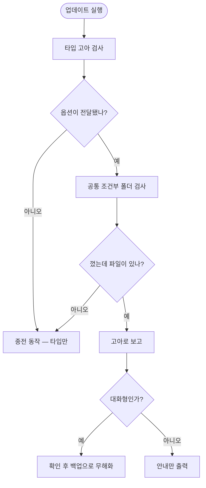

# 선택형 공통 워크플로우를 껐는데 기존 파일이 남아 계속 실행됨

## 개요

`common/` 아래 "선택했을 때만 복사되는" 워크플로우를 **껐는데 기존 파일이 지워지지 않아
계속 실행됐다.** 켜는 경로만 있고 끄는 경로가 없었다.

| 폴더 | 결정하는 값 |
|---|---|
| `common/secret-backup/` | `options.secret_backup` |
| `common/deploy/<target>/` | `options.deploy` |
| `common/pr-summary/` | `options.code_review.ai_summary` |

사용자 입장에서는 **"껐는데 왜 아직 도나"** 가 된다.

## 원인

고아 감지가 `common/`을 순회에서 통째로 제외하고 있었다.

```js
for (const e of readdirSync(projectTypesDir, { withFileTypes: true })) {
  if (!e.isDirectory() || e.name === "common" || selected.has(e.name)) continue;
  //                      ^^^^^^^^^^^^^^^^^^^ 아예 보지 않는다
```

#487에서 고아 감지를 만들 때 대상이 **타입 폴더**였기 때문이다. 이후 `secret-backup`·
`deploy`가 늘어나면서 사각지대가 생겼고, `pr-summary`를 만들며 드러났다.

## 기능 흐름



## 변경 사항

- `src/core/orphan-workflows.js`: `commonOptionalOrphans()` 신설. `detectOrphanWorkflows`가
  `options`를 받으면 공통 조건부 폴더도 검사
- `src/index.js`·`src/commands/interactive.js`: 선택 옵션 전달
- `test/orphan-common.test.js` (신규 8건)

## 주요 구현 내용

### deploy는 선택한 타겟만 살린다

`deploy`는 타겟별 폴더이므로 단순 on/off가 아니다. **선택된 타겟 폴더만 제외하고 나머지를
대상**으로 삼는다. `vercel`에서 `docker-ssh`로 바꾸면 Vercel 워크플로우가 정리된다.

### 옵션을 주지 않으면 종전 동작

`options`가 없으면 공통 폴더를 검사하지 않는다. 구 호출부와 기존 테스트가 영향받지 않는다.

### 비대화형은 자동으로 지우지 않는다

배포 파이프라인일 수 있으므로 안내만 한다. 대화형에서 확인 후 `.bak`으로 무해화한다 —
#487이 정한 원칙 그대로다.

## 주의사항

### 조건부 폴더를 새로 만들 때는 두 곳을 함께 고친다

복사 게이트(`copy/workflows.js`)와 고아 감지(`orphan-workflows.js`) **양쪽**이 필요하다.
켜는 쪽만 만들면 이번과 같은 일이 반복된다. 이 규칙을 `CLAUDE.md`에 남겼다.

## 검증 결과

| 항목 | 결과 |
|---|---|
| `node --test test/orphan-common.test.js` | **8/8** |
| `npm test` 전체 | 395/395 |

| 시나리오 | 결과 |
|---|---|
| 전부 끔 | 세 워크플로우 모두 감지 |
| 전부 켬 | 대상 없음 (쓰는 파일을 지우지 않음) |
| deploy 타겟 변경 | 선택 외 타겟만 감지 |
| 축별 독립 판정 | 끈 축만 감지 |
| 미설치 파일 | 감지하지 않음 |
| `options` 미전달 | 종전 동작 |
| 타입 고아(#487) | 계속 동작 |
| 정리 실행 | `.bak`으로 무해화 |

## 관련

- 구현 커밋: `c76c450`
- 연관: #487 (타입 고아 감지 — 같은 방식) · #566 (`pr-summary` 신설로 드러남)
