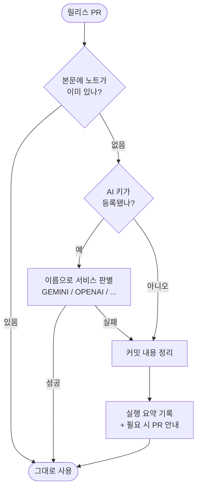

# MODEL_API_KEY를 등록해도 AI 요약이 동작하지 않음

## 개요

키를 등록해도 AI가 쓰이지 않았다. 게다가 안내는 **"키를 등록하세요"라고 말하고 있었다** —
시키는 대로 해도 아무 일이 일어나지 않는, 안내가 거짓이 되는 상태였다.

파고들면서 같은 뿌리의 문제가 더 나왔다.

| 문제 | 상태 |
|---|---|
| 키를 등록해도 안 쓰임 | 기본값 분기에만 키 검사가 빠져 있었다 |
| 무슨 서비스 키인지 알 수 없음 | `MODEL_API_KEY` 하나로 뭉뚱그림 |
| 키가 있으면 무조건 Gemini로 가정 | OpenAI 키를 넣으면 Gemini 엔드포인트로 호출 |
| 어디에 뭘 넣으라는 안내가 없음 | 완료 화면에 키 관련 항목 자체가 없었다 |
| 끈 기능의 설정법이 계속 표시됨 | CodeRabbit을 꺼도 활성화 방법이 나왔다 |
| 기본 경로에 과금 요소 | Copilot이 1순위였다 |

## 무엇이 잘못돼 있었나

### 키를 봐도 쓰지 않았다

```python
if provider == "commit":
    return [commit]      # MODEL_API_KEY가 있어도 쳐다보지 않는다
```

`copilot`·`coderabbit`·미지정 분기에는 키 검사가 들어갔는데, **정작 신규 설치 기본값인
`commit` 분기에만 빠져 있었다.**

### 이름이 아무것도 말해주지 않았다

`MODEL_API_KEY`를 보고 Gemini인지 OpenAI인지 알 방법이 없다. 사람도 모르고 코드도 몰라서
**키가 있으면 무조건 Gemini로 가정**했다. OpenAI 키를 넣으면 Gemini 엔드포인트로 호출해
실패한다.

### 기본값에 돈이 드는 경로가 있었다

"기본 경로에 외부 의존을 두지 않는다"고 해놓고 **Copilot을 1순위에 뒀다.** Copilot은
Premium Request로 과금되므로, 설치한 사람이 모르는 사이 크레딧이 빠지는 구조였다.
스스로 세운 원칙을 어긴 셈이다.

## 기능 흐름



## 변경 사항

### 키 인식

- `ladder.py`: `detect_key()` 신설. 서비스별 전용 이름을 먼저 보고, 없으면 `MODEL_API_KEY`의
  접두사(`sk-ant-`·`gsk_`·`sk-`·`AIza`)로 추정
- `commit` 분기에도 키 검사 추가 — 키 등록이 곧 "AI를 쓰겠다"는 의사표시다
- 워크플로우가 전용 Secret 5종 + 구 이름을 모두 전달

| Secret 이름 | 서비스 | 무료 |
|---|---|---|
| `GEMINI_API_KEY` | Google Gemini | ✅ 일 500회 |
| `GROQ_API_KEY` | Groq | ✅ |
| `MISTRAL_API_KEY` | Mistral | ✅ |
| `OPENAI_API_KEY` / `ANTHROPIC_API_KEY` | OpenAI / Anthropic | ❌ |
| `MODEL_API_KEY` | 구 이름 — 접두사로 추정 | 하위호환 |

### 기본 경로에서 과금 제거

- Copilot을 기본 사다리에서 제외. `provider: copilot`을 명시했을 때만 사용
- `AI-PR-SUMMARY`의 기본 provider도 `copilot` → `commit`

### 안내

- 완료 화면: `GEMINI_API_KEY`를 어디에 어떻게 넣는지 + **고른 것만** 표시
- `doctor`: AI 키 항목 신설. 원격 점검은 실제 등록 여부와 서비스명까지 표시
- `PROJECTOPS-SETUP-GUIDE.md`: "지금 해야 하는 것은 하나뿐"으로 재구성
- 마법사 질문: 코드 리뷰와 변경 요약이 **서로 다른 일을 하고 한도도 따로**임을 명시

## 주요 구현 내용

### 이름이 설명이 되어야 한다

`MODEL_API_KEY`는 "모델 API 키"라는 동어반복이라 아무 정보가 없다. `GEMINI_API_KEY`는
이름만으로 무엇을 발급받아 넣어야 하는지 알려준다. 코드도 추측할 필요가 없어진다.

구 이름은 접두사로 추정해 하위호환을 지킨다. 추정에 실패하면 Gemini로 시도하되
**"전용 이름을 쓰면 정확합니다"라고 로그에 남긴다.**

### 기본값은 언제나 "돈이 들지 않는 것"

남의 저장소에 설치되는 템플릿이다. 설치한 사람이 모르는 사이에 비용이 발생해선 안 된다.
기본 경로(본문 존중 → 커밋 분석)에는 외부 호출도 과금도 없다.

### 고르지 않은 것의 설정법은 보여주지 않는다

CodeRabbit을 껐는데 활성화 방법이 나오면, 무엇을 해야 하는지가 흐려진다. 완료 화면은
**선택한 것만** 안내한다.

## 주의사항

### CodeRabbit 한도

공개 저장소는 영구 무료지만 **시간당 3회** 제한이 있다. 비공개 저장소는 무료 플랜이 없다.
릴리스 노트는 별도 사다리가 만들므로 CodeRabbit이 한도에 걸려도 릴리스는 기다리지 않는다.

### Copilot을 쓰려면 명시해야 한다

`version.yml`의 `options.changelog.provider`를 `copilot`으로 바꾼다. 요청 수로 과금되므로
한도가 빠듯하다는 점을 감안할 것.

## 검증 결과

| 항목 | 결과 |
|---|---|
| `npm test` | **401/401** |
| `pytest` | **140/140** |
| 키 이름별 provider 선택 | **9가지 경우 전수 실측** |

**키 인식 실측**

| 입력 | 선택된 provider |
|---|---|
| `GEMINI_API_KEY` | `openai:gemini` |
| `OPENAI_API_KEY` | `openai:openai` |
| `ANTHROPIC_API_KEY` | `openai:claude` |
| `GROQ_API_KEY` | `openai:groq` |
| `MODEL_API_KEY=sk-ant-...` | `openai:claude` |
| `MODEL_API_KEY=sk-...` | `openai:openai` |
| `MODEL_API_KEY=AIza...` | `openai:gemini` |
| `MODEL_API_KEY=gsk_...` | `openai:groq` |
| `MODEL_API_KEY=unknown` | `openai:gemini` (경고 출력) |
| 없음 | `commit` |

**E2E 15 시나리오** — 신규 설치·재실행·업데이트·축 끄기/켜기·사용자 수정 보호·실행 기록·
잘못된 입력·대화형 경로·업데이트 안전성·진단·과금 요소 부재.

## 관련

- 구현 커밋: `4d5bbf7` `be212ac` `1d789a1`
- 연관: #566 (사다리 재설계 — 이 분기만 누락됐다)
