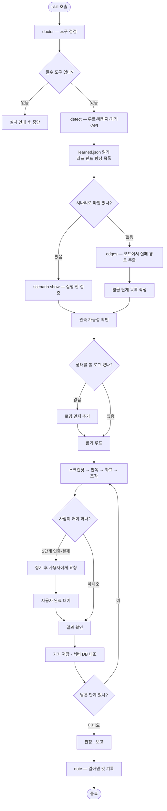

# Flutter 앱을 실제 기기에서 밟아 검증하는 pro-flutter-e2e 추가

## 개요

Flutter 앱을 **실제 에뮬레이터에서 직접 조작해** 검증하는 skill을 추가했다. 기존
`pro-testcase`는 QA 문서를, `pro-spring-test`는 테스트 코드를 만들 뿐 **앱을 실행하지
않는다.** 그런데 실제로 터지는 문제의 상당수는 실행해야만 드러난다 — 이 skill을 만들게 된
elum 프로젝트에서 `flutter test`와 `flutter analyze`를 모두 통과한 코드에서 크래시 1건,
상태 복원 버그 1건, UX 문제 3건이 나왔고, 그중 하나는 당시 스토어에 올라가 있던 모든
빌드에 있던 크래시였다.

절차는 어느 앱이나 같지만 **무엇을 밟을지는 프로젝트마다 다르다.** 그 차이를 시나리오
파일로 분리했고, 밟으면서 알게 된 것은 프로젝트 레포에 쌓이도록 했다.

## 기능 흐름

## 변경 사항

### 신규 skill

- `skills/pro-flutter-e2e/SKILL.md` (398줄) — Phase 0~6 절차, 되는 것/안 되는 것 실측 표,
  테스트 설계 3축, 좌표 방식의 한계
- `skills/pro-flutter-e2e/scripts/e2e_cli.py` — 서브커맨드 7개
- `skills/pro-flutter-e2e/references/device-control.md` — adb·simctl 명령, iOS 제약
- `skills/pro-flutter-e2e/references/reporting.md` — 보고 형식, 이슈 이미지 첨부, 오판 정정

### 문서 등록

- `README.md` · `docs/SKILLS.md` — skill 목록과 워크플로우 표에 추가

## 주요 구현 내용

### 서브커맨드 7개

| 명령 | 하는 일 | 왜 스크립트로 뺐나 |
| --- | --- | --- |
| `detect` | 루트·패키지명·번들ID·API URL·기기·AVD·adb 경로 | 매 호출마다 grep 조합을 다시 짜지 않으려고 |
| `devices` | 연결·부팅된 기기 | 위와 같음 |
| `doctor` | 도구 유무 점검 + 설치 안내 | 없는 채로 시작하면 절반쯤 가서 막힌다 |
| `scenario` | 프로젝트별 밟기 경로 관리·검증 | 절차는 같고 내용만 다르다 |
| `edges` | 코드에서 실패 경로 추출 | 해피 패스만 밟는 것을 막는다 |
| `note` | 알아낸 것 축적 | 다음에 처음부터 다시 알아내지 않도록 |
| `shrink` | 이슈 첨부용 이미지 축소 | macOS 전용 `sips` 의존을 걷어내려고 |

### 실측으로 확정한 범위

문서에 "될 것이다"로 적지 않고 에뮬레이터에서 하나씩 돌려 확인했다.

**되는 것** — 다크모드(`cmd uimode night yes`), 네트워크 끊기(`svc wifi disable`),
권한 거부(`pm revoke`), 폰트 확대(`font_scale`), 동작 줄이기, 화면 회전, 딥링크,
지문 인증(`adb emu finger touch 1`).

**안 되는 것** — 한글 입력은 `input text`가 `NullPointerException`을 낸다(ASCII만 받는다).
클립보드·keyevent 우회도 전부 실패했다. 요소를 텍스트로 찾는 것도 불가능한데, Flutter가
캔버스에 그려 `uiautomator dump`에 위젯이 안 잡히기 때문이다. `SemanticsBinding.
ensureSemantics()`를 앱에 넣고 재빌드까지 해봤지만 접근성 서비스가 실제로 붙어야 노출되어
에뮬레이터에서는 여전히 빈 트리였다(검증 후 앱 수정은 되돌렸다).

이 결과가 "좌표로 갈 수밖에 없다"는 결론과 그 한계를 문서에 적는 근거가 됐다.

### 해피 패스만 밟지 않게 하는 3축

정상 경로는 개발자가 이미 수십 번 밟는다. 버그는 그 바깥에 있으므로 밟을 것을 세 축에서
고르게 했다 — **상태 조합**(세션 유무 × 온보딩 완료 × 토큰 만료), **실패 주입**(위 명령으로
네트워크를 끊고 권한을 뺏어서), **환경 조건**(큰 글씨·다크모드·회전에서 레이아웃이 버티는가).

`edges`가 후보를 뽑아준다. elum에 돌리니 91개 파일에서 폴백 254·빈 목록 59·예외 경로 52·
토큰 만료 39곳이 나왔고, 그 과정에서 **앱의 401 자동 복구를 한 번도 밟지 않았다는 사실**이
드러났다. 서버 쪽 refresh만 검증하고 클라이언트 경로를 빠뜨린 것이다.

### 쌓인 기록을 잃지 않는 구조

| 무엇 | 어디 | skill 업데이트 영향 |
| --- | --- | --- |
| 절차·스크립트 | 하네스 설치 경로 | 통째로 교체된다 |
| 쌓인 기록 | 프로젝트 레포 `docs/testing/e2e/learned.json` | 없다 |

초기 구현에는 **기록이 조용히 사라지는 경로**가 있었다. 파일이 깨졌을 때 빈 값으로 덮어써서
그동안 쌓은 것이 없어졌는데, 실제로 파일을 깨뜨려 재현했다. 지금은 원본을
`learned.broken-{시각}.json`으로 옮기고 경고를 띄운다. 쓰기도 임시 파일 후 바꿔치기로 바꿔,
쓰는 도중 멈춰도 기존 파일이 온전하다(5개 병렬 실행으로 확인).

모르는 필드는 건드리지 않는다. 다른 하네스나 다음 버전이 넣은 값일 수 있어서다 — 실제로
임의 필드를 넣고 갱신해 보존되는 것을 확인했다.

### 지식의 범위 구분

기록에는 두 종류가 섞인다. **이 앱에서만 통하는 것**(어느 화면의 버튼 좌표)과 **어느
Flutter 앱에나 통하는 것**(한글 입력 불가)이다. 후자를 프로젝트에 묻어두면 다음 프로젝트에서
똑같이 한 번 더 겪는다.

그래서 `note pitfall --scope project|flutter|platform`으로 나누고, `project`가 아니면
"skill의 함정 표로 올리라"고 안내한다. elum에 쌓인 4건 중 2건이 범용이었고 이번에 승격했다.

### 하네스 이식성

Claude Code·Codex·Gemini·Pi 어디서 불려도 같은 스크립트를 찾도록 표준 탐색 패턴을 썼고,
실제 설치된 3곳(claude/codex/pi)에서 동작을 확인했다.

Bash 도구는 호출마다 상태가 초기화되므로 **경로를 한 번 찾아 이후 블록에 값으로 써넣는
규약**을 문서 맨 앞에 명시했다. 초기 구현에는 탐색 패턴이 한 곳뿐이라 두 번째 명령부터
실패했을 것이다.

플랫폼 의존도 걷어냈다. 이미지 축소는 Pillow → sips → ffmpeg 중 있는 것을 고르고,
Android SDK는 macOS·Linux 기본 경로에 더해 Windows(`%LOCALAPPDATA%`)와
`ANDROID_HOME`·`ANDROID_SDK_ROOT`를 본다. PATH를 비운 채 `ANDROID_HOME`만 주고 AVD 목록까지
나오는 것을 확인했다.

## 주의사항

### 이 방식으로 못 하는 일

좌표를 눌러 밟으므로 화면 판독에 사람이 필요하다. 그래서 **CI 무인 실행·회귀 자동 감지·
빠른 반복·위젯 내부 상태 확인**이 구조적으로 불가능하다.

`integration_test`·`patrol`과는 경쟁이 아니라 역할이 다르다. 그쪽은 Finder로 요소를 찾아
안 깨지고 CI에서 반복되지만 앱에 하네스를 넣어야 하고 외부 앱(소셜 로그인 웹)을 넘기
어렵다. 이 skill은 외부 앱을 넘나들고 서버 DB까지 함께 보며, 아직 무엇을 검증해야 할지
모를 때 쓴다. **반복 검증할 경로가 정해지면 `integration_test`로 옮기는 것이 맞다.**
문서에 "프로젝트에 `integration_test/`나 patrol이 이미 있으면 그쪽을 먼저 확인하라"고 적었다.

### iOS는 반쪽이다

시뮬레이터에는 `adb shell input tap`에 해당하는 공식 명령이 없다. 선택지 세 가지
(`integration_test` / AppleScript 창 클릭 / 사용자 조작)를 적고, **임의로 고르지 말고
사용자에게 먼저 확인하라**고 규정했다. AppleScript는 창 위치에 의존해 엉뚱한 곳을 누른다.

### 좌표는 힌트지 보증이 아니다

`learned.json`에 쌓은 좌표는 해상도가 다르거나 화면이 바뀌면 빗나간다. 기록된 좌표를
쓰더라도 **누른 뒤 결과를 확인하는 단계를 건너뛰면 안 된다.** 이 skill을 만드는 과정에서도
좌표가 두 번 빗나갔고(키보드·안내 문구가 레이아웃을 밀어서), 스크롤을 덜 하고 "잘렸다"고
오판해 없는 버그로 이슈를 올렸다가 취소한 일이 있다. 그 실패들이 그대로 절차의 규칙이 됐다.

### 앞으로

- `edges`의 규칙은 정규식 기반이라 후보만 준다. 무엇을 밟을지는 사람이 고른다
- 동시 실행 시 기록이 일부 유실될 수 있다(파일이 깨지지는 않는다). 잦아지면 잠금이 필요하다
- Gemini 확장 경로는 탐색 대상에 넣었지만 미설치라 실측하지 못했다
