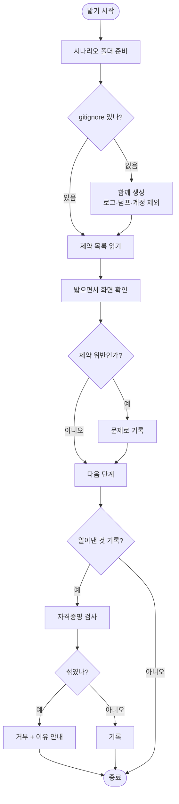

# pro-flutter-e2e 테스트 산출물이 무방비로 커밋되고 프로젝트 제약을 모른 채 밟는다

## 개요

skill을 실제로 몇 번 돌려보니 세 가지가 빠져 있었다. **테스트 산출물에 아무 방어가 없었고**,
skill이 이 앱의 규칙을 모른 채 밟았으며, 기록에 자격증명이 섞여도 걸러내지 않았다.

첫 번째가 가장 급했다. 지금까지 커밋된 것은 깨끗했지만 그건 **판단이었지 장치가 아니었다.**
다음 사람이 로그를 통째로 덤프하거나 계정을 메모에 적으면 그대로 올라가고, 한 번 들어가면
지워도 히스토리에 남는다.

## 기능 흐름



## 변경 사항

### 산출물 보호

- `scripts/e2e_cli.py` — `scenario init`이 시나리오 폴더에 `.gitignore`를 함께 만든다.
  로그(`*.log`)·UI 덤프(`*.xml`)·녹화(`*.mp4`)·계정 파일은 제외하고, 시나리오와 학습 노트는
  팀이 공유해야 하므로 추적한다
- `scripts/e2e_cli.py` — `note`에 이메일·전화번호·JWT·비밀번호·API 키가 섞이면 기록을
  거부하고 무엇이 걸렸는지 마스킹해 알린다

### 프로젝트 제약 인식

- `scripts/e2e_cli.py` — `note constraint` 추가. 이 앱이 지켜야 할 것과 **무엇을 보면
  위반인지**(`--check`)를 함께 기록한다
- `SKILL.md` — 제약을 Phase 1의 확인 항목으로 쓰도록 절차에 넣었다

### 문서

- `SKILL.md` — "산출물을 레포에 올릴 때" 절 추가. 스크린샷은 자동으로 거를 수 없으므로
  소셜 로그인 화면을 올리지 않는다는 규칙을 명시

## 주요 구현 내용

### 왜 `--check`가 핵심인가

규칙만 적으면 밟으면서 떠올리지 못한다. "경고색을 쓰지 않는다"는 원칙이지만, 화면을 보는
순간 판정하려면 **"빨간 글자·`Icons.error`가 있으면 위반"**이라는 형태여야 한다.

elum에 다섯 개를 등록했다.

| 제약 | 확인 |
| --- | --- |
| 실패에 경고색·경고 아이콘 금지 | 빨간 글자·`Icons.error`가 있으면 위반 |
| 아동 화면 전환 300ms 이상 | 아이 모드 화면이 순간적으로 바뀌면 위반 |
| 진단명·장애 유형 수집 금지 | 입력 폼에 관련 항목이 있으면 위반 |
| AI 결과는 보호자 승인 후 노출 | 승인 없이 아이 화면에 카드가 나타나면 위반 |
| 오류 시 화면이 깨지지 않고 에러 코드 노출 | 실패했는데 식별자가 없으면 위반 |

마지막 항목이 바로 직전에 발견한 문제와 맞는다. 세션이 끊긴 채 홈이 정상처럼 보이는
상황(elum #175)을 "화면이 안 깨졌으니 통과"가 아니라 **"식별자가 없으니 위반"**으로
판정할 수 있다.

### 자격증명은 들어가기 전에 막는다

사후 검사는 소용이 없다. 커밋된 뒤에는 히스토리에서 지워야 하는데 그건 사실상 못 한다.
그래서 쓰기 직전에 막고, 무엇이 걸렸는지 **마스킹해서** 알린다.

```
ok: False | code: secret_detected
기록하려는 내용에 이메일 주소(tes***), 비밀번호(비번 ***)이(가) 들어 있습니다
구체적인 값 대신 '테스트 계정으로'처럼 바꿔 적으세요
```

정상 문구("테스트 계정으로 로그인하면 2단계 인증이 뜬다")는 그대로 통과한다.

### 검증

실제로 로그·덤프·계정 파일을 만들어 `git status`에 잡히지 않는 것을 확인했다.

```
M  docs/testing/e2e/learned.json     ← 공유 대상
?? docs/testing/e2e/.gitignore       ← 공유 대상
(full.log · ui.xml · accounts.txt 는 나타나지 않음)
```

## 주의사항

### 스크린샷은 걸러지지 않는다

이미지 안의 글자까지 판단해야 하므로 자동화할 수 없다. **소셜 로그인 화면에는 이메일
주소가 그대로 찍힌다.** 문서에 "레포에 넣지 않는다"를 명시했지만 이건 규칙일 뿐 장치가
아니다. 필요하면 해당 부분을 잘라내거나 가린 뒤 올린다.

### 패턴 검사의 한계

정규식이라 변형된 표기(`test [at] example.com`)는 통과한다. 완벽한 차단이 아니라 **실수로
붙여넣는 것**을 막는 장치로 본다. 진짜 방어선은 `.gitignore`와 커밋 전 확인이다.

### 제약은 사람이 넣어야 한다

프로젝트의 `CLAUDE.md`나 서비스 원칙 문서에서 자동으로 뽑지 않는다. 문서 형식이 제각각이고,
무엇이 **밟으면서 확인 가능한 것**인지는 판단이 필요하기 때문이다. 처음 한 번만 넣으면
이후로는 계속 쓰인다.
