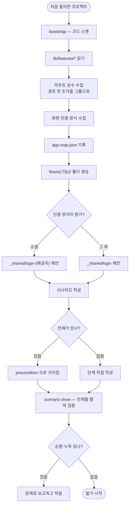

# pro-flutter-e2e에 앱 구조 스캔과 기능별 시나리오 폴더·전제 재사용 추가

## 개요

기능이 늘어날수록 세 가지가 걸림돌이 됐다. 시나리오가 한 층에 평평하게 쌓여 어디에 넣을지
매번 고민해야 했고, 로그인처럼 거의 모든 시나리오의 전제가 되는 흐름을 매번 다시 적어야
했으며, **이 앱이 어떻게 생겼는지 모른 채** 매번 코드를 뒤져 라우트를 찾았다.

세 가지 모두 **코드에 이미 있는 것을 읽지 않아서** 생긴 문제였다. Flutter 프로젝트는
`lib/features/*`로 기능이 나뉘어 있고 라우트 상수가 경로 계층을 담고 있다. 한 번 읽어 두면
폴더 구조도, 어디에 무엇을 넣을지도 자동으로 정해진다.

## 기능 흐름



## 변경 사항

### 부트스트랩

- `scripts/e2e_cli.py` — `bootstrap` 서브커맨드 추가. 기능 그룹·라우트·화면·인증 방식을
  스캔해 `app-map.json`에 기록하고 `flows/` 아래 기능별 폴더를 만든다

### 시나리오 구조

- `scripts/e2e_cli.py` — 하위 폴더까지 탐색하도록 확장. `--group`으로 어디에 만들지 지정
- `scripts/e2e_cli.py` — `precondition` 필드와 전제 펼치기. 순환 참조·없는 전제를 막는다
- `.gitignore`에 `runs/` 추가

### 문서

- `SKILL.md` — Phase 0.5(앱 구조 읽기) 추가, 폴더 구조와 전제 사용법

## 주요 구현 내용

### 폴더를 코드와 같은 이름으로

`lib/features/{auth,onboarding,guardian,child}`가 그대로 `flows/{auth,onboarding,guardian,child}`가
된다. **새 기능을 만들면 폴더가 이미 거기 있으므로** 어디에 넣을지 고민할 일이 없다.

라우트도 함께 읽어 그룹을 붙인다. `/guardian/routine/input`은 guardian 그룹이므로 그 기능을
테스트하려면 `flows/guardian/`에 넣는다는 것이 자동으로 정해진다.

한 프로젝트에서 실측한 결과 — 기능 4개, 라우트 19개, 화면 20개, 인증 소셜 4종.

### 전제는 한 곳에 두고 가리킨다

```json
{
  "name": "일과 만들기",
  "precondition": "_shared/login-kakao",
  "steps": [ ...일과 만들기만... ]
}
```

`scenario show`가 전제를 펼쳐 전체 단계를 보여주고 `reset`도 물려받는다. **로그인 방식이
바뀌면 `_shared` 한 곳만 고친다.** 앱마다 로그인이 다르므로 프로젝트가 늘수록 이득이 커진다.

순환 참조와 없는 전제는 검증에서 막는다. 무한 재귀로 죽는 대신 어디서 도는지 경로를 보여준다.

### 인증 방식은 감지하되 만들지 않는다

`*Provider` enum을 찾아 소셜인지 판단하고 제공자 목록까지 뽑지만, **전제 파일을 자동 생성하지는
않는다.** 어떤 버튼을 눌러야 하는지는 밟아 봐야 알기 때문이다. 대신 "무엇부터 만들라"고 알린다.

## 주의사항

### 이 구조로 실제 버그를 찾았다

구조를 갖추고 나니 `app-map.json`과 시나리오 목록을 대조해 **아직 안 밟은 기능 그룹**이
바로 드러났다(child·guardian·onboarding). 그중 하나를 밟다가 계정 전환 시 이전 아이 이름이
남아 새 이름과 이어붙는 버그를 찾았다.

그 버그는 앞선 수정(재시작 시 상태 복원)이 만든 회귀였다. **복원을 넣으면서 "언제 비워야
하는가"를 함께 보지 않은 것**이 원인이었다. 구조가 없었다면 그 영역을 밟을 생각도 하지
않았을 것이다.

### 기존 시나리오는 손으로 옮겨야 한다

평면에 있던 파일을 자동으로 분류하지 않는다. 어느 기능에 속하는지, 어디까지가 전제인지는
판단이 필요하기 때문이다. `scenario list`가 `(미분류)`로 표시해 옮길 대상을 알려준다.

### 라우트 스캔은 상수 선언만 본다

`static const x = '/...'` 형태를 찾는다. 라우트를 다른 방식으로 정의하는 프로젝트에서는
덜 잡힐 수 있다. 그 경우 `app-map.json`을 손으로 보완하면 된다 — 스캔은 출발점이지
완결이 아니다.
