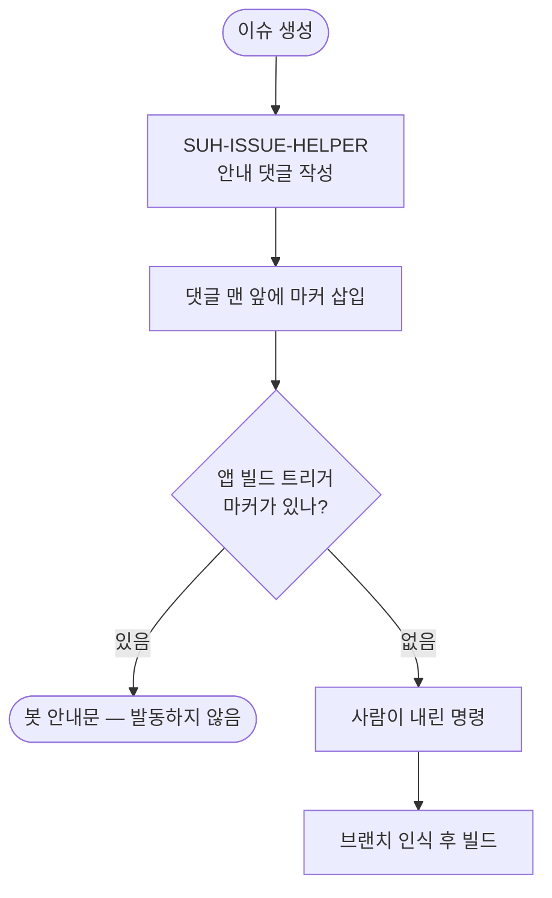

# 이슈를 만들기만 해도 앱 빌드 트리거가 발동해 실패 댓글이 달림

## 개요

**projectops가 만든 안내문이 projectops가 만든 트리거를 불렀다.**

이슈를 만들면 `SUH-ISSUE-HELPER`가 브랜치 안내 댓글을 단다. 그 안내문에 사용법으로
적어 둔 `@projectops app build`가 앱 빌드 트리거의 발동 조건을 **그대로 만족**했다.
방금 만든 이슈에는 브랜치가 없으므로 워크플로우는 "브랜치를 찾을 수 없습니다" 실패
댓글을 남기고 끝났다. 이 템플릿을 쓰는 **모든 Flutter 저장소**에서 일어났다.

## 원인

두 기능이 서로를 부르는 구조였다.

```python
# .github/scripts/issue_helper.py
GUIDE_LINES = [
    ("PROJECT-FLUTTER-PROJECTOPS-APP-BUILD-TRIGGER.yaml",
     "`@projectops app build` 댓글 빌드 — 이 댓글의 브랜치를 자동 인식해서 빌드"),
```

```yaml
# PROJECT-FLUTTER-PROJECTOPS-APP-BUILD-TRIGGER.yaml
if: |
  contains(github.event.comment.body, '@projectops') &&
  (contains(github.event.comment.body, 'build') && contains(github.event.comment.body, 'app')) || ...
```

트리거는 **댓글에 그 단어들이 있는지**만 본다. 안내용으로 적은 예시와 사람이 실제로
내린 명령을 구분할 방법이 없었다.

실측으로 확인한 안내문 내용이다.

| 단어 | 안내문에 존재 |
|---|---|
| `@projectops` | ✅ |
| `app` | ✅ |
| `build` | ✅ |

## 기능 흐름



## 변경 사항

댓글 본문을 조건으로 쓰는 워크플로우 전부에 **봇 마커 제외**를 추가했다.

| 워크플로우 | 조건 |
|---|---|
| `PROJECT-FLUTTER-PROJECTOPS-APP-BUILD-TRIGGER` | 실제 오발동이 확인된 자리 |
| `PROJECT-COMMON-QA-ISSUE-CREATION-BOT` | 같은 구조 — 예방 |
| `PROJECT-PYTHON-PR-PREVIEW` | 같은 구조 — 예방 (2곳) |
| `PROJECT-SPRING-PR-PREVIEW` | 같은 구조 — 예방 (2곳) |

```yaml
if: |
  !contains(github.event.comment.body, '<!-- SUH-ISSUE-HELPER -->') &&
  contains(github.event.comment.body, '@projectops') && ...
```

사람이 다는 댓글에는 그 마커가 없으므로 **기존 동작은 그대로다.**

## 주요 구현 내용

### 안내문을 고치지 않고 트리거를 고쳤다

안내문에서 `@projectops app build`를 빼면 사용법을 알려줄 수 없다. 안내는 실제 명령을
보여줘야 한다. 따라서 **받는 쪽이 출처를 구분**하게 했다. 마커는 이미 `issue_helper.py`가
댓글 맨 앞에 넣고 있었으므로 새로 만들 것이 없었다.

### 예방까지 함께 넣었다

지금 안내문에는 `create qa`·`server` 문구가 없다. 하지만 **구조가 같다** — 안내문이 한 줄
늘어나면 똑같이 터진다. 회귀 테스트가 "댓글을 조건으로 쓰는 모든 워크플로우"를 자동으로
찾아 검사하므로, 새 트리거를 추가해도 가드를 빠뜨리면 바로 걸린다.

## 주의사항

### ⚠️ 인라인 `if: !contains(...)`는 YAML 파싱이 깨진다

수정 과정에서 실제로 겪었다. YAML은 `!`로 시작하는 인라인 스칼라를 **태그 지시자**로 읽는다.

| 형태 | 파싱 |
|---|---|
| `if: \|` 블록 안의 `!contains(...)` | ✅ |
| `if: ${{ !contains(...) }}` | ✅ |
| **`if: !contains(...)`** | ❌ **ParserError** |

PR Preview 두 파일이 인라인 `if:`라 그대로 넣었다면 워크플로우가 통째로 깨질 뻔했다.
`${{ }}`로 감싸 해결했고, **모든 인라인 `if:`가 YAML로 파싱되는지 검사하는 테스트**를 넣었다.

## 검증 결과

| 항목 | 결과 |
|---|---|
| `pytest` | **158/158** (신규 18건) |
| `npm test` | 401/401 |
| 인라인 `if:` YAML 파싱 | 4개 파일 전부 통과 |

**역검증** — 회귀를 일부러 심어 테스트가 잡는지 확인했다.

| 심은 회귀 | 결과 |
|---|---|
| 인라인 `!`로 되돌림 | ✅ 실패로 잡힘 |
| (복원) | ✅ 18/18 통과 |

신규 테스트 `test_comment_trigger_guard.py`는 네 축을 본다.

1. 안내 댓글이 마커로 시작하는가 (걸러낼 수 있어야 한다)
2. 댓글 트리거가 그 마커를 제외하는가 — **워크플로우를 자동 탐색**하므로 새 트리거도 포함
3. 안내문이 실제로 트리거 조건을 만족하는가 (사고의 전제 확인)
4. 인라인 `if:`가 YAML로 파싱되는가

## 관련

- 구현 커밋: `6a53215`
- 연관: `.github/scripts/issue_helper.py` (#478 내재화) · `docs/BRANCH-CONVENTION.md`
