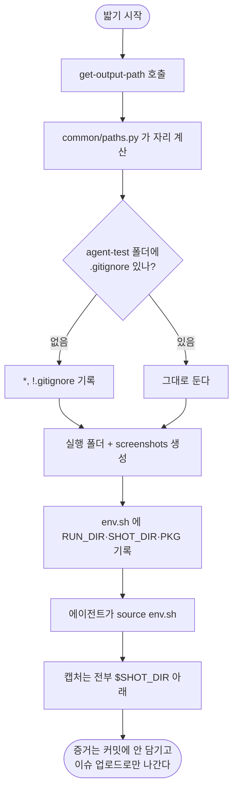

# agent-test 산출물이 우산 밖(docs/testing)에 쌓이고 추적 제외도 안 된다

## 개요

`pro-agent-test` 로 실제 프로젝트를 밟았더니 대상 레포에 `docs/testing/screenshots/` 가 생겼다. 24개 파일 **8.0MB**, `.gitignore` 에도 없어 다음 `git add` 에 그대로 딸려 들어갈 상태였다. 원인은 에이전트의 즉흥이 아니라 **스킬이 증거를 둘 자리를 한 번도 정해 준 적이 없다는 것**이었다. `get-output-path` 서브커맨드를 추가해 `common/paths.py` 가 계산한 우산 아래에 실행 폴더를 만들고, 그 폴더가 추적 제외를 스스로 들고 다니게 했다. 문서에는 경로 대신 하네스(`env.sh`)를 쓰게 바꾸고, 다시 임의 경로가 적히는 것을 전수 검사로 막았다.

## 기능 흐름



## 변경 사항

### CLI — 계산만 한다

- `skills/pro-agent-test/scripts/e2e_cli.py`
  - `get-output-path` 서브커맨드 추가. 경로 규칙은 재구현하지 않고 `common.paths.resolve_output_path("agent-test")` 가 만든 이름(`날짜_번호_제목`)을 **실행 폴더 이름으로만** 빌려 쓴다.
  - `_ensure_untracked()` — `<우산>/agent-test/.gitignore` 에 `*` + `!.gitignore` 를 보장한다. 이미 같은 내용이면 다시 쓰지 않는다.
  - `_env_sh()` — `RUN_DIR`·`SHOT_DIR`·`AGENT_TEST_RUN`·`PKG`(선택)를 export 하는 하네스를 실행 폴더에 쓴다.
  - `web shot` 이 `--out` 없이 찍을 때 `$SHOT_DIR` 이 있으면 그쪽에 모은다. 앱·웹 증거가 두 군데로 갈라지면 이슈에 붙일 때 한쪽을 빠뜨린다.

### 문서 — 경로 대신 하네스를 쓰게 한다

- `skills/pro-agent-test/SKILL.md`
  - "산출물 자리 — 먼저 받아 둔다" 절 신설. `SCRIPTS` 를 찾은 직후 한 번 돌리고, 이후 블록마다 `source "{env_file}"` 한다.
  - 실행 수단 표에 `get-output-path` 추가.
  - `/tmp/step_N.png` 3곳을 `"$SHOT_DIR/step_N.png"` 로 교체.
- `skills/references/doc-output-path.md`
  - skill 표에 `agent-test` 추가. **산출물이 md 가 아니라 실행 폴더**라는 점과 추적 제외 이유를 명시.

### 테스트

- `skills/pro-agent-test/tests/test_e2e_cli.py`
  - `run_cli` 에 `cwd` 인자 추가 (`get-output-path` 는 cwd 의 저장소를 본다).
  - 우산 아래에 만드는가 · **실제로 추적되지 않는가** · 루트 `.gitignore` 를 건드리지 않는가 · 하네스가 실행 폴더 안을 가리키는가 · 두 번 불러도 되는가.
  - 문서 전수 검사: SKILL.md·references 의 **코드블록 안**에 `/tmp/`·`docs/testing` 이 없는지.

## 주요 구현 내용

**폴더가 추적 제외를 스스로 들고 다닌다.** 루트 `.gitignore` 를 고치지 않는 것이 요점이다. 이 스킬은 남의 저장소에 설치되므로 공용 파일을 건드리면 사용자 변경과 충돌한다. `#561` 에서 실행 기록에 같은 방식(`*` + `!.gitignore`)을 썼고 그대로 따랐다.

**py 는 계산만 하고 실행은 셸에 남긴다.** adb·스크린샷을 CLI 로 감싸지 않았다. 대신 실행 환경(`env.sh`)을 만들어 주고, 문서는 `$SHOT_DIR` 만 쓴다. 에이전트가 경로를 지어낼 자리를 없애는 것이 목적이지 명령을 대신 실행하는 것이 아니다.

**실측 검증.** 깨끗한 레포와 실제 프로젝트 양쪽에서 돌렸다. 증거 파일(400KB PNG + json)을 넣고 `git add -A` 한 뒤 스테이징된 것이 `.gitignore` **한 개뿐**임을 확인했다.

```
$ git diff --cached --name-only
docs/projectops/agent-test/.gitignore
```

## 주의사항

**테스트가 실제로 잡는지 증명했다.** `.gitignore` 내용을 무력화하고 문서 코드블록에 `/tmp/` 를 심어 두 테스트가 각각 실패하는 것을 확인한 뒤 원복했다. `#591` 의 교훈 — 돌지 않는 테스트는 통과와 구분되지 않는다 — 을 같은 실수로 반복하지 않기 위한 절차다.

**문서 전수 검사는 코드블록만 본다.** 산문은 검사하지 않는다. "이렇게 하지 마라"는 경고에 `/tmp` 나 `docs/testing` 이 나오는 것은 오히려 있어야 하고, 에이전트가 실제로 복사해 실행하는 것은 코드블록 안이기 때문이다. 처음에는 산문까지 훑어서 자기 경고문을 잡았다.

**`web shot` 의 기존 기본값은 유지된다.** `$SHOT_DIR` 이 없으면 종전대로 홈(`~/.projectops/agent-test/{repo}/shots`)에 떨어진다. 하네스를 쓰지 않는 기존 흐름이 깨지지 않는다.

**남은 것.** 이번 작업 중 별개 결함 두 건을 발견해 따로 올렸다 — `#612`(공용 레이어 테스트가 CI 에서 안 돌았다)·`#613`(브랜치에서 날짜를 이슈 번호로 뽑는다). 특히 `#613` 때문에 이 기능의 실행 폴더 이름도 잘못 나오고 있었고, 그 이슈에서 함께 고쳤다.
