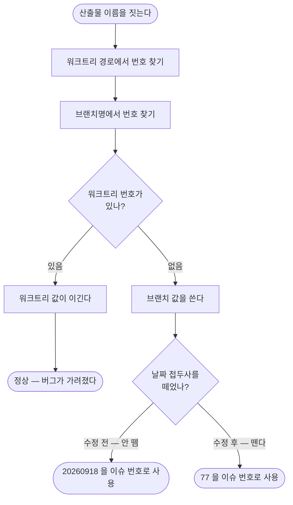

# 브랜치에서 이슈 번호 대신 날짜를 뽑아 산출물 이름이 20260918_20260918_… 이 된다

## 개요

산출물 이름을 짓는 공용 헬퍼 `extract_from_branch()` 가 이 프로젝트 **자신의 브랜치 규칙**(`YYYYMMDD_#번호_제목`)에서 이슈 번호 대신 **맨 앞 날짜**를 뽑고 있었다. `#611` 작업 중 실제로 돌려 보다 발견했다. 바로 위 줄의 워크트리 패턴은 날짜를 건너뛰게 제대로 짜여 있었고 브랜치 쪽만 틀려서, **워크트리로 작업하면 드러나지 않고 브랜치만 체크아웃했을 때만** 터졌다. 날짜 접두사를 먼저 떼도록 고치고 회귀 테스트로 고정했다.

## 기능 흐름



## 변경 사항

### 헬퍼

- `scripts/common/issue_number.py`
  - `_DATE_PREFIX` 추가 — 맨 앞 8자리 날짜를 구분자가 뒤따를 때만 떼어 낸다.
  - `_BRANCH_PATTERN` 의 구분자 집합에 `#` 추가. 규칙이 번호 앞에 `#` 을 붙이는데 이것이 빠져 있어 `feature/#77-x` 는 아예 `None` 이었다.
  - `extract_from_branch()` 가 날짜를 뗀 뒤 번호를 찾는다.

### 테스트

- `scripts/tests/test_issue_number.py` 신설 — 표준 규칙 3종 · 날짜 없는 브랜치 3종 · 번호 없는 브랜치 3종을 파라미터로 고정. 워크트리와 브랜치가 같은 답을 내는지, `resolve()` 가 진짜 불일치에서만 경고하는지도 함께 본다.

## 주요 구현 내용

**영향 범위가 파일 이름에 그치지 않았다.** `extract_from_branch` 는 `paths.py` 뿐 아니라 `commit_cli.py` 도 쓴다. 즉 `/pro-commit` 이 커밋 메시지에 **존재하지 않는 이슈 번호**를 박을 수 있었다. 실측으로 확인했다.

```
브랜치: 20260918_#77_로그인_화면_검증

수정 전   commit_cli get-issue-number → "20260918"
          e2e_cli get-output-path     → 20260918_20260918_untitled
수정 후   commit_cli get-issue-number → "77"
          e2e_cli get-output-path     → 20260918_77_로그인_화면_검증
```

**기존 동작을 깨지 않는 것이 조건이었다.** 날짜 접두사가 없는 브랜치(`fix/123`·`123-hotfix`·`release/2026`)는 종전 그대로 동작한다. 날짜만 있고 번호가 없는 브랜치(`20260918_제목만_있음`)는 아무 숫자나 집어오지 않고 `None` 을 낸다.

## 주의사항

**테스트가 실제로 잡는지 증명했다.** 고친 줄을 원래대로 되돌리자 11건 중 5건이 실패했고, 다시 적용하니 전부 통과했다.

**왜 오래 안 보였는가.** `resolve()` 는 워크트리 번호를 우선한다. 이 레포의 표준 흐름인 `/pro-init-worktree` 로 작업하면 워크트리 폴더명에서 올바른 번호가 나와 브랜치 값이 쓰이지 않는다. **워크트리 없이 브랜치만 체크아웃하는 경우** — 이 레포의 `develop` 직행, 클론해서 브랜치만 받아 작업하는 경우 — 에만 드러났다. 두 경로가 같은 규칙을 다르게 해석하고 있었던 것이 근본 원인이므로, 앞으로 한쪽 패턴을 고치면 다른 쪽도 함께 봐야 한다.

**이 테스트는 `#612` 가 먼저 들어가야 강제된다.** `scripts/tests/` 는 직전까지 CI 에서 돌지 않았다. 같은 세션에서 `#612` 를 먼저 반영해 이제 매 커밋에 돈다.
