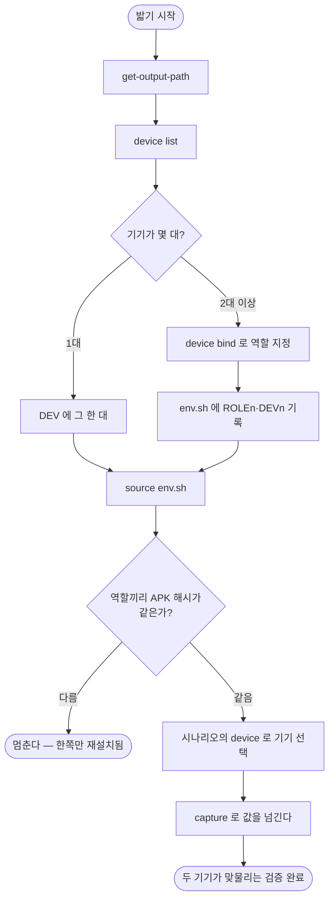

# 실측으로 쌓인 함정 14건 승격 + 기기 여러 대 개념이 없음

## 개요

연결·공유·초대처럼 **참가자가 둘인 흐름**은 스킬이 기기를 하나만 전제해서 밟을 수 없었다. 원인은 에이전트가 아니라 문서였다 — SKILL.md 와 `target-app.md` 의 `adb` 33곳이 전부 `-s` 없이 적혀 있었고, 에이전트는 그것을 복사한다.

역할을 기기에 묶는 `device` 서브커맨드를 넣고, `#611` 이 만든 하네스(`env.sh`)를 확장해 **문서에 시리얼을 적지 않고도** 어느 기기인지 말할 수 있게 했다. 설치된 빌드가 역할마다 다르면 밟기 전에 멈춘다. 함정 6건을 스킬 문서로 올렸다.

## 기능 흐름



## 변경 사항

### 하네스 — 역할 이름을 셸 변수명에 쓰지 않는다

- `scripts/e2e_cli.py`
  - `_sh_quote()` — **모든 값**을 작은따옴표로 감싼다. 역할 이름뿐 아니라 경로에도 `$`·공백·따옴표가 올 수 있다.
  - `_write_env_sh()` — `env.sh` 를 쓰는 **유일한 함수**. `get-output-path` 와 `device` 가 둘 다 이것을 부른다.
  - `DEV` 는 **항상 정의된다.** 역할이 없으면 붙어 있는 기기가 한 대일 때 그 한 대, 아니면 빈 값.

### `device` 서브커맨드 — 묶고 대조만 한다

- `list` · `bind` · `unbind` · `show`. `devices.json`(홈)에 저장해 워크트리를 오가도 남는다.
- `_build_info()` — 해상도 · versionName+Code · **APK 해시**(sha1sum → md5sum → lastUpdateTime).
- `_build_mismatch()` — 역할끼리 해시가 다르면 보고한다.

### 좌표 · 시나리오

- `screens` 에 `variants` 축 (`{역할}@{해상도}`). 구 포맷은 읽는 순간 자동 승격 — 기존 기록이 깨지지 않는다.
- `_validate_roles()` — 미선언 `device`, 앞선 단계가 만들지 않은 `${이름}`, `roles` 2개 이상인데 `target != app` 을 막는다.

### 문서

- `adb` **33곳**을 `adb -s "$DEV"` 로. 기기를 안 쓰는 `devices`·`start-server` 등은 예외.
- `references/devices.md` 신설(116줄). SKILL.md 는 788 → 833줄(+45)로 거의 안 늘었다.
- 함정 6건 배치 — 타겟 무관 1건은 SKILL.md, 앱 전용 5건(글씨 크기 · 라우팅 교체/푸시 · 빌드 플래그 3종)은 `target-app.md`. **겪은 앱 이야기가 아니라 어떤 기술에서 나는 문제인지만** 적었다.

## 주요 구현 내용

**가장 중요한 결정은 "무엇을 안 하는가"였다.** `adb` 를 CLI 로 감싸지 않았다 — 표면이 너무 넓어(`shell`·`pm`·`dumpsys`·`settings`·`emu`·`logcat`) 감싸면 adb 재구현이 되고, 탈출구를 만들면 거기로 `-s` 없는 명령이 다시 샌다. py 는 **묶고·대조하고·검증만** 하고 실행은 셸에 남겼다.

**설계 단계에서 실측이 설계를 바꿨다.** 처음에는 `export DEV_{역할명}` 이었다.

```
$ export DEV_만드는쪽=emulator-5554
bash: export: `DEV_만드는쪽=...': not a valid identifier
$ echo "$DEV_만드는쪽"
만드는쪽                    # ← 터지지 않고 엉뚱한 값. adb 가 없는 기기를 가리킨다
```

셸 변수명은 `[A-Za-z_][A-Za-z0-9_]*` 뿐이다. **역할 이름은 사용자가 자기 말로 짓는 것**이라 한글·공백·하이픈이 얼마든지 온다. 번호로 고정하고(`DEV1`·`DEV2`) 이름은 값으로 담는(`ROLE1`) 구조로 바꿨다. `ROLE{n}` 값은 시나리오 `roles` 의 키와 같은 문자열이라 둘이 이어진다.

**빌드는 버전이 아니라 APK 해시로 잰다.** 컴파일타임 플래그만 바꾼 재빌드는 `versionName`·`versionCode` 가 똑같다 — `#603` 이 정확히 그 사고였다. 버전만 보면 "한쪽만 재설치됨"을 절대 구분하지 못한다.

### 실측 검증

```
$ source env.sh && echo "$ROLE2|$ROLE3|$DEV_COUNT"
받는 쪽|it's-a/role|3        # bash 3.2 (macOS 기본)
```

시나리오 검증 4종도 실제 파일로 확인했다 — 정상 통과, 미선언 역할 거부, 정의 안 된 `${값}` 거부, 웹인데 역할 둘 거부.

## 주의사항

**새 테스트가 실제로 잡는지 증명했다.** `export DEV_{역할명}` 으로 되돌리고, 문서에 맨몸 `adb` 를 한 줄 심어 각각 실패하는 것을 확인한 뒤 원복했다.

> **그 과정에서 테스트 자체의 결함을 찾았다.** 변수명 검사가 `^export ([^=]+)=` 였는데, `env.sh` 는 한 줄에 `export` 가 둘이라(`export ROLE1=...; export DEV1=...`) **뒤엣것을 놓쳤다.** 일부러 깨뜨렸는데도 통과했다. 추가만 하고 넘어갔으면 영영 몰랐을 자리다.

**설계에서 네 가지가 바뀌었다** (spec 의 "구현하며 바뀐 것" 참조). 요지는 `device bind` 가 실행 폴더를 몰라도 **거부하지 않고** 바인딩은 저장한다는 것, 패키지를 **프로젝트 단위 한 곳**에 둔다는 것, `device list` 가 `env.sh` 도 새로 고친다는 것이다. 마지막은 기기가 `get-output-path` **뒤에** 부팅되는 흔한 경우를 위해서다.

**범위 밖으로 남긴 것.** 웹 다중 컨텍스트(`web` 은 브라우저 하나·페이지 하나라 같은 구멍이 있다)와 iOS 다중 시뮬레이터. 스키마(`roles`)가 막지는 않으므로 나중에 열 수 있다.

**함정은 9건이 아니라 6건이었다.** 이슈 본문의 표를 세어 보니 새로 올릴 것이 8건이고 그중 2건(화면만 보고 통과 · 첫 화면이 전부)은 **이미 SKILL.md 에 있었다**(828·829줄). 남은 6건을 올렸다.
