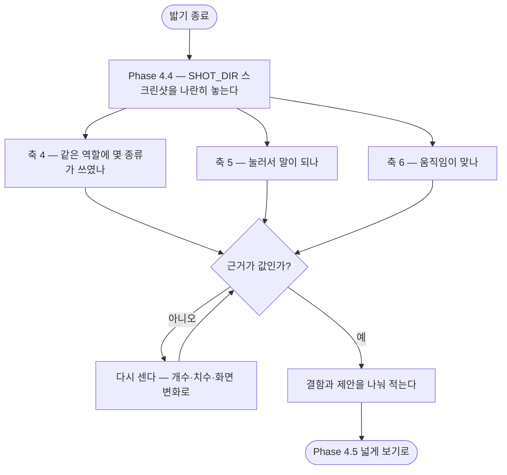

# 되는데 이상한 것(폰트·통일성·안 눌리는 버튼·불필요한 단계)을 볼 축이 없음

## 개요

기존 세 축은 **"기능이 도는가"만** 본다. 그래서 폰트가 화면마다 다르거나, 눌리는데 반응이 없거나, 화살표는 되는데 기기 뒤로가기는 막혀 있거나, 누를 것이 하나뿐인 화면이 끼어 있는 것은 **전부 통과로 끝난다.** 이슈가 지적한 대로 그런 결함은 지금까지 전부 우연히 걸렸다 — 스킬이 "이걸 봐라"라고 시킨 적이 없었다.

보는 축 4·5·6 을 `references/looks-wrong.md` 로 만들고, SKILL.md 에 `Phase 4.4` 를 넣어 밟은 직후 반드시 거치게 했다. 판정이 취향 다툼이 되지 않도록 **근거를 다시 셀 수 있는 값으로만** 적는 규칙을 함께 넣었다.

## 기능 흐름

## 변경 사항

### 새 문서 — 보는 축

- `references/looks-wrong.md` (138줄)
  - **축 4 — 같은 것이 같게 생겼나**: 글자·버튼·색·여백을 **종류의 개수**로 센다. 같은 의미에 다른 색, 다른 의미에 같은 색을 둘 다 결함으로 본다.
  - **축 5 — 눌러서 말이 되나**: 반응 없는 요소 · 이유 모를 비활성 · 되돌아갈 길 · 불필요한 단계 · 작은 탭 영역.
  - **축 6 — 움직임이 맞나**: 있어야 할 곳에 있나 · 끝나고 원위치인가 · 동작 줄이기를 무시하나. 연출이 없는 제품이면 건너뛴다.
  - 축마다 **코드에서 후보를 뽑는 패턴 목록**. 언어를 가리지 않게 Flutter·웹 표기를 함께 적었다.
  - **판정을 만든 사람이 한다** 문제에 A·B 두 대응.

### SKILL.md

- `Phase 4.4 — 되는데 이상한 것을 본다` 신설. 넓게 보기(4.5) **앞**에 둔다 — 그쪽은 "다른 자리도 그런가", 여기는 "이 자리가 말이 되는가"다.
- 기존 세 축 절 끝에 한 줄: **축 1·2·3 은 "무엇을 밟을지", 축 4·5·6 은 "밟으면서 무엇을 볼지"** 로 성격이 다르다.
- 833 → 859줄(+26). 상세는 전부 참조 문서로 뺐다.

### 보고 규칙

- `references/reporting.md` — 근거를 값으로 적는 표. 결함과 제안을 나눈다.

### 고아 문서 검사

- `scripts/tests/test_skill_docs.py` — 스킬의 참조 문서가 **어디선가 실제로 읽히는지** 전수 확인.
- `references/learning.md` 를 SKILL.md 에 연결했다. 이 문서가 **109줄짜리 고아**였다 (아무 데서도 안 읽힘). 산출물 규칙이 `#611` 로 바뀐 뒤에도 옛 내용으로 남아 있어 머리말을 함께 고쳤다.

## 주요 구현 내용

**py 를 만들지 않았다.** 이 축들은 판단이고, 스킬의 원칙은 "판단은 네가 한다. 스크립트는 실행과 기록만 한다"이다. 대신 **코드에서 후보를 뽑는 grep 패턴**을 줬다 — 축 1 이 이미 `catch · rescue · except · fallback` 목록으로 쓰고 있는 것과 같은 방식이다. "여기를 보라"는 목록만으로도 운에 기대는 것보다 낫다.

> 이슈가 말한 `edges` 명령은 **지금 저장소에 없다.** 코드에서 실패 경로 후보를 뽑는 일은 CLI 가 아니라 SKILL.md 의 grep 레시피로 남아 있다. 그래서 "명령 확장"이 아니라 같은 레시피 방식을 축 4·5·6 에 넓히는 것으로 풀었다.

**판정을 값으로 묶은 것이 핵심이다.** 축 4·5 는 "이 정도면 됐다"가 사람마다 다르다. 근거를 숫자로 적게 하면 나중에 남이 같은 화면을 보고 같은 숫자에 도달할 수 있고, 확인할 수 있으면 봐주기가 어려워진다.

| 이렇게 적는다 | 이렇게 적지 않는다 |
|---|---|
| 제목 크기가 4개 화면에서 **3종류**(20 · 22 · 24) | 폰트가 통일 안 된 느낌 |
| 버튼 높이 **48 / 44 / 52** | 버튼이 들쭉날쭉 |
| 눌렀으나 **화면 변화 없음 · 로그 0줄** | 반응이 없는 것 같다 |

**독립 판정(A)은 구조 없이도 되게 만들었다.** `$SHOT_DIR` 의 스크린샷과 이 문서만 새 세션에 넘기고 코드·작업 내용을 알려주지 않으면 된다. 그대로 쓸 수 있는 지시문을 문서에 넣었다. A 를 못 하는 상황이면 B 만이라도 지키라고 적었다.

## 주의사항

**고아 문서 검사가 실제로 잡는지 증명했다.** 아무도 안 읽는 문서를 하나 만들어 테스트가 그 파일명을 짚어 실패하는 것을 확인하고 치웠다.

> 처음에는 SKILL.md 에서 `references/looks-wrong.md` 참조를 지워 증명하려 했는데 **통과했다.** `reporting.md` 에도 참조가 있어서였다. 검사가 잘못된 것이 아니라 증명 방법이 잘못된 것이었고, 그래서 진짜 고아 파일을 만들어 다시 확인했다.

**축 6 은 건너뛸 수 있게 열어 뒀다.** 연출이 없는 제품에 "애니메이션이 빠졌다"를 강제하면 잡음만 늘어난다.

**48dp 탭 영역은 자동으로 못 잰다.** Flutter 는 캔버스라 `uiautomator dump` 에 위젯 경계가 안 나온다(SKILL.md 의 기존 함정 표에 있는 그대로다). 스크린샷에서 눈으로 재는 수밖에 없어, 근거에 "잰 치수"를 적으라고만 했다.

**남은 것.** 이슈 본문의 `edges` 확장은 CLI 가 아니라 문서 레시피로 풀었다. 나중에 후보 뽑기를 명령으로 만들 여지는 있지만, 지금은 언어·프레임워크마다 패턴이 달라 py 로 굳히면 그 목록 밖은 영영 안 보게 된다 — 스킬이 축 1 에서 이미 내린 판단을 그대로 따랐다.
