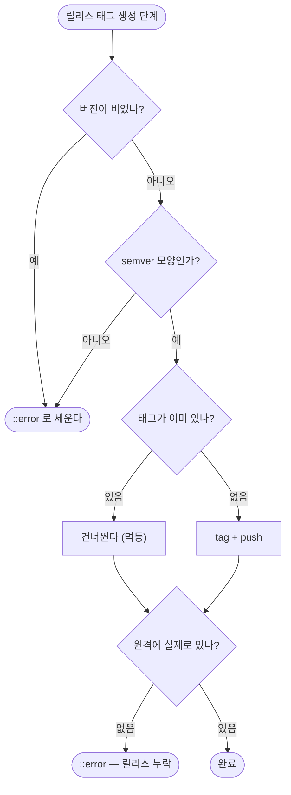

# 릴리스가 조용히 누락된다 — 게이트가 커밋 메시지 경합에 취약하다

## 개요

**보고된 원인은 이 저장소에 없다.** 지목된 `PROJECT-COMMON-RELEASE-PUBLISH.yaml` 은 설계 문서에만 있던 워크플로우로 구현된 적이 없고(전체 git 이력에 파일이 없다), 원인이던 커밋 메시지 게이트(`chore(release):`)도 현재 구조에는 없다. 지금은 `version.yml` 변경 감지로 판정하므로 — 이슈가 권고한 방향이 이미 채택돼 있다 — 커밋 순서 경합이 성립하지 않는다. `v*` 태그를 정렬해 쓰던 드리프트 가드도 없다.

**그런데 요구사항 하나가 그대로 남아 있었다.** *"누락이 발생하면 워크플로우가 실패로 표시된다 — 조용히 성공하지 않는다."* 실제로 조용히 성공하는 경로가 **두 워크플로우에** 있었고, 그것을 막았다.

## 남아 있던 구멍

```bash
NEW_VERSION="${{ needs.update-changelog.outputs.new_version }}"   # 앞 잡의 출력이 비면
TAG_NAME="v$NEW_VERSION"                                          # → "v"
git tag "v" && git push origin "v"
echo "✅ 릴리스 태그 생성: v"                                      # ← 성공으로 보고된다
```

버전이 비면 **이름이 `v` 뿐인 태그가 원격에 올라가고 초록불로 끝난다.** 정작 `v4.18.0` 은 없다. 보고된 사고의 모양 — "전부 초록불인데 릴리스가 없다" — 이 그대로 재현되는 경로다.

`push` 가 실패하는 경우도 마찬가지였다. `RELEASE-CHANGELOG` 쪽은 `git push` 의 결과를 보지 않아 실패해도 다음 단계로 넘어갔다.

## 기능 흐름



## 변경 사항

### 두 워크플로우 · 각 두 벌 (루트 + `project-types/common/`)

- `PROJECT-COMMON-RELEASE-CHANGELOG.yaml` — 릴리스 PR 경로
- `PROJECT-COMMON-VERSION-CONTROL.yaml` — main 직접 push 안전망 경로

각각에 세 가지를 넣었다.

| 검사 | 막는 것 |
|---|---|
| 버전이 비었으면 `::error` 후 중단 | 이름이 `v` 뿐인 태그가 성공으로 올라가는 것 |
| semver 모양이 아니면 중단 | 앞 단계가 엉뚱한 문자열을 넘겼을 때 |
| `git ls-remote --tags` 로 **원격 확인** | push 가 조용히 실패해 태그만 없는 상태 |

### 회귀 방지

- `.github/scripts/test/test_release_tag_guard.py` — **모든 워크플로우**에서 `git tag "$..."` 를 실행하는 run 블록을 찾아, 빈 버전 가드와 원격 확인이 있는지 전수 검사한다.

## 주요 구현 내용

**테스트가 두 번째 사례를 찾았다.** `RELEASE-CHANGELOG` 만 고치고 테스트를 돌렸더니 `VERSION-CONTROL` 도 같은 구멍이라고 알려 줬다. 한 곳만 보고 끝냈으면 안전망 경로는 그대로 남았을 것이다 — 전수 검사로 만든 이유가 이것이다.

**두 벌 동기화를 확인했다.** 공통 워크플로우는 루트와 `project-types/common/` 이 동일해야 한다(CLAUDE.md). `diff` 로 두 쌍 모두 무차이임을 확인했다.

## 주의사항

**테스트가 실제로 잡는지 증명했다.** `VERSION-CONTROL` 에서 가드를 빼고 돌려 그 파일명을 짚어 실패하는 것을 확인한 뒤 원복했다.

**이슈의 나머지 내용은 이 저장소에 해당하지 않는다.** 커밋 메시지 게이트·`v*` 드리프트 가드·`AUTO-CHANGELOG-CONTROL` 은 전부 없거나 이미 대체됐다(`registry.js` 에 폐기 등록됨). 다만 보고가 나온 레포는 **다른 계보의 템플릿**을 쓰고 있었을 가능성이 크고, 그쪽은 이 수정으로 자동으로 고쳐지지 않는다 — 그 레포를 최신 템플릿으로 다시 통합해야 한다.

**`PROJECT-COMMON-RELEASE-PUBLISH.yaml` 은 `registry.js` 에 없다.** 이 저장소가 만든 적 없는 파일이라 등록 대상이 아니지만, 만약 과거 어떤 경로로 사용자 레포에 배포된 적이 있다면 그 레포에는 지금도 남아 돌고 있다. 확인이 필요하면 별도 이슈로 다루는 편이 낫다.
