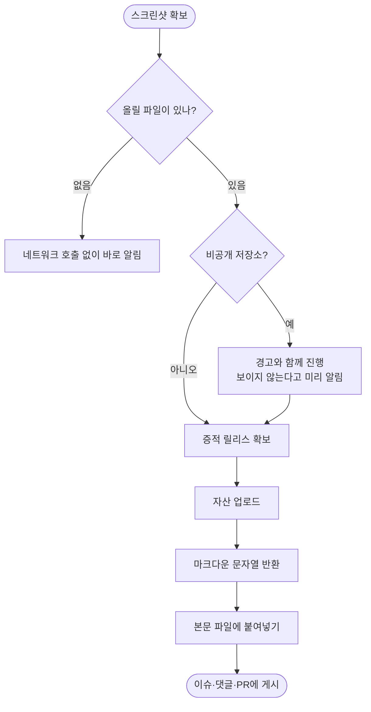

# 이슈·PR 본문과 댓글에 이미지를 올릴 수단이 없어 테스트 증적이 글로만 남음

## 개요

이슈·PR에 **이미지를 넣을 수 있게 했다.** 테스트 결과를 보고할 때 스크린샷이 가장 중요한
증거인데, 지금까지는 글로만 남고 이미지는 대화에만 머물렀다.

GitHub 공식 첨부 업로드는 브라우저 세션이 필요해 PAT로 쓸 수 없다. 그래서 "방법이 없다"고
판단해 왔는데, **릴리스 자산으로 우회할 수 있다는 것을 실측으로 확인**하고 구현했다.

## 기능 흐름



## 실측으로 확인한 것

"릴리스 자산이 마크다운에서 렌더링되는가"가 이 작업의 유일한 관문이었다. 추측하지 않고 확인했다.

| 항목 | 결과 | 의미 |
|---|---|---|
| PAT 업로드 | ✅ | `POST /repos/{owner}/{repo}/releases/{id}/assets` |
| 익명 접근 | ✅ 200 | 로그인 없이 열린다 |
| Content-Type | `application/octet-stream` | image/png가 **아니다** |
| Content-Disposition | `attachment` | 다운로드를 유도하는 헤더 |
| **X-Content-Type-Options** | **없음** | ← 여기가 관건 |
| 이슈 본문 렌더 | ✅ `` | `body_html`로 확인 |
| 이슈 댓글 렌더 | ✅ `` | 〃 |

`nosniff`가 없으므로 브라우저가 PNG 매직넘버를 보고 스니핑해 그린다. `Content-Disposition:
attachment`는 `` 태그에서는 무시된다(navigation에서만 동작). **두 헤더 모두 걸림돌이
아니었다.**

아래는 이 보고서 자체가 새 기능으로 올린 이미지다.


## 변경 사항

### 업로드 헬퍼
- `scripts/common/gh_client.py`: `upload_evidence_image`·`ensure_evidence_release`·
  `delete_release_asset`·`is_repo_private` 추가. 바이너리 본문을 보내야 해서 전용 요청
  함수(`_upload_request`)를 따로 뒀다 — 기존 `_request`는 Content-Type이 JSON으로 고정이다.

### 서브커맨드
- `skills/pro-github/scripts/github_cli.py`: `upload-image`·`delete-image` 추가.
  여러 파일을 한 번에 올리고, 바로 붙여넣을 `markdown` 문자열까지 만들어 돌려준다.

### 문서
- `skills/pro-github/SKILL.md`: "이미지 첨부" 절 — 쓰는 순서와 제약
- `skills/pro-report/SKILL.md`: 보고서에 스크린샷을 넣는 방법
- `CLAUDE.md`: 서브커맨드 목록·스킬 설명 갱신

### 테스트
- `skills/pro-github/tests/test_github_cli.py`: 이름 생성(URL 안전·고유성)·에러 경로 5건 추가

## 주요 구현 내용

**이름은 자동으로 정리하고 시각을 붙여 고유화한다.** 같은 이름을 다시 올리면 GitHub이 422로
거절하고, 한글·공백이 남으면 URL 인코딩되어 마크다운이 깨진다.

```
검증_2번째.png        → 20260918-093513_2.png
스크린샷 2026-09-18.png → 20260918-093513_2026-09-18.png
한글만.png            → 20260918-093513_image.png   (알아볼 수 없으면 image)
```

**비공개 저장소에서는 미리 경고한다.** private 레포는 익명 접근이 막혀 이미지가 깨진다.
올리고 나서 알면 이미 이슈에 깨진 이미지가 박힌 뒤라, 업로드 **전에** 확인해 알린다.

**렌더링되지 않는 형식은 ``로 만들지 않는다.** mp4 등은 링크(`[]()`)로 준다 —
GitHub이 video로 그려주는 것은 공식 첨부 경로뿐이라 릴리스 자산은 해당되지 않는다.

## 주의사항

- **증적은 버전 릴리스와 섞지 않는다.** `qa-evidence` 전용 태그를 쓰고 prerelease로 만든다.
  최신 릴리스 배지가 증적으로 바뀌면 사용자가 혼란스럽다.
- **레포에 커밋하는 방식은 쓰지 않았다.** 이미지가 git 히스토리에 영구히 남아 레포가 무거워진다.
  릴리스 자산은 지우면 실제로 사라진다.
- **순서를 지킨다.** 업로드로 URL을 먼저 받고 → 본문에 넣고 → 게시한다. 뒤집으면 이미지 없는
  본문이 먼저 올라간다.
- 구현 중 테스트가 결함을 하나 잡았다. 없는 파일을 줬는데 네트워크를 먼저 쳐서
  `github_api_404`가 나왔다 — 진짜 원인(파일 없음)을 못 짚었다. 파일 검사를 API 호출보다
  앞으로 옮겼다.
