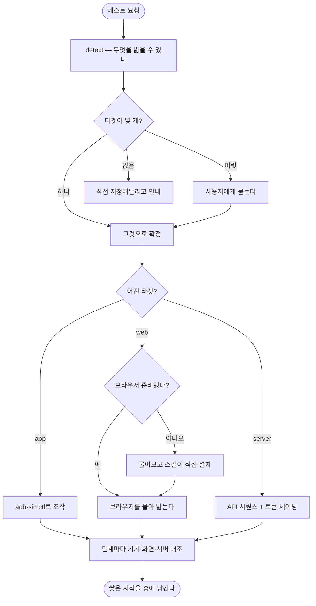

# E2E 스킬이 Flutter에만 묶여 있고 쌓은 지식이 워크트리마다 사라짐

## 개요

`pro-flutter-e2e`를 **`pro-agent-test`로 바꾸고 앱·웹·서버를 모두 밟게** 했다.
그리고 더 심각했던 문제 — **쌓은 지식이 워크트리를 만들 때마다 사라지던 것** — 을 고쳤다.

밟는 방법론(Phase 구조·3축·시나리오·자가발전)은 원래부터 플랫폼과 무관했다.
바꾼 것은 **"무엇으로 조작하고 무엇으로 판독하는가"** 한 층뿐이다.

## 기능 흐름



## 가장 심각했던 것 — 자가발전이 매번 초기화되고 있었다

`learned.json`은 `{프로젝트루트}/docs/testing/e2e/`에 저장되고 `.gitignore`로 추적에서 빠진다.
**추적되지 않는 파일은 새 워크트리에 복사되지 않는다.** 이 조직은 이슈마다 워크트리를 만드는
것이 기본이라, **이슈 하나가 끝날 때마다 쌓은 지식이 통째로 사라졌다.**

| 위치 | learned.json | app-map.json | flows/ |
|---|---|---|---|
| elum 본체 | 13 KB | 5.4 KB | 있음 |
| 워크트리 | 없음 | 없음 | 없음 |

이제 **`~/.projectops/agent-test/{owner}__{repo}/`** 에 둔다. 프로젝트 구분은 **git remote**로
한다 — 경로로 구분하면 워크트리마다 갈라져 같은 문제가 그대로 남는다.

예전 위치에 있던 것은 **처음 한 번 자동으로 옮겨 온다.** elum의 13,188 bytes가 그대로 살아나는
것을 실측으로 확인했다. 옮겼다는 사실은 어느 명령에서든 `migrated` 필드로 전달된다 —
호출부마다 챙기면 반드시 빠뜨리는 자리가 생기므로 출력 길목 한 곳에서 처리한다.

부수 효과로 **레포에 산출물이 아예 생기지 않는다.** 서버 주소·토큰이 공개 레포로 새던 경로가
구조적으로 사라졌다(#578에서 실제로 겪은 사고다).

## 실측으로 뒤집힌 설계 — 브라우저 세션 유지

이 스킬은 **agent가 화면을 보고 다음 수를 정하므로** 조작이 여러 번의 CLI 호출로 쪼개진다.
그런데 Playwright를 호출마다 새로 띄우면 매번 로그인이 풀린다.

처음 설계는 `pw.chromium.launch(args=["--remote-debugging-port=..."])`로 띄우고 `pw.stop()`은
"연결만 끊는다"고 적었다. **틀렸다.** 두 번째 명령이 이렇게 실패했다.

```
열린 브라우저에 붙지 못했습니다: connect ECONNREFUSED 127.0.0.1:53954
```

`launch()`로 띄운 브라우저는 **Playwright 드라이버 프로세스에 묶여 있어 드라이버가 끝나면 함께
죽는다.** 그래서 실행 파일 경로만 얻어 **독립 프로세스로 띄우고** CDP로 붙는 방식으로 바꿨다.


위 화면은 `web open → type → click → shot` **네 번의 별개 CLI 호출**을 거쳐 찍은 것이다.
입력값이 남아 있다는 것이 세션 유지의 증거다.

## 설치까지가 스킬의 역할이다

macOS의 Homebrew 파이썬은 **PEP 668로 `pip install`을 막는다**(externally-managed).
처음에 적은 "`pip install playwright` 하세요"라는 안내는 **그대로 따라 해도 실패한다.**

그래서 `web setup`이 전용 가상환경을 만들고 Playwright와 Chromium까지 받는다.
시스템 파이썬은 건드리지 않는다. 약 100MB를 받으므로 **agent가 먼저 사용자에게 물어본다.**

이 원칙은 이 스킬에만 두면 다른 스킬이 여전히 마음대로 설치하므로
`skills/references/common-rules.md`의 **공통 규칙**으로 올렸다.

## 변경 사항

### 축 — 타겟과 모드는 다르다
- `target`(app·web·server) = **무엇으로 조작하나**, `mode`(e2e·load) = **무슨 종류인가**
- 한 축으로 묶으면 "웹에서 밟으며 서버 DB를 확인"하는 조합이 표현되지 않는다
- `target`이 정하는 것은 `do`를 누가 실행하느냐뿐이고, `expect_*`는 타겟과 무관하게 붙는다
- 부하(`load`)는 **축만 예약**했다. 쓰려고 하면 아직 구현되지 않았다고 알려준다

### 신규 서브커맨드
- `web` — setup·open·goto·click·type·shot·assert·console·close
- `api` — 서버 시나리오를 밟는다. 앞 응답의 값을 다음 요청에 물린다(`save` → `{token}`)

### 타겟별로 갈라진 것
- `detect` — 타겟 판정(사용자 지정 → version.yml → 마커 파일). **Flutter가 없어도 실패하지 않는다**
- `bootstrap` — app은 라우트·화면, web은 라우트·페이지, server는 **엔드포인트**
- `edges` — app은 `.dart`, web은 `.ts/.tsx/.vue`, server는 `.java/.py/.js`

### 문서
- `references/target-app.md`(구 device-control) · `target-web.md` · `target-server.md`
- **agent는 타겟이 정해진 뒤 해당 문서 하나만 읽는다** — 웹 프로젝트에서 adb 함정 표를 읽을 이유가 없다
- `CLAUDE.md` 스킬 목록·라우팅 표에 등록 (여태 **등록조차 안 돼 있었다**)

### 테스트 — 리팩터보다 먼저 썼다
`e2e_cli.py` 1442줄에 테스트가 하나도 없었다. 이 상태로 뜯으면 기존 앱 E2E가 조용히 깨져도 모른다.
**지금 동작을 고정하는 테스트를 먼저 쓰고 그다음 확장했다.** 총 53개.

실제로 테스트가 결함을 잡았다 — 웹·서버에서 `lib` 변수가 정의되지 않아 `NameError`가 날 자리,
`bootstrap`이 `auth`를 무조건 참조하던 자리가 그것이다.

## 주의사항

- **기존 elum 시나리오는 한 글자도 고치지 않았다.** `target`·`mode` 키가 없으면 각각 `app`·`e2e`로
  본다. 실제 시나리오 4개가 그대로 통과하는 것을 확인했다.
- **`launch()` 방식으로 되돌리면 세션 유지가 통째로 깨진다.** 브라우저를 독립 프로세스로 띄우는
  구조를 바꾸지 말 것. 닫을 때 pid를 함께 정리하는 것도 같은 이유다.
- **운영 서버에 밟지 않도록 `base_url`을 매번 확인한다.** 계정을 만들고 지우는 시나리오가 운영에서
  돌면 실제 사용자 데이터가 사라진다.
- 웹의 `console`은 **부른 뒤부터** 듣는다. 이미 지나간 오류는 못 보므로 조작 직후에 부른다.
- DB 대조는 PostgreSQL만 본다. 다른 DB는 이번 범위 밖이다.
