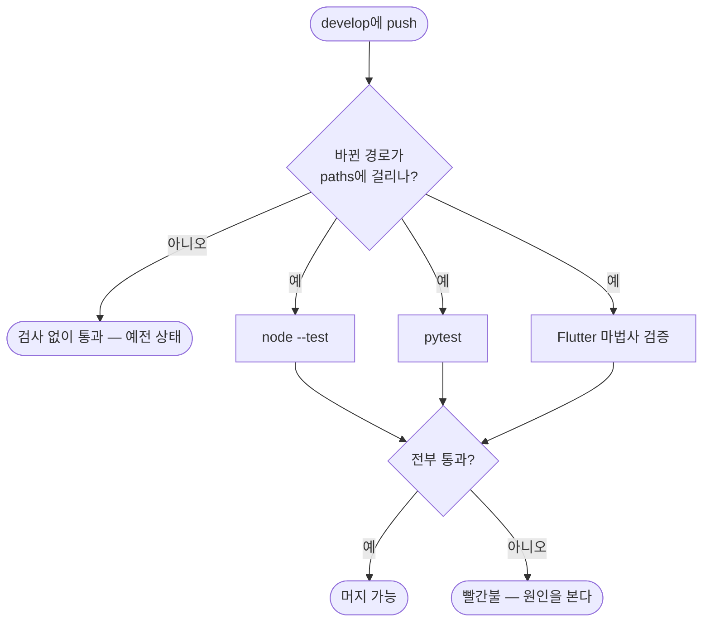

# 파이썬 테스트가 CI에서 한 번도 돌지 않아 스킬 변경이 검증 없이 들어감

## 개요

`PROJECT-TEMPLATE-CI`가 `npm test`와 Flutter 마법사 검증만 돌리고 **pytest는 어디에서도
호출하지 않았다.** 게다가 `paths` 필터에 파이썬 경로가 없어 **스킬만 고친 커밋은 CI가 아예
트리거되지 않았다.**

즉 파이썬 테스트 219개가 전부 **로컬에서만** 통과하고 있었다.

## 기능 흐름

## 고친 것

### ① 실행이 없었다
`pytest` job을 추가했다. Ubuntu·macOS 양쪽에서 돈다 — 이 저장소는 경로·셸 처리에서 OS
차이를 여러 번 겪었다.

- `.github/scripts/test/` — changelog provider·version manager·issue helper (158개)
- `skills/` — pro-github(13) · pro-agent-test(54)

### ② paths에 파이썬 경로가 없었다
`.github/scripts/**` · `skills/**` · `scripts/**` 를 추가했다.

## CI를 켜자마자 두 가지가 드러났다

**이것이 이 작업의 값어치다.** 로컬에서는 전부 통과하던 것들이다.

| # | 증상 | 진짜 원인 |
|---|---|---|
| 1 | `ModuleNotFoundError: No module named 'yaml'` | 워크플로우 YAML 문법 검사가 PyYAML을 쓰는데 **CI에 없었다.** 로컬에 깔려 있어 보이지 않았다 |
| 2 | `KeyError: 'install'` | 브라우저가 **없을 때만** 도는 테스트가 옛 키를 보고 있었다. 로컬은 브라우저가 있어 skip돼 드러나지 않았다 |

2번이 특히 그렇다. `_require_playwright`의 반환 키를 `install`에서 `fix`·`manual`·`ask_user`로
바꿨는데 테스트를 안 고쳤다. **로컬에서는 그 테스트가 영원히 skip되므로 아무리 돌려도 안 잡힌다.**
CI에만 브라우저가 없어서 그제야 실행됐다.

고치고 나서, 로컬에서도 같은 조건을 만들어(전용 가상환경을 잠시 치우고) 재현·확인했다.

## 주의사항

- **테스트 의존성은 `pytest`와 `pyyaml` 둘뿐이다.** 스킬 스크립트 자체는 표준 라이브러리만
  쓴다(내부망 대응) — 그 원칙은 **배포되는 코드**에 대한 것이고, CI에서만 도는 테스트 도구는
  별개다. 새 외부 패키지를 테스트에 들이면 CI 설치 목록에도 넣어야 한다.
- **`skills/pro-agent-test`의 실브라우저 테스트는 CI에서 skip된다.** Playwright가 없기 때문이다.
  그 대신 "없을 때 안내가 정확한지"를 검사한다 — 오늘 잡힌 것이 바로 그 경로다.
- 릴리스 버전 확정 커밋(`[skip ci]`)에서는 돌지 않는다. 기존 job들과 같은 조건이다.
