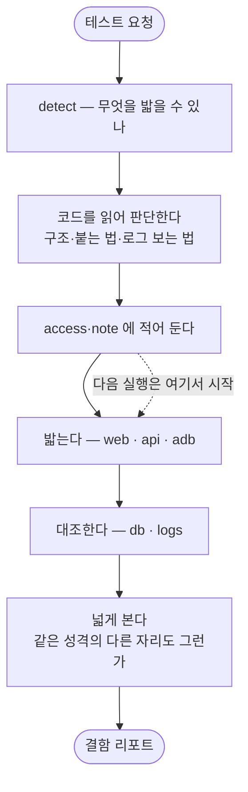

# DB 대조가 Spring·PostgreSQL·직접접속만 가정해 agent가 판단할 자리가 없음

## 개요

`pro-agent-test`가 **"프로젝트가 어떻게 생겼는지 알아맞히는 일"** 을 하고 있었다.
그건 스크립트가 할 수 없는 일이다 — 세상의 서버·앱·웹 종류만큼 예외가 있다.

이번에 **판단은 agent, 실행은 도구, 지식은 기록**으로 역할을 다시 나눴다. 그리고 이 skill이
**QA**라는 정체성을 분명히 했다 — 코드를 고치는 쪽이 아니라 버그를 찾는 쪽이다.

## 기능 흐름



## 무엇이 잘못됐었나

**세 타겟 전부 같은 병이었다.** 서버만의 문제가 아니었다.

| 타겟 | 박혀 있던 전제 | 안 맞으면 |
|---|---|---|
| 앱 | `lib/features/` · `*_screen.dart` | 같은 Flutter라도 구조가 다르면 빈손. React Native는 아예 안 됨 |
| 웹 | `app/`·`pages/` + Next.js 규칙 | Vite·Remix·Nuxt → 어긋남 |
| 서버 | Spring yml · **`/admin/logs/api/tail`** | 그런 엔드포인트가 없음 |

`/admin/logs/api/tail`은 **한 프로젝트의 엔드포인트가 오픈소스 스킬 코드에 들어 있던 것**이다.

공통점은 하나다. **틀리면 조용히 빈손으로 돌아왔다.** 사용자에게는 "아무것도 못 찾았다"로만
보여서, 프로젝트에 화면이 없는 줄 안다.

## 고친 것

### ① 붙는 법을 적어 두고 그대로 실행한다

설정이 사는 곳(`application.yml`·`.env`·`settings.py`·`ormconfig`)도, 붙는 길(로컬·SSH 경유·
컨테이너 안)도 프로젝트마다 다르다. **맞히지 않고 적어 둔다.**

```bash
access set --key db --json '{"how":"ssh","engine":"postgres","password_env":"DB_PASSWORD"}'
db --profile db --sql "select ..."
logs --tail 100 --grep ERROR
```

붙는 길이 셋이다 — `direct` · `ssh` · `command`(컨테이너 등 **무엇이든**).
엔진은 postgres·mysql을 고르고, 그 밖은 `--command` 로 하면 된다.

**비밀번호는 값을 적지 않는다.** `password_env` 로 어디서 읽을지만 적고, 값을 적으려 하면 막는다.

### ② 프로젝트를 맞히던 기능을 걷어냈다

| 제거 | 대신 |
|---|---|
| `bootstrap` + 스캐너 5종 | **agent가 Grep·Read로 직접 읽는다** |
| `edges` | 〃 |
| `backend` 계열(Spring 탐색·admin 엔드포인트·고아 조사) | `access`(기록) + `db`·`logs`(실행) |

결정적 근거: **agent에게는 이미 Grep이 있다.** 도구가 어설픈 정규식을 대신 돌려줄 이유가
없고, 오히려 틀린 답을 준다.

### ③ QA라는 정체성을 분명히 했다

| 하는 일 | 하지 않는 일 |
|---|---|
| 깨뜨려 보고 결함을 찾는다 | 찾은 결함을 고친다 |
| 재현 절차·근거·심각도를 남긴다 | 코드를 바꾼다 |

**로그가 없으면 "추적 불가"를 결함으로 보고한다** — 로깅을 대신 넣어 주지 않는다.
여기서 고치기 시작하면 무엇이 원래 결함이었는지 알 수 없게 된다.

### ④ 넓게 보는 단계를 넣었다 (Phase 4.5)

**이번 작업에서 가장 중요한 추가다.**

> 회원가입의 비밀번호 재입력 화면에 "틀리면 흔들림"을 넣었다. 그 화면은 통과한다.
> 그런데 같은 앱의 다른 비밀번호 입력 화면은 안 흔들린다.
> **요청받은 화면만 보면 결함이 아니다. 프로젝트 전체를 봐야 결함이다.**

세 개의 렌즈로 본다.

| 렌즈 | 묻는 것 |
|---|---|
| 횡단 | 같은 성격의 자리가 **전부** 같게 동작하나 |
| 대칭 | 가입↔탈퇴 · 생성↔삭제 · 켜기↔끄기 — 짝도 같은 대접을 받나 |
| 파급 | 이걸 건드리면 어디가 영향받나 |

밟은 것에서 규칙을 한 문장으로 뽑아 `note constraint` 로 남기면, **다음에 새 화면이 생겼을 때
자동으로 검사 대상이 된다.** 쓸수록 똑똑해지는 자리다.

### ⑤ 백엔드 체크리스트를 순위와 함께 줬다

`references/target-server.md`에 **깨뜨리는 방법과 함께** 적었다.

| 순위 | 무엇 | 왜 1등인가 |
|---|---|---|
| 1 | 권한 경계 | 프론트에서 버튼을 숨겨도 API는 열려 있고, **거의 아무도 안 밟아본다** |
| 2 | 상태 대조 | 응답 201인데 DB에 없을 수 있다 |
| 3 | 관측성 | 실패를 나중에 추적할 수 있는가 |

회원가입은 단발 API가 아니라 **생애주기**로 본다 — 가입 → 중복가입 → 로그인 → 탈퇴 →
**탈퇴 후 남은 토큰** → 재가입.

### ⑥ 하위호환을 걷어냈다

쓰는 사람이 없으므로 옛 것을 붙잡지 않는다. 폐기 안내·옛 경로 이전·옛 이름 마커·`mode` 축을
전부 제거했다. `target` 기본값(`app`)만 남겼는데, 그건 호환이 아니라 **대부분이 앱이라 매번
적게 하지 않으려는 것**이다.

## 테스트가 잡은 실제 결함

`access`에 비밀번호를 적으려 하면 막아야 하는데 **JSON 형태를 못 잡고 있었다.**

```
패턴이 yaml(password: x)만 보고 {"password": "x"} 를 놓쳤다 → 원문이 그대로 기록될 수 있었다
```

따옴표를 허용하도록 고치고, `password_env`(환경변수 이름)와 `host`·`user`는 통과시키는 것까지
회귀 테스트로 고정했다.

## 실측으로 확인한 것

| 확인 | 결과 |
|---|---|
| elum 타겟 판정 | `app`·`server` (version.yml 근거) |
| 기존 시나리오 | 그대로 통과 — 한 글자도 안 고쳤다 |
| 쌓인 지식 | 제약 5 · 함정 25 · 화면 4 유지 |
| 운영 PostgreSQL 조회 | `select count(*) from member` → **72** |
| 구조가 다른 앱(`lib/ui/*_page.dart`) | "못 찾았다"가 아니라 **무엇을 봤는지 알려준다** |

## 주의사항

- **`db --command` 는 무엇이든 실행한다.** 다루는 엔진이 아니어도, 컨테이너 안이어도 된다.
  대신 무엇을 실행할지는 부르는 쪽이 온전히 책임진다.
- **운영에 밟지 않도록 `base_url`과 DB를 매번 확인한다.** 계정을 만들고 지우는 시나리오가
  운영에서 돌면 실제 사용자 데이터가 사라진다.
- **스캐너를 다시 넣지 않는다.** 편해 보여도 틀리면 "없다"고 답해 오해를 만든다.
  agent가 Grep으로 읽는 편이 언제나 더 정확하다.
- 남은 것은 전부 **실행**이거나 **기록**이다. 판단하는 코드를 새로 들이지 않는다.
