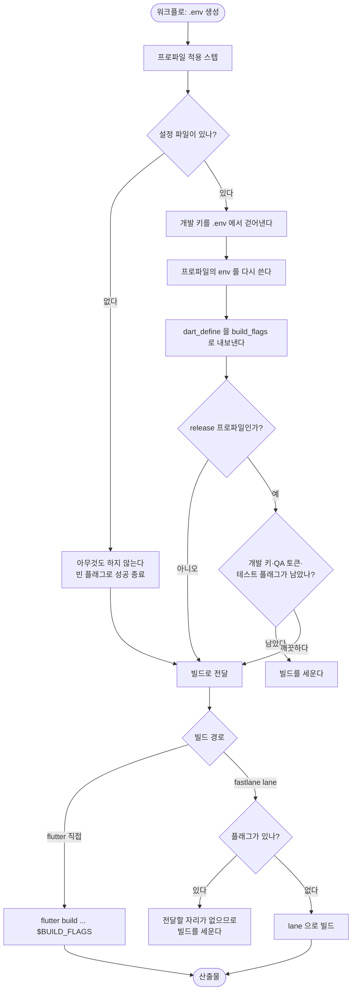

# 빌드 프로파일이 .env만 다뤄 반쪽만 적용됨

## 개요

개발 스위치는 **런타임(`.env`)과 컴파일타임(`--dart-define`) 두 층**에 있는데 워크플로가 한 층만 다뤄, **한쪽만 적용돼도 빌드가 통과**했다. `.env`에 플래그가 찍히고 로그는 "적용 완료"를 냈지만 설치해 보면 개발자 도구가 없었다.

템플릿에는 프로파일 스크립트가 **아예 없었고** `dart-define`도 한 군데도 쓰이지 않았다. 따라서 이 작업은 "개선"이 아니라 **신설**이다. 정의는 저장소가 갖고 템플릿은 엔진만 제공하는 구조로 만들었다.

## 기능 흐름

## 변경 사항

### 엔진

- `.github/scripts/apply_build_profile.py` (신규): 설정을 읽어 `.env`를 정리하고 `build_flags`를 `$GITHUB_OUTPUT`으로 내보낸다. 표준 라이브러리만 사용한다.
- `.github/config/build-profile.json.example` (신규): 저장소가 복사해 쓰는 설정 출발점.
- `src/core/copy/simple.js`: 새 스크립트를 사용자 프로젝트 복사 목록에 등록.

### 워크플로 (6개)

| 워크플로 | 프로파일 | 플래그 전달 방식 |
| --- | --- | --- |
| `ANDROID-TEST-APK` | test | 같은 job — `steps.build_profile.outputs` |
| `IOS-TEST-TESTFLIGHT` | test | **job 경계 넘음** — `needs.prepare-test-build.outputs` |
| `ANDROID-PLAYSTORE-CICD` | release | 같은 job |
| `ANDROID-FIREBASE-CICD` | release | 같은 job |
| `ANDROID-SELFHOSTED-CICD` | release | 같은 job |
| `IOS-TESTFLIGHT` | release | **job 경계 넘음** — `needs.prepare-build.outputs` |

### 문서·회귀 방지

- `CLAUDE.md`: "빌드 플래그는 두 층이 함께 가야 한다" 절 추가.
- `.github/scripts/test/test_build_profile.py` (신규): 16개. "되는 경우"보다 **막아야 하는 경우**를 더 많이 본다.

## 주요 구현 내용

### 설정이 없으면 아무것도 하지 않는다

이 템플릿은 남의 저장소에 설치되고 대부분은 프로파일을 쓰지 않는다. 설정 파일이 없으면 `.env`를 건드리지 않고 빈 플래그만 내보낸 뒤 성공으로 끝낸다. 실측으로 `.env` 무변화를 확인했다.

### 앱 고유 키를 엔진에서 뺐다

참조한 기존 구현은 앱 이름이 붙은 키(`ELUM_*`)가 스크립트에 박혀 있어 그대로는 템플릿이 될 수 없었다. 정의를 `build-profile.json`으로 옮기고 엔진은 그것을 읽기만 한다.

`dev_keys`는 프로파일 적용 **전에** `.env`에서 걷어낸다. Secret에 남아 있던 값이 살아남으면 프로파일이 의미를 잃기 때문이다.

### 배포 빌드는 양쪽 층을 모두 검사한다

`release` 이름의 프로파일에는 검증이 걸린다 — 개발 키가 켜져 있거나, QA 토큰이 남았거나, 테스트 전용 `dart-define`이 섞이면 빌드를 세운다. `.env`가 깨끗해도 컴파일타임이 뚫리면 개발 빌드가 나가기 때문에 한 층만 보지 않는다.

### fastlane 경로는 조용히 넘기지 않는다

`fastlane build` lane은 빌드 명령을 자기가 만들어 `dart-define`을 넘길 자리가 없다. 플래그가 있는데 그 경로를 타면 **빌드를 세우고** 무엇을 고쳐야 하는지 안내한다. 조용히 빠뜨리면 이 작업이 고치려던 사고("한쪽만 적용")가 그대로 재발한다.

### 플레이버 이름

`APP_FLAVOR`처럼 앱 이름이 들어가지 않는 중립적인 이름을 쓴다. Flutter 표준 `FLUTTER_APP_FLAVOR`는 예약어라 `--dart-define`으로 넣을 수 없고, `--flavor`는 Gradle `productFlavors`와 Xcode scheme을 요구해 빌드 산출물 경로까지 바뀐다.

### 검증

기존 bash 구현의 정의를 JSON으로 옮겨 **동등 동작을 실측 확인**했다 — QA 토큰이 남은 채 release를 돌리면 정확히 그 지점에서 멈춘다. 토큰 값이 빌드 로그에 찍히지 않는 것도 함께 확인했다.

**테스트가 실제 결함을 하나 잡았다.** 처음에는 `dart-define` 검증에서 키만 보고 제외해, release가 test와 **같은 값**을 써도 통과했다. 값까지 비교하도록 고쳤다.

## 주의사항

- **fastlane lane으로 빌드하는 저장소는 플래그를 쓸 수 없다.** 현재는 빌드를 세우고 안내만 한다. lane이 `ENV['BUILD_FLAGS']`를 받도록 마법사 Fastfile 템플릿을 고치는 것은 별도 작업이다 — Fastfile은 마법사가 덮어쓰므로 손으로 고치면 다시 깔 때 사라진다(#601).
- `release`라는 **이름**에 검증이 걸린다. 다른 이름(`prod` 등)을 쓰면 검증이 돌지 않는다.
- 테스트 전용 `dart-define` 판정은 "다른 프로파일의 값"에서 자동 추론한다. 양쪽에 의도적으로 같은 값을 두고 싶으면 그것은 개발 전용이 아니므로 프로파일 밖에 둔다.
- `.env` 생성과 빌드가 다른 job인 워크플로는 `outputs`로 값을 넘긴다. **새 워크플로를 추가할 때 이 구분을 놓치면 플래그가 빈 채로 빌드된다** — 조용히 실패하는 종류다.
