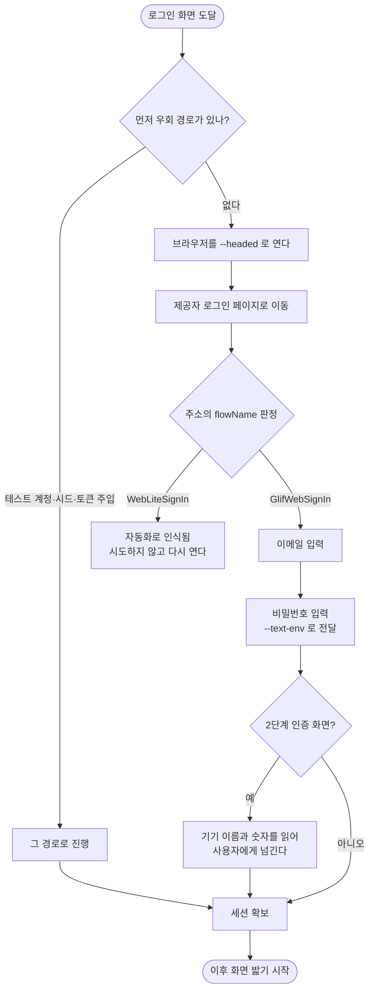

# 소셜 로그인 처리 절차 추가

## 개요

QA 스킬이 **로그인 화면을 보자마자 사람에게 넘겨서 그 뒤 화면이 한 번도 검증되지 않던 문제**를 해결했다. 이제 이메일·비밀번호까지는 스킬이 직접 통과시키고, 2단계 인증에서만 멈춘다.

이슈는 통과 경로를 gstack `browse connect`의 anti-bot stealth 덕으로 추정했으나, **실측 결과 그것이 아니었다.** 같은 Chromium으로 같은 주소를 열어도 `--headed` 여부만으로 갈렸다. 따라서 외부 도구 없이 이 스킬의 `web` 명령만으로 구현했다.

## 기능 흐름



## 변경 사항

### 실행 수단

- `skills/pro-agent-test/scripts/e2e_cli.py`: `web` 명령에 `--text-env` 추가. 입력값을 환경변수에서 읽어 명령줄에 비밀번호가 남지 않게 한다. 실패 응답에서도 그 값을 `***`로 가린다.

### 문서

- `skills/pro-agent-test/SKILL.md`: Phase 4에 "소셜 로그인" 절 추가. 로그인 화면이 "사람이 해야 하는 지점" 표에 **없다**는 것을 명시했다 — 표만 보고 넘겨버리던 것이 문제의 출발점이었다.
- `skills/pro-agent-test/references/social-login.md` (신규): 우회 경로 우선순위, 판정 신호, 되지 않았던 방법들, 2FA 안내 형식, 비밀값 취급, 미확인 제공자 처리.

### 회귀 방지

- `skills/pro-agent-test/tests/test_e2e_cli.py`: 6개 추가. 판정 신호(`WebLiteSignIn`/`GlifWebSignIn`)가 문서에서 사라지지 않는지, `--text-env`가 없는 변수에 조용히 빈 값을 넣지 않는지, 미확인 제공자가 "미확인"으로 표시돼 있는지.

## 주요 구현 내용

### 시도하기 전에 판정한다

거부는 비밀번호 단계가 아니라 **이메일 단계**에서 일어나며, 주소가 그것을 미리 알려준다.

| 모드 | 도달한 flowName | 결과 |
| --- | --- | --- |
| 기본(headless) | `WebLiteSignIn` | `/signin/rejected` — 비밀번호를 묻지도 않는다 |
| `--headed` | `GlifWebSignIn` | 정상 진행 |

실측(2026-09-18, projectops): 같은 Chromium·같은 주소·`--headed`만 다르게 두 번 열어 확인했다.

### 문서로 "적지 마라"라고 쓰지 않고 수단을 만들었다

비밀번호를 `--text`에 적으면 세션 기록 파일에 평문으로 남는다. 규칙만 문서에 적으면 지켜지지 않으므로 대안을 함께 제공했다.

```bash
APP_PW="..." e2e_cli.py web type --selector 'input[type=password]' --text-env APP_PW
```

기록에는 변수 이름만 남는다. 셀렉터가 틀려 실패했을 때도 예외 문구에서 값이 새지 않는 것을 확인했다.

### 안 해본 것은 안 해봤다고 적었다

구글만 실측했다. 애플·카카오·네이버는 **미확인**으로 표시하고, 만났을 때 추측하지 말고 관측한 신호를 `note --scope platform`으로 남기라고 안내했다. 다음 사람이 그 기록에서 시작한다.

## 주의사항

- **화면이 없는 환경(CI·원격 SSH)에서는 이 경로를 쓸 수 없다.** `--headed`가 성립하지 않는다. 그때는 테스트 계정·개발용 우회 플래그·토큰 주입으로 돌아가야 하며, 문서의 우회 경로 우선순위가 그 순서다.
- `flowName` 신호는 **제공자가 언제든 바꿀 수 있다.** 값이 달라지면 문서의 표를 실측으로 갱신해야 한다. 테스트는 값이 문서에 존재하는지만 보장하지, 그 값이 여전히 유효한지는 보장하지 않는다.
- `web close`로 브라우저를 닫으면 세션도 사라진다. 로그인 후 연속 작업 중에는 열어 둔다.
- 계정 잠금 위험 때문에 **자동 재시도는 한 번까지**로 제한했다. 두 번째 실패는 사용자에게 넘긴다.
