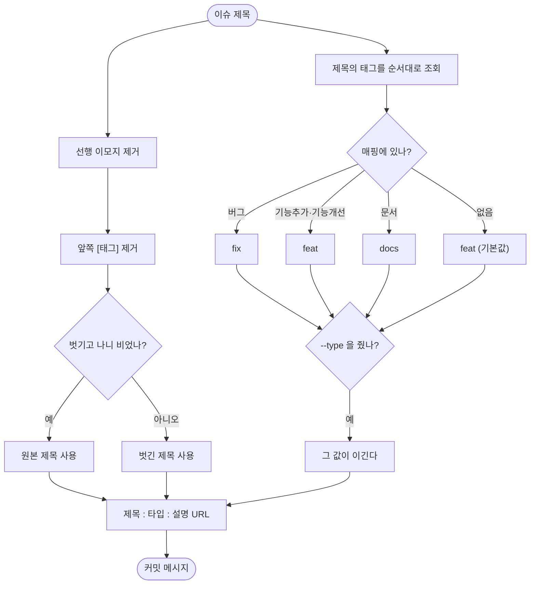

# 커밋 템플릿이 금지된 이모지·태그를 그대로 내보내고 타입도 feat로 박혀 있음

## 개요

커밋 메시지를 만들어 주는 `get_commit_template` 이 **이슈 제목을 그대로 붙이고 타입을 `feat` 로 박아** 두 가지 문제를 만들고 있었다. 저장소 규칙이 금지한 이모지·태그가 커밋에 들어가고, 버그 수정도 기능 추가로 기록돼 릴리스 버전이 실제보다 크게 올라갔다.

**두 번째 문제는 처음 진단이 틀렸다.** "타입을 고를 수 있게 하자"고 제안했는데, 확인해 보니 `issue_helper.py` 에 **이미 태그→타입 매핑이 있었다.** 없는 기능을 만들 일이 아니라, 있는 판정을 스킬 쪽이 쓰지 않는 것이 문제였다.

## 기능 흐름



## 변경 사항

### 정본

- `scripts/common/gh_branch.py`
  - `strip_issue_decorations()` — 선행 이모지와 **앞쪽** `[태그]` 를 벗긴다
  - `infer_commit_type()` — 제목 태그로 커밋 타입을 정한다
  - `COMMIT_TYPE_MAP` — 워크플로 정본과 같은 값
  - `get_commit_template()` — 위 둘을 쓰고, `commit_type` 인자로 덮어쓸 수 있다

### CLI

- `skills/pro-commit/scripts/commit_cli.py` · `skills/pro-github/scripts/github_cli.py`
  - `get-commit-template --type fix` 추가. 생략하면 제목 태그에서 유도한다

### 회귀 방지

- `skills/pro-commit/tests/test_commit_template.py` (신규) — 20개

## 주요 구현 내용

### 이모지·태그는 도구가 벗긴다

규칙을 문서에만 적어 두면 agent 가 매번 손으로 지워야 하고, 빠뜨리면 그대로 나간다. 실제로 이 작업 직전 커밋 두 건을 손으로 지웠다.

```
전:  ⚙️[기능추가][pro-agent-test] 소셜 로그인 절차 : feat : ...
후:  소셜 로그인 절차 : feat : ...
```

**제목 중간의 대괄호는 건드리지 않는다.** `.env[테스트] 처리가 안 됨` 같은 제목이 깨지면 안 된다. 다 벗겨서 빈 문자열이 되는 경우엔 원본을 그대로 쓴다 — 제목이 통째로 사라지는 것이 더 나쁘다.

### 타입은 이미 있던 판정을 가져다 쓴다

`issue_helper.py` 의 `DEFAULT_COMMIT_TYPE_MAP` 이 정본이다. 워크플로가 이슈에 다는 댓글은 이 매핑으로 타입을 정해 안내하는데, **스킬만 그것을 무시하고 `feat` 를 박고 있었다.**

```
❗[버그][워크플로] 빌드가 실패함
  이슈 댓글(워크플로) →  fix     ← 맞다
  스킬(커밋 생성)     →  feat    ← 틀렸다
```

`semver_auto` 가 켜진 저장소에서는 이 값이 릴리스 승격 폭을 정한다. 버그 수정이 `feat` 로 기록되면 patch 로 끝날 릴리스가 minor 가 된다.

### 두 곳이 갈라지지 않게 테스트가 잡는다

배포 경로가 달라(`.github/scripts/` 는 워크플로용, `scripts/common/` 은 스킬용) import 할 수 없어 값을 복제했다. 복제는 반드시 갈라지므로, 정본 파일을 읽어 매핑이 일치하는지 검사하는 테스트를 붙였다. 어긋나면 **이슈 댓글이 안내한 타입과 스킬이 만드는 타입이 달라지고, 사용자는 둘 중 무엇이 맞는지 알 방법이 없다.**

## 주의사항

- **`--type` 은 탈출구지 기본 경로가 아니다.** 이슈 태그가 성격을 이미 말해 주므로 대개 필요 없다. 이슈는 기능인데 실제 작업이 버그 수정인 경우처럼 태그와 내용이 다를 때만 쓴다.
- 매핑에 없는 태그는 `feat` 로 떨어진다. 새 이슈 템플릿 태그를 만들면 **정본(`issue_helper.py`)에 먼저 넣어야** 한다 — 테스트가 복제본을 따라오게 강제한다.
- 이모지 제거는 **제목 앞부분만** 본다. 본문 중간의 이모지는 그대로 남는다 (제목 내용일 수 있다).
