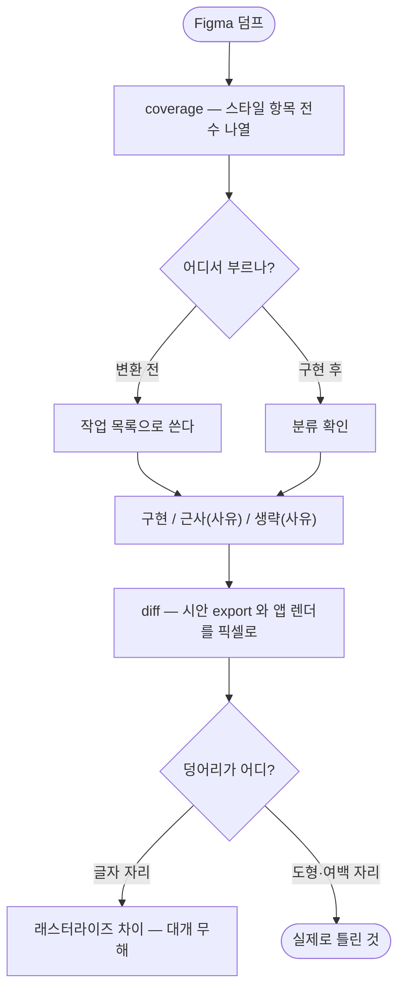

# Figma MCP로 만든 화면이 시안과 같은지 아무도 세지 않는다 — 대조 단계가 없다

## 개요

시안대로 화면을 만들어도 **그 화면이 시안과 같은지 확인하는 단계가 어디에도 없었다.** 덤프는 `fills`·`strokes`·`effects`·`layout` 을 전부 주는데 그중 일부만 옮겨도 아무도 세지 않았다.

세는 일을 하는 `pro-figma-verify` 를 만들었다. 그리고 **검토 중에 이 이슈의 범위가 절반이라는 것을 발견해** 변환 단계에도 같은 세기를 물렸다.

## 검토에서 드러난 것 — 대조만으로는 부족하다

사용자가 *"figma MCP만 줘도 정말 그대로 잘 만들어주냐"* 고 물어 변환 스킬을 직접 열어 봤다.

```
pro-figma/SKILL.md 106줄 전체에서
  MCP · get_figma_data · 덤프 · effects · fills · strokes  →  0건
```

다루는 것은 **Width/Height · Padding/Margin · Font Size · Border Radius** 넷뿐이었다. 체크리스트 6줄도 전부 반응형 단위 얘기였고 *"시안 값이 다 왔는가"* 는 한 줄도 없었다.

**즉 Figma MCP 를 줘도 "effects 네 줄을 다 옮겨라"라고 말해주는 곳이 없었다.** 세 줄이 사라진 것은 우연이 아니다. 대조는 사후 확인이고 빠뜨림은 변환 단계에서 일어난다.

## 기능 흐름



## 변경 사항

### 새 스킬 — `pro-figma-verify`

| 파일 | 내용 |
|---|---|
| `SKILL.md` (162줄) | Phase 0~4 + 자주 묻는 함정 |
| `scripts/figma_verify_cli.py` (320줄) | `coverage` · `diff` 두 서브커맨드 |
| `references/rendering.md` | 렌더를 시안과 같게 맞추기 (논리 크기·안전영역·배율·내용) |
| `references/framework-gaps.md` | 시안이 그대로 안 옮겨지는 자리 |
| `tests/test_figma_verify_cli.py` (195줄) | 12건 |

**`coverage`** — 덤프를 재귀로 훑어 스타일 항목을 나열한다. 핵심은 **배열을 원소마다 한 줄로 쪼개는 것**이다. 통째로 한 줄이면 네 줄짜리 효과에서 한 줄이 빠져도 티가 안 난다.

**`diff`** — 시안 export 와 앱 렌더를 픽셀로 맞대 어긋난 자리를 덩어리(좌표·크기·평균차)로 뽑고 차이를 칠한 그림을 남긴다.

### 변환 단계에도 같은 세기를 물렸다

- `pro-figma/SKILL.md` — "덤프가 있으면 먼저 센다" 절 신설. `coverage` 결과가 **작업 목록**이 된다. 체크리스트에 "시안 값이 다 왔는가" 4줄 추가. 근사·생략은 **코드 주석에 사유**를 남기게 했다.

### 참조 경로 검사를 넓혔다

- `scripts/tests/test_skill_docs.py` — 스킬 **간** 참조(`../<다른 스킬>/references/x.md`)도 보게 했다. 꼬리만 잡으면 앞 경로가 날아가 자기 폴더로 해석되어 깨진 참조를 놓친다. 검사 대상 78 → 88건.

## 주요 구현 내용

**py 는 세고 그릴 뿐, 판단은 에이전트가 한다.** 스킬의 기존 원칙 그대로다.

**남의 프로젝트 값을 지웠다.** 참고 구현에는 합성 배경색이 `#F7F2EF` 로 박혀 있었다. 남의 저장소에서 틀리므로 **시안 모서리에서 읽도록** 바꾸고 `--bg` 로 덮어쓸 수 있게 했다. 특정 프로젝트 이름은 0건이다.

**스타일을 하나도 못 찾으면 실패한다.** 0건으로 조용히 통과하면 대조를 안 한 것과 구분되지 않는다.

### 실측

이슈의 사고를 그대로 재현한 데이터로 돌렸다.

```
$ figma_verify_cli.py coverage --dump {덤프}
분류해야 할 스타일 항목 8개  effects 4 · fills 1 · layout 2 · text 1
  effects  {노드}/effects[0]   DROP_SHADOW  blur=20
  effects  {노드}/effects[1]   INNER_SHADOW blur=24     ← 빠졌던 세 줄이
  effects  {노드}/effects[2]   INNER_SHADOW blur=32     ← 각각 한 줄로
  effects  {노드}/effects[3]   INNER_SHADOW blur=10     ← 드러난다
```

`diff` 는 안쪽 테두리가 빠진 구현을 잡아 덩어리 좌표로 짚었고(다른 픽셀 20.12%), 차이 그림이 정확히 그 자리를 칠했다.

## 주의사항

**테스트가 실제로 잡는지 증명했다.** 배열을 통째로 한 줄로 세게 만들었더니 *"효과가 1줄로 세어졌다 — 네 줄이어야 한다"* 로 실패했고 원복 후 통과했다.

**Pillow·numpy 를 CI 설치 목록에 넣었다.** 없으면 그 테스트가 건너뛰어지는데, 건너뛴 것은 "안 돌아간 것"과 구분되지 않는다.

**아직 진짜 Figma MCP 응답으로 돌려본 적이 없다.** 합성 덤프로만 검증했다. MCP 가 어떤 모양의 JSON 을 주는지 확인하지 못해 파서를 방어적으로 짰다 — 키 이름을 고정하지 않고 재귀로 훑고, `effects`/`boxShadow`/`shadow` 같은 별칭을 함께 보고, 못 찾으면 실패한다. **대비일 뿐 검증은 아니다.** 실제 링크로 한 번 돌려 봐야 한다.

**밟는 쪽 훅은 다른 세션이 함께 작업했다.** `pro-agent-test` 의 시안 축(축 7)과 훅 문구는 병행 세션이 커밋했고(`c2e7f37`), 이 작업과 충돌 없이 합쳐졌다.
