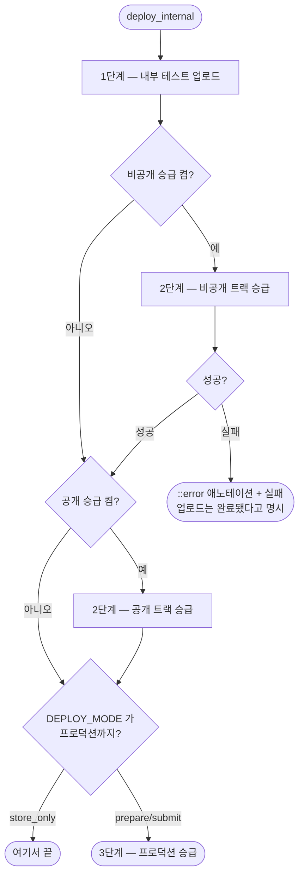

# Play 배포 템플릿에 비공개·공개 테스트 트랙이 없어 개인 계정은 프로덕션까지 갈 수 없다

## 개요

Play 배포 템플릿이 `internal` 과 `production` **두 트랙만** 다뤄, 비공개·공개 테스트를 거치는 경로가 아예 없었다. 해당 조건의 개인 계정은 이 템플릿으로 배포를 다 돌려도 **프로덕션에 갈 수가 없다.**

트랙 승급을 배포 모드와 **독립된 스위치**로 분리하고, 상황별 설정표를 템플릿과 문서에 넣었다. 그리고 **검토 중에 이슈가 놓친 더 위험한 것**을 발견해 함께 고쳤다.

## 🔴 이슈가 놓친 것 — 기본값이 반대였다

```
Fastfile   : ENV["DEPLOY_MODE"] || "store_submit"   ← 프로덕션 심사 자동 등록
워크플로우 : ...                    || 'store_only'  ← 내부 테스트까지만
```

워크플로를 거치지 않고 `fastlane deploy_internal` 을 직접 부르면 **프로덕션 심사에 자동 등록**됐다. iOS 쪽은 `testflight_only` 로 안전했고 **Android 만** 그랬다.

[#601](https://github.com/Cassiiopeia/projectops/issues/601) 이 정확히 이 패턴을 경고한다 — *"기본값에 기대고 있으면 Fastfile 기본값이 바뀌는 순간 테스트 빌드가 앱 심사에 올라간다. 되돌릴 수 없는 종류의 사고다."*

## 기능 흐름



**중간 트랙 승급은 `store_only` 여도 돈다.** 프로덕션과 독립이기 때문이고, 개인 계정이 조건을 채우려면 비공개 테스트를 계속 돌려야 하기 때문이다.

## 변경 사항

### Fastfile 템플릿 (145 → 249줄)

| 무엇 | 내용 |
|---|---|
| **안전 기본값** | `store_submit` → **`store_only`**. 워크플로 기본값과 일치 |
| **트랙 스위치** | `PROMOTE_TO_CLOSED_TESTING` · `PROMOTE_TO_OPEN_TESTING` (기본 `false`) |
| **트랙 이름** | `CLOSED_TESTING_TRACK`(기본 `alpha`) · `OPEN_TESTING_TRACK`(기본 `beta`) — **값으로 둔다** |
| **새 lane 2개** | `promote_internal_to_closed_testing` · `promote_internal_to_open_testing` |
| **공통 private_lane** | `promote_internal_to` — `skip_` 플래그 열 줄이 트랙마다 갈라지지 않게 |
| **상황별 설정표 · 트랙 특성표** | 파일 상단 주석 |

### 워크플로우

수동 실행 입력 2개 + 최상위 `env` 4개 + fastlane 스텝 전달. 우선순위는 **수동 입력 > 레포 변수 > 안전 기본값**.

### 문서

- `FLUTTER-CICD-OVERVIEW.md` — **iOS/Android 대응표**(같은 `DEPLOY_MODE` 가 플랫폼마다 다른 지점까지 간다) + 트랙 특성표 + 스위치 표
- `FLUTTER-PLAYSTORE-WIZARD.md` — 사전 요구사항에 개인 계정 안내
- 마법사 완료 화면에도 스위치와 주의를 출력

### 회귀 방지 — 4건

| 검사 | 막는 것 |
|---|---|
| Fastfile 기본값이 심사·출시로 가지 않는가 | 워크플로 없이 lane 을 직접 불러 프로덕션에 올라가는 것 |
| Fastfile ↔ 워크플로 기본값이 어긋나지 않는가 | 어느 쪽을 보고 판단해도 틀리게 되는 것 |
| 스위치가 워크플로에서 Fastfile 까지 닿는가 | 스위치를 켜도 영영 승급 안 되는 것 |
| 트랙 이름을 박지 않았는가 | 임의 이름 트랙을 쓰는 저장소에서 조용히 안 올라가는 것 |

## 주요 구현 내용

**실패를 `puts` 로 삼키지 않았다 — 이슈 제안과 다르게 갔다.**

이슈는 `rescue` 로 잡고 경고만 찍자고 했다. 그런데 **초록불 안의 `puts` 는 아무도 읽지 않는다.** 이 저장소는 최근에만 같은 모양을 세 번 겪었다 — [#612](https://github.com/Cassiiopeia/projectops/issues/612)(CI 가 테스트 폴더를 통째로 건너뜀) · [#545](https://github.com/Cassiiopeia/projectops/issues/545)(태그가 `v` 로 만들어지고 성공 보고) · 로컬 자격증명에 의존하던 테스트. 전부 **실패가 아니라 실행되지 않은 것**이었다. 바로 옆 줄의 `rescue_changes_not_sent_for_review: false` 주석이 *"거짓 성공 차단"* 이라고 못 박고 있는데 그 옆에 삼키는 `rescue` 를 넣는 것은 방향이 반대다.

**대신 실패로 두되 메시지를 정확하게 했다.** 스위치는 opt-in 이라 켠 사람은 그 승급을 원한 것이다.

```
::error title=비공개 테스트(alpha) 트랙 승급 실패::
  비공개 테스트(alpha) 트랙 승급 실패 — 내부 테스트 업로드는 정상 완료되었습니다.
  사유: ...
  확인할 것: (1) 서비스 계정 트랙 권한 (2) 트랙 존재 여부 (3) 버전 코드 중복
```

*"멀쩡히 배포된 빌드가 실패로 보인다"* 는 걱정은 **메시지로 푸는 것이지 숨겨서 푸는 것이 아니다.** GitHub Actions 일 때만 애노테이션을 붙여 실행 목록에 뜨게 하고, 로컬에서는 그냥 찍는다.

**트랙 이름을 박지 않았다.** Play 의 기본 비공개 트랙이 `alpha` 인 것은 맞지만 콘솔에서 **임의 이름**의 비공개 트랙을 만들 수 있다. 박아두면 그런 저장소에서 조용히 안 올라간다.

**구글 정책 조건에 단서를 달았다.** 12명·14일은 **2023-11-13 이후에 만든 개인 계정**에 적용된다. "개인 계정"이라고만 쓰면 그 이전 계정 사용자가 혼란스럽다 — 남의 저장소에 나가는 문서라 필요한 단서다.

## 주의사항

**테스트가 실제로 잡는지 증명했다.** 기본값을 `store_submit` 으로 되돌리니 *"Fastfile 기본값이 심사·출시로 이어진다"* 로 실패했고, 트랙 이름을 박으니 그것도 잡혔다. 둘 다 원복 후 통과.

**기본값을 바꾼 것은 동작 변경이다.** 환경변수 없이 lane 을 직접 부르던 사람은 이제 내부 테스트에서 멈춘다. 의도한 변경이고 워크플로 기본값과 일치하는 쪽이지만, 릴리스 노트에 드러나야 한다.

**`ruby -c` 로 문법을 확인했다.** fastlane 실행은 하지 못했다 — 실제 Play 자격증명과 앱이 필요하다. lane 정의·호출 정합성은 [#601](https://github.com/Cassiiopeia/projectops/issues/601) 의 전수 검사가 지킨다.

**이 워크플로우는 `project-types/flutter/` 단일본이다.** 공통 워크플로우의 두 벌 동기화 규칙은 적용되지 않는다 (확인 완료).
