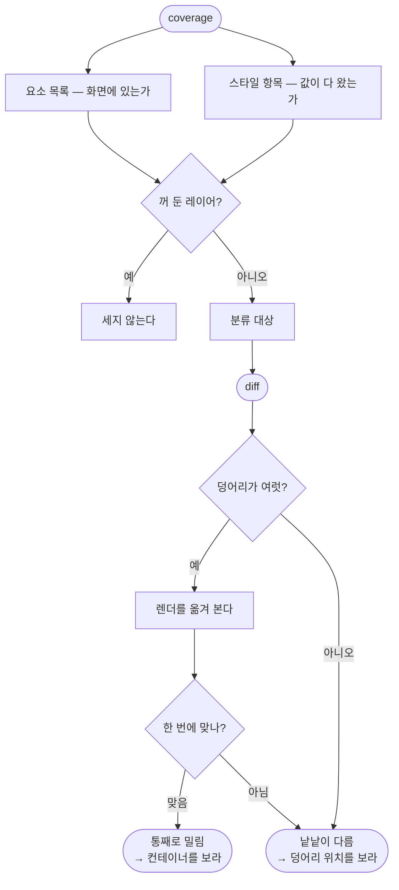

# 시안 대조가 '통째로 밀림'을 못 가려 덩어리 수를 결함 수로 읽게 된다

## 개요

시안 대조 스킬을 만든 뒤, **실제로 시안 대조를 많이 한 프로젝트의 이슈 183건**을 훑었다. 그중 **112건이 시안·디자인 관련**이었다. 스킬이 못 잡거나 오히려 오해를 만드는 자리를 찾는 것이 목적이었다.

**네 가지가 나왔고 둘은 코드, 둘은 문서로 고쳤다.** 나머지 반복 함정 여섯 가지도 문서에 올렸다.

## 기능 흐름



## 고친 것 — 코드

### 1. 통째로 밀림을 스스로 가린다

실사고 기록: 시트 윗변이 **35px 아래**에 뜨자 안의 단계·보상·버튼이 **전부 두 겹**으로 보였다.

> *"윗변이 밀리면 안의 모든 줄이 함께 밀립니다 — 낱낱이 어긋난 것이 아니라 통째로 내려앉은 것입니다."*

`diff` 는 덩어리를 열 개 내놓는다. 그걸 보면 "열 군데가 어긋났다"로 읽혀 **엉뚱한 데를 고친다.** 실제로 틀린 것은 컨테이너 높이 하나였다.

렌더를 조금씩 옮겨 보고 **한 번에 맞아떨어지는 자리**가 있는지 본다. 세로를 먼저 본다 — 화면은 세로로 쌓이므로 밀림도 대개 세로다.

```json
{"shift_probe": {"dy": -35, "dx": 0, "before": 31.88, "after": 0.0,
                 "looks_shifted": true}}
```

절반 아래로 떨어질 때만 밀림으로 친다. 조금 나아지는 정도는 안티에일리어싱으로도 생기므로 신호로 치지 않는다.

### 2. 요소 목록을 함께 낸다 — 스타일만 세면 안 보이는 것이 있다

*"시안에 있는데 화면이 없다"* 가 여러 건 있었다. 그건 스타일 문제가 아니라 **요소가 아예 없는 것**이라 스타일 항목만 나열해서는 드러나지 않는다.

이제 두 층으로 낸다.

| 층 | 묻는 것 |
|---|---|
| `elements` | 이것이 화면에 **있는가** |
| `items` | 그 요소의 값이 **다 왔는가** |

### 3. 꺼 둔 레이어를 세지 않는다

> *"덤프에는 화면에 안 그려지는 레이어도 섞여 나온다."*

실측으로 항목이 **두 배**가 됐다 (4개 → 8개). "분류할 항목 40개"가 뜨면 사람이 보다 지쳐 포기하고, 그러면 세는 의미가 없다. 부모가 꺼져 있으면 자식까지 통째로 건너뛴다.

**모르는 표기를 만나면 보이는 것으로 친다** — 잘못 걸러 빠뜨리는 쪽이 한 줄 더 세는 것보다 나쁘다.

## 고친 것 — 문서

| 올린 것 | 실제로 있었던 일 |
|---|---|
| **공통 컴포넌트를 화면보다 먼저** | 아이콘 하나의 칠 값이 틀려 **다섯 화면이 동시에** 어긋났다. 화면별로 보고했다면 결함 다섯 건이지만 고칠 곳은 파일 하나였다 |
| **에셋도 분류 대상** | 모양은 같은데 **칠 값만** 달랐다. 아이콘 17개 중 2개가 토큰에 없는 값을 썼고, **같은 역할의 다른 아이콘과 나란히 놓았을 때** 비로소 보였다 |
| **상태를 다 세었는가** | 시안은 한 컴포넌트를 `enable`/`disable`·비어 있을 때/채웠을 때로 그려 두는데 구현자는 기본 상태 하나만 본다. 어떤 체크 컴포넌트를 한 화면에서만 고치고 다른 화면은 그대로 둔 일이 있었다 |
| **시안은 한 가지 내용으로만 그려져 있다** | 시안 문구 길이에 맞춰 만들면 긴 문구에서 깨진다 — 설명이 두 줄이 되면 카드 아래가 잘리고, 버튼이 키보드에 가려졌다 |
| **골든은 기준이 아니다** | *"첫 이미지가 시안과 다르면 **틀린 것을 그대로 고정**하고, 이후에는 그 틀린 그림에서 벗어나는 것만 잡아낸다. 회귀는 막지만 정합은 못 본다."* |
| **무엇과 맞댔는지 남긴다** | 화면별로 시안 노드 id 를 남기지 않으면 다음 사람이 어느 시안과 비교할지 몰라 처음부터 찾는다 |

## 주요 구현 내용

**조사 대상 프로젝트 이름·노드 id 는 한 글자도 넣지 않았다.** 스킬은 남의 저장소에 설치되므로 **어떤 종류의 실수인지**만 남긴다. 전수 검사로 0건을 확인했다.

**밀림 탐색은 세로 먼저, 그다음 가로다.** 두 축을 동시에 훑으면 계산이 제곱으로 늘어난다. 화면은 세로로 쌓이므로 세로를 먼저 맞추고 그 자리에서 가로를 본다.

### 실측

실사고를 그대로 재현해 확인했다.

```
6개 덩어리 · 다른 픽셀 31.88%
  → dy=-35 로 옮기면 0.0%  ·  looks_shifted=true
  → "통째로 밀린 것입니다 — 컨테이너를 먼저 보세요"

한 줄만 진짜 다른 경우
  → looks_shifted=false  ·  평소 안내 그대로
```

## 주의사항

**추가한 검사를 전부 깨뜨려 확인했다.** 밀림 판정을 끄니 실패, 꺼 둔 레이어 필터를 끄니 항목이 4개에서 8개로 늘어 실패, 요소 수집을 끄니 실패. 각각 원복 후 통과.

**밀림 탐색 범위는 기본 ±40px 이다.** 그보다 크게 밀린 경우는 못 잡는다 — `--probe-shift` 로 넓힐 수 있고 `0` 으로 끌 수 있다. 범위를 무작정 넓히면 우연히 맞아떨어지는 자리를 찾아 **밀림이 아닌 것을 밀림이라 할** 위험이 있어 기본값을 보수적으로 뒀다.

**여전히 진짜 Figma MCP 응답으로는 못 돌려봤다.** 합성 덤프로만 검증했다. 꺼 둔 레이어 표기(`visible`·`opacity`·`isVisible`·`hidden`)도 도구마다 다를 수 있어 **모르는 표기는 보이는 것으로 치도록** 했지만, 그건 대비지 검증이 아니다.
