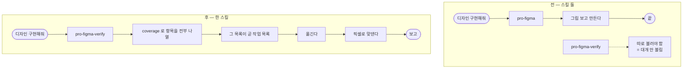

# Figma 스킬이 옮기는 쪽과 세는 쪽으로 나뉘어 있어 한쪽만 부르게 된다

## 개요

Figma 관련 스킬이 둘이었다. `pro-figma`(시안을 코드로 **옮긴다**)와 `pro-figma-verify`(옮긴 것이 시안과 같은지 **센다**). 사용자는 보통 "이 디자인 구현해줘" 라고만 하고, 그러면 옮기는 쪽만 불린다.

문제는 **옮기는 쪽이 무엇을 옮겨야 하는지 몰랐다는 것**이다. `pro-figma` 에는 `effects`·`fills`·`strokes` 라는 말이 한 번도 나오지 않았다. 그림을 보고 만드는 수준이었고, 작고 은은한 효과는 애초에 목록에 오르지 않았다. 세는 쪽은 잘 만들어 두었지만 **사후에 따로 불러야** 했으므로 대개 안 불렸다.

그래서 둘을 하나로 합쳤다. **빠뜨림은 옮길 때 생기고, 대조는 사후 확인일 뿐이다.**

## 기능 흐름



## 변경 사항

### 스킬 병합

- `skills/pro-figma/SKILL.md` — **삭제** (142줄). 내용은 아래로 흡수했다.
- `skills/pro-figma-verify/SKILL.md` — Phase 구조를 "세기 → 옮기기 → 대조" 한 줄기로 다시 짰다. description 에 옮기는 쪽 트리거(`figma 디자인 구현해줘`·`시안대로 만들어줘`·`figma 코드로 바꿔줘`)를 더했다.
- `skills/pro-figma-verify/references/conversion.md` — 신규 65줄. 구 `pro-figma` 의 단위 환산·토큰 재사용 내용을 옮겨 왔다.

### 지운 스킬이 남는 문제 (함께 고침)

소스에서 스킬을 지워도 **이미 설치된 `~/.cursor/skills/` 에는 영영 남는다.** 복사가 overlay 라서 없어진 것을 지우지 않았다.

- `src/core/ide/adapters/cursor.js` — 설치본에서 **소스에 없는 스킬을 정리**하도록 고쳤다. 다만 우리가 깐 것(`pro-`·`suh-` 접두사)만 건드린다 — 사용자가 직접 만든 스킬은 손대지 않는다.

```js
const srcNames = new Set(readdirSync(src));
for (const name of readdirSync(dest)) {
  if (srcNames.has(name) || name === "cursor-skills-meta.json") continue;
  if (!/^(pro|suh)-/.test(name)) continue;     // 남의 것은 두고 간다
  rmSync(join(dest, name), { recursive: true, force: true });
}
```

### 문서

- `CLAUDE.md` · `README.md` · `docs/SKILLS.md` 의 스킬 목록에서 `figma` 를 지우고 `figma-verify` 설명을 "시안 → 코드 → 대조 한 묶음" 으로 고쳤다.

## 주요 구현 내용

합친 뒤 Phase 는 이렇게 된다.

| Phase | 하는 일 |
|---|---|
| 0 | 무엇을 다룰지 정한다 (공통 컴포넌트 먼저) |
| 1 | `coverage` 로 **빠짐없이 나열**해 분류한다 |
| 2 | 옮긴다 — **분류표가 곧 작업 목록** |
| 3 | 픽셀로 맞댄다 |
| 4 | 컴포넌트를 배율 올려 따로 본다 |
| 5 | 보고 |

핵심은 **2번이 1번 없이 시작될 수 없게** 한 것이다. 예전에는 2번만 있는 스킬이 따로 있었다.

## 테스트

- `test/ide.test.js` — "소스에서 지운 스킬은 설치본에서도 사라진다" · "사용자가 만든 스킬은 건드리지 않는다" 추가.
- `test/rename-consistency.test.js` — 스킬 목록 대조 대상에서 `figma` 제거.
- `scripts/tests/test_skill_docs.py` — 지워진 스킬을 가리키는 참조가 남아 있는지 검사(고아 참조). 실제로 `conversion.md` 가 `references/framework-gaps.md` 를 **제 폴더 기준이 아닌 경로**로 가리키고 있었고 이 테스트가 잡았다.

검증: pytest·node 전체 통과, CI success.

## 주의사항

- **`~/.cursor/skills/` 정리는 접두사로 범위를 좁혔다.** 소스에 없는 것을 전부 지우면 사용자가 직접 만든 스킬이 날아간다. `pro-`·`suh-` 만 우리 것으로 본다.
- 합치면서 `pro-figma` 를 지웠으므로, **그 이름으로 부르던 사용자는 이제 `pro-figma-verify` 를 부른다.** description 에 옛 트리거 문구를 전부 넣어 두어 자동 매칭은 유지된다.
- 이 병합이 후속 작업의 출발점이 됐다 — 합친 뒤 실제 Figma MCP 응답으로 돌려 보니 **덤프를 아예 못 읽는 것부터 에셋을 통째로 안 다루는 것까지** 줄줄이 드러났다 (#621).
