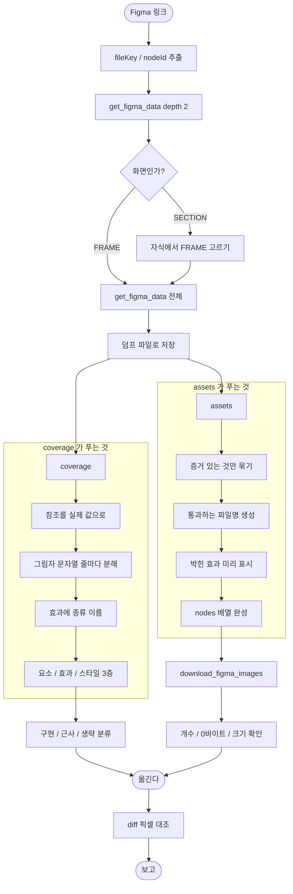

# Figma MCP 허점을 몰라 에셋과 효과가 조용히 빠진다

## 개요

`pro-figma-verify` 는 시안 값을 "빠짐없이 세는" 것이 존재 이유인데, 정작 **Figma MCP 응답이 실제로 어떻게 생겼는지를 모르는 채로** 세고 있었다. 실제 파일(노드 2,617개)과 화면 하나(`로그인_iOS`)를 링크에서 다운로드까지 끝까지 밟아 확인한 결과, 값의 일부와 **에셋 전체**가 도구를 그대로 통과하고 있었다.

핵심은 하나다. **MCP 는 값을 주는 대신 여러 군데서 조용히 모자라고, 모자란다는 표시를 하지 않는다.** 도구가 그 자리를 알고 메우도록 고쳤고, 알아낸 것을 전부 문서로 남겼다.

## 기능 흐름



## 변경 사항

### 도구

- `skills/pro-figma-verify/scripts/figma_verify_cli.py`
  - `_split_shadows` — 괄호 깊이를 세어 쉼표로 이어진 그림자를 줄마다 쪼갠다. `rgba(...)` 안의 쉼표는 건드리지 않는다.
  - `_effect_kind` — 그림자 / 안쪽 그림자 / 글로우 / 블러 / 배경 블러로 이름 붙인다.
  - `coverage` — `effects` 를 따로 꺼내고 `effect_counts` 를 낸다. `asset_count` 도 함께.
  - `assets` (신규 서브커맨드) — 내려받을 목록과 `download_figma_images` 에 그대로 넣을 `nodes[]` 를 만든다.
  - `_download_plan` — `componentId` 가 같으면 확실, 노드 내용이 같으면 추정, 이름만 같으면 안 묶는다.
  - `_slug` — `^[a-zA-Z0-9_.-]+\.(png|svg)$` 를 통과하는 이름을 만들고, 겹치면 번호를 붙이고, 뜻을 잃었으면 `rename_me` 로 표시한다.
  - `_image_ref` — 칠 참조를 풀어 `imageRef` 를 찾고, 덤프가 알려주는 `imageDownloadArguments` 를 그대로 쓴다.
  - `baked_effect` — 효과가 붙은 에셋을 미리 짚는다.

### 문서

- `skills/pro-figma-verify/references/mcp.md` (신규 251줄) — 두 MCP 도구의 인자 계약과 허점 15가지. 모든 수치가 실측이다.
- `skills/pro-figma-verify/SKILL.md` — MCP 호출 두 단계(`depth 2` 로 화면 목록 → 화면 하나), 에셋 Phase 신설, 효과를 먼저 따로 보는 절, 함정 표 8줄 추가.
- `skills/pro-figma-verify/references/rendering.md` — React(Playwright), React Native(시뮬레이터, `captureRef`) 절을 채웠다. 비어 있던 자리다.
- `skills/pro-figma-verify/references/framework-gaps.md` — React(CSS)와 React Native 절을 채웠다.

## 주요 구현 내용

### 1. 한 문자열에 뭉쳐 오는 그림자

실제 값은 이렇게 온다.

```
boxShadow: '0px 4px 20px 0px rgba(204,188,246,1),
            inset 0px 8px 24px -16px rgba(255,255,255,0.24),
            inset 0px -24px 32px 0px rgba(255,255,255,0.24),
            inset 0px 0px 10px 2px rgba(255,255,255,1)'
```

**이것이 원래 사고의 그 값이다.** 네 줄 중 안쪽 세 줄이 빠진 채 배포됐다. 한 줄로 세면 세 줄이 빠져도 개수가 안 변해서, 그 사고를 막으려고 만든 도구가 같은 자리에서 또 못 잡고 있었다.

| | 고치기 전 | 고친 뒤 |
|---|---|---|
| 전체 파일 효과 항목 | 153 | **171** |
| `boxShadow` 정의 12개 | 12줄로 셈 | **16줄** |

### 2. 효과를 따로 꺼낸다

한 화면이 `layout 3,294 / fills 1,849 / effects 171` 이다. 효과는 3%인데 빠뜨리는 것은 거의 항상 이쪽이다. 작고 은은해서 빠져도 눈에 안 띈다. 그래서 `coverage` 가 효과를 독립된 층으로 내고 종류별 개수를 먼저 보여준다.

### 3. 아이콘은 덤프로 구분할 수 없다

에셋 노드에 있는 것은 이게 전부다.

```yaml
- id: I204:993;510:1641;1503:15321
  name: Wifi-path
  type: IMAGE-SVG
  layout: layout_CIJ1TC
  fills: fill_5PQ06X
```

**경로도 점도 모양도 없다.** Figma 가 벡터에 붙이는 기본 이름이 `Vector` 라서, 이름으로 묶으면 위험하다.

> 실측: `Vector` 71개 → 실제로 서로 다른 **48종**.

그래서 묶는 기준을 증거로 바꿨다. `componentId` 가 같으면 확실(`certain: true`), 노드 내용 전체가 같으면 추정, **이름만 같으면 묶지 않는다.** 결과적으로 `Vector` 가 정확히 48개로 나뉘었다.

### 4. 파일명과 중복

| 실측 | 순진하게 하면 |
|---|---|
| 에셋 609개 중 **281개(46%)** 가 한글·공백·`/` 이름 | `fileName` 패턴에 거부된다 |
| 609개 중 **592개**가 45종 이름에 몰림 (`Wifi-path` 144개) | 서로 덮어쓴다 |

도구가 통과하는 이름을 만들고 겹치면 번호를 붙인다. 한글이라 뜻을 잃은 것은 `rename_me` 로 표시해 사람이 다시 짓게 한다 — 자동 이름(`asset-976-4627.svg`)으로 두면 다음 사람이 못 알아본다.

### 5. 효과가 박혀 크게 온다

`layout` 36x34 인 글로우 도형을 실제로 받아 보니 **96x94** 였다. 번짐이 SVG 필터로 그림 안에 들어온다.

```svg
<svg width="96" height="94" viewBox="0 0 96 94">
  <g filter="url(#filter0_d_726_4744)">
    <path d="M48 64C38.05 64 30 56.39 ..." fill="#9AFFE9"/>
```

모르면 레이아웃 크기로 우겨 넣어 **도형이 쪼그라들거나**, 효과를 코드로 또 넣어 **두 번 적용**된다. `assets` 가 `baked_effect` 로 미리 짚는다.

## 실제 응답으로 밟은 검증

문서만 고치고 끝내지 않았다. 링크 하나로 시작해 다운로드까지 실제로 돌렸고, **그 과정에서 도구 버그 두 개가 더 나왔다.**

| 단계 | 결과 |
|---|---|
| 링크 → `get_figma_data(nodeId=238:1846)` | **1,083,214자** — 그 노드가 SECTION 이었다. 파일 전체와 다를 바 없음 |
| `depth: 2` 로 다시 | **12KB** — 화면 54개 목록이 한눈에 |
| 화면 하나(`238:1808`) | **15KB** — 분류 가능한 양 |
| `coverage --node 238:1808` | 요소 39 · 스타일 84 · 효과 4(그림자 3, **글로우 1**) · 참조 미해소 **0** |
| `assets --node 238:1808` | 에셋 13개, 이름 지어야 할 것 3개, **박힌 효과 1개** |
| `download_figma_images` (프로젝트 밖 경로) | `Directory traversal is not allowed` 로 거부 |
| 같은 호출 (프로젝트 안 경로) | **5개 전부 성공.** 생성된 `nodes[]` 를 손대지 않고 그대로 넘겼다 |
| 받은 파일 검사 | 0바이트 없음, `<path>` 있음, `vector-3.svg` 만 96x94 (도구가 예측한 그것) |

**실데이터가 잡아낸 내 버그 두 개**

1. `imageRef` 도 참조 뒤에 있었다 — 노드에는 `fills: fill_JJ816G` 만 있고 값은 globalVars 안이다. 내 `_image_ref` 는 문자열에서 정규식으로 찾고 있어서 **사진 에셋을 통째로 놓쳤다.** 지어낸 픽스처에는 값이 인라인으로 들어 있어 테스트가 통과하고 있었다.
2. 덤프가 `imageDownloadArguments` 로 필요한 인자를 알려주는데 무시하고 있었다.

둘 다 고치고 픽스처를 **실제 모양(참조 + `imageDownloadArguments`)으로 교체**했다.

## 테스트

신규 11개 포함 `pro-figma-verify` 34개. 전체 pytest 855 · node 402 통과.

**새 테스트는 전부 일부러 깨뜨려 확인했다.** 아래 고장이 각각 의도한 테스트를 실패시키는 것을 확인한 뒤 되돌렸다.

| 고장 | 잡힌 테스트 |
|---|---|
| 그림자를 안 쪼갠다 | 3개 |
| 괄호 무시하고 쉼표 분할 (`rgba` 파괴) | 4개 |
| 에셋을 이름으로만 묶는다 | 2개 |
| 레이어 이름을 파일명에 그대로 | 5개 |
| `layout` 참조를 안 푼다 | 1개 |
| 글로우를 그림자로 뭉뚱그린다 | 1개 |
| `imageRef` 를 안 넘긴다 | 1개 |
| 칠 참조를 안 푼다 | 1개 |
| 접두사로만 참조 판별 | 1개 |
| 덤프가 알려준 인자 무시 | 1개 |
| `baked_effect` 를 안 채운다 | 1개 |

## 주의사항

- **`depth` 는 화면 목록을 찾을 때만 쓴다.** 트리를 자르는데 잘렸다는 표시가 없어서, 얕게 받아 놓고 "요소가 몇 개뿐"이라고 결론 내면 그대로 틀린다. 분류용 호출에는 절대 주지 않는다.
- **`certain: false` 인 묶음은 추정이다.** 덤프에 모양 정보가 없어 더 강한 근거를 만들 방법이 현재로선 없다. 받은 뒤 눈으로 확인하는 단계를 스킬이 요구한다.
- **참조 해소는 접두사가 아니라 키 일치로 판별한다.** 실제로 `Label Color/Light/Primary` 처럼 사람이 붙인 이름이 섞여 온다. 나중에 "`fill_` 로 시작하는 것만 참조" 같은 최적화를 넣으면 조용히 깨진다 — 회귀 테스트가 막는다.
- **`rendering.md` 의 그 밖의 프레임워크 절은 여전히 비어 있다.** Vue·SwiftUI 등을 쓰게 되면 그때 채운다. 억지로 채우면 검증 안 된 내용이 들어간다.
- 이 작업으로 지어낸 픽스처의 위험이 두 번째로 드러났다. **새 파싱 로직을 넣을 때는 실제 응답 조각을 픽스처로 쓴다.**
