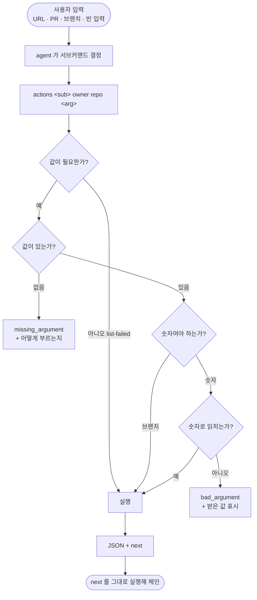

# 문서대로 부른 Actions 진단 3개가 인자를 못 받고 깨진다

## 개요

`pro-github` 의 Actions 진단 서브커맨드 다섯 개 중 **셋이 SKILL.md 에 적힌 그대로 불러도 깨졌다.** 원인은 argparse 파서에 선택 위치 인자를 **네 개 줄줄이** 둔 것이다. argparse 는 값을 왼쪽부터 채우므로 어떤 서브커맨드를 부르든 첫 값이 항상 `run_id` 로 들어갔다.

특히 `joblog` 는 `show-run` 이 `next` 로 가리키는 **바로 다음 단계**다. 즉 문서가 안내하는 진단 흐름(run 찾기 → 실패 job 확인 → 로그 읽기)이 마지막 칸에서 끊겨 있었고, **그 흐름을 끝까지 밟아 본 적이 없었다.**

## 기능 흐름



## 변경 사항

### 파서

- `skills/pro-github/scripts/github_cli.py` — `actions` 의 위치 인자 `run_id`·`job_id`·`pr_number`·`branch` **넷을 하나(`arg`)로** 합쳤다. 형제 CLI 인 `changelog_cli.py` 가 처음부터 쓰던 방식이다.

### 인자 해석

- `_actions_int()` 신설 — 숫자 변환을 파서가 아니라 **명령 안에서** 한다. 파서에 `type=int` 를 걸면 argparse 가 무엇이 잘못됐는지 못 알려준 채 죽는다.
- **안 준 것(`missing_argument`)과 잘못 준 것(`bad_argument`)을 가른다.** 둘은 다른 고침을 부른다 — 값을 빠뜨린 사람이 형식을 의심하며 헤매지 않도록.
- 두 경우 모두 `hint` 로 올바른 호출 형태를 준다.

### 문서

- SKILL.md 는 **고치지 않았다.** 적혀 있던 형태가 원래 옳았고, 구현이 그걸 못 받고 있었을 뿐이다.

## 주요 구현 내용

```python
p_ac.add_argument("arg", nargs="?",
                  help="서브커맨드에 따라 run_id · job_id · pr_number · branch")
```

```python
def _actions_int(args, name):
    raw = args.arg
    if raw is None:
        return None, emit({"code": "missing_argument", "error": f"{name} 필요",
                           "hint": f"actions {args.sub} {args.owner} {args.repo} <{name}>"})
    try:
        return int(raw), None
    except (TypeError, ValueError):
        return None, emit({"code": "bad_argument",
                           "error": f"{name} 는 숫자여야 합니다: {raw!r}", ...})
```

## 검증

고치기 전후를 같은 호출로 재었다.

| 호출 (SKILL.md 그대로) | 전 | 후 |
|---|---|---|
| `show-run ... 35700287900` | OK | OK |
| `joblog ... 106656419974` | **missing_argument** | OK |
| `list-failed ...` | OK | OK |
| `resolve-pr ... 1` | **missing_argument** | github_api_404 (PR 이 실제로 없음 — 해석은 정상) |
| `resolve-branch ... develop` | **bad_args** (`invalid int value: 'develop'`) | OK |

체인도 실제로 이어진다.

```
show-run 의 next: actions joblog Cassiiopeia projectops 106392221619
그대로 실행 → OK
  로그 첫 줄: ... ERROR_COMMENT="❌ 자동 병합 실패. 수동으로 병합해주세요."
```

## 테스트

`skills/pro-github/tests/test_github_cli.py` 에 5개 추가. **네트워크를 타지 않고 인자 해석만** 본다 — PAT 가 없어도 돈다.

고장 넷을 넣어 전부 잡히는 것을 확인했다.

| 고장 | 잡힌 테스트 |
|---|---|
| 위치 인자를 넷으로 되돌린다 (원래 버그) | 4개 |
| `arg` 에 `type=int` 를 건다 | 3개 |
| 값이 없어도 조용히 넘어간다 | 1개 |
| `hint` 를 뺀다 | 1개 |

> 처음 쓴 단언은 **세 번째 고장을 놓쳤다.** "에러가 났나"만 보아서, 값을 안 준 것과 잘못 준 것을 구분하지 못했다. 코드(`missing_argument` / `bad_argument`)와 `hint` 내용까지 보도록 조인 뒤에야 잡혔다.

## 주의사항

- **선택 위치 인자를 여러 개 줄줄이 두지 않는다.** 이번 버그의 형태다. CLAUDE.md 에 규칙으로 올렸다.
- `show-run` 과 `list-failed` 가 **우연히** 맞았던 것이 이 버그를 오래 숨겼다. 일부가 동작하면 전체가 동작한다고 착각하기 쉽다.
- 이 저장소에서 같은 종류가 반복된다 — 워크플로가 없는 fastlane lane 을 부르던 것(#601), 그리고 이번. **문서에 적힌 경로를 끝까지 밟아 보는 것** 외에 막을 방법이 없다.
