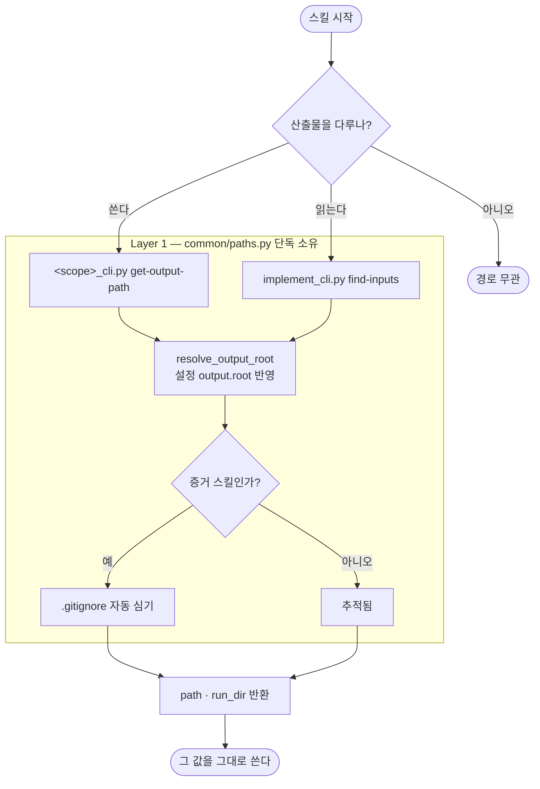

# 일부 스킬이 산출물 경로를 박아 써서 루트 설정을 무시한다

## 개요

산출물 경로 규칙은 `scripts/common/paths.py` 가 단독으로 갖고 있고(#525), 그 루트는 설정(`output.root`)으로 바꿀 수 있다. 그런데 **일부 스킬은 그 규칙을 거치지 않고 `docs/projectops/...` 를 SKILL.md 에 직접 박아 썼다.**

루트를 옮긴 팀에서는 **`pro-testcase` 가 엉뚱한 곳에 쓰고, `pro-implement` 는 빈 폴더를 스캔해 "계획 없음"으로 판단한다.** 둘 다 조용히 틀리고 틀렸다는 신호가 없다 — `implement` 쪽은 그대로 구현에 들어간다.

## 기능 흐름



## 변경 사항

### 신규 CLI

- `skills/pro-testcase/scripts/testcase_cli.py` — `get-output-path`. 쓰는 스킬인데 계산 수단이 없었다.
- `skills/pro-implement/scripts/implement_cli.py` — `find-inputs`. **이 스킬은 쓰지 않고 읽는다.** 그래서 경로 계산이 아니라 "plan · analyze 가 어디 있고 가장 최근 것이 무엇인가" 를 돌려준다.

### SKILL.md — 경로 조립 제거

| 스킬 | 고친 것 |
|---|---|
| `pro-testcase` | `{PROJECT_ROOT}/docs/projectops/testcase/...` 조립 + `mkdir -p` → CLI 호출 |
| `pro-implement` | `docs/projectops/plan/` · `analyze/` 스캔 → `find-inputs` |
| `pro-analyze` | 산출 위치 · plan 참조 · 스캔 대상 3곳 |
| `pro-plan` | 산출 위치 |
| `pro-report` | 완료 안내 2곳 |

> **뒤 셋은 내가 처음에 못 봤다.** CLI 를 이미 갖고 있어서 다 된 줄 알았는데, **회귀 테스트를 먼저 쓰자 그 자리에서 잡혔다.** 눈으로 훑는 것과 기계로 세는 것의 차이다.

### CLAUDE.md

- CLI 표에 `testcase` · `implement` · `figma-verify` · `agent-test` 를 올렸다.
- "산출물 경로를 SKILL.md 에 박아 쓰지 않는다" 규칙과 "선택 위치 인자를 줄줄이 두지 않는다"(#622) 규칙을 agent 필독으로 추가했다.

## 주요 구현 내용

`find-inputs` 는 파일명이 `날짜_번호_제목` 인 것을 이용해 **이름 역순 = 최신순**으로 고른다.

```json
{"output_root": "...",
 "inputs": {"plan":    {"dir": "...", "exists": true, "count": 1, "latest": "...", "recent": [...]},
            "analyze": {"dir": "...", "exists": true, "count": 1, "latest": "...", "recent": [...]}},
 "summary": "구현 전에 읽을 산출물: plan 1개 · analyze 1개",
 "next": "각 latest 를 Read 로 읽고 시작하세요 ..."}
```

산출물이 없으면 `next` 가 **"사용자에게 확인하거나 `/pro-plan` 을 먼저 돌리라"** 고 말한다. 예전처럼 빈 폴더를 보고 조용히 넘어가지 않는다.

## 검증

두 CLI 를 실제로 돌려 확인했다.

```
testcase get-output-path --title "로그인 QA"
  → .../docs/projectops/testcase/20260922_001_로그인_QA.md

implement find-inputs
  → plan 1개 · analyze 1개, 각 latest 경로 반환
```

## 테스트

`scripts/tests/test_output_tracking.py` 에 3개 추가 (총 11개).

| 테스트 | 막는 것 |
|---|---|
| `..._ask_a_cli_for_their_paths` | 경로를 CLI 에 안 묻는 스킬 |
| `..._do_not_write_the_default_root_into_docs` | SKILL.md 에 박힌 `docs/projectops/<스킬>/` |
| `..._path_command_actually_exists` | 문서가 부르는데 CLI 에 없는 서브커맨드 (#622 의 재발 방지) |

고장 셋을 넣어 확인했다.

| 고장 | 잡힘 |
|---|---|
| 호출 줄을 없앤다 | ✅ |
| 경로를 다시 박아 쓴다 | ✅ |
| 없는 서브커맨드를 문서가 부른다 | ✅ |

> 첫 판 테스트는 **첫 고장을 놓쳤다.** `get-output-path` 라는 **단어가 산문에 있기만 해도** 통과했다. `_cli.py <서브커맨드>` 형태의 **실제 호출 줄**을 요구하도록 바꾼 뒤에야 잡혔다.

## 주의사항

- **산문에서 우산 폴더(`docs/projectops/`)를 언급하는 것은 막지 않는다.** 스킬별 하위 경로를 조립해 적은 것만 막는다 — 설명까지 금지하면 문서가 읽기 어려워진다.
- `find-inputs` 가 보는 대상은 `_INPUT_SKILLS = ("plan", "analyze")` 한 곳에 있다. 구현 전에 읽어야 할 산출물이 늘면 거기에만 추가한다.
- **`pro-build` · `pro-skill-creator` 는 대상이 아니다.** 전자는 산출물이 없고, 후자는 `skills/<이름>/` 에 쓴다 — 문서 산출물이 아니다.
- `pro-design-analyze` · `pro-ppt` · `pro-refactor-analyze` · `pro-troubleshoot` 은 **SKILL.md 가 없다** (빈 `scripts/` 폴더만 로컬에 남아 있고 git 에는 없다). 테스트가 SKILL.md 있는 것만 보므로 대상에서 자연히 빠진다. 스킬로 되살리면 그때 걸린다.
