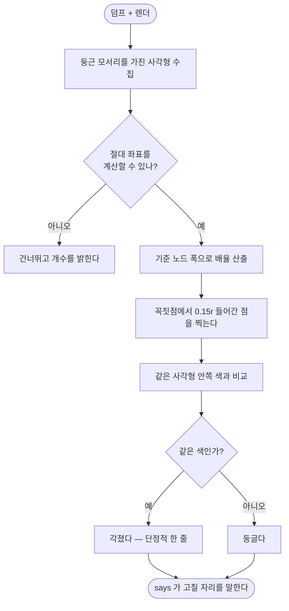

# 시안 정합을 픽셀 퍼센트가 아니라 속성으로 대조한다

## 개요

**픽셀 퍼센트는 어디가 다른지만 말하고 무엇이 어떻게 다른지를 말하지 않는다.** 이슈가 든 사례가 정확히 그랬다 — 각진 모서리를 도구가 `476~519 / 0~785 / 평균차 77` 로 **리포트까지 했는데** 아무도 못 읽었다. 전체 5.5% 다름에 덩어리 22개라 진짜 결함이 잡음에 묻혔다.

속성은 단정적이다. `좌상 r=20 인데 렌더가 각졌다`.

이슈는 "`pro-agent-test` 에 넣거나 새 스킬로" 라고 적었지만, 그 사이에 `pro-figma-verify` 가 생겼다 (#616·#619·#620·#621). 시안 대조가 이 스킬의 존재 이유이므로 여기에 넣었다.

## 기능 흐름



## 이슈의 주장을 실덤프로 먼저 확인했다

| 주장 | 실측 |
|---|---|
| 절대 좌표를 계산할 수 있다 | `locationRelativeToParent` 를 가진 layout 스타일 **701개** ✅ |
| 화면의 INSTANCE 는 원본 값을 안 갖는다 | INSTANCE 474개 중 **81개(17%)** 가 `componentId` 만 있고 스타일 키가 아예 없다 ✅ |
| `borderRadius` 는 모서리별로 다를 수 있다 | 대부분 하나(`20px`), 네 귀가 다른 것은 4개 — **두 형태를 다 받아야 한다** |

### 다만 이슈의 탐침 좌표는 틀렸다

이슈는 **"꼭짓점에서 안쪽으로 r×0.3 들어간 자리가 바깥인가"** 라고 했다. 기하로 재 보면 그 자리는 **안쪽**이다.

꼭짓점에서 t 만큼 들어간 점 `(t,t)` 는 호 중심 `(r,r)` 까지 `(r-t)·√2` 다. 바깥이려면 그게 `r` 보다 커야 하므로

```
t < r(1 - 1/√2) = 0.2929r
```

`0.3r` 은 이 임계값을 넘는다. 그 자리를 찍으면 **둥근 모서리에서도 면 색이 나와 언제나 "각졌다"** 가 된다. 여유를 두고 **`0.15r`** 을 쓴다 (`r=20` 이면 중심까지 24.04 > 20 — 확실히 바깥).

## 변경 사항

### 도구

- `skills/pro-figma-verify/scripts/figma_verify_cli.py`
  - `corners` 서브커맨드 신설
  - `_parse_radius` — `20px` 하나도, `0px 0px 0px 0px` 넷도 받는다
  - `_rects` — layout 참조를 따라 **절대 좌표**를 누적한다. 자동배치 자식처럼 좌표를 모르는 것은 **건너뛰고 개수를 밝힌다** (지어내면 엉뚱한 자리를 검사하고 결함이라 우긴다)
  - `_node_width` — 배율을 **기준 노드 폭**에서 뽑는다
  - `_probe_corners` — 칠 값을 따로 알 필요 없이 **같은 사각형 안쪽**을 기준으로 비교한다

### 문서

- `skills/pro-figma-verify/SKILL.md`
  - **Phase 4 = 속성 대조**를 신설하고 **픽셀을 Phase 5 보조로 강등**
  - "각졌다고 나오면 먼저 이걸 의심한다" — **준 라운드를 자식이 덮은 것**. 프레임워크별 클리핑 스위치 표
  - 자주 어긋나는 속성 표 (투명도·strokeAlign·lineHeight·그라디언트 스톱)
  - **컴포넌트 원본은 화면이 아니라 정의에 있다** (실측 17% 근거와 함께)
  - 함정 4줄 추가
  - description 에 `모서리가 각진 것 같은데` · `라운드 안 먹었어` 트리거 추가

## 주요 구현 내용

```python
# 꼭짓점에서 대각선으로 t 만큼 들어간 점은 호 중심까지 (r-t)·√2.
# 바깥이려면 t < r(1 - 1/√2) = 0.2929r
_CORNER_PROBE = 0.15
_CORNER_LIMIT = 1.0 - 1.0 / (2 ** 0.5)
```

칠 색을 해석하지 않는다 — **바깥이어야 할 자리**와 **확실히 안쪽인 자리**(`r×1.6`)를 같은 이미지에서 찍어 비교한다. 색이 같으면 각진 것이다.

## 검증

각진 것과 둥근 것을 **내가 정확히 아는** 이미지를 만들어 돌렸다.

```
시안: 두 상자 다 r=20 선언 / 렌더: 위는 둥글게, 아래는 각지게

사각형 2개 검사 (배율 1) — ⚠️ 각진 모서리 4곳
   각진 상자 160x80 @20,120 좌상 r=20 → 렌더가 각졌다
   각진 상자 160x80 @20,120 우상 r=20 → 렌더가 각졌다
   각진 상자 160x80 @20,120 우하 r=20 → 렌더가 각졌다
   각진 상자 160x80 @20,120 좌하 r=20 → 렌더가 각졌다
```

**둥근 상자는 한 곳도 잡지 않았다.** 오탐이 있으면 아무도 안 쓴다.

3배로 찍은 렌더에서도 같은 결과가 나온다.

### 처음에 내가 낸 버그

배율을 **수집한 사각형들의 최대 폭**에서 뽑았더니 1.0 대신 **1.25** 가 나왔다. 기준 프레임은 대개 둥근 모서리가 없어 그 목록에 없기 때문이다. 좌표가 통째로 어긋나 **멀쩡한 둥근 상자를 각졌다고** 했다. 기준 노드를 덤프에서 직접 찾도록 고쳤고, 그 상황을 테스트로 고정했다.

## 테스트

6개 추가 (총 42개). 둘은 **도구 없이 어디서나 도는 순수 값 검사**다.

| 테스트 | 막는 것 |
|---|---|
| `..._probe_point_must_fall_outside_the_arc` | 탐침이 임계값을 넘는 것 (이슈의 0.3r) |
| `..._radius_string_is_parsed_into_four_corners` | 네 귀를 첫 값으로 뭉개는 것 |
| `..._square_corner_is_caught_and_round_one_is_not` | 오탐 / 미탐 |
| `..._scale_comes_from_the_reference_node...` | 위에서 내가 낸 그 버그 |
| `..._positions_it_cannot_compute_are_skipped...` | 모르는 좌표를 지어내는 것 |
| `..._clean_screen_says_so_plainly` | 정상 화면에서 시끄러워지는 것 |

고장 넷을 넣어 전부 잡히는 것을 확인했다.

| 고장 | 잡힌 테스트 |
|---|---|
| 이슈의 0.3r 을 그대로 쓴다 | 4개 |
| 배율을 사각형 목록에서 뽑는다 | 3개 |
| 위치를 모르는 것도 0,0 으로 검사한다 | 1개 |
| 네 귀를 첫 값으로 뭉갠다 | 1개 |

검증: pytest 882 · node 402 통과.

## 주의사항

- **`corners` 는 기하로 판정할 수 있는 것만 한다.** 색·타이포·간격은 여전히 `coverage` 가 나열하고 사람이 대조한다. 자동 대조를 하려면 구현 쪽 값을 읽어야 하는데, 프레임워크마다 방법이 달라 지금 구조로는 렌더에서 읽을 수 있는 것만 가능하다.
- **자동배치 자식은 검사하지 못한다.** 좌표가 덤프에 없어서다. 지어내지 않고 건너뛴 개수를 밝힌다 — 조용히 0개를 검사하고 "이상 없음"이라고 하면 그게 더 나쁘다.
- **탐침 계수를 올리지 마라.** `0.2929r` 이상이면 둥근 모서리도 전부 각졌다고 나온다. 테스트가 막는다.
- 이슈에 적힌 나머지 항목(이펙트·그라디언트·에셋 자동 대조, 심각도별 종료 코드)은 이번에 하지 않았다. `corners` 가 되는 것을 보고 같은 방식으로 늘리는 편이 낫다고 판단했다 — 한 번에 다 만들면 어느 것이 실제로 쓸모 있는지 알 수 없다.
