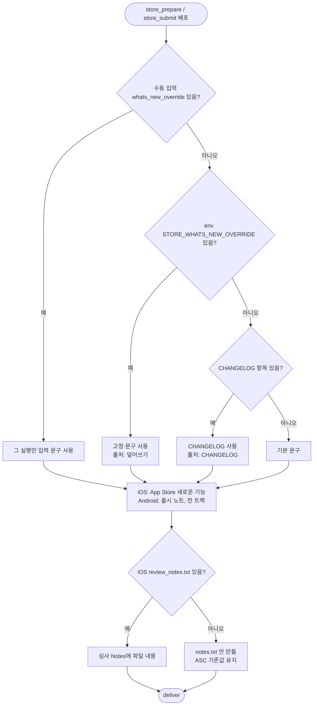

# 스토어 새로운 기능 문구를 STORE_WHATS_NEW_OVERRIDE로 덮어쓸 수 있게 하고 배포 설정 주석을 보강한다

## 개요

`store_prepare`/`store_submit` 배포 때 스토어 '새로운 기능(What's New)' 칸에 CHANGELOG 해당 버전 항목이 그대로 들어가던 것을, 워크플로 `env`의 `STORE_WHATS_NEW_OVERRIDE`로 고정 문구로 바꿀 수 있게 했다. 템플릿 기본값은 빈 문자열이라 기존 사용자에게는 아무것도 바뀌지 않는다. 함께 확인한 결과, iOS 심사 메모(Notes)를 빈 파일로 "초기화"하던 기존 로직은 실제로 동작하지 않아서, `ios/fastlane/review_notes.txt`가 있을 때만 넣는 방식으로 바꿨다. 배포 모드 주석과 마법사·문서 안내도 처음 설치한 사람이 읽을 수 있게 다시 썼다.

## 기능 흐름

TestFlight 'What to Test'(내부 테스터용)는 이 흐름과 상관없이 항상 CHANGELOG를 쓴다.

## 변경 사항

### 워크플로
- `.github/workflows/project-types/flutter/PROJECT-FLUTTER-IOS-TESTFLIGHT.yaml`: `env`에 `STORE_WHATS_NEW_OVERRIDE: ""`와 설명 주석을 추가했다. 배포 모드 주석을 세 모드 설명, 레포 변수 위치, 레포 변수에 두는 이유까지 다시 썼다. `workflow_dispatch` 입력 `whats_new_override`를 추가하고, 업로드 스텝에서 두 값을 fastlane에 넘긴다.
- `.github/workflows/project-types/flutter/PROJECT-FLUTTER-ANDROID-PLAYSTORE-CICD.yaml`: 같은 `env`, 입력, 주석을 추가했다. 출시 노트 준비 직전에 덮어쓰기 분기(`>>> whats-new` 구간)를 넣었다. 덮어쓴 문구도 기존 480자 절단을 그대로 거친다.

### Fastfile 템플릿
- `.github/util/flutter/testflight-wizard/templates/Fastfile.ios.template`: 결정 규칙을 순수 함수 `resolve_whats_new`, `resolve_review_notes`로 분리했다(`>>> store-text` 구간). What's New는 이 함수가 정하고, 출처를 빌드 로그에 남긴다. 심사 Notes는 파일이 있을 때만 쓰고 없으면 `notes.txt`를 지운다.

### 안내
- `testflight-wizard.html`, `playstore-wizard.html`: 배포 모드 카드에 문구 덮어쓰기와 심사 메모 안내를 추가했다.
- `docs/FLUTTER-CICD-OVERVIEW.md`: "스토어 '새로운 기능' 문구" 절을 새로 만들었다.

### 테스트
- `.github/scripts/test/test_store_whats_new.py` (20건): 기본값이 빈 문자열인지, 입력이 step env로만 전달되는지 확인한다. Fastfile 구간을 ruby로, 워크플로 구간을 bash로 **실제로 실행해** 6가지 경우(덮어쓰기 없음·공백·있음 × CHANGELOG 없음·있음)와 수동 입력 우선을 검증한다.

## 주요 구현 내용

- **레포 변수가 아니라 워크플로 `env`에 둔 이유**: 템플릿은 레포 변수를 미리 넣어 줄 수 없다. `env`는 기본값과 설명을 파일에 함께 실어 보낼 수 있다. 거의 바꾸지 않는 값이라 코드에서 보이고 git 이력이 남는 편이 낫다. 반대로 배포 모드는 급할 때 배포 없이 바로 꺼야 해서 레포 변수에 그대로 둔다.
- **이름은 플랫폼 공통 `STORE_WHATS_NEW_OVERRIDE`**: 이슈 댓글에서 확정한 대로 따랐다. 워크플로가 플랫폼별로 따로 있어 이름을 나눌 필요가 없다.
- **'이번만 직접 입력'**: 이슈에서 검토 항목이던 `workflow_dispatch` 입력도 넣었다. 입력값을 `run:` 본문에 `${{ }}`로 박으면 셸 주입이 되므로 step `env`로만 받는다. 테스트가 이 규칙을 강제한다.
- **심사 메모**: 빈 `notes.txt`는 deliver가 전송하지 않아 ASC 기존값이 남는다(elum 실측). 그래서 "초기화"는 애초에 동작하지 않았다. 파일이 있으면 넣고 없으면 건드리지 않는 쪽이 실제 동작과 맞다. 원본 경로는 모노레포를 고려해 `APP_ROOT` 기준이다.

## 주의사항

- **Fastfile은 마법사가 까는 파일이다.** 이미 설치된 레포는 마법사로 Fastfile을 다시 깔아야 iOS 덮어쓰기와 Notes 변경이 적용된다. 옛 Fastfile은 `STORE_WHATS_NEW_OVERRIDE`를 무시하므로 이전 동작 그대로다(실패하지 않는다). Android는 워크플로 셸에서 처리하므로 워크플로만 업데이트되면 적용된다.
- **이전 동작과 달라지는 한 가지**: iOS 심사 Notes를 비우려던 동작이 없어졌다. 원래도 비워지지 않았으므로 실제 결과는 같다.
- `>>> store-text` / `>>> whats-new` 표식은 테스트가 구간을 떼어 실행하는 기준이다. 지우거나 옮기면 테스트가 "구간을 찾지 못했다"로 바로 실패한다(조용히 비지 않게 했다).
- actionlint 경고 수는 변경 전과 같다(iOS 8, Android 14, 모두 기존 경고).
- 실제 스토어 제출 실측은 하지 않았다. 참고 구현인 Twin-Fang/elum(`aaa14dc`, `ede2d37`)에서 동작이 확인된 로직을 옮겼다.
