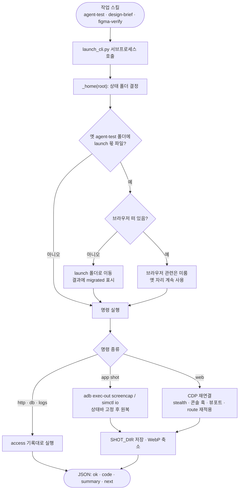

# 앱, 웹, 서버를 띄우고 찍는 기능이 QA 스킬에 묶여 있다: pro-launch로 떼어낸다

## 개요

`pro-agent-test` 안에 섞여 있던 **실행 능력**(기기 찾기, 앱 띄우기, 스크린샷, 브라우저 조작, HTTP, 로그·DB)을 능력 스킬 `pro-launch`로 떼어냈다. 다른 스킬은 Skill을 호출하지 않고 `launch_cli.py`를 스크립트로 부른다. `pro-github`이 이미 쓰던 방식이다. 두 CLI가 함께 쓰는 저수준 코드는 `scripts/common/`에 모았다. 문서로만 안내하던 앱 캡처는 명령(`app shot`)이 됐다. 상태를 연출하는 `web viewport`·`web route`, 단건 `http`도 새로 넣었다. 작업 중 사용자 요청에 따라, Google·Apple 로그인이 자동화 브라우저를 막는 것을 줄이려고 gstack browse의 stealth 층을 옮겨 넣었다.

## 기능 흐름

## 변경 사항

### 공용 저수준 (`scripts/common/`, 신규)
- `proc.py`: `run()`, `sdk_tool()`. adb·emulator가 PATH에 없을 때 SDK 표준 경로를 찾는다.
- `image.py`: `to_webp()`, `shrink()`, `has_pillow()`, `resize_tool()`. Pillow → 전용 venv Pillow → cwebp → ffmpeg 순으로 폴백한다.
- `access.py`: `load_access()`·`save_access()`·`find_secrets()`. 저장 자리는 state가 정한다.
- `state.py`: `repo_key()`, `state_dir(kind, root)`, `migrate_launch()`, `launch_file()`(옛 자리 폴백), `venv_dir()`(옛 venv 폴백).
- `paths.py`: `EVIDENCE_SKILLS`에 `launch`를 추가했다.

### pro-launch (`skills/pro-launch/`, 신규)
- `scripts/launch_cli.py`: 옮긴 명령은 `doctor`·`detect`(마커 파일만 본다)·`devices`·`device`·`web`·`access`·`db`·`logs`·`shrink`·`get-output-path`다. 새 명령은 `app shot/launch`·`web viewport`·`web route`·`http`와 `get-output-path --skill`이다.
- `scripts/stealth.py`: gstack `stealth.ts`의 Layer C와 흔적 정리 스크립트, 실행 인자, UA 보정을 옮겼다. MIT 원문 고지를 포함한다.
- `SKILL.md`: 능력 스킬이라 절차는 넣지 않았다. 명령별 호출 예와 함정만 담았다.
- `references/app.md`·`web.md`·`server.md`: agent-test 문서에서 "붙는 법" 부분을 옮기고, route·viewport·stealth 설명을 더했다.
- `tests/test_launch_cli.py`: 44건(`local_only` 2건 포함).

### 등록
- `scripts/tests/test_cli_signatures_doc_sync.py`: `CLI_TO_SKILL`에 launch_cli를 추가했다. 모든 서브커맨드가 SKILL.md에 호출 예로 있어야 한다.
- `CLAUDE.md`·`README.md`: 스킬 표, CLI 표, 라우팅 표에 추가했다.

## 주요 구현 내용

- **env.sh 변수 이름은 그대로 두었다.** `$SHOT_DIR`·`$RUN_DIR`·`$DEV`·`$DEVn`·`$ROLEn`·`$PKG`는 문서 수십 곳이 기대고 있다. 실행 이름 변수만 스킬별로 `{스킬}_RUN`이 된다(launch → `LAUNCH_RUN`, agent-test → `AGENT_TEST_RUN`). `device bind`가 env.sh를 다시 쓸 때는 처음 쓴 이름을 이어받는다.
- **`get-output-path --skill`은 증거 스킬만 받는다.** 문서 스킬 폴더에는 추적 제외가 없어서, 거기에 캡처를 쌓으면 커밋에 딸려 들어간다.
- **붙어 있는 동안만 사는 설정은 붙을 때마다 다시 건다.** 콘솔 훅, stealth 스크립트, 뷰포트, 응답 바꿔치기는 CDP 연결이 끊기면 사라진다(#625와 같은 이유). 그래서 `browser.json`에 적어 두고 연결할 때마다 다시 적용한다. `viewport`·`route`는 브라우저가 닫혀 있어도 기록되고, 다음 `open`에서 걸린다.
- **route는 규칙이 있을 때 네트워크가 잠잠해질 때까지 기다린다.** 먼저 떨어지면 뒤늦은 API 요청이 진짜 응답을 받는다. 빈 목록을 연출했는데 목록이 채워지는 현상이 이 때문이다.
- **app shot `--clean-status`는 찍은 뒤 원래대로 되돌린다.** iOS는 `status_bar clear`로, Android는 데모 모드 종료와 `sysui_demo_allowed` 원래 값 복원으로 되돌린다. 남의 기기 설정을 바꿔 두지 않는다.
- **stealth는 실행 인자가 핵심이다.** 이 스킬은 명령마다 붙었다 떨어진다. 그래서 init 스크립트만으로는 연결을 끊은 뒤 뜨는 로그인 팝업을 덮지 못한다. `--disable-blink-features=AutomationControlled`는 브라우저 전체에 걸린다. gstack 전체(TS 2.6만 줄, Bun 바이너리 119MB)는 들이지 않았다. EXTENDED 모드(플러그인·WebGL 위조)와 패치된 Chromium 전용 `--gstack-*` 인자도 옮기지 않았다.

### 실측

| 확인 | 결과 |
|---|---|
| Android 에뮬레이터 `app shot --clean-status` | 9:41 고정 캡처 확인, 이후 `sysui_demo_allowed` = null로 복원 확인 |
| iOS 시뮬레이터 `app shot --clean-status` | 9:41 고정 캡처 확인, 이후 override 목록 비어 있음 확인 |
| `web route` 200 `[]` | "비어 있어요" 렌더 |
| `web route` 500 + `web viewport mobile` | "실패: HTTP 500"이 390px 폭으로 렌더되고 콘솔에 오류 1건 |
| stealth | `navigator.webdriver=false`, UA에 Headless 없음, `chrome.runtime` 존재 |
| 테스트 | pro-launch 44건 통과(실제 브라우저 2건 포함), 전체 파이썬 947 / 노드 402 통과 |

실제 진짜 응답 → 빈 목록 → 500(모바일 폭) 순서:

## 주의사항

- **테스트에서 HOME을 임시 폴더로 바꾸면 macOS Chrome이 페이지 이동 중 멈춘다**(실측. 기존 e2e_cli도 같았다). 브라우저 테스트는 실제 HOME을 두고, 원격 없는 임시 레포를 `--root`로 줘서 상태 폴더만 나눈다. 테스트와 `references/web.md`에 적어 두었다.
- **Playwright route 핸들러는 `(route, request)`로 불린다.** 규칙을 기본 인자로 묶으면 request가 그 자리를 덮는다. 실측에서 겪었고 회귀 테스트를 두었다.
- stealth는 봇 판정을 줄일 뿐 통과를 보장하지 않는다. #604 실측에서 통과를 가른 것은 `--headed`였고, 문서도 그 순서로 안내한다.
- `pro-agent-test`의 `e2e_cli.py`에는 아직 같은 기능이 두 벌 남아 있다. #631에서 넘겨주기 층으로 바꾸고 문서를 옮긴다. 그 전까지 e2e_cli는 옛 저장 자리를 쓰는데, launch가 파일을 옮긴 뒤에는 옛 자리에서 못 찾을 수 있다. #631을 이어서 바로 처리한다.
- `render run`은 #632에서 한다.
